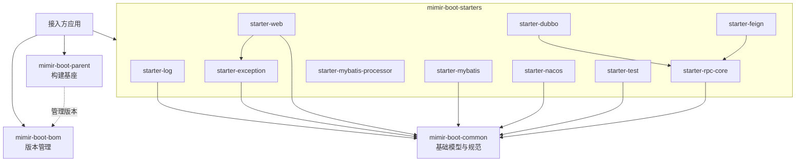

# ARCHITECTURE.md

<!--!
  长期稳定架构约束——系统边界、分层、核心依赖方向。
  实质性架构约束变更应先走架构 RFC（docs/design-docs/arch-*.md）；事实修订与链接维护直接同步。
  智能体在开始任何编码任务前应先阅读此文件。
-->

## 系统概述

Mimir Boot 是 Yggdrasil-Labs 的 Java 企业级基础框架仓库，核心定位是**基础设施产品**而非单体业务系统。它为组织内所有 Java 微服务提供统一的依赖版本管理、构建与发布规范、公共基础模型，并以 Spring Boot Starter 形式沉淀可复用的横切能力。

技术选型基于 Java 17 + Spring Boot 3.3.13 + Spring Cloud 2023.0.6，持久层使用 MyBatis-Plus，配置中心对接 Nacos。仓库通过 GitHub Actions 实现 CI/CD，制品发布至 Maven Central 和 GitHub Packages，版本由根 POM 的 `revision` 属性统一管理，配合 release-please 自动化发版。

接入方通过继承 `mimir-boot-parent`（已自动引入 `mimir-boot-bom`），按需引入所需 Starter，即可获得企业级基础能力（日志脱敏、链路追踪、统一异常、配置加密、RPC 治理等）。使用其他父 POM 的项目也可单独导入 BOM 管理依赖版本。

## 项目结构

```text
mimir-boot/
├── mimir-boot-parent/                         # 父 POM：插件版本、构建 profile、质量门禁
├── mimir-boot-bom/                            # BOM：第三方与本仓库模块版本统一管理
├── mimir-boot-common/                         # 公共组件：基础模型、异常、响应、分页、工具类
└── mimir-boot-starters/                       # Starter 聚合模块
    ├── mimir-boot-starter-log/                #   日志（Logback + 脱敏 + 访问日志）
    ├── mimir-boot-starter-exception/          #   异常处理（全局异常、统一响应）
    ├── mimir-boot-starter-web/                #   Web 层增强（CORS、Trace、响应增强）
    ├── mimir-boot-starter-mybatis/            #   MyBatis（分页、审计、加密字段）
    ├── mimir-boot-starter-mybatis-processor/  #   MyBatis 编译期处理器（生成 Mapper/Service）
    ├── mimir-boot-starter-nacos/              #   Nacos 配置加密（ENC() 格式解密）
    ├── mimir-boot-starter-test/               #   测试支持（测试基类与工具）
    ├── mimir-boot-starter-rpc-core/           #   RPC 通用治理核心（Dubbo/Feign 通用能力）
    ├── mimir-boot-starter-dubbo/              #   Dubbo 专用治理
    └── mimir-boot-starter-feign/              #   Feign 专用治理
```

## 分层模型



**依赖规则：**

- 依赖只能沿声明方向流动：Starter → Common，不可反向
- Parent 只管构建，BOM 只管版本，两者不承载运行时逻辑
- Common 聚焦稳定公共模型，禁止依赖任何具体 Starter
- 横切关注点（日志、链路追踪、异常处理）通过独立 Starter 提供，接入方按需组合
- 新增 Starter 横向耦合需经设计评审，禁止未经审批的循环依赖

## 技术栈

| 层级 | 技术 | 说明 |
|------|------|-----------|
| 运行环境 | Java | 17 (LTS) |
| 应用框架 | Spring Boot | 3.3.13 |
| 微服务 | Spring Cloud | 2023.0.6 (Leyton) |
| 配置中心 | Spring Cloud Alibaba Nacos | 2023.0.3.4 |
| 持久层 | MyBatis-Plus | 数据访问增强 |
| 数据库驱动 | MySQL Connector/J / PostgreSQL JDBC | 数据库连接 |
| 工具库 | Hutool / Lombok / MapStruct | 通用工具与编译期代码生成 |
| 日志 | Logback / SLF4J API | 日志实现与门面 |
| 测试 | JUnit / Mockito / Testcontainers | 由接入方按需引入容器模块 |
| CI/CD | GitHub Actions | release-please + GPG 签名 |
| 代码质量 | Spotless / JaCoCo / SonarCloud | — |

本表保留核心技术基线；普通依赖与插件的具体版本以[根 POM](./pom.xml)、[BOM](./mimir-boot-bom/pom.xml)和 [Parent POM](./mimir-boot-parent/pom.xml)为准。

## 模块职责

| 模块 | 职责 | 依赖 |
|------|------|------|
| `mimir-boot-parent` | 统一 Maven 插件版本、构建 profile、质量门禁（Spotless、JaCoCo、Enforcer） | BOM（dependencyManagement） |
| `mimir-boot-bom` | 统一第三方与本仓库模块版本，对齐 Spring Boot/Cloud 版本矩阵 | 无 |
| `mimir-boot-common` | 全仓库共享基础约定：annotation、constant、dto、enums、exception、page、response、util | 无 |
| `starter-log` | 日志自动配置：Logback 模板、敏感信息脱敏、TraceId/SpanId、访问日志 | common |
| `starter-exception` | 全局异常处理、统一错误响应格式 | common |
| `starter-web` | Web 层增强：CORS、Trace 追踪、响应体自动填充 traceId | common, starter-exception |
| `starter-mybatis` | 持久层增强：分页拦截器、乐观锁、审计字段自动填充、字段加解密 | common |
| `starter-mybatis-processor` | 编译期注解处理器：按 `@AutoMybatis` 生成 Mapper、Service 和 ServiceImpl | 无运行时依赖 |
| `starter-nacos` | Nacos 配置加密：ENC() 格式自动解密、动态刷新支持 | common |
| `starter-test` | 测试基类与工具集 | common |
| `starter-rpc-core` | RPC 通用治理核心：Dubbo/Feign 共享的治理抽象 | common |
| `starter-dubbo` | Dubbo 专用治理与增强 | starter-rpc-core |
| `starter-feign` | Feign 专用治理与增强 | starter-rpc-core |

## 关键架构决策

详见 [`docs/design-docs/`](./docs/design-docs/)。

## 当前能力边界

- `mimir-boot-common` 新增三个 `fromCodeOrNull` 查询方法，既有 `fromCode` fallback 保持兼容。
- 日志脱敏以完整配置快照处理接入方显式启用的 10 组字段型规则，支持普通赋值和带引号键名的文本标量；它不解析完整 JSON，对象/数组值不保证完整保护，边界与调用方处置要求见日志 Starter README（TD-038 的标量缺口已补齐并通过本地验收，尚未随版本发布）。
- MongoDB 驱动族由 Spring Boot BOM 管理为 5.0.1；消费者显式覆盖时应保持驱动族版本一致并自行验证。
- RPC 适配层使用调用级上下文与异步生命周期；旧 `RpcTracerBridge.extract` 和 Hook 直调入口继续保留兼容。
- Nacos 应用解密仅处理已绑定的 `mimir.boot.nacos.encrypt`（兼容旧前缀）配置；删除前缀时旧解密覆盖层仍可能残留（TD-039）。遗留 AES 入口仅供离线迁移并输出告警。
- MyBatis v2 密文使用应用级 context 作为 AAD，`crypto-v2-write-enabled` 默认关闭；该绑定不提供字段或记录级完整性。
- 测试 Starter 不再通过类路径资源注入数据库副作用或固定应用名；Testcontainers 由接入方按场景显式引入。
- 分页构造和转换存在不同校验边界；Jackson 绑定及直接 setter 路径不保证自动校正（TD-042）。
- Parent 负责构建门禁、BOM 负责版本管理；consumer 与发布签名验证使用隔离验证路径。发布属性覆盖、部分受管依赖兼容性、覆盖率报告时序与格式扫描范围仍有缺口（TD-036、TD-037、TD-041、TD-043、TD-044）。

已知问题的处置状态与验收标准统一维护在[技术债台账](./docs/active/tech-debt-tracker.md)。
