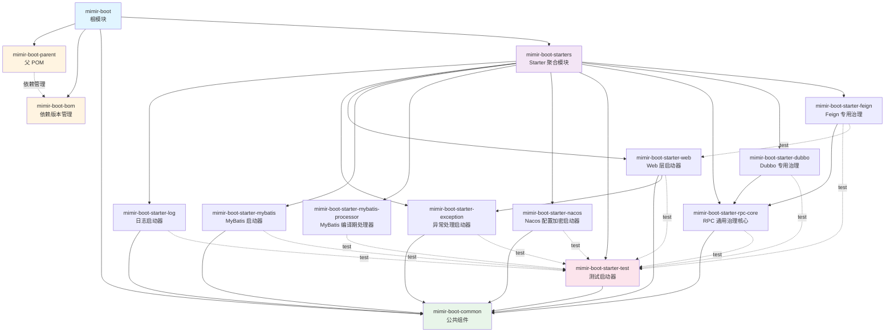

<div align="center">

# Mimir Boot

</div>

<div align="center">


[](https://sonarcloud.io/summary/new_code?id=Yggdrasil-Labs_mimir-boot)

> Yggdrasil-Labs 的 Java 企业级基础框架  
> 统一依赖版本、公共组件、自定义 Starter 与编译期代码生成工具。

[快速开始](#-快速开始) • [模块说明](#-模块说明) • [技术栈](#-技术栈) • [特性展示](#-特性展示)

</div>

## ✨ 特性

- 🎯 **企业级基座**: 统一技术栈，减少重复配置
- 📦 **依赖管理**: Parent POM + BOM 模式，版本统一管理
- 🛠️ **公共组件**: 常量、枚举、异常处理、分页等
- 🪵 **智能日志**: 自动脱敏、Trace追踪、访问日志
- 🔐 **配置安全**: Nacos 配置加密脱敏，支持 ENC() 格式
- 🔧 **开箱即用**: 多个 Starter 模块，快速接入
- 📋 **质量工具**: Spotless 代码格式化、单元测试、JaCoCo 覆盖率、SonarCloud 分析

## 📦 模块说明

| 模块                                     | 描述                           | 状态    |
|----------------------------------------|------------------------------|-------|
| `mimir-boot-parent`                    | 父 POM，提供插件版本和构建配置            | ✅ 已完成 |
| `mimir-boot-bom`                       | 依赖版本统一管理（BOM）                | ✅ 已完成 |
| `mimir-boot-common`                    | 公共模型与工具类                     | ✅ 已完成 |
| `mimir-boot-starter-log`               | 日志启动器（Logback + 脱敏 + 访问日志）   | ✅ 已完成 |
| `mimir-boot-starter-exception`         | 异常处理启动器（全局异常处理、统一响应）         | ✅ 已完成 |
| `mimir-boot-starter-web`               | Web 层启动器（CORS、Trace、响应增强）    | ✅ 已完成 |
| `mimir-boot-starter-mybatis`           | MyBatis 启动器（分页、审计、加密字段）      | ✅ 已完成 |
| `mimir-boot-starter-mybatis-processor` | MyBatis 编译期处理器（生成 Mapper、Service 和 ServiceImpl） | ✅ 已完成 |
| `mimir-boot-starter-nacos`             | Nacos 配置加密启动器（ENC() 格式解密）    | ✅ 已完成 |
| `mimir-boot-starter-rpc-core`          | RPC 通用治理核心（Dubbo/Feign 通用能力）  | ✅ 已完成 |
| `mimir-boot-starter-dubbo`             | Dubbo 专用治理（Dubbo 增强与治理）       | ✅ 已完成 |
| `mimir-boot-starter-feign`              | Feign 专用治理（Feign 增强与治理）        | ✅ 已完成 |
| `mimir-boot-starter-test`               | 测试基类与辅助工具                     | ✅ 已完成 |

### 🔮 未来方向

以下能力在探索中，尚未启动正式开发：

- **服务治理**：限流、熔断、重试
- **指标监控**：Metrics 采集与上报
- **安全治理**：签名、token 透传、安全增强

正式落地前需完成产品规格评审。

## 🚀 快速开始

### 1. 继承 Parent POM

**当前开发版本（尚未发布）**：以下片段中的开发版本应与根 POM 的 `<revision>` 保持一致；正式发布后再将版本替换为对应的正式版本。

```xml
<parent>
    <groupId>io.github.yggdrasil-labs</groupId>
    <artifactId>mimir-boot-parent</artifactId>
    <version>2.2.2-SNAPSHOT</version>
</parent>
```

`mimir-boot-parent` 已在 `dependencyManagement` 中引入 `mimir-boot-bom`，继承 Parent 的项目通常无需重复导入 BOM。若项目不继承 Parent，或需要独立使用版本矩阵，再显式导入 BOM：

```xml
<dependencyManagement>
    <dependencies>
        <dependency>
            <groupId>io.github.yggdrasil-labs</groupId>
            <artifactId>mimir-boot-bom</artifactId>
            <version>2.2.2-SNAPSHOT</version>
            <type>pom</type>
            <scope>import</scope>
        </dependency>
    </dependencies>
</dependencyManagement>
```

**注意**：如果使用 GitHub Packages，需要在 `~/.m2/settings.xml` 中配置认证：

```xml
<settings>
  <servers>
    <server>
      <id>github</id>
      <username>YOUR_GITHUB_USERNAME</username>
      <password>YOUR_GITHUB_TOKEN</password>
    </server>
  </servers>
</settings>
```

并在 `pom.xml` 中添加仓库配置：

```xml
<repositories>
    <repository>
        <id>github</id>
        <url>https://maven.pkg.github.com/Yggdrasil-Labs/mimir-boot</url>
    </repository>
</repositories>
```

### 2. 添加依赖

```xml
<dependencies>
    <!-- Spring Boot Web -->
    <dependency>
        <groupId>org.springframework.boot</groupId>
        <artifactId>spring-boot-starter-web</artifactId>
    </dependency>

    <!-- Mimir Boot Log Starter - 日志模块 -->
    <dependency>
        <groupId>io.github.yggdrasil-labs</groupId>
        <artifactId>mimir-boot-starter-log</artifactId>
    </dependency>

    <!-- Mimir Boot Common - 公共组件 -->
    <dependency>
        <groupId>io.github.yggdrasil-labs</groupId>
        <artifactId>mimir-boot-common</artifactId>
    </dependency>
</dependencies>
```

### 3. 配置应用名称（可选）

在 `application.yml` 中配置应用名：

```yaml
spring:
  application:
    name: your-app-name

logging:
  level:
    root: INFO
```

日志文件将保存在 `logs/your-app-name/` 目录下。

## 🔧 常用命令

```bash
# 构建整个项目
./mvnw clean install

# 构建特定嵌套模块（-pl 使用模块路径）
./mvnw clean install -pl mimir-boot-starters/mimir-boot-starter-log -am

# 跳过测试
./mvnw clean package -DskipTests

# 测试与 CI profile 质量门禁
./mvnw -Pci clean verify

# CI profile 下的代码格式化检查（Spotless）
./mvnw -Pci spotless:check

# 自动格式化代码（Spotless）
./mvnw spotless:apply
```

`-Pci clean verify` 启用当前配置的测试、覆盖率、Spotless 和 Enforcer 门禁。当前子模块格式扫描范围和集成测试覆盖率报告仍有局限，配置细节见 [Parent 文档](mimir-boot-parent/README.md)。

## 📋 技术栈

| 类别       | 主要技术                                            |
|----------|-------------------------------------------------|
| **运行环境** | Java 17 (LTS)                                   |
| **应用框架** | Spring Boot 3.3.13                               |
| **微服务**  | Spring Cloud 2023.0.6 (Leyton)                    |
| **配置中心** | Spring Cloud Alibaba Nacos 2023.0.3.4            |
| **数据库**  | MyBatis-Plus, MySQL Connector/J, PostgreSQL JDBC |
| **工具类**  | Hutool, Lombok, MapStruct                       |
| **日志**   | Logback, SLF4J API                               |
| **测试**   | JUnit 5, Mockito；Testcontainers 由接入方按需引入 |
| **监控**   | Micrometer, Prometheus, JaCoCo                  |

完整技术栈列表请参考 [mimir-boot-bom/pom.xml](mimir-boot-bom/pom.xml)

## 💡 特性展示

### 📦 智能依赖管理

- **统一 BOM 管理**: BOM 集中声明显式管理坐标，导入的上游 BOM 继续提供传递版本
- **版本来源清晰**: 已验证和仅管理坐标以 [BOM 支持等级](mimir-boot-bom/README.md#-支持等级) 为准
- **兼容性范围明确**: BOM 以 Spring Boot BOM 为基线并补充部分版本；支持范围和接入限制见 [BOM 文档](mimir-boot-bom/README.md)

### 🪵 企业级日志方案

引入 `mimir-boot-starter-log` 后自动提供：

- 按配置规则进行敏感信息脱敏（默认替换为 `****`，规则配置见模块文档）
- 日志输出 MDC 中已有的 TraceId / SpanId；Web Starter 提供 TraceId，SpanId 需由接入方的追踪组件提供
- HTTP 访问日志（慢接口自动记录为 WARN）
- 多环境配置（开发环境输出到控制台和文件；生产环境按 logger 分流，根日志保留控制台输出）

详细文档请参考 [mimir-boot-starter-log/README.md](mimir-boot-starters/mimir-boot-starter-log/README.md)

### 🔐 配置加密脱敏

引入 `mimir-boot-starter-nacos`，显式绑定 `mimir.boot.nacos.encrypt`（兼容旧前缀 `mimir.nacos.encrypt`）并启用解密后提供：

- Nacos 配置中匹配已配置前缀的 `prefix(encrypted_value)` 格式自动解密（默认前缀为 `ENC`）
- 配置动态刷新时自动重新解密
- 提供加解密工具类 `NacosEncryptUtil`

详细文档请参考 [mimir-boot-starter-nacos/README.md](mimir-boot-starters/mimir-boot-starter-nacos/README.md)

### 🔧 Web 层增强

`mimir-boot-starter-web` 提供以下能力：

- 统一响应格式 `R<T>` 自动填充 traceId
- 自动生成/传递 traceId（MDC + 响应头）
- CORS 跨域配置默认关闭，启用时需显式配置 Origin 白名单

详细文档请参考 [mimir-boot-starter-web/README.md](mimir-boot-starters/mimir-boot-starter-web/README.md)

### 💾 持久层增强

引入 `mimir-boot-starter-mybatis` 后自动提供：

- 分页拦截器、乐观锁拦截器、审计字段自动填充
- 字段加解密（`@TableField(typeHandler = StringCryptoTypeHandler.class)`）
- MyBatis v2 密文读取使用 `mimir.boot.mybatis.crypto-context`，写入开关
  `mimir.boot.mybatis.crypto-v2-write-enabled` 默认关闭；启用前需完成全实例读取升级和列容量预检。
- 三个枚举提供 `fromCodeOrNull`，旧 `fromCode` fallback 保持兼容。

详细文档请参考 [mimir-boot-starter-mybatis/README.md](mimir-boot-starters/mimir-boot-starter-mybatis/README.md)

## 📚 模块文档

- [mimir-boot-parent](mimir-boot-parent/README.md) - 父 POM，提供插件版本和构建配置
- [mimir-boot-bom](mimir-boot-bom/README.md) - 依赖版本统一管理（BOM）
- [mimir-boot-common](mimir-boot-common/README.md) - 公共组件说明
- [mimir-boot-starter-log](mimir-boot-starters/mimir-boot-starter-log/README.md) - 日志启动器文档
- [mimir-boot-starter-exception](mimir-boot-starters/mimir-boot-starter-exception/README.md) - 异常处理启动器文档
- [mimir-boot-starter-web](mimir-boot-starters/mimir-boot-starter-web/README.md) - Web 层启动器文档
- [mimir-boot-starter-mybatis](mimir-boot-starters/mimir-boot-starter-mybatis/README.md) - MyBatis 启动器文档
- [mimir-boot-starter-mybatis-processor](mimir-boot-starters/mimir-boot-starter-mybatis-processor/README.md) - MyBatis 编译期处理器文档
- [mimir-boot-starter-nacos](mimir-boot-starters/mimir-boot-starter-nacos/README.md) - Nacos 配置加密启动器文档
- [mimir-boot-starter-test](mimir-boot-starters/mimir-boot-starter-test/README.md) - 测试启动器文档
- [mimir-boot-starter-rpc-core](mimir-boot-starters/mimir-boot-starter-rpc-core/README.md) - RPC 通用治理核心文档
- [mimir-boot-starter-dubbo](mimir-boot-starters/mimir-boot-starter-dubbo/README.md) - Dubbo 专用治理文档
- [mimir-boot-starter-feign](mimir-boot-starters/mimir-boot-starter-feign/README.md) - Feign 专用治理文档

## 🏗️ 项目结构

```
mimir-boot/
├── mimir-boot-parent/                    # 父 POM，插件和构建配置
├── mimir-boot-bom/                        # 依赖版本管理（BOM）
├── mimir-boot-common/                     # 公共组件
├── mimir-boot-starters/                   # Starter 集合
│   ├── mimir-boot-starter-log/            # 日志 Starter
│   ├── mimir-boot-starter-exception/      # 异常处理 Starter
│   ├── mimir-boot-starter-web/            # Web 层 Starter
│   ├── mimir-boot-starter-mybatis/        # MyBatis Starter
│   ├── mimir-boot-starter-mybatis-processor/  # MyBatis 编译期处理器
│   ├── mimir-boot-starter-nacos/          # Nacos 配置加密 Starter
│   ├── mimir-boot-starter-rpc-core/       # RPC 通用治理核心
│   ├── mimir-boot-starter-dubbo/          # Dubbo 专用治理
│   ├── mimir-boot-starter-feign/          # Feign 专用治理
│   └── mimir-boot-starter-test/           # 测试启动器
└── README.md                              # 本文件
```

## 📊 模块依赖关系



### 依赖关系说明

- **根模块和 Starter 聚合模块发出的实线箭头**：模块聚合关系
- **其余实线箭头**：编译依赖关系
- **虚线箭头**：按标签区分依赖管理（Parent → BOM）和仅测试使用的依赖（`test`）
- **颜色说明**：
  - 🔵 蓝色：根模块
  - 🟡 黄色：基础设施模块（Parent、BOM）
  - 🟢 绿色：核心公共模块（Common）
  - 🟣 紫色：Starter 聚合模块
  - 🔴 粉色：测试模块

## 📄 许可证

本项目采用 [Apache License 2.0](LICENSE) 许可证。

## 🛠️ CI / Release / 发布

- **CI（.github/workflows/ci.yml）**
  - 在 push 到 `main`/`develop` 和目标分支为 `main` 的 PR 时运行：`bash scripts/ci-preflight.sh`
  - 上传 Surefire/Failsafe 报告与 JaCoCo 覆盖率；当前 JaCoCo XML 在集成测试前生成
  - Spotless 检查随 CI profile 执行，实际扫描范围受模块配置影响
  - 可选 Sonar：仅在 push 到 `main`/`develop` 且同时存在 `SONAR_TOKEN`、`SONAR_ORGANIZATION` 和 `SONAR_PROJECT_KEY` 时自动执行

- **Release PR 与自动打 Tag（.github/workflows/release-please.yml）**
  - 当 `main` 有新提交时，自动创建 “Release PR”（包含版本号变更与 CHANGELOG）
  - 合并该 PR 后，由 `create-tag.yml` 创建 `vX.Y.Z` Tag；Tag 再触发 `release.yml`，在公开制品校验通过后创建 GitHub Release

- **发布（.github/workflows/release.yml）**
  - 基于 Tag 触发：先执行 `./mvnw -B spotless:check clean package -DskipTests`，再执行消费者契约校验
  - 按发布选择发布制品到 GitHub Packages（GPR）和/或 Maven Central；Maven Central 正式版需要显式 GPG 签名

### 使用 GitHub Packages（消费者）

在使用方开发机/CI 的 `~/.m2/settings.xml` 配置凭据（无需改动本仓 POM）：

```xml

<settings>
    <servers>
        <server>
            <id>github</id>
            <username>GITHUB_USER</username>
            <password>GITHUB_TOKEN</password>
        </server>
    </servers>
</settings>
```

在使用方项目的 `pom.xml` 增加仓库（或放到其 `settings.xml` 的 `mirrors/profiles` 中统一管理）：

```xml

<repositories>
    <repository>
        <id>github</id>
        <name>GitHub Packages</name>
        <url>https://maven.pkg.github.com/Yggdrasil-Labs/mimir-boot</url>
        <releases>
            <enabled>true</enabled>
        </releases>
        <snapshots>
            <enabled>true</enabled>
        </snapshots>
    </repository>
    <!-- 仍需中央仓 -->
    <repository>
        <id>central</id>
        <url>https://repo1.maven.org/maven2/</url>
    </repository>

</repositories>
```

## 📞 联系我们

- **GitHub**: <https://github.com/Yggdrasil-Labs/mimir-boot>
- **组织**: Yggdrasil Labs
