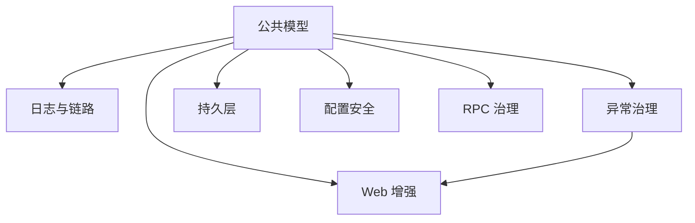

# 业务领域划分

<!--!
  本文件记录项目的业务领域划分，随业务演进持续更新。
  智能体据此判断代码应该放在哪里、新功能属于哪个领域。

  与 ARCHITECTURE.md 的区别：
  - ARCHITECTURE.md = 技术架构（分层、依赖方向、技术栈），相对稳定
  - 本文件 = 业务领域（领域边界、职责、实体），随业务演进变化

  修改本文件不需要架构 RFC，但需要更新 AGENTS.md 中的导航链接。
-->

## 领域清单

| 领域 | 职责说明 | 代码位置 | 关键实体 |
|------|----------|----------|----------|
| 依赖管理 | 统一版本矩阵、BOM 对齐 | `mimir-boot-bom/` | Spring Boot/Cloud 版本、第三方库版本 |
| 构建基座 | 插件版本、质量门禁、发布配置 | `mimir-boot-parent/` | Maven 插件、Profile |
| 公共模型 | 统一异常、响应、分页、枚举等规范 | `mimir-boot-common/` | R, PageResult, BizException, CommonStatus |
| 日志与链路 | 自动脱敏、TraceId、访问日志 | `mimir-boot-starters/mimir-boot-starter-log/` | SensitiveDataConverter, AccessLogFilter |
| 异常治理 | 全局异常处理、统一响应格式 | `mimir-boot-starters/mimir-boot-starter-exception/` | MimirExceptionHandler |
| Web 增强 | CORS、Trace 透传、响应增强 | `mimir-boot-starters/mimir-boot-starter-web/` | TraceInterceptor, ResponseBodyEnhancer |
| 持久层 | 分页、审计、加密字段、Mapper 扫描 | `mimir-boot-starters/mimir-boot-starter-mybatis/`、`mimir-boot-starters/mimir-boot-starter-mybatis-processor/` | AbstractCryptoTypeHandler, AuditMetaObjectHandler |
| 配置安全 | Nacos 配置 ENC() 加解密 | `mimir-boot-starters/mimir-boot-starter-nacos/` | NacosEncryptUtil, NacosEncryptEnvironmentPostProcessor |
| RPC 治理 | Dubbo/Feign 通用治理与适配 | `mimir-boot-starters/mimir-boot-starter-rpc-core/`、`mimir-boot-starters/mimir-boot-starter-dubbo/`、`mimir-boot-starters/mimir-boot-starter-feign/` | RpcCallContext, RpcHookChain |
| 测试支持 | 测试基础设施与工具 | `mimir-boot-starters/mimir-boot-starter-test/` | — |

## 领域间关系

下图箭头表示能力支撑方向（提供方 → 使用方）；Maven 依赖方向由下方通信规则描述。

## 领域通信规则

- 所有 Starter 领域可依赖公共模型领域（common）
- Starter 之间不允许循环依赖
- Web 增强依赖异常治理（统一响应格式）
- RPC 治理的 dubbo/feign 适配依赖 rpc-core 抽象
- 新增领域（Starter）前必须通过新增 Starter 落地检查
