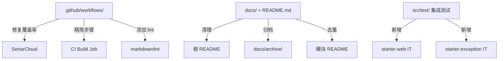

# Quality Refinement — 工程质量与文档治理

## Context

Mimir Boot 自 v2.0.4 发布以来（2026-03-23），已完成 exception-handler-adapter 功能并积累了依赖更新。release-please 已准备好 v2.1.0 Release PR。

当前存在几类工程债务：

1. SonarCloud CI 用 `sonar.coverage.exclusions=**` 完全排除覆盖率，Quality Gate 形同虚设
2. CI workflow 结构冗余（build job 分三步启动 JVM、release.yml 两个 publish job 大量重复）
3. README 列了 governance/metrics/security 三个不存在的模块，给接入方错误预期
4. exception-handler-adapter 的 plan.md 状态与代码不同步
5. 缺少文档自动化（lint、死链检查）
6. 技术债 TD-001~TD-004 持续 ORPHAN

本轮迭代聚焦调整与优化，不新增功能 Starter，不升级 JDK。

## Goal

- SonarCloud 能接收真实覆盖率数据，Quality Gate 恢复有效
- CI build job 执行时间减少（消除多次 JVM 冷启动）
- README 与实际代码库状态一致，不含虚假模块
- 文档技术债 TD-001~TD-004 全部解决或降级
- 已有 starter 的 AutoConfiguration 有集成测试保障

## Non-Goal

- 不新增 Starter（governance/metrics/security 只清理文档引用）
- 不升级 JDK 版本
- 不修改公共 API 或破坏向后兼容
- 不重构 release workflow 的核心发布逻辑（仅消除重复）

## Architecture

本次改动不涉及运行时架构变更，全部为工程基础设施改动：



## Interface Contract

### CI-1: 修复 SonarCloud 覆盖率上报

**文件**: `.github/workflows/ci.yml`

OLD:

```yaml
          ./mvnw -B clean verify sonar:sonar -Pci \
            -Dsonar.host.url=https://sonarcloud.io \
            -Dsonar.organization=${SONAR_ORGANIZATION} \
            -Dsonar.projectKey=${SONAR_PROJECT_KEY} \
            -Dsonar.coverage.exclusions=**
```

NEW:

```yaml
          ./mvnw -B clean verify sonar:sonar -Pci \
            -Dsonar.host.url=https://sonarcloud.io \
            -Dsonar.organization=${SONAR_ORGANIZATION} \
            -Dsonar.projectKey=${SONAR_PROJECT_KEY} \
            -Dsonar.coverage.jacoco.xmlReportPaths=**/target/site/jacoco/jacoco.xml
```

### CI-2: CI build job 精简

**文件**: `.github/workflows/ci.yml`

将 `Format check` + `Compile` + `Unit tests` 三个 step 合并为一个 step：

OLD (3 个 step):

```yaml
      - name: Format check
        if: github.actor != 'dependabot[bot]'
        run: ./mvnw -B validate -Pci

      - name: Compile
        if: github.actor != 'dependabot[bot]'
        run: ./mvnw -B -U compile -Pci

      - name: Unit tests
        if: github.actor != 'dependabot[bot]'
        run: ./mvnw -B test -Pci
```

NEW (1 个 step):

```yaml
      - name: Build and test
        if: github.actor != 'dependabot[bot]'
        run: ./mvnw -B -U verify -Pci
```

### CI-3: 统一 workflow action 版本注释

**文件**: `.github/workflows/release.yml`, `.github/workflows/create-tag.yml`

为缺少版本注释的 `uses:` 行补齐 `# vN` 注释（ci.yml 和 release-please.yml 已有完整注释，无需修改）。示例：

OLD:

```yaml
      - uses: actions/checkout@9c091bb21b7c1c1d1991bb908d89e4e9dddfe3e0
```

NEW:

```yaml
      - uses: actions/checkout@9c091bb21b7c1c1d1991bb908d89e4e9dddfe3e0 # v6
```

### CI-4: 添加 Markdown lint CI step

**文件**: `.github/workflows/ci.yml`

在 build job 中新增 step（在 Java build 之前，markdown 校验不依赖 JDK）：

```yaml
      - name: Markdown lint
        if: github.actor != 'dependabot[bot]'
        uses: DavidAnson/markdownlint-cli2-action@db4c24b0a350e5e15d4117f67d1e5c86c9b656c0 # v19
        with:
          globs: '**/*.md'
```

**新建文件**: `.markdownlint.json`

```json
{
  "MD013": false,
  "MD033": false,
  "MD041": false,
  "MD024": { "siblings_only": true }
}
```

### DOC-1: README 清理规划模块

**文件**: `README.md`

模块表中移除 governance/metrics/security 三行，改为在表后新增"未来方向"小节：

OLD (表中 3 行):

```markdown
| `mimir-boot-starter-governance`        | 服务治理（限流、熔断、重试）              | 🔄 规划中 |
| `mimir-boot-starter-metrics`           | 指标监控（Metrics 采集与上报）           | 🔄 规划中 |
| `mimir-boot-starter-security`          | 安全治理（签名、token 透传、安全增强）    | 🔄 规划中 |
```

NEW (表后):

```markdown
### 🔮 未来方向

以下能力在探索中，尚未启动正式开发：

- **服务治理**：限流、熔断、重试
- **指标监控**：Metrics 采集与上报
- **安全治理**：签名、token 透传、安全增强

正式落地前需完成产品规格评审。
```

同步清理 README.md 中：

- 模块文档列表中 governance / metrics / security 链接（第 345-347 行）
- 项目结构树中 3 行目录描述（第 366-368 行）
- Mermaid 图中 Governance / Metrics / Security 节点、规划依赖箭头和 style 行（第 393-429 行）

> 注：`ARCHITECTURE.md` 中已无规划模块引用，无需修改。

### DOC-2: exception-handler-adapter 归档

**目录移动**: `docs/active/exception-handler-adapter/` → `docs/archive/exception-handler-adapter/`

在 `design.md` 头部追加：

```
status: archived
archived-date: 2026-06-26
```

更新 `docs/archive/index.md` 添加归档记录。

### DOC-3: 根 README 去重

**文件**: `README.md`

精简"特性展示"节（当前约 150 行重复内容），每个 starter 只保留 2-3 行摘要 + "详见模块 README" 链接。目标：根 README 总行数从当前水平减少约 30%。

### DOC-4: 移除 generated 占位引用

**文件**: `AGENTS.md` 中若有 `docs/generated/` 引用则移除（TD-002）。
因 `docs/generated/` 目录不存在，不需要删除文件。

### DOC-5: 更新 tech-debt-tracker

解决/降级所有 TD 条目：

- TD-001: 通过 DOC-3 解决
- TD-002: 通过 DOC-4 解决（标记为"不适用"）
- TD-003: 通过 CI-4 解决
- TD-004: 标记为"已降级"，规划模块从 README 移除后无紧迫性

### MOD-1: starter-web 集成测试

**新建文件**: `mimir-boot-starters/mimir-boot-starter-web/src/test/java/com/yggdrasil/labs/web/config/WebAutoConfigurationIT.java`

```java
class WebAutoConfigurationIT {
    private final WebApplicationContextRunner runner = new WebApplicationContextRunner()
            .withConfiguration(AutoConfigurations.of(WebAutoConfiguration.class));

    @Test void traceInterceptorRegistered() {
        runner.run(ctx -> assertThat(ctx).hasSingleBean(TraceInterceptor.class));
    }
    @Test void corsConfigRegistered() {
        runner.run(ctx -> assertThat(ctx).hasSingleBean(CorsConfig.class));
    }
    @Test void responseBodyEnhancerRegistered() {
        runner.run(ctx -> assertThat(ctx).hasSingleBean(ResponseBodyEnhancer.class));
    }
}
```

> 注：使用 `WebApplicationContextRunner` 而非 `@SpringBootTest`，因为 `WebAutoConfiguration` 有 `@ConditionalOnWebApplication(type = SERVLET)` 条件，需要 Web 环境才能激活。`WebApplicationContextRunner` 自动提供 mock servlet 环境。
>
> `TraceInterceptor` 有 `@ConditionalOnMissingClass("io.micrometer.tracing.Tracer")` 条件——当前 starter-web 的测试 classpath 中不含 micrometer-tracing，条件满足。若未来引入该依赖需调整测试。

### MOD-2: starter-exception 集成测试

**新建文件**: `mimir-boot-starters/mimir-boot-starter-exception/src/test/java/com/yggdrasil/labs/exception/config/ExceptionAutoConfigurationIT.java`

```java
class ExceptionAutoConfigurationIT {
    private final WebApplicationContextRunner runner = new WebApplicationContextRunner()
            .withConfiguration(AutoConfigurations.of(ExceptionAutoConfiguration.class));

    @Test void defaultFactoryRegistered() {
        runner.run(ctx -> assertThat(ctx).hasSingleBean(DefaultExceptionResponseFactory.class));
    }
    @Test void handlerRegistered() {
        runner.run(ctx -> assertThat(ctx).hasSingleBean(MimirExceptionHandler.class));
    }
    @Test void customFactoryOverridesDefault() {
        runner.withBean(ExceptionResponseFactory.class, () -> (code, msg, data) -> "custom")
              .run(ctx -> {
                  assertThat(ctx).doesNotHaveBean(DefaultExceptionResponseFactory.class);
                  assertThat(ctx).hasSingleBean(ExceptionResponseFactory.class);
              });
    }
}
```

> 注：`ExceptionAutoConfiguration` 有 `@ConditionalOnWebApplication` 条件，必须使用 `WebApplicationContextRunner` 提供 mock servlet 环境。

### MOD-3: common 模块 Javadoc 补齐

**文件**: `mimir-boot-common/src/main/java/com/yggdrasil/labs/common/` 下以下类：

- `exception/ErrorCode.java` — 补充枚举值逐项 Javadoc

> 注：`R.java`、`BizException.java`、`PageResult.java`、`PageRequest.java`、`PageQuery.java` 经检查已有完善 Javadoc，无需修改。实施时先跑 `./mvnw javadoc:javadoc -pl mimir-boot-common` 确认实际 warning，按需扩大范围。

## Alternatives Considered

| 方案 | 优点 | 缺点 | 不选原因 |
|------|------|------|---------|
| release.yml 用 reusable workflow 消除重复 | 消除重复代码 | 改动较大，workflow_call 传参复杂 | 风险高，留到下轮（已登记 TD 跟踪） |
| 用 megalinter 替代 markdownlint | 功能更全 | 引入过重，配置复杂 | 最小改动原则 |
| CI 覆盖率用独立 upload step 发到 Codecov | 多平台对比 | 已有 SonarCloud | 不增加工具 |

## Testing Strategy

| 测试对象 | 层级 | 验证方法 | 通过标准 |
|---------|------|---------|---------|
| CI-1/CI-2 修改 | 文档 | CI 流水线在 PR 中执行通过 | build job 绿色 |
| CI-4 markdownlint | 文档 | 本地 `npx markdownlint-cli2 "**/*.md"` | 无 error |
| DOC-1~5 | 文档 | grep 验证内容变更 | 旧内容移除、新内容存在 |
| MOD-1 集成测试 | 集成 | `./mvnw test -pl mimir-boot-starters/mimir-boot-starter-web -Pci` | 全部 PASS |
| MOD-2 集成测试 | 集成 | `./mvnw test -pl mimir-boot-starters/mimir-boot-starter-exception -Pci` | 全部 PASS |
| MOD-3 Javadoc | 单元 | `./mvnw javadoc:javadoc -pl mimir-boot-common` 无 warning | 0 warning |
| 全量回归 | 集成 | `./mvnw verify -Pci` | 全部模块通过 |

## Milestones

| 阶段 | 产出 | 依赖 |
|------|------|------|
| Phase 1 | CI 优化（CI-1, CI-2, CI-3, CI-4） | 无 |
| Phase 2 | 文档治理（DOC-1~5） | 无（可与 Phase 1 并行） |
| Phase 3 | 模块打磨（MOD-1~3） | 无（可与 Phase 1/2 并行） |
| Phase 4 | 全量验证 + 合并 release-please PR | Phase 1~3 |
