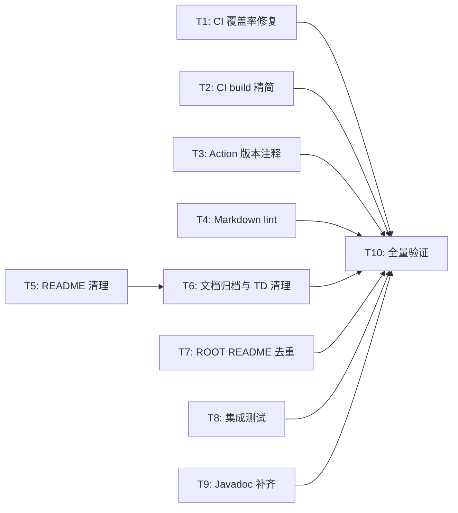

# Quality Refinement

> **状态校正（2026-07-26）**：T1 至 T10 的实施结果已由当前 CI、源代码、集成测试和 Java 17 全量 `verify` 复核。下方未勾选的步骤保留为当时的执行记录，不再表示待办；该计划等待随下一版本归档。

**Branch:** main（直接在 main 上修改，工程质量改善不需要特性分支）
**Baseline SHA:** 6fe0b1079e95ca73ba8463514a2ed88ff18543b7
**Worktree Path:** /home/yangyang/workspace/codes/Yggdrasil-Labs/mimir-boot
**Started At:** 2026-06-26
**Updated At:** 2026-06-26

**Goal:** 修复 CI 覆盖率上报、精简构建流程、治理文档一致性、补充集成测试。
**Architecture:** 纯工程基础设施改动——CI workflow 修复 + 文档清理归档 + 集成测试补充，无运行时代码变更。
**Tech Stack:** GitHub Actions, markdownlint-cli2, Spring Boot Test, JUnit 5

## Dependency Graph

| Task | 依赖 | 可并行组 |
|------|------|---------|
| T1 | 无 | A |
| T2 | 无 | A |
| T3 | 无 | A |
| T4 | 无 | A |
| T5 | 无 | A |
| T6 | T5 | B |
| T7 | 无 | A |
| T8 | 无 | A |
| T9 | 无 | A |
| T10 | T1~T9 | C |



---

### T1: CI SonarCloud 覆盖率修复

**Depends on:** 无

**Files:**

- Modify: `.github/workflows/ci.yml`

**Behavior:**
移除 `sonar.coverage.exclusions=**`，改为指定 JaCoCo XML 报告路径，让 SonarCloud 接收真实覆盖率数据。

**Execution:**

- **Status:** pending
- **Commit SHA:** null
- **Attempts:** 0
- **Blocked Reason:** null

- [ ] **Step 1: Confirm baseline**

```bash
grep "sonar.coverage.exclusions" .github/workflows/ci.yml
```

> 应命中 `sonar.coverage.exclusions=**`

- [ ] **Step 2: Implement**

```
OLD:
            -Dsonar.coverage.exclusions=**

NEW:
            -Dsonar.coverage.jacoco.xmlReportPaths=**/target/site/jacoco/jacoco.xml
```

- [ ] **Step 3: Verify**

```bash
grep "sonar.coverage.exclusions" .github/workflows/ci.yml || echo "REMOVED"
grep "jacoco.xmlReportPaths" .github/workflows/ci.yml
```

- [ ] **Step 4: Commit**

`fix(ci): 修复 SonarCloud 覆盖率上报，移除全排除配置`

---

### T2: CI build job 精简

**Depends on:** 无

**Files:**

- Modify: `.github/workflows/ci.yml`

**Behavior:**
将 `Format check` + `Compile` + `Unit tests` 三个独立 step 合并为一个 `./mvnw -B -U verify -Pci`，减少 JVM 冷启动次数。同时更新 `sonar` job 中的注释说明 build job 已一步到位。

**Execution:**

- **Status:** pending
- **Commit SHA:** null
- **Attempts:** 0
- **Blocked Reason:** null

- [ ] **Step 1: Confirm baseline**

```bash
grep -c "run: ./mvnw" .github/workflows/ci.yml
```

> 应 ≥ 4（Format check + Compile + Unit tests + Build only Dependabot + sonar）

- [ ] **Step 2: Implement**

替换 `Format check` + `Compile` + `Unit tests` 三个 step 为：

```yaml
      - name: Build and test
        if: github.actor != 'dependabot[bot]'
        run: ./mvnw -B -U verify -Pci
```

保留 `Build only (Dependabot)` step 不变。

- [ ] **Step 3: Verify**

```bash
grep -A2 "Build and test" .github/workflows/ci.yml
grep "Format check" .github/workflows/ci.yml || echo "REMOVED"
grep "Compile" .github/workflows/ci.yml || echo "REMOVED"
grep "Unit tests" .github/workflows/ci.yml || echo "REMOVED"
```

- [ ] **Step 4: Commit**

`perf(ci): 合并 build job 为单步 verify，减少 JVM 冷启动`

---

### T3: 统一 workflow action 版本注释

**Depends on:** 无

**Files:**

- Modify: `.github/workflows/release.yml`
- Modify: `.github/workflows/create-tag.yml`

**Behavior:**
为所有 `uses:` 行缺少版本注释的补齐 `# vN` 格式注释。（ci.yml 和 release-please.yml 已有完整注释，无需修改。）

**Execution:**

- **Status:** pending
- **Commit SHA:** null
- **Attempts:** 0
- **Blocked Reason:** null

- [ ] **Step 1: Confirm baseline**

```bash
grep -h "uses:" .github/workflows/release.yml .github/workflows/create-tag.yml | grep -v "#" | head -10
```

> 列出缺少注释的行

- [ ] **Step 2: Implement**

版本映射：

- `actions/checkout@9c091bb21b7c1c1d1991bb908d89e4e9dddfe3e0` → `# v6`
- `actions/setup-java@ad2b38190b15e4d6bdf0c97fb4fca8412226d287` → `# v4`
- `actions/github-script@3a2844b7e9c422d3c10d287c895573f7108da1b3` → `# v7`
- `softprops/action-gh-release@718ea10b132b3b2eba29c1007bb80653f286566b` → `# v2`

> 实施时须验证每个 SHA 对应的 tag：`gh api repos/{owner}/{repo}/git/ref/tags/{tag} --jq .object.sha`

逐文件补齐。

- [ ] **Step 3: Verify**

```bash
grep -h "uses:" .github/workflows/release.yml .github/workflows/create-tag.yml | grep -v "#"
```

> 预期输出为空（所有行都有注释）

- [ ] **Step 4: Commit**

`chore(ci): 统一 workflow action 版本注释`

---

### T4: 添加 Markdown lint

**Depends on:** 无

**Files:**

- Modify: `.github/workflows/ci.yml`
- Create: `.markdownlint.json`

**Behavior:**
在 CI build job 中新增 markdownlint step（Java 构建之前），并新建配置文件禁用不适合本项目的规则（行长度、HTML、首行标题）。

**Execution:**

- **Status:** pending
- **Commit SHA:** null
- **Attempts:** 0
- **Blocked Reason:** null

- [ ] **Step 1: Confirm baseline**

```bash
test ! -f .markdownlint.json && echo "NOT_EXISTS"
grep "markdownlint" .github/workflows/ci.yml || echo "NOT_EXISTS"
```

- [ ] **Step 2: Implement**

1. 创建 `.markdownlint.json`：

```json
{
  "MD013": false,
  "MD033": false,
  "MD041": false,
  "MD024": { "siblings_only": true }
}
```

1. 在 ci.yml 的 `Make Maven Wrapper executable` step 之后、`Build and test` step 之前插入：

```yaml
      - name: Markdown lint
        if: github.actor != 'dependabot[bot]'
        uses: DavidAnson/markdownlint-cli2-action@db4c24b0a350e5e15d4117f67d1e5c86c9b656c0 # v19
        with:
          globs: '**/*.md'
```

> 实施时须在 GitHub 上验证 SHA `db4c24b0...` 确实对应 v19 tag。验证方法：`gh api repos/DavidAnson/markdownlint-cli2-action/git/ref/tags/v19 --jq .object.sha`

- [ ] **Step 3: Verify**

```bash
cat .markdownlint.json
grep "Markdown lint" .github/workflows/ci.yml
```

- [ ] **Step 4: Commit**

`feat(ci): 添加 Markdown lint 自动检查`

---

### T5: README 清理规划模块

**Depends on:** 无

**Files:**

- Modify: `README.md`

**Behavior:**
从 README 模块表中移除 governance/metrics/security 三行，改为"未来方向"文字段落。同步清理 README 中的模块文档链接、项目结构树和 Mermaid 图。

**Execution:**

- **Status:** pending
- **Commit SHA:** null
- **Attempts:** 0
- **Blocked Reason:** null

- [ ] **Step 1: Confirm baseline**

```bash
grep "governance" README.md
grep "metrics" README.md
grep "security" README.md
```

> 三行都应命中模块表中的规划条目

- [ ] **Step 2: Implement**

README.md：

- 删除模块表中的 3 行（governance / metrics / security）
- 在模块表后添加"未来方向"段落
- 删除项目结构树中的 3 行
- 删除模块文档列表中 governance / metrics / security 链接
- 删除 Mermaid 图中 Governance / Metrics / Security 节点、规划依赖箭头和 style 行

> 注：ARCHITECTURE.md 中已无规划模块引用，无需修改。

- [ ] **Step 3: Verify**

```bash
grep "🔄 规划中" README.md || echo "REMOVED"
grep "未来方向" README.md
grep "Governance" README.md || echo "REMOVED"
grep "style Governance" README.md || echo "REMOVED"
```

- [ ] **Step 4: Commit**

`docs: 清理 README/ARCHITECTURE 中不存在的规划模块`

---

### T6: 文档归档与技术债清理

**Depends on:** T5

**Files:**

- Move: `docs/active/exception-handler-adapter/` → `docs/archive/exception-handler-adapter/`
- Modify: `docs/archive/index.md`
- Modify: `docs/active/index.md`
- Modify: `docs/active/tech-debt-tracker.md`
- Modify: `AGENTS.md`（移除 `docs/generated/` 引用如有）

**Behavior:**

1. 归档 exception-handler-adapter（移动目录 + 更新 design.md 头部状态）
2. 更新 tech-debt-tracker：TD-001~TD-004 全部标记为已解决或已降级
3. 移除 AGENTS.md 中对 `docs/generated/` 的无效引用

**Execution:**

- **Status:** pending
- **Commit SHA:** null
- **Attempts:** 0
- **Blocked Reason:** null

- [ ] **Step 1: Confirm baseline**

```bash
test -d docs/active/exception-handler-adapter && echo "EXISTS"
grep "TD-001" docs/active/tech-debt-tracker.md
grep "generated" AGENTS.md || echo "NO_REF"
```

- [ ] **Step 2: Implement**

1. `mv docs/active/exception-handler-adapter/ docs/archive/exception-handler-adapter/`
2. 在 `docs/archive/exception-handler-adapter/design.md` 头部加 `status: archived` + `archived-date: 2026-06-26`
3. 更新 `docs/archive/index.md` 添加归档记录
4. 更新 `docs/active/tech-debt-tracker.md`：
   - 删除 TD-001（通过 T7 根 README 去重解决）
   - 删除 TD-002（不适用：项目无数据库，`docs/generated/` 目录不存在）
   - 删除 TD-003（通过 T4 markdownlint CI 解决）
   - TD-004 保留但修改：优先级降为"低"，备注"规划模块已从 README 移除，待正式立项时再写产品规格"
5. 新增一条 TD 条目：`TD-005 | ci | release.yml publish-gpr 与 publish-maven-central 大量重复步骤，待用 reusable workflow 重构 | 中 | 2026-06-26 | ORPHAN | —`
6. 检查 AGENTS.md 是否有 `docs/generated/` 引用，有则移除

- [ ] **Step 3: Verify**

```bash
test -d docs/archive/exception-handler-adapter && echo "ARCHIVED"
test ! -d docs/active/exception-handler-adapter && echo "MOVED"
grep "TD-001" docs/active/tech-debt-tracker.md || echo "CLEARED"
grep "TD-004" docs/active/tech-debt-tracker.md && echo "KEPT_DOWNGRADED"
grep "TD-005" docs/active/tech-debt-tracker.md && echo "NEW_TD_ADDED"
grep "archived" docs/archive/exception-handler-adapter/design.md
```

- [ ] **Step 4: Commit**

`docs: 归档 exception-handler-adapter，清理技术债`

---

### T7: 根 README 去重精简

**Depends on:** 无

**Files:**

- Modify: `README.md`

**Behavior:**
精简"特性展示"段落，每个 starter 的展示内容压缩为 2-3 行摘要 + 链接到模块 README。移除大段代码示例（与模块 README 重复）。

**Execution:**

- **Status:** pending
- **Commit SHA:** null
- **Attempts:** 0
- **Blocked Reason:** null

- [ ] **Step 1: Confirm baseline**

```bash
wc -l README.md
```

> 记录当前行数

- [ ] **Step 2: Implement**

精简策略：

- "智能日志方案"段：保留功能要点列表，删除代码示例和详细日志格式示例
- "配置加密脱敏"段：保留功能要点列表，删除代码示例
- "Web 层增强"段：保留功能要点列表，删除代码示例
- "持久层增强"段：保留功能要点列表，删除代码示例
- 每段末尾保留"详细文档请参考 [模块 README](链接)"

- [ ] **Step 3: Verify**

```bash
wc -l README.md
```

> 行数应比 baseline 减少 ≥ 20%

```bash
# 验证特性展示段精简幅度
sed -n '/## 💡 特性展示/,/## 📚 模块文档/p' README.md | wc -l
```

> 特性展示段行数应比 baseline 减少 ≥ 50%

```bash
grep "详细文档请参考" README.md | wc -l
```

> 应 ≥ 4（每个 starter 展示段都有链接）

- [ ] **Step 4: Commit**

`docs: 精简根 README，去重特性展示段落`

---

### T8: starter-web 与 starter-exception 集成测试

**Depends on:** 无

**Files:**

- Create: `mimir-boot-starters/mimir-boot-starter-web/src/test/java/com/yggdrasil/labs/web/config/WebAutoConfigurationIT.java`
- Create: `mimir-boot-starters/mimir-boot-starter-exception/src/test/java/com/yggdrasil/labs/exception/config/ExceptionAutoConfigurationIT.java`

**Behavior:**
为两个 starter 的 AutoConfiguration 补充 `@SpringBootTest` 级集成测试，验证 Bean 注册正确性和 `@ConditionalOnMissingBean` 覆盖行为。

**Execution:**

- **Status:** pending
- **Commit SHA:** null
- **Attempts:** 0
- **Blocked Reason:** null

- [ ] **Step 1: Confirm baseline**

```bash
test ! -f mimir-boot-starters/mimir-boot-starter-web/src/test/java/com/yggdrasil/labs/web/config/WebAutoConfigurationIT.java && echo "NOT_EXISTS"
test ! -f mimir-boot-starters/mimir-boot-starter-exception/src/test/java/com/yggdrasil/labs/exception/config/ExceptionAutoConfigurationIT.java && echo "NOT_EXISTS"
```

- [ ] **Step 2: Implement**

`WebAutoConfigurationIT.java`：

```java
// 使用 WebApplicationContextRunner（提供 mock servlet 环境，满足 @ConditionalOnWebApplication）
// 配合 AutoConfigurations.of(WebAutoConfiguration.class)
// 验证 TraceInterceptor Bean 存在（前提：classpath 无 micrometer-tracing，当前满足）
// 验证 CorsConfig Bean 存在（@Import 引入的配置类）
// 验证 ResponseBodyEnhancer Bean 存在
// 验证 WebProperties 可注入
```

`ExceptionAutoConfigurationIT.java`：

```java
// 使用 WebApplicationContextRunner（ExceptionAutoConfiguration 有 @ConditionalOnWebApplication 条件）
// 配合 AutoConfigurations.of(ExceptionAutoConfiguration.class)
// 验证 DefaultExceptionResponseFactory Bean 存在
// 验证 MimirExceptionHandler Bean 存在
// 用 .withBean() 注册自定义 ExceptionResponseFactory，验证覆盖默认实现
```

- [ ] **Step 3: Verify**

```bash
./mvnw test -pl mimir-boot-starters/mimir-boot-starter-web -Dtest=WebAutoConfigurationIT -Pci
./mvnw test -pl mimir-boot-starters/mimir-boot-starter-exception -Dtest=ExceptionAutoConfigurationIT -Pci
```

> 全部 PASS

- [ ] **Step 4: Commit**

`test(web,exception): 补充 AutoConfiguration 集成测试`

---

### T9: common 模块 Javadoc 补齐

**Depends on:** 无

**Files:**

- Modify: `mimir-boot-common/src/main/java/com/yggdrasil/labs/common/exception/ErrorCode.java`

**Behavior:**
为 `ErrorCode` 枚举值补充逐项 Javadoc。实施前先跑 `javadoc:javadoc` 确认实际 warning，如其他类也有 warning 则按需扩大范围。

**Execution:**

- **Status:** pending
- **Commit SHA:** null
- **Attempts:** 0
- **Blocked Reason:** null

- [ ] **Step 1: Confirm baseline**

```bash
./mvnw javadoc:javadoc -pl mimir-boot-common -Dquiet=true 2>&1 | grep -i "warning" | head -20
```

> 记录实际 warning 数量和来源文件，确认需要补齐的范围

- [ ] **Step 2: Implement**

为 `ErrorCode` 枚举的每个值补充 Javadoc：

```java
/** 说明该错误码的含义和典型使用场景 */
```

若 Step 1 发现其他文件有 warning，一并修复。

- [ ] **Step 3: Verify**

```bash
./mvnw javadoc:javadoc -pl mimir-boot-common -Dquiet=true 2>&1 | grep -i "warning" | wc -l
```

> 预期 0 warning

- [ ] **Step 4: Commit**

`docs(common): 补齐 ErrorCode 枚举 Javadoc`

---

### T10: 全量验证

**Depends on:** T1, T2, T3, T4, T5, T6, T7, T8, T9

**Files:** 无新增修改

**Behavior:**
执行全量构建验证，确保所有改动不破坏现有功能。验证通过后更新 `docs/active/index.md`。

**Execution:**

- **Status:** pending
- **Commit SHA:** null
- **Attempts:** 0
- **Blocked Reason:** null

- [ ] **Step 1: Confirm baseline**

```bash
git status --short
```

> 工作区干净

- [ ] **Step 2: Implement**

```bash
./mvnw clean verify -Pci
```

- [ ] **Step 3: Verify**

```bash
echo $?
```

> 退出码 0

```bash
grep -r "BUILD SUCCESS" --include="*.log" . || echo "check stdout"
```

- [ ] **Step 4: Commit**

无额外 commit（纯验证步骤）。如验证通过，更新 `docs/active/index.md` 记录版本状态：

`docs: 更新活跃版本索引`
