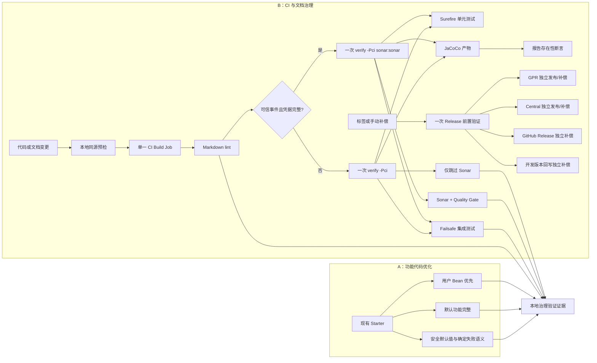

# Project Governance

## Context

Mimir Boot 的 Parent、BOM、Common 和 Starter 分层保持不变。本轮治理针对的不是重新划分架构，
而是三类已经有代码证据的问题：质量门禁没有执行全部已有测试、部分 Starter 的默认能力或失败语义
不完整，以及单人维护流程存在重复构建和人工事实同步。

范围讨论已逐项完成。设计只承接 GOV-001 至 GOV-020，不把低收益整洁性调整、消费者契约工程、
新 Starter 或发布体系重构带入 v2.1.2。

实施按两条主线组织：B“CI 与文档治理”先建立可信门禁，A“功能代码优化”再进入运行时和
Starter 修改。GOV-008 是兼容性约束，不形成独立实施流。

## Goal

- 正常 Java 17 `verify -Pci` 执行单元测试和集成测试，Failsafe 报告非空。
- 每次 CI 只进行 1 次完整 Reactor 构建，Sonar 复用该构建产物。
- 完成主线 A 的 10 个 GOV 条目，同时保持现有公开替换点和 v2.x 公共边界可用。
- 校正版本、10 个 Starter 聚合子模块、15 个 Reactor 模块和内部链接的当前文档事实；持续自动校验
  作为 GOV-012 延期项处理。
- v2.1.2 关闭时 GOV-001 至 GOV-020 均已验证、关闭或按规则延期，P0/P1 未关闭数为 0。

## 实施验证

本设计的运行时与构建契约已由 T1—T11 的本地定向 AC 验证。T12 使用 Java 17 同源预检、Markdown、
文档状态核对和历史提交审计复核本地结果；远端 PR CI 与可信 push Sonar Quality Gate 尚待 T12 AC4
验证。GOV-008 保持既有公共边界并记录为 3.0 候选，GOV-012 按延期记录处理。

## Non-Goal

- 不新增 observability/trace、缓存、安全、指标或治理 Starter。
- 不创建消费者契约仓库、示例应用矩阵或独立兼容夹具。
- 不移除 v2.x 公共响应模型的 `Serializable` 上界。
- 不精简或拆分企业级宽 BOM，不宣称“仅管理”依赖已通过本仓库验证。
- 不自动合并 Dependabot PR，不降低依赖更新频率。
- 不让 GPR 和 Maven Central 共用发布产物，不改变故障补偿的独立性。
- 不自动覆盖人工 Markdown 内容。

## Architecture



主线 B 先把本地预检、CI 和 Release 的确定性门禁对齐；主线 A 再让默认能力在输入、业务执行和
清理阶段保持可预测。Release 只压缩重复前置验证，不合并具有外部副作用的发布任务。

## Interface Contract

### 1. 构建生命周期与 Spring Boot 版本线

服务 Behavior“构建与发布门禁可信”。

#### Maven Failsafe

文件：`mimir-boot-parent/pom.xml`

- 将 `maven-failsafe-plugin` 从仅有版本和 execution 定义的 `pluginManagement`，补充到继承生效的
  `<build><plugins>`。
- 保持匹配 `**/*IT.java` 和 `**/*IntegrationTest.java`。
- `verify` 必须执行 `integration-test` 与 `verify` goals；`package` 不执行集成测试。
- Surefire 继续排除上述集成测试命名，保证每个测试只由一个测试插件执行。

正常路径：`./mvnw -B -Pci verify` 生成 Surefire 与 Failsafe 报告。

错误路径：任一 `*IT` 失败或 Failsafe verify 失败时 Maven 退出码非 0。

#### Spring Boot 共享版本属性

文件：根 `pom.xml`、`mimir-boot-bom/pom.xml`、`mimir-boot-parent/pom.xml`

根 POM 提供单一版本来源：

```xml
<spring.boot.version>3.3.13</spring.boot.version>
```

BOM 的依赖平台和 Parent 的构建插件都引用：

```xml
<version>${spring.boot.version}</version>
```

- BOM 删除自己的重复版本常量，继承根属性。
- Parent 的 `maven.spring.boot.plugin.version` 删除或改为 `${spring.boot.version}`，不得再维护第二个数值。
- 发布后的扁平 POM 必须包含可解析的具体版本，不泄漏无法解析的仓库内部属性。

### 2. CI 单次构建与轻量预检

服务 Behavior“构建与发布门禁可信”。为降低单人维护成本，普通 CI 不引入项目级 Node 工具链、YAML 解析器或
文档治理脚本；文档事实与链接治理由独立文档任务处理。

文件：`.github/workflows/ci.yml`、`scripts/ci-preflight.sh`。

#### CI Job

唯一预检入口为 `bash scripts/ci-preflight.sh`。它要求 Java 17，默认以一次
`./mvnw -B -Pci clean verify` 构建整个 Reactor；`RUN_SONAR` 只允许 `true|false`，true 路径先要求
`SONAR_TOKEN`、`SONAR_ORGANIZATION`、`SONAR_PROJECT_KEY` 均非空，再在同一次 Maven invocation 中追加
`sonar:sonar` 以及 host、organization、project key、JaCoCo XML 和 Quality Gate 参数。Token 始终只通过
环境变量供 Scanner 读取，绝不进入命令行或输出。

Maven 返回后，预检必须确认至少一份非空 Surefire XML 且零 failures/errors/skipped；至少两份 Failsafe
XML、至少 11 个 testcase 且零 failures/errors/skipped；并存在非空 JaCoCo XML。下界避免新增集成测试时
将正常增长误判为失败。

`ci.yml` 仅保留一个 Build Job：checkout、Java 17 + Maven cache、Markdown lint、一次预检调用和报告上传。
它不使用 `-U`、独立 Sonar Job、`paths`/`paths-ignore` 或项目级 Node 步骤。Sonar 仅在可信 push 且三项配置
齐全时运行；所有 PR、fork、Dependabot、缺配置和本地默认路径继续执行核心预检并输出
`Sonar analysis: skipped (not eligible)`。三个 Sonar 环境变量也仅在 push 映射真实 Secret，避免 PR 代码接触
凭据。

- Job 权限保持 `contents: read`；核心预检不读取发布 Secret，不使用 `pull_request_target`。
- Artifact 上传保持 `if: always()`，但报告缺失由预检脚本在上传前明确失败，不依赖 artifact action 的默认行为判断。
- 保留普通 CI 的同分支取消策略；Release 保留 `cancel-in-progress: false` 与 `queue: max`，不得改成
  取消正在发布的运行，也不得同时配置 `cancel-in-progress: true`。

#### CI 失败分类

| 类型 | 是否阻断 | 设计处理 |
|------|----------|----------|
| Markdown、格式、编译、测试、覆盖率失败 | 是 | 本地与 CI 同源命令，Push 前可复现 |
| Failsafe/JaCoCo 报告缺失 | 是 | 预检脚本给出专用错误，不产生“构建绿但报告空” |
| Dependabot、fork 或 Secret 缺失 | 否 | 仅 Sonar 条件跳过，核心门禁照常执行 |
| Sonar 已进入执行后失败 | 是 | 视为真实质量门禁或外部服务故障，由同一 Build Step 失败，不触发第二次构建 |
| 发布凭据或远程仓库失败 | 不影响普通 CI | 只存在于标签/手动 Release 工作流，可按既有粒度补偿 |

#### 普通 CI 路径矩阵

| 路径 | Sonar 资格 | Maven 目标 | 可观察结果 |
|------|------------|------------|------------|
| 主仓库 push，三项配置完整 | true | `verify sonar:sonar` + 完整项目参数 | 扫描与 Quality Gate 参与 Build 结果 |
| 主仓库内部 PR，三项配置完整 | false | `verify` | 固定日志记录 skipped，核心门禁继续 |
| fork PR | false | `verify` | 固定日志记录 skipped，核心门禁继续 |
| Dependabot | false | `verify` | 固定日志记录 skipped，核心门禁继续 |
| 任一 Sonar 配置缺失 | false | `verify` | 固定日志记录 skipped，核心门禁继续 |
| 本地默认执行 | false | `verify` | 无需 Sonar 配置即可复现核心门禁 |

上述路径是普通 CI 的冻结验收矩阵；终审不得再用新的路径分类扩张本版本范围。

#### 延期的文档事实自动化

DOC-001—DOC-006 原计划覆盖版本、Starter 聚合子模块、Reactor 模块、活跃索引、内部链接和 GOV 状态。
2026-08-12 的 T2 范围收缩明确不引入项目级 Node、YAML 解析器或长期文档事实脚本，因此这些规则没有
进入当前 CI，不能作为已交付接口或 T12 通过证据。GOV-012 记录 Owner、延期理由和目标版本；后续独立
文档治理需求如重新实施，仍须满足“只读、失败定位、不自动覆盖 Markdown”的原始边界。

DOC-007 仅用于 T4 的 BOM 支持等级一次性核对：`mimir-boot-bom/README.md` 中“已验证”和“仅管理”集合
必须覆盖全部显式管理坐标且互斥。它不依赖项目级 Node 工具链，也不代表 DOC-001—DOC-006 已实现。

### 3. Release 前置验证

服务 Behavior“构建与发布门禁可信”。

文件：`.github/workflows/release.yml`、`.github/actions/checkout-setup/action.yml`、
`.github/actions/maven-release-prepare/action.yml`

- 将 `build-verify` 与只执行最终 package 的 `release` 合并为 `release-verify`。
- 手动补偿选择校验保留在该 Job。
- 前置命令固定为：

```bash
./mvnw -B -Dspotless.check.skip=false spotless:check clean package
```

- Release Workflow 和发布准备复合 Action 的所有 Maven 命令移除 `-U`。
- `publish-gpr`、`publish-maven-central`、GitHub Release 和开发版本回写只更新 `needs`，
  其 `if`、权限、密钥、并发和补偿选择保持不变；`lint-ci.mjs` 解析 YAML 后逐项验证，而不是只搜索 Job 名称。
- 不上传或复用前置 Job 的 Maven 制品作为远程发布输入。

### 4. Dependabot 分组

服务 Behavior“文档与依赖维护自动化”。

文件：`.github/dependabot.yml`

Maven 入口保持当前 weekly Saturday、现有领域分组和开放 PR 上限。GitHub Actions 入口保持
weekly Monday 和开放 PR 上限，新增：

```yaml
groups:
  github-actions-minor-patch:
    patterns:
      - "*"
    update-types:
      - "minor"
      - "patch"
```

major 更新保持独立；不配置自动合并或更低频率。

### 5. MDC 所有权

服务 Behavior“运行时上下文与扩展生命周期安全”。

文件：`TraceInterceptor.java`、`WebInterceptor.java` 及测试。

- `TraceInterceptor` 只拥有 `traceId` 和 `requestId`，`WebInterceptor` 只拥有 `ip`。
- 每个拦截器在写入前把自有键的“是否存在”和旧值保存到当前请求属性。
- `afterCompletion` 恢复旧值；进入前不存在则移除该键。
- 禁止调用 `MDC.clear()`。
- 异常请求与正常请求使用同一恢复路径。

请求属性名是模块内部常量，不作为公共配置或业务 API。

### 6. 客户端 IP 信任边界

服务 Behavior“运行时上下文与扩展生命周期安全”。

文件：`IpUtils.java`、`WebInterceptor.java`、`AccessLogFilter.java`、相关 README 与测试。

新增安全默认接口：

```text
public static String resolveClientIp(Supplier<String> remoteAddrSupplier)
```

显式可信代理扩展接口：

```text
public static String resolveForwardedClientIp(
        UnaryOperator<String> headerGetter,
        Supplier<String> remoteAddrSupplier,
        Predicate<String> trustedProxyPredicate)
```

- Web 与访问日志默认只调用单参数安全接口，即读取容器提供的 `request.getRemoteAddr()`。
- 反向代理部署使用 Spring Boot/Servlet 容器的 Forwarded Header 与 trusted proxies 配置，
  由容器先安全改写 remote address；Starter 不维护第二套代理 CIDR 配置。
- 三参数接口只有在连接来源地址满足 `trustedProxyPredicate` 时解析转发头；否则返回连接来源地址。
- 解析 `X-Forwarded-For` 时从最接近应用的一侧向外跳过可信代理，返回第一个不可信地址，
  不再无条件取最左值。
- 现有两参数 `resolveClientIp(headerGetter, remoteAddrSupplier)` 标记弃用，并改为安全接口语义，
  防止升级后继续默认信任任意请求头。

这是安全默认值修正。迁移文档必须给出 Tomcat 和 Framework 两种可信代理配置入口，并明确只有
受控边界代理可以启用 Forwarded Header 处理。

### 7. Jackson 追加式定制

服务 Behavior“运行时上下文与扩展生命周期安全”。

文件：`JacksonConfig.java` 及集成测试。

```text
builder.modules(javaTimeModule)
-> builder.modulesToInstall(javaTimeModule)
```

保留日期、时间、时区、null、pretty-print 和未知字段配置；只改变 Module 注册语义。
集成测试同时注册一个测试 Module，并断言项目时间格式与测试 Module 均生效。

### 8. RPC 生命周期失败策略

服务 Behavior“运行时上下文与扩展生命周期安全”。

文件：`RpcHookChain.java`、`RpcExecutionTemplate.java`、`RpcFeignClient.java`、
`RpcDubboFilter.java` 及相关测试。

新增每次调用独享的 Handle，`RpcHookChain` 单例只保存不可变 Hook 列表，不保存调用状态：

```text
public RpcHookInvocation open(RpcCallContext context)

public final class RpcHookInvocation implements AutoCloseable {
    private enum State { OPEN, COMPLETING, CLOSED }
    private final AtomicReference<State> state = new AtomicReference<>(State.OPEN);

    public void before();
    public void completeSuccess(RpcCallResult result);
    public void completeFailure(RpcCallResult result, Throwable primaryError);
    @Override public void close();
}
```

Invocation 使用 `AtomicReference<State>`，状态只能按 `OPEN -> COMPLETING -> CLOSED` 前进。
`completeSuccess`、`completeFailure` 和 `close` 都先以 CAS 争夺唯一终态执行权；只有赢家执行对应的
after/onError 和 cleanup，其他并发或重复完成调用直接 no-op。`close()` 只用于尚未完成且无主异常的
兜底清理；存在业务主异常时，调用方必须调用 `completeFailure`。适配器不得仅依赖 try-with-resources
处理有主异常路径，以免 Java 自动 suppressed 规则改变本设计的异常优先级。

- `open` 为当前调用快照化有序 Hook 列表并返回独立 Invocation；同步调用持有到 finally，异步调用
  把同一 Invocation 移交完成回调。
- `before` 在调用某个 Hook 前先把它记入 entered 列表，因此 `before` 自身抛错的 Hook 也必须 cleanup；
  尚未开始的后续 Hook 不进入任何后置或清理阶段。
- `completeSuccess` 内部依次执行 after 和 cleanup；`completeFailure` 内部依次执行 onError 和 cleanup。
  after/onError 只遍历 entered Hook，cleanup 逆序遍历 entered Hook；三个阶段不再作为可独立重复调用的公共方法。
- Invocation 内只保存当前调用的 context、entered 列表和原子状态，不使用 `ThreadLocal` 或
  `RpcHookChain` 可变字段，因此并发和异步完成不会串扰。
- 现有 `RpcHookChain.before/after/onError/cleanup` 公共方法保留并标记弃用，维持二进制与源码兼容；
  内部适配器全部迁移到 `open`，旧方法不参与新的 entered 生命周期保证。

统一阶段语义：

| 阶段 | 策略 | 对业务调用的影响 |
|------|------|------------------|
| `before` | fail-closed，首个异常停止后续前置阶段 | 不执行业务调用 |
| tracer inject/extract | fail-closed | 不执行业务调用 |
| business | 原始结果或异常为主结果 | 决定主成功/失败 |
| `after` | 所有 entered Hook best-effort | 不覆盖成功业务结果 |
| `onError` | 所有 entered Hook best-effort | 不覆盖业务异常 |
| `cleanup` | 逆序执行全部 entered Hook，best-effort | 不覆盖主结果或主异常 |

- 调用方必须先 `open`，再把 `before` 和 tracer 移入能保证 `completeFailure(result, primaryError)` 或
  `completeSuccess(result)` 的边界；finally 中的 `close()` 仅作兜底并因终态 CAS 保持 no-op。
- `after`/`onError`/`cleanup` 内部捕获并记录扩展异常；存在 primaryError 时作为 suppressed exception
  附加，调用方仍收到 primaryError。
- 不存在主异常时，after/cleanup 异常不把成功业务调用改为失败。
- 同步与异步适配器都只能完成一次 after/onError 和一次 cleanup。

### 9. 默认 RPC MDC Bridge

服务 Behavior“Starter 默认能力完整”。

文件：RPC Core、Feign、Dubbo、Web、Common 常量与测试；Feign 模块 POM 以 test scope 引入 Web
Starter，专门承载真实 Feign 出站到 Web 入站的跨模块测试，不改变 Feign 的生产依赖。

新增常量：

```text
CommonConstants.REQUEST_ID = "requestId";
HttpHeaderConstants.REQUEST_ID_HEADER = "X-Request-Id";
```

为现有接口增加向后兼容的默认 scope 方法：

```java
default RpcTraceScope extractScope(RpcCallContext context, Map<String, String> carrier) {
    extract(context, carrier);
    return RpcTraceScope.noop();
}
```

新增公共生命周期接口：

```java
@FunctionalInterface
public interface RpcTraceScope extends AutoCloseable {
    @Override
    void close();

    static RpcTraceScope noop() {
        return () -> {};
    }
}
```

新增默认实现 `MdcRpcTracerBridge`：

- `inject` 只读取 MDC 的 `traceId`、`requestId`，只注入非空且符合
  `[A-Za-z0-9][A-Za-z0-9._-]{0,63}` 的值。
- `extractScope` 在当前执行线程保存两个键的旧状态；合法 traceId 写入 MDC，缺失或非法 traceId
  生成 32 位十六进制值；合法 requestId 写入，缺失或非法 requestId 在调用期间移除，避免继承线程上
  一次调用的旧值。
- `RpcTraceScope.close()` 恢复旧状态，只能幂等关闭一次。
- Dubbo Provider 在 `invoker.invoke` 返回前关闭 scope；异步完成回调使用 `RpcCallContext`，不依赖 MDC。
- Feign 和 Dubbo Consumer 复用 `inject`。
- Feign 下游由 Web `TraceInterceptor` 从 `X-Trace-Id` 与 `X-Request-Id` 提取合法值写入 MDC；
  两个键都使用请求级旧值保存/恢复，非法 requestId 不得进入 MDC。

自动装配：

```java
@Bean
@ConditionalOnMissingBean(RpcTracerBridge.class)
public RpcTracerBridge rpcTracerBridge() {
    return new MdcRpcTracerBridge();
}
```

现有 `NoopRpcTracerBridge` 类保留为显式关闭或测试用途，但不再作为默认 Bean。

Web 侧同时收口幽灵接管条件：

- `WebAutoConfiguration.traceInterceptor()` 删除
  `@ConditionalOnMissingClass("io.micrometer.tracing.Tracer")`。
- back-off 条件改为 `@ConditionalOnMissingBean(TraceInterceptor.class)`。
- `TraceInterceptor` 继续优先复用 MDC 中已存在的合法 Micrometer traceId，并负责写入 `X-Trace-Id`
  响应头；没有现有 ID 时才生成新值。
- `TraceInterceptor` 同时读取合法 `X-Request-Id`；缺失或非法时生成 32 位十六进制 requestId，
  请求结束后与 traceId 一起恢复进入前状态。
- 删除“由不存在的 starter-trace 接管”相关注释和 README 描述。

### 10. Spring 6 HTTP 异常映射

服务 Behavior“Starter 默认能力完整”。

文件：`MimirExceptionHandler.java`、错误码定义（仅在现有码无法表达时追加）、测试和 README。

新增处理签名：

```text
public Object handleHandlerMethodValidationException(
        HandlerMethodValidationException e, HttpServletRequest request)

public Object handleConstraintViolationException(
        ConstraintViolationException e, HttpServletRequest request)

public Object handleMissingRequestHeaderException(
        MissingRequestHeaderException e, HttpServletRequest request)

public Object handleMissingPathVariableException(
        MissingPathVariableException e, HttpServletRequest request)

public Object handleHttpMediaTypeNotAcceptableException(
        HttpMediaTypeNotAcceptableException e, HttpServletRequest request)

public Object handleHttpMediaTypeNotSupportedException(
        HttpMediaTypeNotSupportedException e, HttpServletRequest request)

public Object handleMaxUploadSizeExceededException(
        MaxUploadSizeExceededException e, HttpServletRequest request)

public Object handleNoResourceFoundException(
        NoResourceFoundException e, HttpServletRequest request)
```

状态映射：

| 异常类别 | HTTP 状态 | 现有错误语义 |
|----------|-----------|--------------|
| 方法入参校验、约束校验、缺少请求头 | 400 | `PARAM_INVALID` 或 `PARAM_MISSING` |
| 方法返回值校验、缺少路径变量 | 500 | 服务端契约或处理器映射错误 |
| 静态资源或请求资源不存在 | 404 | `DATA_NOT_FOUND` |
| 响应媒体类型不可接受 | 406 | `OPERATION_NOT_ALLOWED` |
| 上传大小超限 | 413 | `PARAM_INVALID` |
| 请求媒体类型不支持 | 415 | `OPERATION_NOT_ALLOWED` |

`HandlerMethodValidationException` 必须按 `isForReturnValue()` 分支：入参校验返回 400，返回值校验
返回 500。`MissingPathVariableException` 保持 Spring 默认的 500 语义，不得作为缺少客户端输入映射
为 400。所有响应继续经过 `ExceptionResponseFactory`，工厂失败继续降级为 `R.fail`。日志只包含
净化后的字段、状态和 URI，不记录请求体。`BizException` 的 HTTP 200 行为不变。

### 11. Nacos 动态刷新验证与条件修复

服务 Behavior“Starter 默认能力完整”。

文件：新增模块内 `NacosEncryptRefreshIT.java`；仅契约失败并记录授权时，按失败类别修改
`NacosEncryptAutoConfiguration.java` 或 `ConfigDecryptProcessor.java`。

测试上下文包含可变 Enumerable PropertySource、一个真实绑定的测试配置 Bean 和 Spring Cloud
配置重绑定能力。测试步骤固定为：启动时验证旧明文 -> 替换为新密文 -> 发布环境变更事件 ->
验证 Environment 与 Bean 的新明文。

确定性分支：

- 基线测试通过：不修改运行时代码，只提交集成测试。
- 基线测试失败：只按结构化授权修复；`refresh-order` 让解密监听器以
  `Ordered.HIGHEST_PRECEDENCE` 在配置重绑定前更新解密覆盖层并删除重复监听路径，`rollback` 或
  `log-safety` 只调整解密处理器对应不变量。

首轮 Decision Evidence 同时覆盖成功刷新、错误密钥回滚和日志安全。全部通过时不修改运行时代码；
任一契约断言失败时，必须先在 T10 `Red Result` 写入结构化对象：`command`、`exitCode`、
`failsafeTests`、`failureKind`、`failedContracts[]` 和 `runtimeChangeAuthorization[]`。`failureKind`
只允许 `none`、`contract`、`environment`，授权值只允许
`refresh-order`、`rollback`、`log-safety`；环境或装配故障不产生授权。`refresh-order` 只允许修改
自动配置监听顺序，`rollback`/`log-safety` 只允许修改解密处理器对应不变量。错误密钥路径必须明确
失败，Environment 与配置 Bean 保持刷新前的旧明文，日志不得包含密钥、密文和明文。

### 12. 任务提交归属验收记录

服务版本级终验，不改变运行时行为。T12 已对 Baseline、Implementation Head、T1—T11 Execution SHA、
任务允许文件和 T10 结构化授权完成一次性历史核对；随后发生的 T12 终验及复审修复提交按实际历史追加
登记。该校验工具已清理，不作为后续版本或日常开发门禁；远端 PR CI 和 `main`/`develop` 可信 push
Sonar Quality Gate 证据仍是 T12 未完成部分。

### 13. JUnit Suite 下游依赖

服务 Behavior“Starter 默认能力完整”。

文件：`mimir-boot-starter-test/pom.xml`、README 和动态临时消费者测试脚本。

```xml
<dependency>
  <groupId>org.junit.platform</groupId>
  <artifactId>junit-platform-suite-api</artifactId>
</dependency>
<dependency>
  <groupId>org.junit.platform</groupId>
  <artifactId>junit-platform-suite-engine</artifactId>
  <scope>runtime</scope>
</dependency>
```

- 删除两个依赖当前的 `test` scope。
- 删除仅供本模块历史测试使用、当前源码未引用的 Testcontainers test-scope 依赖；BOM 版本管理继续保留。
- README 明确 Suite 开箱即用，Testcontainers 由消费者选择具体模块。消费依赖树本来就不会传递
  test-scope Testcontainers，因此“无 Testcontainers”只作为清理不改变消费者依赖的回归证据，
  不作为本功能收益或 Red 失败依据。
- 验证使用临时 Maven 项目，不新增长期消费者契约工程。

### 14. 自动装配用户优先

服务 Behavior“Starter 默认能力完整”。

文件：Web、Log、MyBatis 自动配置与上下文测试。

| 默认组件 | back-off 条件 | 替换结果 |
|----------|---------------|----------|
| `ResponseBodyEnhancer` | `@ConditionalOnMissingBean(ResponseBodyEnhancer.class)` | 用户实例生效 |
| `WebInterceptor` | `@ConditionalOnMissingBean(WebInterceptor.class)` | 用户实例生效 |
| `TraceInterceptor` | `@ConditionalOnMissingBean(TraceInterceptor.class)` | 用户实例生效，不按 classpath 猜测接管者 |
| `accessLogFilter` 注册 | `@ConditionalOnMissingBean(name = "accessLogFilter")` | 用户同名注册生效 |
| `MybatisPlusInterceptor` | `@ConditionalOnMissingBean(MybatisPlusInterceptor.class)` | 用户实例完整替换默认实例 |

不新增 Customizer，不合并用户与 Starter 的 MyBatis 内部拦截器。TraceInterceptor 现有命名覆盖策略
本轮不扩张为新的公共接口。

### 15. BOM 支持等级与 Serializable 决策

服务 Behavior“依赖维护”和“2.x 公共兼容性保持”。

文件：`mimir-boot-bom/README.md`、相关产品/架构文档和治理专题。

- BOM 继续管理当前企业生态依赖。
- “已验证”只包含被当前 Starter 直接消费并进入 Reactor 测试的依赖。
- “仅管理”包含提供统一版本但没有当前 Starter 运行验证的依赖。
- T4 的一次性只读核对确认两个集合无重复、BOM 中每个显式管理项至少属于一个集合。
- GOV-008 不修改生产 API，但必须增加编译回归：Serializable 类型继续编译且 JSON 语义不变，
  非 Serializable 类型继续编译失败；3.0 评估入口保留在治理文档。

## Data Model

不新增数据库或持久化模型。新增或调整的数据结构如下：

| 数据结构 | 字段/接口 | 约束 |
|----------|-----------|------|
| RPC 传播载体 | `X-Trace-Id: String`、`X-Request-Id: String` | ASCII 白名单，长度 1—64 |
| RPC Trace Scope | `close(): void` | 幂等，只恢复本 Bridge 拥有的两个 MDC 键 |
| RPC Hook Invocation | `context: RpcCallContext`、`entered: List<RpcHook>`、`state: AtomicReference<State>` | `OPEN -> COMPLETING -> CLOSED`，每次调用独享，唯一终态路径完成 after/onError 与逆序 cleanup |
| BOM 支持等级 | `verified/managedOnly: Set<MavenCoordinate>` | 每个显式管理项恰好属于一类，无持久化关系 |
| GOV 标识 | `id: String`，GOV-001—GOV-020 | 本目录唯一、连续，不复用 |
| 实施提交边界 | `baseline/implementationHead/taskShas` | T1—T11 覆盖实施区间；其后的终验及复审修复提交按实际历史登记，不限制提交数量 |

## Error Handling

| 失败场景 | 处理策略 |
|----------|----------|
| Failsafe 报告缺失或集成测试失败 | Maven 与 CI 失败，不允许以 Surefire 通过替代 |
| Sonar 密钥不可用 | 仅跳过分析；构建、测试和报告照常完成 |
| Sonar 分析自身失败 | 有密钥且进入分析时 CI 失败，不重复构建来掩盖失败 |
| Markdown 格式错误 | 本地与 CI 的 Markdown lint 失败并定位文件，不修改文件 |
| Maven 缓存缺失 | 正常下载缺失构件；只有明确故障排查才使用 `-U` |
| npm/Maven/Action 下载暂时失败 | 保留失败 Step 与缓存证据，不把网络错误改写为测试失败；确认平台恢复后只重跑原 Job |
| 发布前置验证失败 | 所有外部发布 Job 不启动，补偿选择保持可重试 |
| RPC 前置扩展失败 | fail-closed，业务不执行，清理 best-effort |
| RPC 后置或清理失败 | 记录并继续；不得覆盖业务主结果或主异常 |
| RPC 载体 ID 非法 | 丢弃非法值，traceId 生成合法新值，requestId 保持缺失 |
| Nacos 刷新解密失败 | 刷新明确失败，Environment 与配置 Bean 保持旧明文，日志不输出敏感材料，不保留半更新解密层 |
| 自定义 Bean 与默认 Bean 同时存在 | 自动配置回退；上下文中只允许一个有效实例 |
| BOM 依赖没有仓库内消费证据 | 标记为“仅管理”，不删除依赖也不宣称已验证 |

## Non-Functional Requirements

| 维度 | 指标 |
|------|------|
| 构建效率 | 每个 CI 工作流完整 Reactor 构建次数 = 1 |
| 测试完整性 | 正常 `verify -Pci` 的 Failsafe 报告数 > 0，测试失败数 = 0 |
| 本地一致性 | 本地与 CI 核心预检入口相同，命令漂移数 = 0 |
| 安全 | 未配置可信代理时，转发头影响审计 IP 的请求数 = 0 |
| 上下文隔离 | 每次 Web/RPC 调用结束后非本组件 MDC 键丢失数 = 0 |
| 日志安全 | Nacos 密钥、密文、解密明文写入日志的数量 = 0 |
| 治理一致性 | Markdown、CI 静态规则、BOM 一次性分类核对错误数 = 0；DOC-001—DOC-006 按 GOV-012 延期 |
| 发布恢复 | GPR 与 Central 可独立补偿，已发布坐标覆盖次数 = 0 |
| 兼容性 | v2.x 主动移除的公共类型、方法和配置项数量 = 0 |

## Alternatives Considered

| 方案 | 优点 | 缺点 | 不选原因 |
|------|------|------|----------|
| 独立 Sonar Job 再次构建 | Job 隔离直观 | 完整 Reactor 重复执行 | 单人维护和 CI 时间收益明显低于复用构建 |
| CI 传递全部 Maven target artifact | 可保留 Job 隔离 | 多模块产物大且恢复脆弱 | 比同 Job 分步分析复杂 |
| 月度 Dependabot | PR 出现频率低 | 更新批次更大、普通修复延迟 | 不减少更新总量 |
| 新建 trace Starter | 模块边界纯 | 增加模块、依赖、发布和文档维护 | 当前只需默认 MDC 传播 |
| 自建可信代理配置 | Starter 可独立解析 CIDR | 与容器安全边界重复且易配置分叉 | 复用标准容器能力更安全 |
| 直接重写 Nacos 监听 | 控制顺序直接 | 没有失败证据且增加框架耦合 | 先以真实刷新测试裁决 |
| 自动合并 MyBatis 拦截器 | 看似保留双方能力 | 顺序和重复能力不可预测 | 用户 Bean 必须完整替换 |
| 精简或拆分 BOM | 减少更新项 | 破坏企业版本基线定位 | 采用支持等级说明边界 |

## Testing Strategy

| 治理项 | 层级 | 验证方法 | 通过标准 |
|--------|------|----------|----------|
| GOV-001 | Maven 集成 | Java 17 `verify -Pci` | Failsafe 报告非空，所有 IT 通过 |
| GOV-002 | 单元/集成 | 预置外部 MDC 键后完成请求 | 仅本模块键恢复，外部键不变 |
| GOV-003 | 单元/Web 集成 | 直连伪造头、可信代理两组请求 | Web 与 Log 地址一致且符合信任边界 |
| GOV-004 | Web 集成 | 同时注册时间 Module 与测试 Module | 两个 Module 均生效 |
| GOV-005 | 单元 | 每个生命周期阶段分别抛错 | 主结果、清理次数、suppressed 异常符合表格 |
| GOV-006 | ApplicationContextRunner | 提供用户 MyBatis Bean | 默认实例回退且只有一个实例 |
| GOV-007 | Maven 模型 | effective/flattened POM 检查 | 依赖平台和插件版本均为 3.3.13 |
| GOV-008 | 编译回归 | 现有公共响应测试 | 2.x 泛型边界无变化 |
| GOV-009 | 文档/Markdown | 人工核对当前项目事实并执行 Markdown lint | 当前事实一致且 Markdown 0 error |
| GOV-012 | 延期记录 | 核对 Owner、原因和目标版本 | 不以未实现的自动漂移检查宣称通过 |
| GOV-010 | 一次性核对 | 核对 BOM 项目分类 | 所有项恰好属于一类 |
| GOV-011 | Actions 结构/运行 | 本地预检、Actions 结构和可信/不可信事件条件测试 | 完整构建命令只有一次，Sonar 条件路径均通过 |
| GOV-013 | Dependabot 配置 | 配置校验与后续 PR 观察 | Actions minor/patch 分组，major 独立 |
| GOV-014 | 静态/空缓存构建 | 搜索 `-U` 并从空缓存构建 | 工作流无 `-U`，构建成功 |
| GOV-015 | Actions 结构/补偿 | 检查 needs 图和手动输入 | 一个前置验证，四类补偿仍独立 |
| GOV-016 | 单元/跨模块集成 | Feign test-scope 引入 Web 后执行真实 HTTP 链路，并覆盖 Dubbo 传播和 Feign scope 依赖树 | ID 传播、校验、恢复和自定义覆盖均通过，Web 只存在于 Feign test scope |
| GOV-017 | MVC 集成 | 每类异常触发一次 | 客户端错误映射 400/404/406/413/415，返回值校验和缺少路径变量保持 500 |
| GOV-018 | Spring 集成 | 可变属性源 + 环境变更事件 | Environment 与 Bean 均得到新明文 |
| GOV-019 | 临时 Maven 消费项目 | 只引入测试 Starter 运行 Suite；检查依赖清理无消费侧变化 | Suite 执行成功，消费树仍无 Testcontainers |
| GOV-020 | ApplicationContextRunner | 默认与用户 Bean 两组上下文 | 每类能力恰好一个有效实例 |
| 全局门禁 | Reactor/文档 | Java 17 全量门禁、Markdown、diff | 15 模块成功，文档与 diff 0 error |

## Milestones

| 阶段 | 产出 | 依赖 |
|------|------|------|
| G1 规格与设计确认 | 冻结 Spec、Design、三个专题清单 | 已完成范围讨论 |
| G2 主线 B：CI 与文档治理 | GOV-001、007、009—015 | G1 |
| G3 主线 A：功能代码优化 | GOV-002—006、016—020 | G2 提供同源预检和集成门禁 |
| G4 版本级验证 | 20 项状态、全量构建、本地文档核对、远端 CI/Sonar 证据和遗留债务 | G2—G3 |

## 官方依据

- GitHub Actions 的 [Workflow 语法](https://docs.github.com/en/actions/reference/workflows-and-actions/workflow-syntax)
  与[并发控制](https://docs.github.com/en/actions/how-tos/write-workflows/choose-when-workflows-run/control-workflow-concurrency)
  支撑普通 CI 取消旧运行、Release 排队且不取消正在发布运行的语义。
- GitHub 的 [Contexts](https://docs.github.com/en/actions/reference/workflows-and-actions/contexts)、
  [Secrets](https://docs.github.com/en/actions/how-tos/write-workflows/choose-what-workflows-do/use-secrets) 与
  [Script injections](https://docs.github.com/en/actions/concepts/security/script-injections)
  支撑把可信事件元数据和 Secret 映射为 Step 环境变量，再由固定脚本只输出布尔资格；不在 shell 中
  拼接不可信表达式值。GitHub 明确说明 fork PR 和 Dependabot 事件拿不到 Actions Secret，因此这两类
  事件只令 `RUN_SONAR=false`，不会跳过构建。
- GitHub 的 [Variables reference](https://docs.github.com/en/actions/reference/workflows-and-actions/variables)
  说明普通 `pull_request` 的 `GITHUB_REF` 是 `refs/pull/<number>/merge`，因此 CI 保留默认 merge ref
  检出，不自行切换到有权限差异的 base ref。
- GitHub 的 [Skipping workflow runs](https://docs.github.com/en/actions/how-tos/manage-workflow-runs/skip-workflow-runs)
  说明被路径或分支过滤跳过的 required check 会保持 Pending，因此普通 CI 不使用 Workflow 级路径过滤。
- Maven Failsafe 的 [Usage](https://maven.apache.org/surefire/maven-failsafe-plugin/usage.html) 与
  [`failsafe:verify`](https://maven.apache.org/surefire/maven-failsafe-plugin/verify-mojo.html)
  支撑将 `integration-test`、`verify` 绑定到生命周期并以 `mvn verify` 统一裁决集成测试。
- Maven 的 [Dependency Mechanism](https://maven.apache.org/guides/introduction/introduction-to-dependency-mechanism.html)
  支撑用 `test` scope 验证 Feign 的测试期 Web 依赖不会进入消费者运行类路径。
- Sonar 的 [SonarScanner for Maven](https://docs.sonarsource.com/sonarqube-cloud/advanced-setup/ci-based-analysis/sonarscanner-for-maven)
  建议 Scanner 与构建目标使用同一 Maven 调用；本方案先计算资格，可信路径执行一次
  `verify sonar:sonar`，不可信路径执行一次 `verify`，两条路径都只有一次 Reactor 构建。
  [CI integration](https://docs.sonarsource.com/sonarqube-server/analyzing-source-code/ci-integration/overview)
  定义 `sonar.qualitygate.wait=true` 时质量门禁失败应使流水线失败。
- Spring Framework 的 [`HandlerMethodValidationException`](https://docs.spring.io/spring-framework/docs/6.1.21/javadoc-api/org/springframework/web/method/annotation/HandlerMethodValidationException.html)、
  [`MissingPathVariableException`](https://docs.spring.io/spring-framework/docs/6.1.21/javadoc-api/org/springframework/web/bind/MissingPathVariableException.html)
  与 [`DefaultHandlerExceptionResolver`](https://docs.spring.io/spring-framework/docs/6.1.21/javadoc-api/org/springframework/web/servlet/mvc/support/DefaultHandlerExceptionResolver.html)
  支撑“入参校验 400、返回值校验 500、缺少路径变量 500”的状态语义。
