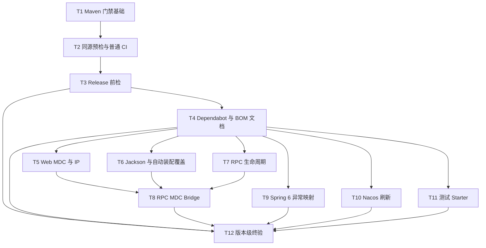

# Project Governance Implementation Plan

**Branch:** [待填充]
**Baseline SHA:** [待填充]
**Implementation Head SHA:** [待填充]
**Worktree Path:** [待填充]
**Started At:** [待填充]
**Updated At:** [待填充]

**Goal:** 先建立 Push 前可复现的 CI 与文档治理门禁，再完成中高收益的功能代码优化。
**Architecture:** 主线 B 把本地预检、GitHub Actions、Release、Dependabot 和事实文档收敛为自动校验；主线 A 在该门禁下修复 Web、RPC、异常、Nacos 和测试 Starter。外部发布副作用保持独立，v2.x 公共兼容边界保持不变。
**Tech Stack:** Java 17、Spring Boot 3.3.13、Maven 3.9.x、Node.js 22、GitHub Actions、JUnit 5、AssertJ
**Commit Mode:** per-task
**Effective Execution Mode:** [待填充]
**Final Record Mode:** final-record-exception

## Global Constraints

- 逻辑版本固定为 `2.1.2`，治理目录固定为 `docs/active/v2.1.2/project-governance/`。
- Java 固定为 17，Spring Boot 依赖平台和 Maven Plugin 固定为同一 `3.3.13` 属性源。
- Node.js 固定为 22，治理依赖精确锁定 `markdownlint-cli2@0.23.2` 和 `yaml@2.9.0`。
- 普通 CI 每次只执行 1 次完整 `./mvnw -B -Pci verify`；Sonar 不得再次执行 `clean`、`package` 或 `verify`。
- 普通 CI 不使用 `pull_request_target` 或 Workflow 级 `paths`/`paths-ignore`，核心 Job 权限为 `contents: read`。
- Dependabot、fork PR 或 Sonar 配置不完整时只跳过 Sonar，核心预检、测试和报告上传必须执行。
- 普通 CI、Release 和发布准备命令默认不使用 `-U`；仅人工故障排查可显式使用。
- 不引入新 Starter、消费者契约工程、自动合并、文档自动改写或 BOM 精简。
- v2.x 不移除 `Serializable` 公共泛型边界，不静默改变 BizException HTTP 200 语义。
- 每个 Task 单独提交，提交信息使用中文 Conventional Commits，只提交该 Task 声明的文件。
- `Files` 中只有 `Create`、`Modify` 和满足结构化 Red 授权的 `Modify only if authorized` 是提交允许范围；
  `Test (read-only baseline)` 只能执行不得修改，`External fixture` 位于动态临时目录且不得进入 Git。

## Dependency Graph



| Task | 依赖 | 可并行组 |
|------|------|----------|
| T1 | 无 | B1 |
| T2 | T1 | B2 |
| T3 | T2 | B3 |
| T4 | T3 | B4 |
| T5 | T4 | A1 |
| T6 | T4 | A1 |
| T7 | T4 | A1 |
| T8 | T5、T6、T7 | A2 |
| T9 | T4 | A1 |
| T10 | T4 | A1 |
| T11 | T4 | A1 |
| T12 | T3—T11 | Final |

> 同组 Task 只表示依赖关系允许并行；若共享工作区或同一文件，执行器必须串行，避免覆盖未提交改动。

## Scenario Traceability

| Spec Scenario | Task | 自动验证证据 |
|---------------|------|--------------|
| Push 前执行同源预检 | T2 | `ci-preflight.sh` 本地执行与 CI 唯一调用断言 |
| 普通变更执行完整质量门禁 | T1、T2 | Reactor `verify -Pci`、报告存在性和单次构建规则 |
| 具备代码分析凭据 | T2 | Sonar trusted push/internal PR fixture 与 Quality Gate 参数断言 |
| 不具备代码分析凭据 | T2 | fork/Dependabot/空配置 fixture，核心预检无条件执行断言 |
| 标签发布进入前置验证 | T3 | Release DAG fixture 与单一 `release-verify` 断言 |
| 固定依赖正常解析 | T2 | 空 Maven 本地仓库解析测试 |
| Web 请求结束 | T5 | Trace/Web/AccessLog MDC 保存与恢复测试 |
| 直连客户端伪造转发头 | T5 | `IpUtilsTest` 直连伪造头用例 |
| 请求经过显式可信代理 | T5 | `IpUtilsTest` 多级可信代理用例 |
| 序列化扩展与项目格式并存 | T6 | `WebAutoConfigurationIT` 双 Module 断言 |
| RPC 前置阶段失败 | T7 | Hook/Template 前置失败矩阵 |
| RPC 业务与清理同时失败 | T7 | 主异常与 suppressed 顺序断言 |
| RPC 业务成功但后置扩展失败 | T7 | 主结果保持与 best-effort 清理断言 |
| 默认 RPC 上下文传播 | T8 | Feign/Dubbo 端到端传播测试 |
| Dubbo Provider 收到非法上下文标识 | T8 | `MdcRpcTracerBridgeTest` 白名单与生成测试 |
| 消费者提供自定义 RPC Bridge | T8 | `RpcCoreAutoConfigurationTest` back-off 测试 |
| Micrometer 类存在但没有自定义 Web Trace 组件 | T8 | Web classpath 回归测试 |
| 常见客户端 HTTP 错误 | T9 | 处理器参数化状态矩阵 |
| HTTP 内容协商或上传失败 | T9 | 406/413/415 映射测试 |
| 业务异常兼容 | T9 | BizException 200 与未知异常/工厂失败回归 |
| Nacos 密文动态刷新成功 | T10 | `NacosEncryptRefreshIT` 成功场景 |
| Nacos 刷新使用错误密钥 | T10 | Environment/Bean 旧值与日志安全断言 |
| Nacos 现有刷新顺序已经正确 | T10 | 首轮 Red Result 决策证据与 main 文件范围断言 |
| 下游使用 JUnit Suite | T11 | 临时消费者 marker 与唯一 Suite 报告 |
| 容器依赖清理不改变消费边界 | T11 | 临时消费者依赖树与 BOM 管理断言 |
| 消费者替换默认自动装配 Bean | T6 | ApplicationContextRunner 单实例断言 |
| 项目事实与文档一致 | T2 | DOC-001—DOC-006 正向 fixture |
| 人工文档发生事实漂移 | T2 | 文档漂移反向 fixture |
| 文档检查发现差异 | T2 | 错误格式、退出码和只读性 fixture |
| 常规依赖更新 | T4 | Dependabot minor/patch 分组 fixture |
| 重大依赖更新 | T4 | major 不分组且无自动合并断言 |
| 企业级宽 BOM | T4 | DOC-007 完整且互斥分类断言 |
| Serializable 数据继续使用公共响应 | T1 | JavaCompiler 正例与 JSON 回归 |
| 非 Serializable 数据尝试使用公共响应 | T1 | JavaCompiler 负例编译失败断言 |
| 后续主版本评估 | T12 | GOV-008 状态与 3.0 评估入口文档核对 |

---

### T1: Maven 集成测试门禁与 Spring Boot 版本线

**Depends on:** 无

**Files:**

- Modify: `pom.xml`
- Modify: `mimir-boot-parent/pom.xml`
- Modify: `mimir-boot-bom/pom.xml`
- Modify: `mimir-boot-common/src/test/java/com/yggdrasil/labs/common/response/RTest.java`
- Create: `mimir-boot-common/src/test/java/com/yggdrasil/labs/common/response/RGenericBoundCompilationTest.java`
- Test (read-only baseline): `mimir-boot-starters/mimir-boot-starter-exception/src/test/java/com/yggdrasil/labs/exception/config/ExceptionAutoConfigurationIT.java`
- Test (read-only baseline): `mimir-boot-starters/mimir-boot-starter-web/src/test/java/com/yggdrasil/labs/web/config/WebAutoConfigurationIT.java`

**Interfaces:**

- Consumes: Maven `verify` lifecycle
- Produces: root property `spring.boot.version=3.3.13`; inherited `maven-failsafe-plugin` execution

**Behavior:** `verify -Pci` 必须执行现有单元测试和两个集成测试，并生成非空 Failsafe 报告；依赖平台与 Spring Boot Maven Plugin 使用同一版本源。

**Acceptance Criteria:**

- [ ] `verify -Pci` 生成至少 2 个 `failsafe-reports/TEST-*.xml`，11 个现有 IT 测试用例全部通过。
- [ ] effective/flattened POM 中 Spring Boot 依赖平台与 Maven Plugin 都解析为 `3.3.13`，不残留独立的 `3.5.16`。
- [ ] Serializable 响应数据继续编译且 JSON 语义不变，非 Serializable 泛型用法继续在编译期失败。

**Execution:**

- **Status:** pending
- **Commit SHA:** null
- **Attempts:** 0
- **Blocked Reason:** null
- **Red Result:** null
- **Verify Result:** null
- **AC Result:** null

**Task Completion Gate:**

- [ ] Red Result exists and passed
- [ ] Verify Result exists and passed
- [ ] AC Result: null (task AC declares no per-task AC) OR (total > 0 AND pass + deferred.length == total, non-deferred AC all verified)
- [ ] Commit SHA belongs to this task only
- [ ] Per-task AC checkbox synced

**Step 1: Red**

Run: `! rg -n '<artifactId>maven-failsafe-plugin</artifactId>' mimir-boot-parent/pom.xml | tail -n +2 | rg . && rg -n '3.5.16' mimir-boot-parent/pom.xml`
Expected: **PASS** — 确认 Failsafe 只在 pluginManagement，且 Boot Plugin 版本已漂移。

**Step 2: Green**

在根 POM 建立 `spring.boot.version`，BOM 与 Parent 引用该属性；把 Failsafe 加入 Parent 的 inherited plugins，保持现有 includes/excludes 和 goals。使用 JDK `JavaCompiler` 添加两个源码片段的编译边界测试，并保留现有 JSON 响应断言。

**Step 3: Verify**

Run: `mise exec java@17 -- ./mvnw -B -Pci clean verify`
Expected: **PASS**

**AC Verification:**

- AC1: 以 `mapfile -d '' reports < <(find . -path '*/target/failsafe-reports/TEST-*.xml' -type f -print0)`
  固定同一报告数组，执行 `test "${#reports[@]}" -ge 2`；再执行
  `test "$(rg -o --no-filename '<testcase ' "${reports[@]}" | wc -l)" -eq 11`，再执行
  `! rg 'failures="[1-9][0-9]*"|errors="[1-9][0-9]*"' "${reports[@]}"`。
- AC2: 执行 `mise exec java@17 -- ./mvnw -B -Pci -DskipTests flatten:flatten`，再检查根/BOM/Parent 的 `.flattened-pom.xml` → Boot 依赖平台和 Plugin 均解析为 `3.3.13`，且不含 `3.5.16` 或未解析的 `${spring.boot.version}`。
- AC3: `mise exec java@17 -- ./mvnw -B -Pci -pl :mimir-boot-common -am test` → Serializable 正例编译、JSON 回归和非 Serializable 负例编译断言全部通过。

**Step 4: Commit**

提交：`build(parent): 启用集成测试门禁并统一 Boot 版本`

---

### T2: 本地同源预检、文档事实检查与普通 CI

**Depends on:** T1

**Files:**

- Modify: `.gitignore`
- Create: `package.json`
- Create: `package-lock.json`
- Create: `scripts/ci-preflight.sh`
- Create: `scripts/lint-docs.mjs`
- Create: `scripts/lint-docs.test.mjs`
- Create: `scripts/lint-ci.mjs`
- Create: `scripts/lint-ci.test.mjs`
- Create: `scripts/sonar-eligibility.mjs`
- Create: `scripts/sonar-eligibility.test.mjs`
- Modify: `.github/workflows/ci.yml`
- Modify: `docs/QUALITY_SCORE.md`
- Modify: `docs/SONAR_QUALITY_DISCIPLINE.md`

**Interfaces:**

- Consumes: inherited Maven verification from T1
- Produces: `bash scripts/ci-preflight.sh`; `node scripts/lint-docs.mjs`; `node scripts/lint-ci.mjs`

**Behavior:** 本地和 GitHub Actions 调用同一个确定性预检入口；普通 CI 只构建一次，报告缺失明确失败，Sonar 仅在主仓库可信事件且配置完整时复用本次构建产物。

**Acceptance Criteria:**

- [ ] 本地同源预检在 Java 17/Node 22 下完成 Markdown、DOC-001—DOC-006、CI 静态规则、Surefire、Failsafe、JaCoCo；Failsafe 至少 2 份报告、不少于基线 11 个 testcase 且失败数为 0，入口退出码为 0。
- [ ] CI YAML 只有一个核心 Build Job 和一个 `ci-preflight.sh` 调用，Sonar 命令不含 `clean`/`package`/`verify`。
- [ ] Dependabot、fork 和空 Sonar 配置 fixture 均只让 Sonar 条件为 false，核心预检仍为无条件 Step。
- [ ] trusted push 与内部 PR 的 Sonar 资格为 true；fork PR、Dependabot 和任一配置为空时为 false。
- [ ] 使用空 Maven 本地仓库执行固定版本解析时可正常下载缺失构件，命令不含 `-U`。

**Execution:**

- **Status:** pending
- **Commit SHA:** null
- **Attempts:** 0
- **Blocked Reason:** null
- **Red Result:** null
- **Verify Result:** null
- **AC Result:** null

**Task Completion Gate:**

- [ ] Red Result exists and passed
- [ ] Verify Result exists and passed
- [ ] AC Result: null (task AC declares no per-task AC) OR (total > 0 AND pass + deferred.length == total, non-deferred AC all verified)
- [ ] Commit SHA belongs to this task only
- [ ] Per-task AC checkbox synced

**Step 1: Red**

Run: `test ! -f scripts/ci-preflight.sh && test "$(rg -c 'clean verify sonar:sonar|verify -Pci' .github/workflows/ci.yml)" -ge 2 && rg -n '\-U' .github/workflows/ci.yml`
Expected: **PASS** — 当前没有同源入口、会重复完整构建且强制更新依赖。

**Step 2: Green**

精确锁定两项 Node 开发依赖并在 `.gitignore` 忽略 `node_modules/`；实现只读文档/Workflow 检查及
fixture 测试；DOC-001 把 `2.1.2-SNAPSHOT` 与 `v2.1.2` 归一为逻辑版本 `2.1.2`，其他后缀报错。
本 Task 只启用普通 CI、Sonar 资格、外部 Action 固定和 DOC-001—DOC-006；尚未修改的 Release 与
Dependabot/BOM 最终规则分别由 T3、T4 和对应配置变更在同一提交启用，不允许提前制造中间态假红。
预检脚本检查 Java/Node 主版本、执行 npm 与 Maven 门禁，并使用同一个 NUL-safe Failsafe 报告数组和
`rg -o --no-filename` 断言至少 2 份 XML、不少于基线 11 个 testcase、零失败及非空 JaCoCo XML；
CI 删除独立 Sonar Job。资格 Step 用纯函数计算五类事件，
把唯一的 `run=true|false` 追加写入 `GITHUB_OUTPUT`；Sonar Step 只消费该 output，并以 300 秒等待
Quality Gate；报告始终上传。

**Step 3: Verify**

Run: `mise exec java@17 node@22 -- bash scripts/ci-preflight.sh`
Expected: **PASS**

**AC Verification:**

- AC1: `npm test && node scripts/lint-docs.mjs && node scripts/lint-ci.mjs` → 截至 T2 启用的普通 CI、
  Sonar、Action 固定和 DOC-001—DOC-006 规则为 0 error，测试证明 Release 最终态规则尚未启用。
- AC2: `test "$(rg -c 'ci-preflight\.sh' .github/workflows/ci.yml)" -eq 1 && ! rg -n 'clean verify sonar:sonar|\-U|pull_request_target|paths-ignore|^[[:space:]]+paths:' .github/workflows/ci.yml` → 单次构建与安全触发成立。
- AC3: `node --test scripts/sonar-eligibility.test.mjs` → 临时 `GITHUB_OUTPUT` 中 trusted push/内部 PR
  精确为 `run=true`，fork/Dependabot/空配置精确为 `run=false`，stdout 不含配置值。
- AC4: `rg -n 'sonar\.qualitygate\.wait=true|sonar\.qualitygate\.timeout=300|steps\.sonar-eligibility\.outputs\.run' .github/workflows/ci.yml` → Quality Gate 等待和唯一布尔条件存在。
- AC5: 执行 `empty_m2_dir="$(mktemp -d -t mimir-empty-m2.XXXXXX)"` 并注册
  `trap 'rm -rf -- "$empty_m2_dir"' EXIT`，再执行
  `mise exec java@17 -- ./mvnw -B -Pci -Dmaven.repo.local="$empty_m2_dir" -DskipTests -pl :mimir-boot-common -am clean package`
  → 缺失构件正常解析且退出 0；`git check-ignore node_modules` 退出 0。

**Step 4: Commit**

提交：`ci(core): 建立本地同源预检并复用单次构建`

---

### T3: Release 单一前置验证与补偿隔离

**Depends on:** T2

**Files:**

- Modify: `.github/workflows/release.yml`
- Modify: `.github/actions/checkout-setup/action.yml`
- Modify: `.github/actions/maven-release-prepare/action.yml`
- Modify: `scripts/lint-ci.mjs`
- Modify: `scripts/lint-ci.test.mjs`

**Interfaces:**

- Consumes: `node scripts/lint-ci.mjs` from T2
- Produces: Release job `release-verify`; CI rules for Release dependency graph

**Behavior:** 标签发布和手动补偿只经过一个无外部副作用的前置验证；GPR、Central、GitHub Release 和开发版本回写仍独立，普通 Push CI 不读取这些发布凭据。

**Acceptance Criteria:**

- [ ] Release 只含一个 `release-verify` 前置 Job，`build-verify` 和 `release` 两阶段重复验证被移除。
- [ ] 所有 Release/复合 Action Maven 命令不含 `-U`；YAML 解析结果证明四类外部操作的 `needs`、
  `if`、权限、并发和补偿选择除前置 Job 名外保持不变。
- [ ] 手动触发未选择任何补偿操作时仍在外部副作用前失败。

**Execution:**

- **Status:** pending
- **Commit SHA:** null
- **Attempts:** 0
- **Blocked Reason:** null
- **Red Result:** null
- **Verify Result:** null
- **AC Result:** null

**Task Completion Gate:**

- [ ] Red Result exists and passed
- [ ] Verify Result exists and passed
- [ ] AC Result: null (task AC declares no per-task AC) OR (total > 0 AND pass + deferred.length == total, non-deferred AC all verified)
- [ ] Commit SHA belongs to this task only
- [ ] Per-task AC checkbox synced

**Step 1: Red**

Run: `rg -n '^  (build-verify|release):|\-U' .github/workflows/release.yml .github/actions/maven-release-prepare/action.yml`
Expected: **PASS** — 当前存在两个前置 Job 和多个强制更新命令。

**Step 2: Green**

合并为 `release-verify`，保留手动选择校验和一次 `spotless:check clean package`；更新所有 needs 与
复合 Action 描述，移除 `-U`；在同一提交扩展 lint-ci 并启用 Release 最终态规则，解析 Release 图，
用变更前语义快照与最小 fixture 锁定
四类补偿路径的 `needs`、`if`、权限、并发和手动选择条件。

**Step 3: Verify**

Run: `npm test && node scripts/lint-ci.mjs`
Expected: **PASS**

**AC Verification:**

- AC1: `node --test scripts/lint-ci.test.mjs` → Release 合法 fixture 通过；重复前检、错误 `needs`、
  `if`、权限、并发或手动选择任一漂移的 fixture 均失败。
- AC2: `node scripts/lint-ci.mjs` → 解析真实 Workflow 后确认恰好一个 `release-verify`，四类外部 Job
  都直接或按既有链路依赖它，且变更前语义快照中除前置 Job 名外无差异。
- AC3: `! rg -n -- '(^|[[:space:]])-U([[:space:]]|$)' .github/workflows/release.yml .github/actions/checkout-setup/action.yml .github/actions/maven-release-prepare/action.yml`
  → 默认命令无 `-U`；此文本检查只负责命令参数，不替代 AC1/AC2 的结构验证。

**Step 4: Commit**

提交：`ci(release): 合并发布前检并保留独立补偿`

---

### T4: Dependabot 分组与 BOM 支持等级

**Depends on:** T3

**Files:**

- Modify: `.github/dependabot.yml`
- Modify: `mimir-boot-bom/README.md`
- Modify: `scripts/lint-docs.mjs`
- Modify: `scripts/lint-docs.test.mjs`
- Modify: `scripts/lint-ci.mjs`
- Modify: `scripts/lint-ci.test.mjs`
- Modify: `docs/active/tech-debt-tracker.md`

**Interfaces:**

- Consumes: governance linters from T2
- Produces: Dependabot group `github-actions-minor-patch`; DOC-007 BOM classification rule

**Behavior:** GitHub Actions minor/patch 更新按周合并，major 保持独立；宽 BOM 继续保留，但每个显式管理项恰好归入“已验证”或“仅管理”。

**Acceptance Criteria:**

- [ ] GitHub Actions weekly 频率和 PR 上限不变，minor/patch 进入同一组，major 不进入该组且没有自动合并。
- [ ] DOC-007 验证 BOM 所有显式管理项恰好属于一个支持等级，两个集合交集为空。

**Execution:**

- **Status:** pending
- **Commit SHA:** null
- **Attempts:** 0
- **Blocked Reason:** null
- **Red Result:** null
- **Verify Result:** null
- **AC Result:** null

**Task Completion Gate:**

- [ ] Red Result exists and passed
- [ ] Verify Result exists and passed
- [ ] AC Result: null (task AC declares no per-task AC) OR (total > 0 AND pass + deferred.length == total, non-deferred AC all verified)
- [ ] Commit SHA belongs to this task only
- [ ] Per-task AC checkbox synced

**Step 1: Red**

Run: `! rg -n 'github-actions-minor-patch|仅管理|已验证' .github/dependabot.yml mimir-boot-bom/README.md`
Expected: **PASS** — 当前缺少 Actions 分组和 BOM 支持等级。

**Step 2: Green**

新增 Actions minor/patch group；根据 Starter POM 和 Reactor 测试证据分类 BOM；实现 DOC-007 和 Dependabot 结构规则，fixture 覆盖遗漏、重复分类和 major 混组。

**Step 3: Verify**

Run: `npm test && node scripts/lint-docs.mjs && node scripts/lint-ci.mjs`
Expected: **PASS**

**AC Verification:**

- AC1: `node scripts/lint-ci.mjs` → YAML 结构断言 weekly 频率和 PR 上限不变、minor/patch 进入
  `github-actions-minor-patch`、major 不进入任何组且不存在自动合并配置。
- AC2: `node scripts/lint-docs.mjs` → DOC-007 为 0 error。

**Step 4: Commit**

提交：`chore(governance): 分组 Actions 更新并标注 BOM 支持等级`

---

### T5: Web MDC 所有权与客户端 IP 信任边界

**Depends on:** T4

**Files:**

- Modify: `mimir-boot-common/src/main/java/com/yggdrasil/labs/common/util/IpUtils.java`
- Modify: `mimir-boot-common/src/test/java/com/yggdrasil/labs/common/util/IpUtilsTest.java`
- Modify: `mimir-boot-starters/mimir-boot-starter-web/src/main/java/com/yggdrasil/labs/web/interceptor/TraceInterceptor.java`
- Modify: `mimir-boot-starters/mimir-boot-starter-web/src/main/java/com/yggdrasil/labs/web/interceptor/WebInterceptor.java`
- Modify: `mimir-boot-starters/mimir-boot-starter-web/src/test/java/com/yggdrasil/labs/web/interceptor/TraceInterceptorTest.java`
- Modify: `mimir-boot-starters/mimir-boot-starter-web/src/test/java/com/yggdrasil/labs/web/interceptor/WebInterceptorTest.java`
- Modify: `mimir-boot-starters/mimir-boot-starter-log/src/main/java/com/yggdrasil/labs/log/web/AccessLogFilter.java`
- Modify: `mimir-boot-starters/mimir-boot-starter-log/src/test/java/com/yggdrasil/labs/log/web/AccessLogFilterTest.java`
- Modify: `mimir-boot-starters/mimir-boot-starter-web/README.md`
- Modify: `mimir-boot-starters/mimir-boot-starter-log/README.md`

**Interfaces:**

- Produces: `IpUtils.resolveClientIp(Supplier<String> remoteAddrSupplier): String`
- Produces: `IpUtils.resolveForwardedClientIp(UnaryOperator<String> headerGetter, Supplier<String> remoteAddrSupplier, Predicate<String> trustedProxyPredicate): String`

**Behavior:** Web 组件只恢复自己拥有的 MDC 键；默认审计 IP 只信任连接地址，只有显式可信代理谓词或容器已安全改写 remoteAddr 时才接受转发信息。

**Acceptance Criteria:**

- [ ] 请求完成后 traceId/ip 恢复原值，其他 MDC 键保持不变，生产路径不调用 `MDC.clear()`。
- [ ] 直连伪造头返回 remoteAddr；可信代理链从应用侧向外跳过可信节点并返回第一个不可信地址。

**Execution:**

- **Status:** pending
- **Commit SHA:** null
- **Attempts:** 0
- **Blocked Reason:** null
- **Red Result:** null
- **Verify Result:** null
- **AC Result:** null

**Task Completion Gate:**

- [ ] Red Result exists and passed
- [ ] Verify Result exists and passed
- [ ] AC Result: null (task AC declares no per-task AC) OR (total > 0 AND pass + deferred.length == total, non-deferred AC all verified)
- [ ] Commit SHA belongs to this task only
- [ ] Per-task AC checkbox synced

**Step 1: Red**

新增外部 MDC 键保留、旧值恢复、直连伪造头和多级可信代理测试。
Run: `mise exec java@17 -- ./mvnw -B -Pci -pl :mimir-boot-starter-web,:mimir-boot-starter-log -am test`
Expected: **FAIL** — 现有全局 clear 和无条件转发头解析违反新断言。

**Step 2: Green**

按键保存/恢复 MDC；实现两个 IP API并弃用旧两参数不安全语义；Web 与 Access Log 默认读取 remoteAddr，README 给出 Tomcat/Framework 可信代理入口。

**Step 3: Verify**

Run: `mise exec java@17 -- ./mvnw -B -Pci -pl :mimir-boot-starter-web,:mimir-boot-starter-log -am verify`
Expected: **PASS**

**AC Verification:**

- AC1: `! rg -n 'MDC\.clear\(\)' mimir-boot-starters/mimir-boot-starter-web/src/main/java mimir-boot-starters/mimir-boot-starter-log/src/main/java` → 生产 Web/Log 无全局清空。
- AC2: `mise exec java@17 -- ./mvnw -B -Pci -pl :mimir-boot-common,:mimir-boot-starter-web,:mimir-boot-starter-log -am test` → IP 与 MDC 测试全部通过。

**Step 4: Commit**

提交：`fix(web): 收紧客户端 IP 信任并恢复 MDC 所有权`

---

### T6: Jackson 追加式配置与自动装配用户优先

**Depends on:** T4

**Files:**

- Modify: `mimir-boot-starters/mimir-boot-starter-web/src/main/java/com/yggdrasil/labs/web/config/JacksonConfig.java`
- Modify: `mimir-boot-starters/mimir-boot-starter-web/src/main/java/com/yggdrasil/labs/web/config/WebAutoConfiguration.java`
- Modify: `mimir-boot-starters/mimir-boot-starter-web/src/test/java/com/yggdrasil/labs/web/config/WebAutoConfigurationTest.java`
- Modify: `mimir-boot-starters/mimir-boot-starter-web/src/test/java/com/yggdrasil/labs/web/config/WebAutoConfigurationIT.java`
- Modify: `mimir-boot-starters/mimir-boot-starter-log/src/main/java/com/yggdrasil/labs/log/web/AccessLogAutoConfiguration.java`
- Modify: `mimir-boot-starters/mimir-boot-starter-log/src/test/java/com/yggdrasil/labs/log/web/AccessLogAutoConfigurationTest.java`
- Modify: `mimir-boot-starters/mimir-boot-starter-mybatis/src/main/java/com/yggdrasil/labs/mybatis/config/MybatisPlusAutoConfiguration.java`
- Modify: `mimir-boot-starters/mimir-boot-starter-mybatis/src/test/java/com/yggdrasil/labs/mybatis/config/MybatisPlusAutoConfigurationTest.java`

**Interfaces:**

- Produces: type-based back-off for `ResponseBodyEnhancer`, `WebInterceptor`, `TraceInterceptor`, `MybatisPlusInterceptor`
- Produces: name-based back-off for bean `accessLogFilter`

**Behavior:** Jackson 日期时间 Module 追加到消费者 Module；用户约定 Bean 完整替换 Starter 默认 Bean，不合并 MyBatis 内部拦截器，也不新增 Customizer API。

**Acceptance Criteria:**

- [ ] 自定义 Jackson Module 与项目时间格式在同一 ObjectMapper 中同时生效。
- [ ] Web、Log、MyBatis 各自提供用户 Bean 时默认 Bean 回退且上下文中只有一个有效实例。

**Execution:**

- **Status:** pending
- **Commit SHA:** null
- **Attempts:** 0
- **Blocked Reason:** null
- **Red Result:** null
- **Verify Result:** null
- **AC Result:** null

**Task Completion Gate:**

- [ ] Red Result exists and passed
- [ ] Verify Result exists and passed
- [ ] AC Result: null (task AC declares no per-task AC) OR (total > 0 AND pass + deferred.length == total, non-deferred AC all verified)
- [ ] Commit SHA belongs to this task only
- [ ] Per-task AC checkbox synced

**Step 1: Red**

新增消费者 Module 保留与五类用户 Bean 覆盖断言。
Run: `mise exec java@17 -- ./mvnw -B -Pci -pl :mimir-boot-starter-web,:mimir-boot-starter-log,:mimir-boot-starter-mybatis -am test`
Expected: **FAIL** — 当前 Jackson 替换 Module，部分默认 Bean 未按约定回退。

**Step 2: Green**

改用 `modulesToInstall`；按类型或约定名称增加 `ConditionalOnMissingBean`，MyBatis 用户实例完整替换默认实例。

**Step 3: Verify**

Run: `mise exec java@17 -- ./mvnw -B -Pci -pl :mimir-boot-starter-web,:mimir-boot-starter-log,:mimir-boot-starter-mybatis -am verify`
Expected: **PASS**

**AC Verification:**

- AC1: Web IT 同时断言测试 Module 与时间序列化格式 → 两者均通过。
- AC2: ApplicationContextRunner 覆盖测试 → 每类能力 Bean 数量均为 1。

**Step 4: Commit**

提交：`fix(starter): 保留 Jackson 扩展并让用户 Bean 优先`

---

### T7: RPC 生命周期失败与清理语义

**Depends on:** T4

**Files:**

- Modify: `mimir-boot-starters/mimir-boot-starter-rpc-core/src/main/java/com/yggdrasil/labs/rpc/core/hook/RpcHookChain.java`
- Create: `mimir-boot-starters/mimir-boot-starter-rpc-core/src/main/java/com/yggdrasil/labs/rpc/core/hook/RpcHookInvocation.java`
- Modify: `mimir-boot-starters/mimir-boot-starter-rpc-core/src/main/java/com/yggdrasil/labs/rpc/core/support/RpcExecutionTemplate.java`
- Modify: `mimir-boot-starters/mimir-boot-starter-rpc-core/src/test/java/com/yggdrasil/labs/rpc/core/hook/RpcHookChainTest.java`
- Modify: `mimir-boot-starters/mimir-boot-starter-rpc-core/src/test/java/com/yggdrasil/labs/rpc/core/support/RpcExecutionTemplateTest.java`
- Modify: `mimir-boot-starters/mimir-boot-starter-feign/src/main/java/com/yggdrasil/labs/rpc/feign/client/RpcFeignClient.java`
- Modify: `mimir-boot-starters/mimir-boot-starter-feign/src/test/java/com/yggdrasil/labs/rpc/feign/client/RpcFeignClientTest.java`
- Modify: `mimir-boot-starters/mimir-boot-starter-dubbo/src/main/java/com/yggdrasil/labs/rpc/dubbo/filter/RpcDubboFilter.java`
- Modify: `mimir-boot-starters/mimir-boot-starter-dubbo/src/test/java/com/yggdrasil/labs/rpc/dubbo/filter/RpcDubboFilterTest.java`

**Interfaces:**

- Produces: `RpcHookChain.open(RpcCallContext context): RpcHookInvocation`
- Produces: `RpcHookInvocation.before(): void`
- Produces: `RpcHookInvocation.completeSuccess(RpcCallResult result): void`
- Produces: `RpcHookInvocation.completeFailure(RpcCallResult result, Throwable primaryError): void`
- Produces: `RpcHookInvocation.close(): void`

**Behavior:** RPC 前置失败阻止业务调用但清理已进入阶段；业务结果或业务异常始终是主结果，after/onError/cleanup 全部尝试且只执行一次。

**Acceptance Criteria:**

- [ ] before 或 tracer 失败时业务调用次数为 0，已进入 Hook 的 cleanup 各执行 1 次并逆序。
- [ ] 业务成功不被后置失败改写；业务异常保留为主异常，后置/清理异常只作为 suppressed 且剩余清理继续。
- [ ] 两个并发或异步调用持有不同 Invocation，entered 列表和关闭状态互不串扰，重复完成只清理一次。

**Execution:**

- **Status:** pending
- **Commit SHA:** null
- **Attempts:** 0
- **Blocked Reason:** null
- **Red Result:** null
- **Verify Result:** null
- **AC Result:** null

**Task Completion Gate:**

- [ ] Red Result exists and passed
- [ ] Verify Result exists and passed
- [ ] AC Result: null (task AC declares no per-task AC) OR (total > 0 AND pass + deferred.length == total, non-deferred AC all verified)
- [ ] Commit SHA belongs to this task only
- [ ] Per-task AC checkbox synced

**Step 1: Red**

为每个阶段注入异常并断言业务次数、顺序、主异常和 suppressed。
Run: `mise exec java@17 -- ./mvnw -B -Pci -pl :mimir-boot-starter-rpc-core,:mimir-boot-starter-feign,:mimir-boot-starter-dubbo -am test`
Expected: **FAIL** — 当前前置边界和后置异常语义不满足全部断言。

**Step 2: Green**

`RpcHookChain.open` 创建调用级 Invocation，不在单例 Chain 或 ThreadLocal 保存状态。Invocation 在调用
`hook.before` 前记录该 Hook，失败即停止；内部状态只允许 `OPEN -> COMPLETING -> CLOSED`。
`completeSuccess`、`completeFailure` 与 `close` 通过 CAS 争夺唯一终态执行权，赢家执行一次
after/onError 和逆序 cleanup，其余完成调用 no-op。旧四个 Chain 方法保留并弃用；模板、Feign、Dubbo
都持有并移交 Invocation，保护主结果并防止异步重复完成。存在主异常时显式调用
`completeFailure(result, primaryError)`；`close()` 只作无主异常兜底，不依赖 try-with-resources 决定
suppressed 语义。

**Step 3: Verify**

Run: `mise exec java@17 -- ./mvnw -B -Pci -pl :mimir-boot-starter-rpc-core,:mimir-boot-starter-feign,:mimir-boot-starter-dubbo -am verify`
Expected: **PASS**

**AC Verification:**

- AC1: RpcExecutionTemplate/RpcHookChain 失败矩阵测试 → 调用次数和顺序全部匹配。
- AC2: Feign/Dubbo 适配器测试 → 同步/异步路径只完成一次 lifecycle。
- AC3: 两个 Invocation 交错执行并从不同线程完成 → entered Hook、suppressed 异常和关闭次数互不串扰。
- AC4: 用 barrier 让 `completeSuccess`、`completeFailure` 和 `close` 三方竞态 → 恰好一个终态路径执行，
  after 与 onError 总执行次数至多 1，cleanup 精确 1 次，最终状态为 `CLOSED`。

**Step 4: Commit**

提交：`fix(rpc): 统一失败关闭与最佳努力清理语义`

---

### T8: 默认 RPC MDC Bridge 与 Web Trace 收口

**Depends on:** T5、T6、T7

**Files:**

- Modify: `mimir-boot-common/src/main/java/com/yggdrasil/labs/common/constant/CommonConstants.java`
- Modify: `mimir-boot-common/src/main/java/com/yggdrasil/labs/common/constant/HttpHeaderConstants.java`
- Modify: `mimir-boot-starters/mimir-boot-starter-rpc-core/src/main/java/com/yggdrasil/labs/rpc/core/tracing/RpcTracerBridge.java`
- Create: `mimir-boot-starters/mimir-boot-starter-rpc-core/src/main/java/com/yggdrasil/labs/rpc/core/tracing/RpcTraceScope.java`
- Create: `mimir-boot-starters/mimir-boot-starter-rpc-core/src/main/java/com/yggdrasil/labs/rpc/core/tracing/MdcRpcTracerBridge.java`
- Modify: `mimir-boot-starters/mimir-boot-starter-rpc-core/src/main/java/com/yggdrasil/labs/rpc/core/config/RpcCoreAutoConfiguration.java`
- Create: `mimir-boot-starters/mimir-boot-starter-rpc-core/src/test/java/com/yggdrasil/labs/rpc/core/tracing/MdcRpcTracerBridgeTest.java`
- Modify: `mimir-boot-starters/mimir-boot-starter-rpc-core/src/test/java/com/yggdrasil/labs/rpc/core/config/RpcCoreAutoConfigurationTest.java`
- Modify: `mimir-boot-starters/mimir-boot-starter-feign/pom.xml`
- Modify: `mimir-boot-starters/mimir-boot-starter-feign/src/test/java/com/yggdrasil/labs/rpc/feign/config/FeignAutoConfigurationEndToEndTest.java`
- Modify: `mimir-boot-starters/mimir-boot-starter-dubbo/src/main/java/com/yggdrasil/labs/rpc/dubbo/filter/RpcDubboFilter.java`
- Modify: `mimir-boot-starters/mimir-boot-starter-dubbo/src/test/java/com/yggdrasil/labs/rpc/dubbo/filter/RpcDubboFilterTest.java`
- Modify: `mimir-boot-starters/mimir-boot-starter-dubbo/src/test/java/com/yggdrasil/labs/rpc/dubbo/filter/RpcDubboFilterEndToEndTest.java`
- Modify: `mimir-boot-starters/mimir-boot-starter-web/src/main/java/com/yggdrasil/labs/web/config/WebAutoConfiguration.java`
- Modify: `mimir-boot-starters/mimir-boot-starter-web/src/main/java/com/yggdrasil/labs/web/interceptor/TraceInterceptor.java`
- Modify: `mimir-boot-starters/mimir-boot-starter-web/src/test/java/com/yggdrasil/labs/web/config/WebAutoConfigurationTest.java`
- Modify: `mimir-boot-starters/mimir-boot-starter-web/src/test/java/com/yggdrasil/labs/web/interceptor/TraceInterceptorTest.java`
- Modify: `mimir-boot-starters/mimir-boot-starter-web/README.md`
- Modify: `mimir-boot-starters/mimir-boot-starter-rpc-core/README.md`
- Modify: `mimir-boot-starters/mimir-boot-starter-feign/README.md`
- Modify: `mimir-boot-starters/mimir-boot-starter-dubbo/README.md`

**Interfaces:**

- Consumes: lifecycle cleanup semantics from T7
- Produces: `RpcTracerBridge.extractScope(RpcCallContext context, Map<String,String> carrier): RpcTraceScope`
- Produces: `RpcTraceScope.close(): void`; `RpcTraceScope.noop(): RpcTraceScope`

**Behavior:** 无自定义 Bridge 时 Feign 出站 Header 由下游 Web 入站拦截器提取，Dubbo Provider 由
`extractScope` 提取；两条链路都传播合法 traceId/requestId 并恢复旧 MDC。自定义 Bridge 完全覆盖
默认实现，Micrometer 类存在不再导致 Web Trace 能力消失。

**Acceptance Criteria:**

- [ ] 合法 ID 跨 Feign/Dubbo 传播；Dubbo 载体的非法 traceId 被替换为 32 位十六进制值，非法 requestId 在调用期间保持缺失且结束后恢复旧 MDC。
- [ ] Scope 幂等关闭并只恢复两个自有键；自定义 RpcTracerBridge 存在时默认 Bean 不创建。
- [ ] 仅存在 Micrometer 类但无自定义 TraceInterceptor 时，响应仍包含合法 `X-Trace-Id`。
- [ ] Web 入站从 `X-Request-Id` 写入合法 requestId，缺失/非法时生成新值，请求结束后恢复旧值。

**Execution:**

- **Status:** pending
- **Commit SHA:** null
- **Attempts:** 0
- **Blocked Reason:** null
- **Red Result:** null
- **Verify Result:** null
- **AC Result:** null

**Task Completion Gate:**

- [ ] Red Result exists and passed
- [ ] Verify Result exists and passed
- [ ] AC Result: null (task AC declares no per-task AC) OR (total > 0 AND pass + deferred.length == total, non-deferred AC all verified)
- [ ] Commit SHA belongs to this task only
- [ ] Per-task AC checkbox synced

**Step 1: Red**

新增 Bridge 校验/恢复、自定义覆盖、Feign/Dubbo 端到端传播和 Micrometer classpath 测试；Feign POM
以 test scope 引入 Web Starter，使 Feign 用例能启动真实 Web 入站拦截器而不增加生产传递依赖。
Run: `mise exec java@17 -- ./mvnw -B -Pci -pl :mimir-boot-starter-rpc-core,:mimir-boot-starter-feign,:mimir-boot-starter-dubbo,:mimir-boot-starter-web -am test`
Expected: **FAIL** — 默认 Bridge、requestId 常量和 Web 条件均不存在或不符合契约。

**Step 2: Green**

以默认方法扩展 Bridge；实现幂等 Scope 和 MDC Bridge；自动配置按类型回退。Feign 测试启动本地
HTTP 服务，真实走 Feign RequestInterceptor 出站 Header 与 Web TraceInterceptor 入站提取。Dubbo Provider 在
`invoker.invoke` 返回前关闭 Trace Scope，异步 Hook Invocation 仍交给完成回调；Feign 只负责出站
注入，Web TraceInterceptor 负责 HTTP 入站两个 Header 的校验、生成和请求级恢复。移除 Web 的
MissingClass 幽灵条件并同步四份 README。

**Step 3: Verify**

Run: `mise exec java@17 -- ./mvnw -B -Pci -pl :mimir-boot-starter-rpc-core,:mimir-boot-starter-feign,:mimir-boot-starter-dubbo,:mimir-boot-starter-web -am clean install`
Expected: **PASS**

**AC Verification:**

- AC1: `MdcRpcTracerBridgeTest` → ID 白名单、生成、恢复、幂等关闭全部通过。
- AC2: Feign 跨模块 HTTP 测试与 Dubbo 端到端测试 → traceId/requestId 传播和清理通过；
  分别对 Feign POM 执行
  `./mvnw -B -f mimir-boot-starters/mimir-boot-starter-feign/pom.xml dependency:tree -Dscope=runtime -Dincludes=io.github.yggdrasil-labs:mimir-boot-starter-web -DoutputFile=target/web-runtime-tree.txt`
  与
  `./mvnw -B -f mimir-boot-starters/mimir-boot-starter-feign/pom.xml dependency:tree -Dscope=test -Dincludes=io.github.yggdrasil-labs:mimir-boot-starter-web -DoutputFile=target/web-test-tree.txt`；断言模块
  `target/` 下两个文件存在，runtime 文件 `! rg 'mimir-boot-starter-web'`、test 文件
  `rg 'mimir-boot-starter-web'`，证明 Web 只进入 test scope。
- AC3: WebAutoConfiguration/TraceInterceptor 测试 → Micrometer classpath 场景仍有响应头。
- AC4: RpcDubboFilter 同步/异步 Provider 测试 → Trace Scope 在调用线程返回前关闭，Hook Invocation 在完成回调只关闭一次。

**Step 4: Commit**

提交：`feat(rpc): 提供默认 MDC 上下文传播`

---

### T9: Spring 6 HTTP 异常映射完整性

**Depends on:** T4

**Files:**

- Modify: `mimir-boot-starters/mimir-boot-starter-exception/src/main/java/com/yggdrasil/labs/exception/handler/MimirExceptionHandler.java`
- Modify: `mimir-boot-starters/mimir-boot-starter-exception/src/test/java/com/yggdrasil/labs/exception/handler/MimirExceptionHandlerTest.java`
- Modify: `mimir-boot-starters/mimir-boot-starter-exception/src/test/java/com/yggdrasil/labs/exception/config/ExceptionAutoConfigurationIT.java`
- Modify: `mimir-boot-starters/mimir-boot-starter-exception/README.md`

**Interfaces:**

- Produces: `handleHandlerMethodValidationException(HandlerMethodValidationException e, HttpServletRequest request): Object`
- Produces: `handleConstraintViolationException(ConstraintViolationException e, HttpServletRequest request): Object`
- Produces: `handleMissingRequestHeaderException(MissingRequestHeaderException e, HttpServletRequest request): Object`
- Produces: `handleMissingPathVariableException(MissingPathVariableException e, HttpServletRequest request): Object`
- Produces: `handleHttpMediaTypeNotAcceptableException(HttpMediaTypeNotAcceptableException e, HttpServletRequest request): Object`
- Produces: `handleHttpMediaTypeNotSupportedException(HttpMediaTypeNotSupportedException e, HttpServletRequest request): Object`
- Produces: `handleMaxUploadSizeExceededException(MaxUploadSizeExceededException e, HttpServletRequest request): Object`
- Produces: `handleNoResourceFoundException(NoResourceFoundException e, HttpServletRequest request): Object`

**Behavior:** 常见客户端错误返回正确 HTTP 状态与统一结构；工厂失败仍安全降级，未知服务端异常仍为 500，BizException 继续 HTTP 200。

**Acceptance Criteria:**

- [ ] 八类新增异常分别映射到 400/404/406/413/415，并通过 ExceptionResponseFactory 返回统一结构。
- [ ] BizException、未知异常和工厂失败回归测试保持现有 200/500/降级语义，日志不包含请求体。

**Execution:**

- **Status:** pending
- **Commit SHA:** null
- **Attempts:** 0
- **Blocked Reason:** null
- **Red Result:** null
- **Verify Result:** null
- **AC Result:** null

**Task Completion Gate:**

- [ ] Red Result exists and passed
- [ ] Verify Result exists and passed
- [ ] AC Result: null (task AC declares no per-task AC) OR (total > 0 AND pass + deferred.length == total, non-deferred AC all verified)
- [ ] Commit SHA belongs to this task only
- [ ] Per-task AC checkbox synced

**Step 1: Red**

新增八类异常状态和统一响应断言。
Run: `mise exec java@17 -- ./mvnw -B -Pci -pl :mimir-boot-starter-exception -am test`
Expected: **FAIL** — 当前处理器缺少这些 Spring 6 映射。

**Step 2: Green**

添加精确 `@ExceptionHandler` 方法，复用现有响应工厂、净化日志和降级路径，不改变 BizException。

**Step 3: Verify**

Run: `mise exec java@17 -- ./mvnw -B -Pci -pl :mimir-boot-starter-exception -am verify`
Expected: **PASS**

**AC Verification:**

- AC1: MimirExceptionHandlerTest 参数化状态矩阵 → 八类映射全部通过。
- AC2: 现有 BizException/未知异常/工厂失败测试 → 兼容行为全部通过。

**Step 4: Commit**

提交：`feat(exception): 补齐 Spring 6 客户端异常映射`

---

### T10: Nacos 密文动态刷新验证与条件修复

**Depends on:** T4

**Files:**

- Create: `mimir-boot-starters/mimir-boot-starter-nacos/src/test/java/com/yggdrasil/labs/nacos/config/NacosEncryptRefreshIT.java`
- Modify only if authorized (`refresh-order`): `mimir-boot-starters/mimir-boot-starter-nacos/src/main/java/com/yggdrasil/labs/nacos/config/NacosEncryptAutoConfiguration.java`
- Modify only if authorized (`rollback` or `log-safety`): `mimir-boot-starters/mimir-boot-starter-nacos/src/main/java/com/yggdrasil/labs/nacos/decrypt/ConfigDecryptProcessor.java`
- Modify: `mimir-boot-starters/mimir-boot-starter-nacos/src/test/java/com/yggdrasil/labs/nacos/config/NacosEncryptAutoConfigurationTest.java`

**Interfaces:**

- Produces conditionally: `ApplicationListener<EnvironmentChangeEvent>` with `Ordered.HIGHEST_PRECEDENCE`

**Behavior:** 真实绑定 Bean 在环境变更后得到新解密明文；若现有顺序已正确，只保留回归 IT。错误密钥明确失败且日志不泄漏密钥、密文或明文。

**Acceptance Criteria:**

- [ ] 旧明文→新密文→环境变更后，Environment 和绑定 Bean 均为新明文。
- [ ] 错误密钥刷新失败，Environment 与配置 Bean 保持旧明文，捕获日志不包含密钥、密文和解密明文。
- [ ] 只有 Decision Evidence 中实际执行的契约场景失败时才修改运行时代码；成功刷新顺序失败时监听优先级先于 rebinder，其他失败只做对应不变量的最小修复。

**Execution:**

- **Status:** pending
- **Commit SHA:** null
- **Attempts:** 0
- **Blocked Reason:** null
- **Red Result:** null
- **Verify Result:** null
- **AC Result:** null

**Task Completion Gate:**

- [ ] Red Result exists and passed
- [ ] Verify Result exists and passed
- [ ] AC Result: null (task AC declares no per-task AC) OR (total > 0 AND pass + deferred.length == total, non-deferred AC all verified)
- [ ] Commit SHA belongs to this task only
- [ ] Per-task AC checkbox synced

**Step 1: Red**

先创建同时包含成功刷新、错误密钥保持旧值和日志安全 Scenario 的 `NacosEncryptRefreshIT`，不修改
main；运行：
`mise exec java@17 -- ./mvnw -B -Pci -pl :mimir-boot-starter-nacos -am -Dit.test=NacosEncryptRefreshIT -Dfailsafe.failIfNoSpecifiedTests=false verify`，随后断言 Nacos 模块存在该类的 Failsafe XML 且 `tests` 大于 0。
Expected: **DECISION EVIDENCE** — Red Result 必须写成单行 JSON：
`{"command":"...","exitCode":0,"failsafeTests":3,"failureKind":"none","failedContracts":[],"runtimeChangeAuthorization":[]}`。
`none` 要求退出码 0 且两个数组为空；`contract` 要求退出码非 0、tests 大于 0、失败契约非空且授权
数组与失败契约集合完全相等；两个数组只允许 `refresh-order`、`rollback`、`log-safety`。
环境或测试装配故障记录为 `environment`，要求授权数组为空，不允许修 main。

**Step 2: Green**

若 Red PASS，不改 main；若 `refresh-order` 获授权，以最高优先级监听器更新解密覆盖层并删除重复
监听路径；若 `rollback` 或 `log-safety` 获授权，只在 `ConfigDecryptProcessor` 针对对应不变量做最小
修复。可同时记录多个契约授权，但不得修改授权映射之外的运行时文件。所有分支都必须验证失败刷新后
Environment/Bean 保持旧值。

**Step 3: Verify**

Run: `mise exec java@17 -- ./mvnw -B -Pci -pl :mimir-boot-starter-nacos -am verify`
Expected: **PASS**

**AC Verification:**

- AC1: NacosEncryptRefreshIT 成功场景 → Environment 与 Bean 均更新。
- AC2: NacosEncryptRefreshIT 错误密钥场景 → 失败明确、Environment/Bean 保持旧值且三类敏感材料未出现在日志。
- AC3: 提交归属校验器解析 Red Result JSON，并对记录的 T10 Commit SHA 执行
  `git diff-tree --no-commit-id --name-only -r <sha>`：`refresh-order` 只放行
  `NacosEncryptAutoConfiguration.java`，`rollback`/`log-safety` 只放行 `ConfigDecryptProcessor.java`；
  授权数组为空时 main 文件集合必须为空，并机械检查 `failureKind`、退出码、tests 与两个集合的关系。
  已暂存、已提交或当前工作区状态都不得绕过该检查。

**Step 4: Commit**

提交：`test(nacos): 验证密文配置动态刷新`

若首轮 IT 失败并需要运行时代码，同一 Task 提交改为：`fix(nacos): 保证密文刷新原子且日志安全`

---

### T11: 测试 Starter 的 JUnit Suite 与内部测试依赖清理

**Depends on:** T4

**Files:**

- Modify: `mimir-boot-starters/mimir-boot-starter-test/pom.xml`
- Modify: `mimir-boot-starters/mimir-boot-starter-test/README.md`
- Create: `scripts/test-suite-consumer.sh`
- External fixture: `mktemp -d -t mimir-suite-consumer.XXXXXX` 创建的动态目录，不提交

**Interfaces:**

- Produces: transitive compile `junit-platform-suite-api`; transitive runtime `junit-platform-suite-engine`

**Behavior:** 下游只引入测试 Starter 即可编译和执行 JUnit Suite；移除 Starter 内部源码未使用的
Testcontainers test-scope 依赖并保留 BOM 管理。该清理不宣称改变消费者依赖树，因为 test-scope
依赖原本就不传递。

**Acceptance Criteria:**

- [ ] 临时 Maven 消费项目仅以 test scope 引入 Starter 时，Suite API 编译且 Engine 发现并执行测试。
- [ ] Starter POM 不再包含内部未使用的 Testcontainers test 依赖；解析后的消费依赖树仍不含
  `org.testcontainers`，BOM 中版本管理保留。

**Execution:**

- **Status:** pending
- **Commit SHA:** null
- **Attempts:** 0
- **Blocked Reason:** null
- **Red Result:** null
- **Verify Result:** null
- **AC Result:** null

**Task Completion Gate:**

- [ ] Red Result exists and passed
- [ ] Verify Result exists and passed
- [ ] AC Result: null (task AC declares no per-task AC) OR (total > 0 AND pass + deferred.length == total, non-deferred AC all verified)
- [ ] Commit SHA belongs to this task only
- [ ] Per-task AC checkbox synced

**Step 1: Red**

先运行 `mise exec java@17 -- ./mvnw -B -Pci install`。新增 `scripts/test-suite-consumer.sh`：脚本以
`mktemp -d -t mimir-suite-consumer.XXXXXX` 创建唯一目录并用 `trap` 清理，在其中创建仅含
`mimir-boot-starter-test:2.1.2-SNAPSHOT` test 依赖的 POM，POM 只额外配置 Surefire 3.5.6；创建会被
Surefire 选中的 `DownstreamSuiteTest` 和不会被默认命名规则直接选中的 `HiddenSuiteMember`，member
成功时写入 `target/suite-member-ran`。脚本每次执行 `clean test`，并在清理前完成报告、marker 和依赖树断言。
Run: `mise exec java@17 -- bash scripts/test-suite-consumer.sh`
Expected: **FAIL** — Suite API 当前为 test scope，临时消费者编译不到 `@Suite`。

**Step 2: Green**

调整 Suite API/Engine scope，移除 Starter 内部未使用的 Testcontainers test 依赖，保留 BOM 管理并同步 README。

**Step 3: Verify**

Run: `mise exec java@17 -- ./mvnw -B -Pci install && mise exec java@17 -- bash scripts/test-suite-consumer.sh`
Expected: **PASS**

**AC Verification:**

- AC1: `scripts/test-suite-consumer.sh` 在动态目录执行 `clean test`，断言 marker 存在、
  `TEST-DownstreamSuiteTest.xml` 的 tests 精确等于 1 且无 `TEST-HiddenSuiteMember.xml` 后退出 0。
- AC2: 同一脚本执行消费依赖树检查并断言无 `org.testcontainers`；另断言 Starter POM 无
  Testcontainers 依赖且 `rg -n 'testcontainers' mimir-boot-bom/pom.xml` 仍命中。

**Step 4: Commit**

提交：`fix(test): 下游开放 JUnit Suite 并移除容器强依赖`

---

### T12: 治理文档同步与版本级终验

**Depends on:** T3、T4、T5、T6、T7、T8、T9、T10、T11

**Files:**

- Modify: `docs/active/v2.1.2/project-governance/index.md`
- Modify: `docs/active/v2.1.2/project-governance/overall-design-review.md`
- Modify: `docs/active/v2.1.2/project-governance/solo-maintainer-efficiency.md`
- Modify: `docs/active/v2.1.2/project-governance/starter-functional-completeness.md`
- Modify: `docs/active/v2.1.2/project-governance/spec.md`
- Modify: `docs/active/v2.1.2/project-governance/design.md`
- Modify: `docs/active/v2.1.2/project-governance/plan.md`
- Modify: `docs/active/v2.1.2/index.md`
- Modify: `docs/active/index.md`
- Modify: `docs/active/tech-debt-tracker.md`
- Modify: `docs/QUALITY_SCORE.md`
- Modify: `docs/SONAR_QUALITY_DISCIPLINE.md`
- Create: `scripts/verify-task-commits.mjs`
- Create: `scripts/verify-task-commits.test.mjs`
- Modify: `mimir-boot-bom/README.md`
- Modify: `mimir-boot-starters/mimir-boot-starter-web/README.md`
- Modify: `mimir-boot-starters/mimir-boot-starter-log/README.md`
- Modify: `mimir-boot-starters/mimir-boot-starter-rpc-core/README.md`
- Modify: `mimir-boot-starters/mimir-boot-starter-feign/README.md`
- Modify: `mimir-boot-starters/mimir-boot-starter-dubbo/README.md`
- Modify: `mimir-boot-starters/mimir-boot-starter-exception/README.md`
- Modify: `mimir-boot-starters/mimir-boot-starter-test/README.md`

**Interfaces:**

- Consumes: `bash scripts/ci-preflight.sh`; all task verification evidence
- Produces: project governance status, version-level acceptance record and deterministic Task commit verifier

**Behavior:** 所有 20 项 GOV 的状态、验证证据和延期理由与代码事实一致；最终门禁从实施基线提交区间核验 Task 提交归属，并完成与普通 CI 相同的本地预检。

**Acceptance Criteria:**

- [ ] GOV-001—GOV-020 均为已验证、已关闭或按规则延期，未验证 P0/P1 数量为 0。
- [ ] Java 17/Node 22 同源预检、未暂存与已暂存 diff check、DOC/CI 静态规则全部通过，15 个 Reactor 模块成功。
- [ ] Baseline 到 Implementation Head 之间每个提交只属于 T1—T11 的一个 Task；其后最多一个仅含 T12 Files 的终验提交，T12 记录使用 `final-record-exception`，最终工作区干净。

**Execution:**

- **Status:** pending
- **Commit SHA:** null
- **Attempts:** 0
- **Blocked Reason:** null
- **Red Result:** null
- **Verify Result:** null
- **AC Result:** null

**Task Completion Gate:**

- [ ] Red Result exists and passed
- [ ] Verify Result exists and passed
- [ ] AC Result: null (task AC declares no per-task AC) OR (total > 0 AND pass + deferred.length == total, non-deferred AC all verified)
- [ ] Commit SHA belongs to this task only or equals `final-record-exception`
- [ ] Per-task AC checkbox synced

**Step 1: Red**

Run:

```bash
topic_files=(
  docs/active/v2.1.2/project-governance/overall-design-review.md
  docs/active/v2.1.2/project-governance/solo-maintainer-efficiency.md
  docs/active/v2.1.2/project-governance/starter-functional-completeness.md
)
test "$(rg --no-filename '^- \*\*状态\*\*：' "${topic_files[@]}" | wc -l)" -eq 20
test "$(rg --no-filename '^- \*\*状态\*\*：讨论中' "${topic_files[@]}" | wc -l)" -eq 19
awk '/^### GOV-008/{inside=1} /^### GOV-009/{exit} inside{print}' "${topic_files[0]}" \
  | rg -q '^- \*\*状态\*\*：已关闭'
```

Expected: **PASS** — 19 个待实施项和 1 个兼容性关闭项构成完整预实施基线；不扫描 Spec/Design/Plan
的说明文字，避免命令或 AC 自身包含状态词造成假阳性。

**Step 2: Green**

T12 开始、修改任何文件前，把当前 `git rev-parse HEAD` 写入 `Implementation Head SHA`。只依据各
Task 的 commit、测试与门禁结果同步状态；实现只读提交归属校验器及其 fixture 测试。校验器只把
`Create`/`Modify` 计入普通允许范围，禁止提交 `Test (read-only baseline)` 路径；T10 条件路径必须由
结构化 Red Result 授权并以记录的 commit diff 验证。无法验证的 P2 必须记录 Owner、原因和目标版本，
P0/P1 不允许延期关闭版本。

**Step 3: Verify**

Run: `mise exec java@17 node@22 -- bash scripts/ci-preflight.sh && git diff --check`
Expected: **PASS**

Run: `set -o pipefail; node scripts/verify-task-commits.mjs --print-t12-files0 docs/active/v2.1.2/project-governance/plan.md | xargs -0 git add -- && git diff --cached --check`
`--print-t12-files0` 只输出解析后的 T12 `Create`/`Modify` 路径，以 NUL 分隔；不得使用目录、glob 或
`git add -A`。
Expected: **PASS** — 包括新建脚本在内的全部 T12 内容都进入 index 且无 whitespace error。

Run: `node scripts/verify-task-commits.mjs --allow-t12-index docs/active/v2.1.2/project-governance/plan.md`
Expected: **PASS** — T1—T11 提交数和归属完整，index 仅含 T12 Files，仓库内无其他未暂存或未跟踪文件。

**AC Verification:**

- AC1: GOV 状态脚本/人工表核对 → 20 项唯一且连续，P0/P1 未关闭数为 0。
- AC2: 同源预检、`git diff --check` 和精确暂存后的 `git diff --cached --check` → 全部退出 0，
  Failsafe/JaCoCo 报告非空，新建 T12 文件未绕过检查。
- AC3: `node --test scripts/verify-task-commits.test.mjs && node scripts/verify-task-commits.mjs --allow-t12-index docs/active/v2.1.2/project-governance/plan.md`
  → T1—T11 的唯一 SHA 集合恰好覆盖 Baseline..Implementation Head；普通允许路径、只读 Test 路径和
  T10 条件授权均按规则验证；index 是 T12 Files 子集且无其他工作区文件。

**Step 4: Commit**

提交前先把本 Task 的 Execution Commit SHA 记为 `final-record-exception`，然后提交：
`docs(governance): 同步 v2.1.2 治理验证结果`。提交后执行
`node scripts/verify-task-commits.mjs docs/active/v2.1.2/project-governance/plan.md && test -z "$(git status --porcelain)"`：Implementation Head 之后必须恰好一个终验提交且只含 T12 Files，工作区必须为空；不为回填自身 SHA 创建第二个提交。

---

## Acceptance Criteria

- [ ] AC1: 普通 Push/PR 的核心质量门禁在本地可用同一入口复现，CI 只进行一次完整 Reactor 构建，Dependabot/fork/缺 Secret 不产生伪失败。
- [ ] AC2: `verify -Pci` 同时执行 Surefire 与 Failsafe，Web/RPC/Nacos/Exception/Test Starter 的新增行为和兼容路径全部通过。
- [ ] AC3: Release 只有一次前置验证且四类外部副作用仍可独立补偿；所有默认 Maven 命令不含 `-U`。
- [ ] AC4: DOC-001—DOC-007、CI 静态规则、Markdown、15 模块构建、未暂存及已暂存 diff check 均为 0 error，GOV-001—GOV-020 状态可追溯。
