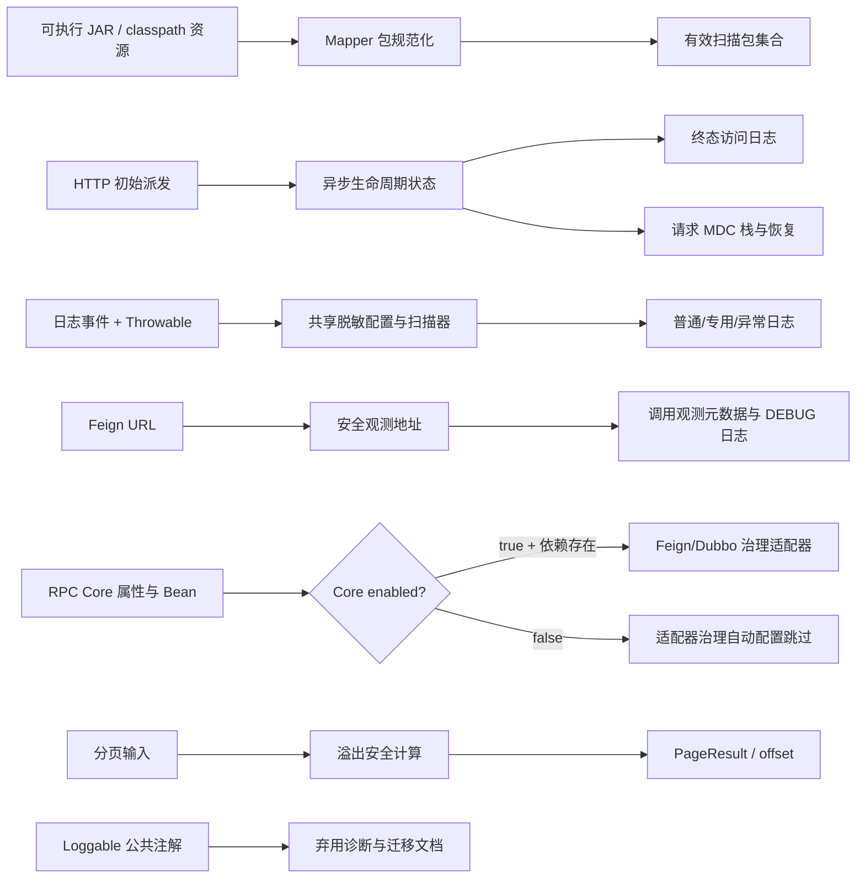

# 底座质量强化 — Design（完整型）

## Context

代码复核确认了 6 组跨模块问题：Mapper 自动发现对 JAR 内部路径使用了错误坐标；Servlet 异步请求在初始派发结束时尚未得到最终状态，且请求 MDC 可能留在容器线程；日志脱敏无法正确处理转义引号和 Throwable 链，Feign DEBUG 日志还会输出带凭证的 URL；RPC Core 关闭时 Feign/Dubbo 适配器仍要求不存在的 Core Bean；分页 Long 运算可产生负 offset 或负 totalPages；`Loggable` 是没有运行时消费者的误导性公共 API。

本需求与 v2.2.1 已完成的技术债修复保持边界分离。所有改动必须以最小实现修复可复现行为，不引入新的公开配置语义，不删除 v2.x 公开 API，也不顺带解决已明确排除的多上下文静态状态问题。

## Baseline and Dependencies

- 实施基线固定为当前 `main` 的 `3730dd500fb1eb974abb2b43c4ba8dc71d8efd38`；进入 Plan 时必须先确认该提交仍是目标 worktree 的祖先，若基线变化则重新记录并重跑旧回归测试。
- 本需求消费 v2.2.1 已完成任务的行为结果，不重写其决策：T1 `29e645b`（common 分页与枚举）、T2 `3a97c62`/`e45e457`（日志快照与脱敏）、T3 `bf493b6`/`2dd1b83`/`4e428e6`（RPC/Feign 生命周期）、T5 `c6006b2`/`4e428e6`（MyBatis 日志与 Mapper 查询）。
- 新旧范围映射固定为：IC-1 扩展 T5 的 Mapper 发现；IC-4/IC-5 扩展 T2 的日志边界；IC-6 扩展 T3 的 Feign 观测；IC-8 扩展 T1 的分页计算。其余旧 AC 必须继续通过，不得回退既有枚举 fallback、配置快照原子发布、RPC scope、有效 Mapper 包查询和 v2 密文行为。
- Plan 的首个验证任务必须运行旧需求的受影响测试并记录通过结果；任何旧 AC 失败都先停止新需求实施，不得用新断言覆盖旧行为。
- 本需求不消费或关闭 TD-013、TD-016、TD-023，也不把多 ApplicationContext 静态状态改造作为隐含依赖。

## Goal

- 8 个 Spec Behavior 全部有可执行回归证据，36 个 Scenario 均映射到测试断言。
- 发布制品中的外部 Mapper 被纳入实际扫描；不可解析资源不阻断其他资源。
- 每个未排除 HTTP 请求恰好记录一次终态访问日志，异步初始派发线程不残留请求 MDC。
- 敏感值在普通消息、转义引号、Throwable cause/suppressed 链和 Feign URL 的 userinfo/query/fragment 中出现次数为 0，异常结构仍可诊断；URL path 按路由数据保留。
- Core 关闭与 Feign/Dubbo 默认开启的上下文组合启动成功；关闭的适配器治理 Bean 不注册。
- 分页极值不产生负 offset/totalPages；`Loggable` 在 v2.2.1 保持兼容并提供弃用信号。

## Non-Goal

- 不改变校验异常响应的 wire format，不移除 `R<T extends Serializable>` 或其他公开 API。
- 不在 v2.2.1 为 `Loggable` 实现 AOP、拦截器或新的日志运行时语义。
- 不重构 Dubbo Holder 或日志转换器的进程级静态状态以实现多 ApplicationContext 隔离；该议题没有已确认的产品契约。
- 不接管业务线程池，也不为异步 HTTP 引入全局 ThreadLocal/TTL 传播机制。
- 不改变 Feign 实际请求 URL、RPC 协议、分页请求纠正规则或既有日志默认启用状态。

## Architecture

数据流边界如下：Mapper 资源先转换成 JAR entry 或 classes 目录下的相对路径，再产出去重的点号包模式集合；HTTP 初始派发在 request attribute 登记 `LifecycleState(phase, generation, claimedContexts)`，`claimedContexts` 是按引用身份（`==`）比较的不可变 `List<AsyncContext>` 快照；每个未出现过的 context 必须先通过 CAS 加入快照并递增 generation，再恰好尝试一次 `addListener`，因此当前、迟到旧 context 或并发重复通知均为幂等 no-op；状态允许 `NEW → REGISTERED → TERMINAL`、注册失败/已完成时的 `NEW → TERMINAL`，以及后续 `onStartAsync` 注册失败时的 `REGISTERED → TERMINAL`，完成/错误/超时/注册失败只允许一个终态日志和一次清理；普通日志和 Throwable 转换各自在一次调用内读取同一不可变脱敏配置，跨 converter 的事件级同代保证不属于本需求；`logback-spring.xml` 的四处 `%mask%n` 均显式改为 `%mask%maskThrowable%n`，不再依赖隐式 Throwable converter；Feign 先从原 URL 生成一次 `SanitizedUrl(service, target, debugUrl)`，Hook 元数据和 DEBUG 日志只消费该结果，委托请求仍使用原 URL；Core 属性和依赖 Bean 共同决定适配器是否注册；分页先验证输入再执行无溢出的商余计算；注解只改变编译期提示和文档，不增加运行时调用链。

## Interface Contract

| 编号 | Behavior | 文件与精确变更 | 兼容性与验收 |
|------|----------|----------------|--------------|
| IC-1 | 可执行制品发现外部 Mapper | 生产：`mimir-boot-starters/mimir-boot-starter-mybatis/src/main/java/com/yggdrasil/labs/mybatis/util/MapperPackageDetector.java`；测试：`mimir-boot-starters/mimir-boot-starter-mybatis/src/test/java/com/yggdrasil/labs/mybatis/util/MapperPackageDetectorTest.java`、`mimir-boot-starters/mimir-boot-starter-mybatis/src/test/java/com/yggdrasil/labs/mybatis/config/MapperScannerConfigurerJarIntegrationTest.java`。保留 `public static Set<String> detectMapperPackages()`；对每个资源取最后一个 `/mapper/` 段，JAR 先剥离 `!/` 前缀，再以 entry 相对路径提取包名；输出点号包模式；集成夹具必须把真实 JAR 放入 context classloader，断言 `MybatisProperties.getEffectiveMapperPackages()` 含 `org.example.order.mapper.**`、`MapperScannerConfigurer.basePackage` 含同一包模式，并成功注册一个 `@Mapper` Bean。 | 不改公开方法签名；默认包去重和不可读资源告警保持；外部包必须进入实际 scanner 输入并可被应用使用。 |
| IC-2 | 异步 HTTP 访问日志 | 生产：`mimir-boot-starters/mimir-boot-starter-log/src/main/java/com/yggdrasil/labs/log/web/AccessLogFilter.java`、`mimir-boot-starters/mimir-boot-starter-log/src/main/java/com/yggdrasil/labs/log/web/AccessLogAutoConfiguration.java`、`mimir-boot-starters/mimir-boot-starter-log/README.md`；测试：`mimir-boot-starters/mimir-boot-starter-log/src/test/java/com/yggdrasil/labs/log/web/AccessLogFilterTest.java`、`mimir-boot-starters/mimir-boot-starter-log/src/test/java/com/yggdrasil/labs/log/web/AccessLogAutoConfigurationTest.java`。保留构造器和 `doFilter`；同步链路在 finally 无异常时无论 HTTP 状态为 2xx、4xx 或 5xx 均输出 `Outcome=COMPLETED`/`ErrorType=-`，只有链路抛出异常才输出 `Outcome=ERROR`/异常全限定名；异步状态使用带 `generation` 与不可变 `claimedContexts` 身份快照的 `LifecycleState`，每个不同 `AsyncContext` 先以 CAS 认领、再恰好尝试一次 `addListener`，迟到旧 context、当前 context 和并发重复通知均为幂等 no-op；允许 `NEW --认领并注册成功--> REGISTERED`、`NEW --注册失败/已完成--> TERMINAL`、`REGISTERED --认领新 context 并注册成功--> REGISTERED`、`REGISTERED --新 context 注册失败--> TERMINAL`、`REGISTERED --完成/超时/错误--> TERMINAL`，所有转移用 CAS 保护；任一已认领 context 的 `addListener` 失败都从当时最新非终态 CAS 竞争 `TERMINAL`，若其他终态已先成功则只记录诊断；`onError` 无 Throwable 时固定 `ErrorType=ASYNC_ERROR_WITHOUT_THROWABLE`；终态输出固定 `Status/Outcome/ErrorType/Duration` 字段。自动配置显式设置 async supported，并由 `AccessLogAutoConfigurationTest.enablesAsyncSupport` 断言 `FilterRegistrationBean.isAsyncSupported()==true`；README 的四个输出示例和字段说明必须同步新格式。 | 构造器和过滤器调用方式不变；排除路径、级别和慢接口阈值不变；异步日志从初始派发状态改为最终状态。 |
| IC-3 | HTTP 请求上下文 | 生产：`mimir-boot-starters/mimir-boot-starter-web/src/main/java/com/yggdrasil/labs/web/interceptor/TraceInterceptor.java`、`mimir-boot-starters/mimir-boot-starter-web/src/main/java/com/yggdrasil/labs/web/interceptor/WebInterceptor.java`；测试：`mimir-boot-starters/mimir-boot-starter-web/src/test/java/com/yggdrasil/labs/web/interceptor/TraceInterceptorTest.java`、`mimir-boot-starters/mimir-boot-starter-web/src/test/java/com/yggdrasil/labs/web/interceptor/WebInterceptorTest.java`。两者实现 `AsyncHandlerInterceptor`，新增 `afterConcurrentHandlingStarted(...)`；固定保留 `traceId`、`requestId`、`ip` 三个 MDC key，初始异步派发释放 request-scoped 栈，后续 ASYNC 派发由 `preHandle`/`afterCompletion` 成对管理。 | 公开类、既有方法和 MDC key 不变；只补异步生命周期的清理，不传播业务线程池上下文。 |
| IC-4 | 普通日志敏感值 | 生产：`mimir-boot-starters/mimir-boot-starter-log/src/main/java/com/yggdrasil/labs/log/converter/SensitiveDataConverter.java`；测试：`mimir-boot-starters/mimir-boot-starter-log/src/test/java/com/yggdrasil/labs/log/converter/SensitiveDataConverterTest.java`、`mimir-boot-starters/mimir-boot-starter-log/src/test/java/com/yggdrasil/labs/log/converter/SensitiveDataConverterBenchmark.java`。保留现有转换和配置属性，修正 quoted value 结束位置，识别反斜杠转义和连续反斜杠；百分号键仅保持既有支持的 `%70assword` 形式，不新增完整 percent-decoded key 语义；单次转换只读取一个完整快照。Benchmark 必须输出 `RuntimeMXBean.getInputArguments()`，并在手工性能命令中用 Surefire `forkCount=0` 证明测试与 Maven 共用实际应用了固定参数的 JVM；默认保留单进程阈值断言，测试专用属性 `mimir.boot.log.mask.benchmark.enforce-threshold=false` 仅允许 T9 证据运行跳过该单进程断言，功能失败、Maven 失败、delta 与 JVM 参数输出仍保持。 | 默认规则、replacement 和配置键不变；只减少转义值泄露，不改变非敏感文本；测试专用属性不进入生产配置。 |
| IC-5 | Throwable 敏感值 | 生产：新增 `mimir-boot-starters/mimir-boot-starter-log/src/main/java/com/yggdrasil/labs/log/converter/SensitiveThrowableProxyConverter.java`，并修改 `mimir-boot-starters/mimir-boot-starter-log/src/main/resources/logback-spring.xml`：增加 `<conversionRule conversionWord="maskThrowable" converterClass="com.yggdrasil.labs.log.converter.SensitiveThrowableProxyConverter"/>`；测试：新增 `mimir-boot-starters/mimir-boot-starter-log/src/test/java/com/yggdrasil/labs/log/converter/SensitiveThrowableProxyConverterTest.java`。`convert(ILoggingEvent)` 先按 Logback 渲染再遮蔽 cause/suppressed；四处 `%mask%n` 精确替换为 `%mask%maskThrowable%n`，所有 appender 显式使用专用 converter，禁止隐式原始 Throwable converter 或重复输出。配置测试必须断言 `maskThrowable` 转换词已注册、四处 pattern 均引用且不存在未显式替换的 `%mask%n`。 | 仅支持现有 Logback 绑定；异常类型、堆栈帧和层级保留；非 Logback 仍按既有 WARN 降级。 |
| IC-6 | Feign 安全观测地址 | 生产：`mimir-boot-starters/mimir-boot-starter-feign/src/main/java/com/yggdrasil/labs/rpc/feign/client/RpcFeignClient.java`；测试：`mimir-boot-starters/mimir-boot-starter-feign/src/test/java/com/yggdrasil/labs/rpc/feign/client/RpcFeignClientTest.java`。保留 `execute(Request, Request.Options)`；新增内部 `private record SanitizedUrl(String service, String target, String debugUrl)` 与 `private SanitizedUrl sanitizeUrl(String rawUrl)`，所有 Hook 元数据、成功/失败 DEBUG 分支（含 `properties.enabled=false`）只消费同一结果；绝对层级且 host 存在时输出 `service=host`、`target=host[:port]`、`debugUrl=scheme://host[:port]/path`，relative 输出 `service=[unknown-service]`、`target=path`、`debugUrl=path`；可解析但缺 host 的绝对层级 URI 固定输出 `[unknown-service]/[invalid-authority]/[invalid-authority]`；opaque、非法、null 分别输出 `[unknown-service]` 加 `[opaque-url]`、`[invalid-url]`、`[missing-url]`。 | 委托客户端仍接收原 URL；Hook 的 `service/target` 与 DEBUG 的 `debugUrl` 均不含 userinfo/query/fragment 或原始非法文本；既有异常传播和响应语义不变。URL 敏感范围仅定义为 userinfo/query/fragment，path 是路由数据。 |
| IC-7 | RPC Core 与适配器组合 | 生产：`mimir-boot-starters/mimir-boot-starter-feign/src/main/java/com/yggdrasil/labs/rpc/feign/config/FeignAutoConfiguration.java`、`mimir-boot-starters/mimir-boot-starter-dubbo/src/main/java/com/yggdrasil/labs/rpc/dubbo/config/DubboAutoConfiguration.java`、`mimir-boot-starters/mimir-boot-starter-rpc-core/src/main/java/com/yggdrasil/labs/rpc/core/config/RpcCoreAutoConfiguration.java`；测试：`mimir-boot-starters/mimir-boot-starter-feign/src/test/java/com/yggdrasil/labs/rpc/feign/config/FeignAutoConfigurationTest.java`、`mimir-boot-starters/mimir-boot-starter-feign/src/test/java/com/yggdrasil/labs/rpc/feign/config/FeignAutoConfigurationEndToEndTest.java`、`mimir-boot-starters/mimir-boot-starter-dubbo/src/test/java/com/yggdrasil/labs/rpc/dubbo/config/DubboAutoConfigurationTest.java`、`mimir-boot-starters/mimir-boot-starter-rpc-core/src/test/java/com/yggdrasil/labs/rpc/core/config/RpcCoreAutoConfigurationTest.java`。适配器在 Core 属性开启且 `RpcHookChain`、`RpcTracerBridge` Bean 存在时才注册。 | 不新增配置键；默认 Core+适配器行为不变；Core=false 不再因缺 Bean 启动失败。 |
| IC-8 | 分页溢出 | 生产：`mimir-boot-common/src/main/java/com/yggdrasil/labs/common/page/PageRequest.java`、`mimir-boot-common/src/main/java/com/yggdrasil/labs/common/page/PageResult.java`；测试：`mimir-boot-common/src/test/java/com/yggdrasil/labs/common/page/PageRequestTest.java`、`mimir-boot-common/src/test/java/com/yggdrasil/labs/common/page/PageResultTest.java`。`getOffset()` 保持签名，在现有纠正后用精确乘法；超出 Long 范围抛 `IllegalArgumentException("分页偏移量超出 Long 范围")`；`PageResult` 使用商余计算 ceil。 | 不改变请求 null/范围纠正和结果非法参数校验；只把不可表示结果从负值改为明确错误，极值合法 totalCount 得到精确页数。 |
| IC-9 | `Loggable` 弃用 | 生产：`mimir-boot-common/src/main/java/com/yggdrasil/labs/common/annotation/Loggable.java` 添加 `@Deprecated(since="2.2.1", forRemoval=true)`，并把类 Javadoc 改为“兼容性日志元数据注解；当前无内置运行时消费者；v2.2.1 弃用，3.0 移除”；文档：`mimir-boot-common/README.md` 的 Loggable 条目改为同一措辞；测试：新增 `mimir-boot-common/src/test/java/com/yggdrasil/labs/common/annotation/LoggableCompatibilityTest.java`，并新增 `mimir-boot-common/src/test/resources/compatibility/loggable-pre-v2.2.1/com/yggdrasil/labs/common/annotation/Loggable.java` 与 `mimir-boot-common/src/test/resources/compatibility/loggable-pre-v2.2.1/com/yggdrasil/labs/common/compat/PrecompiledLoggableConsumer.java` 两份旧契约编译 fixture。 | 源码/二进制兼容；编译器产生弃用诊断；不增加 AOP 行为。本轮仅修复方案文档，源码 Javadoc/注解和兼容性测试在执行阶段落地。 |

### 公开 API 与配置签名

| 契约 | 签名或属性 | 空值、错误与并发规则 |
|------|------------|----------------------|
| Mapper 自动发现 | `public static Set<String> MapperPackageDetector.detectMapperPackages()` | 返回去重后的包模式集合；单个资源解析失败只告警并继续；方法不加载 Mapper 类。 |
| 访问日志过滤器 | `public AccessLogFilter(long slowThresholdMs, List<String> excludePaths)`；`public void doFilter(ServletRequest request, ServletResponse response, FilterChain chain) throws IOException, ServletException`；内部 listener 实现 `public void onComplete(AsyncEvent event)`、`onTimeout(AsyncEvent event)`、`onError(AsyncEvent event)`、`onStartAsync(AsyncEvent event)` | 四个 listener 回调不向外抛异常；request attribute 保存 `LifecycleState(phase, generation, claimedContexts)`、开始时间和最后终态；`claimedContexts` 是不可变引用列表并只用 `==` 判断身份；同步 finally 无异常时 2xx/4xx/5xx 均为 `COMPLETED/-`，抛异常时为 `ERROR/<异常全限定名>`；`onStartAsync` 仅为 CAS 成功认领的新 context 尝试一次注册并递增 generation，任何已认领 context 的迟到/重复通知均不注册；只有 CAS 成功进入 `TERMINAL` 才输出一次 `Status/Outcome/ErrorType/Duration`；排除路径不输出。 |
| 异步拦截器 | `public void afterConcurrentHandlingStarted(HttpServletRequest request, HttpServletResponse response, Object handler) throws Exception` | 初始派发释放当前拦截器写入的 MDC key；后续 ASYNC 派发仍由 `preHandle`/`afterCompletion` 成对管理；不修改其他组件拥有的 MDC key。 |
| Throwable 日志转换 | `public String SensitiveThrowableProxyConverter.convert(ILoggingEvent event)` | event 无 Throwable 时返回空字符串；存在 Throwable 时保留原渲染结构并对所有异常链文本应用同一配置快照。 |
| Feign 请求 | `public Response RpcFeignClient.execute(Request request, Request.Options options) throws IOException`；内部 `private record SanitizedUrl(String service, String target, String debugUrl)` 与 `private SanitizedUrl sanitizeUrl(String rawUrl)` | request 和 options 非 null 时委托原值；所有 Hook 元数据和 DEBUG 分支均只消费一次 sanitizer 结果；绝对层级且 host 存在时输出 `service=host`、`target=host[:port]`、`debugUrl=scheme://host[:port]/path`；相对 URL 输出 `[unknown-service]`/path/path；绝对层级但缺 host 输出 `[unknown-service]`/`[invalid-authority]`/`[invalid-authority]`；opaque、非法、null 输出各自固定占位符。 |
| RPC Core 条件 | `mimir.boot.rpc.core.enabled`（boolean，默认 `true`） | `false` 时 Core Bean 和依赖 Core 的 Feign/Dubbo 治理适配器均不自动注册；适配器自身 `enabled=false` 只关闭对应适配器。 |
| 分页 offset | `public Long PageRequest.getOffset()` | 纠正规则保持不变；乘法不可表示时抛 `IllegalArgumentException`，不返回负值。 |
| 分页结果 | `public class PageResult<T extends Serializable> implements Serializable`；`public PageResult(List<T> data, Long totalCount, Long pageIndex, Long pageSize)` | totalCount≥0、pageIndex≥1、pageSize≥1 时计算商余 ceil；null/非法输入仍抛既有 `IllegalArgumentException("分页参数无效")`。 |
| `Loggable` | `@Deprecated(since="2.2.1", forRemoval=true) public @interface Loggable` | `String module/type/description` 默认 `""`；`boolean logRequest/logResponse/logExecutionTime` 默认 true；仅新增编译诊断。 |

## Data Model

| 数据 | 字段/格式 | 约束 |
|------|-----------|------|
| 有效 Mapper 包集合 | `Set<String>` 点号包模式（如 `org.example.mapper.**`） | JAR entry 或 classes 相对路径只作为解析中间态；最终输出统一为点号包模式并去重。对含多个 `/mapper/` 段的路径取最后一个匹配段；不可读资源不污染集合。 |
| 异步访问日志状态 | request attribute：`startTime`、`AtomicReference<LifecycleState>`、终态 status/outcome/errorType；`LifecycleState=(phase,generation,claimedContexts)`，其中 `claimedContexts` 为不可变 `List<AsyncContext>` 快照且只以 `existing == candidate` 判断身份 | 初始 generation=0、列表为空；每个未认领 identity 先在 CAS 成功的新状态中加入列表并令 generation+1，再恰好调用一次 `addListener`；当前、迟到旧或并发重复 identity 只要已在任一成功快照中出现即为 no-op。注册调用失败后，从当时最新非终态循环 CAS 到 `TERMINAL`；完成/超时/错误与任一注册失败并发竞争时只有首个终态成功，其他路径只记录诊断。同步状态在 filter chain finally 直接进入 `TERMINAL`，其耗时终点为 finally；异步耗时终点为首个终态回调或注册回退处理结束；开始时间只写一次。注册失败输出 `REGISTRATION_ERROR`，已完成使用 `ASYNC_ALREADY_COMPLETED`；`onError` 有 Throwable 时使用异常全限定名，无 Throwable 时使用 `ASYNC_ERROR_WITHOUT_THROWABLE`。本行并发规则仅适用于 AccessLog 的 listener/注册状态；同步请求不注册异步监听器。 |
| 拦截器 MDC 栈 | request attribute 中的 `Deque<MdcState>` / IP 栈 | 每次 `preHandle` 入栈，`afterCompletion` 或 `afterConcurrentHandlingStarted` 出栈；此处串行假设仅适用于 MVC dispatcher 对同一请求的 MDC 栈配对，不适用于上一行允许并发的 AccessLog listener 回调；不允许并发修改同一栈，空栈移除 attribute。 |
| 日志配置快照 | 既有不可变 patterns、字段名和 replacement | 普通 `%mask` 与 Throwable converter 各自在单次 `convert` 调用内读取一份完整快照；不承诺两个 converter 跨调用的事件级同代，配置发布保持原子替换。 |
| 安全 URL 元数据 | `SanitizedUrl(service, target, debugUrl)` | 绝对层级且 host 存在时为 `host`、`host[:port]`、`scheme://host[:port]/path`；relative 为 `[unknown-service]`、path、path；绝对层级但 host 缺失为 `[unknown-service]`、`[invalid-authority]`、`[invalid-authority]`；opaque/非法/null 为 `[unknown-service]` 加对应固定占位符。三字段均不含 userinfo/query/fragment 或原始非法文本；path 按路由数据保留。 |
| 分页计算结果 | `offset: long`、`totalPages: long` | offset 必须非负且可表示；totalPages 使用非溢出 ceil；不可表示 offset 显式失败。 |

本需求不新增持久化表、序列化字段或数据库索引。

## Non-Functional Requirements

| 维度 | 指标 |
|------|------|
| 性能 | Java 17、固定 1 KiB 消息、CPU 核心 0 和 `-Xms1g -Xmx1g -XX:+AlwaysPreTouch` 下，先运行无规则基线再运行启用 3 个敏感字段规则的候选路径；两者均预热 100000 次、测量 1000000 次。手工命令必须设置 Surefire `forkCount=0`，使每次测试运行与对应 Maven 进程共享同一 JVM；连续独立启动 3 个 Maven/JVM 进程，每次一个 sample，不剔除离群值，三次新增开销算术平均 ≤20 µs。默认 Benchmark 仍执行单进程阈值断言；仅 T9 证据命令可设置测试专用属性 `mimir.boot.log.mask.benchmark.enforce-threshold=false`，由外层脚本对三个均成功进程的 delta 统一断言。Benchmark 输出 `RuntimeMXBean.getInputArguments()`，证据同时保存 Java 版本、CPU、MAVEN_OPTS 和实际测试 JVM 参数。该基准是发布前人工证据，不是 CI 硬门禁；异步终态回调不执行阻塞外部 I/O。 |
| 安全 | 每次普通消息或 Throwable converter 调用中，转义引号、cause/suppressed，以及 Feign URL 的 userinfo/query/fragment fixture 中敏感明文出现次数为 0；异常类型和堆栈帧保留。不承诺动态刷新发生在同一 event 的两个 converter 调用之间时的跨 converter 同代；URL path 按路由数据处理，不在本 NFR 的凭证范围内。 |
| 可用性 | Core=false + Feign/Dubbo 默认开启的 ApplicationContext 启动成功；不可解析 Mapper 资源、异步 listener 回调异常和非 Logback 绑定均不得阻断业务启动或请求结果。 |
| 可观测性 | 每个未排除请求 1 条访问日志；日志事件可区分最终 HTTP 状态、耗时和慢接口级别；RPC 关闭组合可通过 Bean 存在性直接诊断；`Loggable` 弃用诊断可被编译器捕获。 |
| 兼容性 | v2.2.1 不删除既有公开类型、方法、注解属性和配置键；Feign 原请求、分页请求纠正和日志默认规则保持兼容。 |

## Alternatives Considered

| 决策 | 选择 | 未选方案及原因 |
|------|------|----------------|
| Mapper 解析 | 先规范化 JAR entry 内部路径，再提取包名 | 通过加载类发现 Mapper 会增加启动副作用、类加载成本和失败面。 |
| 异步访问日志 | 使用 `AsyncListener` 在终态输出并用一次性标记去重 | 仅把过滤器映射到 ASYNC dispatch 可能重复记录，且初始 dispatch 仍不是最终状态。 |
| MDC 清理 | 使用 `AsyncHandlerInterceptor.afterConcurrentHandlingStarted` 释放 request-scoped 栈 | 全局 TTL/ThreadLocal 传播会接管业务线程池，超出底座边界；只在 `afterCompletion` 清理又无法覆盖无后续派发的超时。 |
| Throwable 脱敏 | 专用 Throwable converter 复用现有消息脱敏规则 | 只遮蔽 formatted message 会让 Logback 自动追加的异常链绕过 `%mask`；预先改写异常对象会破坏异常身份和堆栈。 |
| RPC 组合 | Core 属性联动并要求 Core Bean 存在 | 注入 no-op Core Bean 会伪装 Core 已启用，容易让适配器错误地宣称有治理能力。 |
| 分页溢出 | offset 不可表示时明确失败，totalPages 使用商余 ceil | 静默截断或把页码裁剪到最大值会产生错误数据位置且难以诊断。 |
| `Loggable` | 弃用并在 3.0 移除 | 在补丁版本新增 AOP 会引入运行时行为、代理顺序和性能契约，且超出用户已确认范围。 |

## Error Handling

- Mapper 资源 URL 无法读取、路径格式异常或解析失败：记录包含资源定位信息的 WARN，跳过该资源，其他资源继续处理。
- 异步访问日志严格按上述认领/终态状态机运行：首次 `startAsync` 将其 context 按引用身份 CAS 加入空快照并形成 generation 1；后续 `onStartAsync` 仅对未认领 identity 原子追加快照、递增 generation 并恰好尝试一次 `addListener`，C1→C2 后迟到的 C1、当前 context 重复通知或并发重复通知均为 no-op。`onComplete` 输出 `Outcome=COMPLETED`，`onTimeout` 输出 `TIMEOUT/ASYNC_TIMEOUT`，`onError` 有 Throwable 时输出 `ERROR/<异常全限定名>`、无 Throwable 时输出 `ERROR/ASYNC_ERROR_WITHOUT_THROWABLE`。任一已认领 context 的 `addListener` 抛异常时从最新非终态循环 CAS 竞争 `TERMINAL` 并输出 `REGISTRATION_ERROR/<异常全限定名>`；检测到异步已完成时从 `NEW` 直接转入 `TERMINAL` 并输出 `REGISTRATION_ERROR/ASYNC_ALREADY_COMPLETED`；所有终态只有首个 CAS 成功者输出一次，失败或迟到路径只记录诊断，不改变 HTTP 结果。
- MDC 恢复遇到空值：按既有语义 remove；恢复动作不抛出业务异常，不覆盖无关 MDC key。
- Throwable 无异常代理：返回 Logback 约定的空结果；异常链中任一消息为 null 时保留结构并跳过该文本。
- Feign URL 不拒绝实际请求；同一次调用先生成 `SanitizedUrl(service, target, debugUrl)`，Hook 元数据和所有 DEBUG 分支（包括 `properties.enabled=false`）均只消费该结果。绝对层级且 host 存在时使用 `host`、`host[:port]`、`scheme://host[:port]/path`；相对 URI 使用 `[unknown-service]`、path、path；绝对层级但 host 缺失（固定夹具 `https:/orders?token=secret`）使用 `[unknown-service]`、`[invalid-authority]`、`[invalid-authority]`；opaque、非法、null 分别使用 `[unknown-service]` 加 `[opaque-url]`、`[invalid-url]`、`[missing-url]`。任何失败分支都不得回退原始 URL；path 属于路由数据，凭证敏感范围仅为 userinfo/query/fragment。
- Core disabled 或依赖 Bean 缺失：适配器自动配置条件不满足，应用上下文保持启动成功；不创建伪造的 no-op Hook/Tracer Bean。
- offset 乘法溢出：抛 `IllegalArgumentException("分页偏移量超出 Long 范围")`，调用方可将其转换为自己的参数错误；不得返回负 offset。
- totalPages 计算：输入已经通过既有校验；合法极值使用商余计算，不产生异常或负数。
- `Loggable` 使用：编译器产生 deprecation warning，不阻断编译；运行时反射仍可读取原注解属性。

## Testing Strategy

| 测试对象 | 层级 | 验证方法 | 通过标准 |
|---------|------|----------|---------|
| MapperPackageDetector | 单元 + 集成 | 包路径边界测试；让受控坏 Resource 返回缺少 `!/` 的 `jar:file:/fixtures/bad.jar!broken/mapper/UserMapper.class`，并与可解析的 `jar:file:/fixtures/good.jar!/org/example/order/mapper/OrderMapper.class` 同时存在；另加入包含两段 `/mapper/` 的嵌套路径；在 `mimir-boot-starters/mimir-boot-starter-mybatis/src/test/java/com/yggdrasil/labs/mybatis/config/MapperScannerConfigurerJarIntegrationTest.java` 通过真实 JAR + context classloader 启动 `MybatisProperties` 与 `MapperScannerConfigurer` | `getEffectiveMapperPackages()` 和 `basePackage` 都包含 `org.example.order.mapper.**`，且扫描后注册的 `@Mapper` Bean 可调用；默认包去重；坏 Resource WARN 同时包含完整资源标识和解析失败原因，不影响正常 JAR 包。 |
| AccessLogAutoConfiguration | 自动配置单元 | `AccessLogAutoConfigurationTest.enablesAsyncSupport` 读取过滤器注册 Bean | `FilterRegistrationBean.isAsyncSupported()` 精确为 true，保证异步请求可进入 IC-2 生命周期。 |
| AccessLogFilter | 单元 + Servlet 集成 | Mock 请求同步链路参数化覆盖 200、404、500（均无异常）及 `FilterChain.doFilter` 抛 `IllegalStateException`；异步完成/超时/错误分别覆盖有 Throwable 与 null Throwable；按 C1→C2→迟到 C1→重复 C2 触发 `onStartAsync`，并另设两个不同新 context 与重复通知并发到达的夹具；首轮及后续 `addListener` 抛异常、异步已完成和完成/超时/错误/注册失败并发竞争夹具；计数器捕获认领、listener 注册和 access logger | 同步/异步每个未排除请求恰好 1 条；同步无异常的 200/404/500 均为 `COMPLETED/-`，抛异常才为 `ERROR/<异常全限定名>`；每个引用身份只认领并尝试一次 `addListener`，generation 等于成功认领的不同身份数且单调递增，迟到旧/当前/并发重复 context 均不再注册；null Throwable 输出 `ASYNC_ERROR_WITHOUT_THROWABLE`；任一轮注册失败回退为 `REGISTRATION_ERROR`；并发竞争仅一个 CAS 成功者输出终态日志。 |
| starter-log README | 文档消费校验 | 读取 `mimir-boot-starters/mimir-boot-starter-log/README.md` 的四个访问日志代码块和字段说明 | 每个示例均含 `Status`、`Outcome`、`ErrorType`、`Duration`；错误示例的 `Outcome/ErrorType` 与 Spec 一致；不存在仅含旧 `Status/Duration` 的示例。 |
| TraceInterceptor/WebInterceptor | 单元 + MVC 异步集成 | 初始 dispatch、`afterConcurrentHandlingStarted`、ASYNC redispatch、timeout/error；前后设置 MDC 哨兵值 | 初始线程恢复/清理；ASYNC 再派发成对恢复；无后续派发也不泄漏；无关 MDC key 不变。 |
| SensitiveDataConverter | 单元 | JSON、百分号键、双/单引号、转义引号、奇偶反斜杠、连续字段与空值参数化测试 | 敏感明文出现次数为 0；边界后的文本保持原值；普通结构可读。 |
| SensitiveDataConverterBenchmark | 手工性能证据 | 默认模式验证单进程阈值；T9 以 `forkCount=0`、`samples=1`、`mimir.boot.log.mask.benchmark.enforce-threshold=false` 独立启动三个 Maven/JVM 进程并保存各自完整日志 | 三个进程均成功且各输出一个 delta、`RuntimeMXBean.getInputArguments()` 和固定 JVM 参数；外层脚本只在收集到恰好三个样本时计算算术平均，并断言 ≤20000 ns/op。 |
| SensitiveThrowableProxyConverter | Logback 集成 | 捕获无 Throwable 的事件以及包含 message、cause、suppressed 的日志事件并渲染四种 appender pattern；配置刷新夹具分别发生在普通 converter 与 Throwable converter 两次调用之间 | 无 Throwable 时精确返回空字符串；存在 Throwable 时消息和所有异常链敏感值为 0，类型、堆栈帧、cause/suppressed 层级保留；四种 pattern 均显式包含 `%maskThrowable` 且不再隐式追加或重复打印 Throwable；每次 converter 调用使用一个完整快照。 |
| RpcFeignClient | 单元 | 成功、失败、含 query/fragment/userinfo、相对、绝对层级但 host 缺失（`https:/orders?token=secret`）、opaque、非法和 null URL；分别将 Feign properties 设为 enabled/disabled；捕获 `RpcCallMetadata.service/target` 和 DEBUG logger | 所有 Hook 元数据和 DEBUG 分支仅输出同一 `SanitizedUrl`：正常绝对 URL 为 host/host[:port]/scheme://host[:port]/path，相对 URL 为 `[unknown-service]`/path/path，缺 host 的绝对层级 URL 为 `[unknown-service]`/`[invalid-authority]`/`[invalid-authority]`，opaque/非法/null 为 `[unknown-service]` 加各自固定占位符；委托收到原 URL；异常传播不变。 |
| Feign/Dubbo/RPC Core auto-config | ApplicationContextRunner 集成 | Core/Feign/Dubbo 三个开关组合矩阵，含 Core disabled、适配器 disabled、缺失 Core Bean | Core disabled 组合启动成功且治理 Bean 不存在；默认组合 Bean 存在；单适配器关闭不影响其他。 |
| PageRequest/PageResult | 单元 | `Long.MAX_VALUE`、边界可表示乘积、溢出乘积、极值 totalCount 参数化测试 | offset 非负或明确 `IllegalArgumentException`；totalPages 精确为 `9223372036854776`；既有纠正/校验测试继续通过。 |
| Loggable | 编译 + 反射 + 文档 | `JavaCompiler` 将 `src/test/resources/compatibility/loggable-pre-v2.2.1` 下的旧注解契约与 consumer 编译到临时目录，删除临时旧 `Loggable.class` 后，以当前 common classloader 为 parent 加载并调用 consumer；另启用 `-Xlint:deprecation` 编译当前下游源码、反射读取六个属性及默认值，并校验 README/Javadoc | 当前源码成功编译并捕获弃用诊断；旧契约 consumer 在只使用当前 `Loggable` 时无 `NoSuchMethodError`、`NoSuchFieldError`、`IncompatibleClassChangeError`；六属性不变；文档无自动运行时承诺且写明 3.0 移除。 |
| 全量回归 | 构建 | Java 17 下 `./mvnw clean verify` 与受影响模块定向测试 | Surefire/Failsafe 无 failures/errors/skipped；所有 Scenario 追溯到通过断言。 |

## Milestones

| 阶段 | 产出 | 依赖 |
|------|------|------|
| Phase 1 | Spec/Design 确认；Mapper、分页和 `Loggable` 契约测试 | 用户确认 Spec/Design |
| Phase 2 | 普通日志、Throwable converter、Feign 安全 URL 和访问日志终态实现 | Phase 1；共享日志快照边界先确定 |
| Phase 3 | Web MDC 异步清理、RPC Core 组合条件及 ApplicationContext 组合测试 | Phase 2 的生命周期测试约定 |
| Phase 4 | 全量构建、性能证据、更新 `mimir-boot-starters/mimir-boot-starter-log/README.md` 的访问日志字段示例、更新 `mimir-boot-common/README.md` 的 Loggable 迁移说明，并完成 release/技术债台账闭环 | Phase 1–3 全部通过；文档消费检查必须断言示例含 `Status/Outcome/ErrorType/Duration`，且不存在仅含旧 `Status/Duration` 的访问日志示例 |
