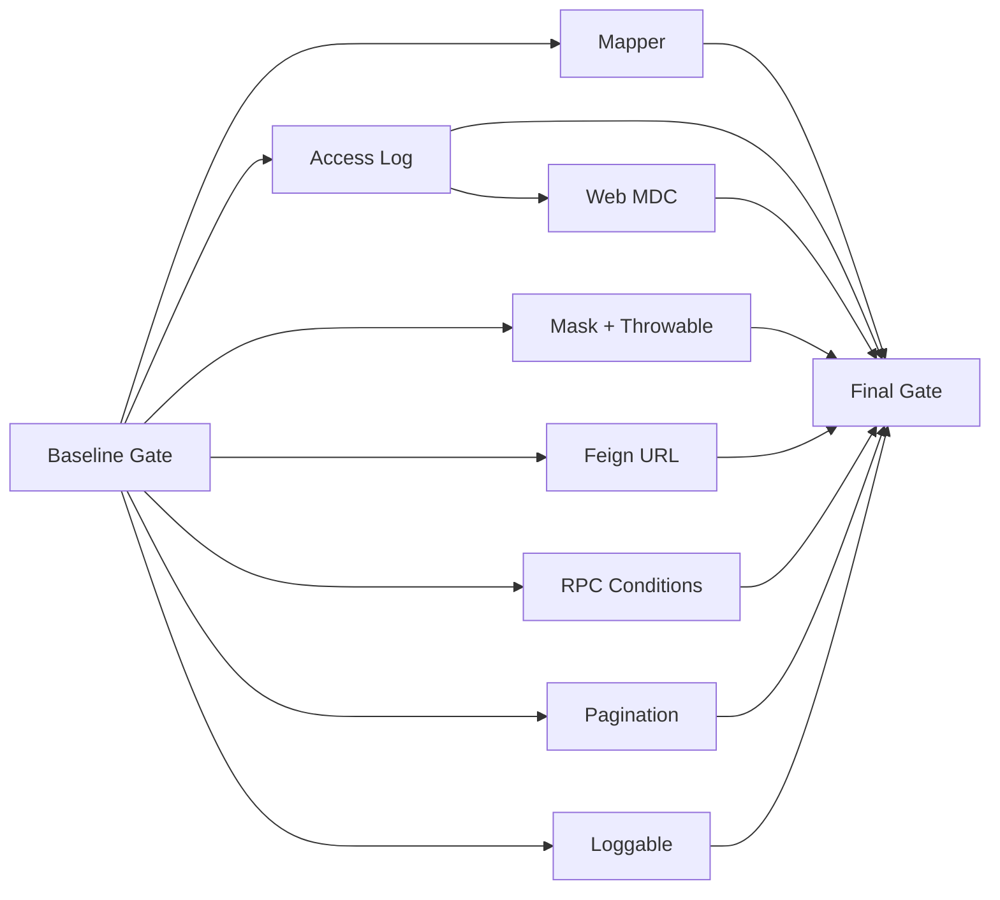

# 底座质量强化 — 实施计划

> Branch: feature/foundation-quality-hardening
> Baseline SHA: 3596025c80c446eb99d58a891163bdd0f2b202ae
> Worktree Path: /home/yangyang/workspace/codes/Yggdrasil-Labs/mimir-boot/.worktrees/foundation-quality-hardening
> Started At: 2026-08-31 07:34:48 +0800
> Updated At: 2026-08-31 09:57:00 +0800
> Effective Execution Mode: serial

## Goal

在不改变 v2.x 公开契约和默认配置语义的前提下，实现 [spec.md](./spec.md) 的 8 个 Behavior、36 个 Scenario，并为 [design.md](./design.md) 的 IC-1 至 IC-9 建立可追溯的测试、提交和发布证据。

## Architecture

Java 17 + Spring Boot 3.3.13 + Maven 多模块。实现遵循模块现有边界：common 只承载公共模型，starter 各自拥有自动配置和运行时行为；跨模块只通过既有公开类型与配置键协作。本计划不引入新依赖、数据库结构或公开配置。

## Tech Stack

- Java 17、Spring Boot 3.3.13、Maven Wrapper。
- JUnit 5、Mockito、Spring Test、ApplicationContextRunner、Logback 测试夹具。
- Git Conventional Commits，中文提交说明。

## Execution Metadata

- Commit Mode: per-task。
- Ledger Mode: controller-commits。
- 执行状态：IN_PROGRESS（T1 至 T4 已完成，继续 T5）。

## Plan Verdict

| 字段 | 当前值 |
|------|--------|
| Verdict | PENDING |
| Blocking Findings | 未执行，尚无结论 |
| Verification Evidence | Baseline Gate：2026-08-31 07:37 +0800，11 个相关模块 Maven 测试通过；Java 17.0.2；祖先检查通过。 |
| Release Readiness | NOT_EVALUATED |

## Decision Log

| ID | 决策 | 状态 | 证据 |
|----|------|------|------|
| DL-001 | T9 仅在 T1–T8 实现、回归与发布证据全部通过后删除 TD-030 至 TD-035；同时记录各债务对应的实现提交和验证命令。 | pending | 待 T9 写入实际提交与验证证据 |

执行完成前不得把 `pending` 改为 `completed`；若任一债务未解决，必须保留对应 TD 条目，T9 与 Plan 保持未完成，且不得通过 Accepted Risks 绕过本组关闭门禁。

## Accepted Risks

| ID | 风险 | 接受理由 | 复核条件 |
|----|------|----------|----------|
| AR-000 | 无 | 当前未接受任何残余风险 | 若实现阶段出现风险，必须先回写本表并由用户确认 |

## Global Constraints

- 开始任何 Red 前，必须确认 Design 固定基线 `3730dd500fb1eb974abb2b43c4ba8dc71d8efd38` 是当前 HEAD 的祖先，并记录实际 Branch、Baseline SHA、Worktree Path 与时间。
- 首轮基线回归失败时立即停止，不得通过修改旧断言来掩盖 T1/T2/T3/T5 已完成行为的回退。
- 只实现 IC-1 至 IC-9；不得引入 `Loggable` AOP、跨 ApplicationContext 静态状态重构、校验 wire format 变化或其他 Non-Goal。
- 所有实现任务采用 TDD：先产生可归因的失败断言，再写最小实现，再执行定向验证。
- 每个任务独立提交；控制器只维护计划状态与提交账本，不把多个任务压成一个实现提交。
- 公共 API、配置键、默认启用语义与 Feign 原始委托请求保持兼容。

## Baseline Gate

在 T1–T8 之前依次执行并保存输出：

```bash
set -euo pipefail
baseline_evidence_prefix=/tmp/mimir-boot-foundation-quality-baseline
git merge-base --is-ancestor 3730dd500fb1eb974abb2b43c4ba8dc71d8efd38 HEAD 2>&1 | tee "${baseline_evidence_prefix}-ancestor.log"
mise exec java@17 -- java -version 2>&1 | tee "${baseline_evidence_prefix}-java-version.log"
mise exec java@17 -- ./mvnw -pl :mimir-boot-common,:mimir-boot-starter-log,:mimir-boot-starter-web,:mimir-boot-starter-mybatis,:mimir-boot-starter-rpc-core,:mimir-boot-starter-feign,:mimir-boot-starter-dubbo -am test 2>&1 | tee "${baseline_evidence_prefix}-tests.log"
```

通过标准：祖先检查退出码为 0；所有已存在测试通过；工作区无本计划之外的重叠修改。失败时 Plan Verdict 保持 PENDING，并记录阻塞证据。

## Dependency Graph



| Task | IC | 依赖 | 可并行组 |
|------|----|------|----------|
| T1 | IC-1 | Baseline Gate | A |
| T2 | IC-2 | Baseline Gate | A |
| T3 | IC-3 | T2 | B |
| T4 | IC-4、IC-5 | Baseline Gate | A |
| T5 | IC-6 | Baseline Gate | A |
| T6 | IC-7 | Baseline Gate | A |
| T7 | IC-8 | Baseline Gate | A |
| T8 | IC-9 | Baseline Gate | A |
| T9 | 全局验收 | T1–T8 | C |

## Scenario Traceability

以下方法名是实施时必须采用或一对一等价替换的测试标识；若改名，控制器必须同步更新本表后才能通过 T9。

| Task | Spec Scenario | 计划测试类/方法或参数 | 对应 AC |
|------|---------------|-----------------------|---------|
| T1 | 发布制品中的 Mapper 可被发现 | `MapperScannerConfigurerJarIntegrationTest.discoversMapperFromExecutableJarAndRegistersBean` | T1 AC1 |
| T1 | 默认包与外部包去重 | `MapperPackageDetectorTest.deduplicatesDefaultAndExternalPackages` | T1 AC2 |
| T1 | 单个资源无法解析 | `MapperPackageDetectorTest.warnsAndSkipsMalformedResource` | T1 AC2 |
| T2 | 同步请求记录一次结果 | `AccessLogFilterTest.testSuccessRequest` | T2 AC1 |
| T2 | 同步 5xx 响应仍标记正常完成 | `AccessLogFilterTest.testServerErrorRequest` | T2 AC1 |
| T2 | 同步 4xx 响应仍标记正常完成 | `AccessLogFilterTest.testClientErrorRequest` | T2 AC1 |
| T2 | 同步处理异常记录 ERROR | `AccessLogFilterTest.logsSynchronousException` | T2 AC1 |
| T2 | 异步请求等待完成 | `AccessLogFilterTest.defersUntilAsyncComplete` | T2 AC1 |
| T2 | 异步超时 | `AccessLogFilterTest.logsAsyncTimeoutExactlyOnce` | T2 AC1 |
| T2 | 异步错误 | `AccessLogFilterTest.logsAsyncErrorWithThrowableExactlyOnce` + `logsAsyncErrorWithoutThrowableExactlyOnce` | T2 AC1、AC3 |
| T2 | 多轮异步派发重新注册监听器 | `AccessLogFilterTest.reRegistersOnlyEachDistinctAsyncContext` + `serializesConcurrentRedispatchAndTerminalCallbacks` | T2 AC2 |
| T2 | 异步监听器注册失败回退 | `AccessLogFilterTest.logsInitialRegistrationFailureWithoutPropagating` | T2 AC1、AC3 |
| T2 | 异步已完成注册回退 | `AccessLogFilterTest.logsAlreadyCompletedAsyncContextWithoutPropagating` | T2 AC1 |
| T2 | 后续异步派发注册失败回退 | `AccessLogFilterTest.logsRedispatchRegistrationFailureExactlyOnce` | T2 AC1、AC3 |
| T3 | 同步请求恢复进入前上下文 | `TraceInterceptorTest.afterCompletionRestoresRequestIdAndKeepsExternalMdcKey` + `WebInterceptorTest.afterCompletionRestoresOnlyItsPreviousIpAndKeepsOtherMdcKeysWhenExceptionExists` | T3 AC1、AC2 |
| T3 | 异步初始派发释放上下文 | `TraceInterceptorTest.releasesMdcAfterConcurrentHandlingStarted` + `WebInterceptorTest.releasesIpAfterConcurrentHandlingStarted` | T3 AC1 |
| T3 | 异步错误路径清理上下文 | `TraceInterceptorTest.restoresSnapshotOnAsyncError` + `WebInterceptorTest.restoresIpOnAsyncError` | T3 AC1、AC2 |
| T3 | 异步超时路径清理上下文 | `TraceInterceptorTest.restoresSnapshotOnAsyncTimeout` + `WebInterceptorTest.restoresIpOnAsyncTimeout` | T3 AC1、AC2 |
| T4 | 普通键值和编码键遮蔽 | `SensitiveDataConverterTest.masksPlainAndSupportedEncodedKeys` | T4 AC1 |
| T4 | 转义引号值整体遮蔽 | `SensitiveDataConverterTest.masksEscapedQuotedValueAndPreservesTail` | T4 AC1 |
| T4 | 异常链消息遮蔽且堆栈保留 | `SensitiveThrowableProxyConverterTest.masksThrowableGraphAndPreservesStructure` | T4 AC2 |
| T6 | Core 与适配器均启用 | `FeignAutoConfigurationEndToEndTest.registersDefaultRpcAdapters` + `DubboAutoConfigurationTest.registersDefaultAdapter` | T6 AC1 |
| T6 | Core 关闭时适配器默认不安装治理能力 | `FeignAutoConfigurationEndToEndTest.skipsDefaultAdaptersWhenCoreDisabled` + `DubboAutoConfigurationTest.skipsAdapterWhenCoreDisabled` | T6 AC1 |
| T6 | Core 关闭且适配器显式开启 | `FeignAutoConfigurationEndToEndTest.skipsExplicitAdaptersWhenCoreDisabled` + `DubboAutoConfigurationTest.skipsExplicitAdapterWhenCoreDisabled` | T6 AC1 |
| T6 | 单独关闭适配器 | `FeignAutoConfigurationTest.honorsAdapterSwitch` + `DubboAutoConfigurationTest.honorsAdapterSwitch` | T6 AC2 |
| T5 | 成功调用不记录查询凭证 | `RpcFeignClientTest.sanitizesSuccessfulAbsoluteUrl` | T5 AC1、AC3 |
| T5 | URL userinfo 不进入观测元数据 | `RpcFeignClientTest.stripsUserInfoFromMetadataAndDebugUrl` | T5 AC1、AC3 |
| T5 | 相对 URL 仍可执行 | `RpcFeignClientTest.delegatesRelativeUrlAndSanitizesObservation` | T5 AC1、AC3 |
| T5 | 缺失 authority、非层级或非法 URL 的元数据不泄露 | `RpcFeignClientTest.usesExactSafePlaceholdersForUnusableUrls` | T5 AC1、AC2、AC3 |
| T7 | 最大总记录数计算精确页数 | `PageResultTest.calculatesMaxTotalPagesWithoutOverflow` | T7 AC1 |
| T7 | 可表示的 offset 保持精确 | `PageRequestTest.returnsLargestRepresentableOffset` | T7 AC2 |
| T7 | offset 超出 Long 范围 | `PageRequestTest.rejectsOffsetOverflow` | T7 AC2 |
| T8 | 既有源码仍可编译 | `LoggableCompatibilityTest.compilesConsumerWithDeprecationDiagnostic` | T8 AC1、AC3 |
| T8 | 反射元数据保持可读 | `LoggableCompatibilityTest.preservesAllAnnotationMembersAndDefaults` | T8 AC1 |
| T8 | 预编译下游仍可运行 | `LoggableCompatibilityTest.loadsConsumerCompiledAgainstPreV221Contract` | T8 AC2 |
| T8 | 文档明确迁移方向 | `LoggableCompatibilityTest.documentsDeprecationWithoutRuntimePromise` | T8 AC4 |

## T1 — Mapper 发布制品发现

**Interfaces:** `public static Set<String> MapperPackageDetector.detectMapperPackages()`；`public String MybatisProperties.getEffectiveMapperPackages()` 继续返回包含点号包模式的逗号分隔字符串；`MapperScannerConfigurer.basePackage` 对自动发现结果去掉终端 `.**`，默认 `com.yggdrasil.labs.**.mapper` 保持原样。

**Files:**

- `mimir-boot-starters/mimir-boot-starter-mybatis/src/main/java/com/yggdrasil/labs/mybatis/util/MapperPackageDetector.java`
- `mimir-boot-starters/mimir-boot-starter-mybatis/src/test/java/com/yggdrasil/labs/mybatis/util/MapperPackageDetectorTest.java`
- `mimir-boot-starters/mimir-boot-starter-mybatis/src/main/java/com/yggdrasil/labs/mybatis/config/MybatisPlusAutoConfiguration.java`
- `mimir-boot-starters/mimir-boot-starter-mybatis/src/test/java/com/yggdrasil/labs/mybatis/config/MybatisPlusAutoConfigurationTest.java`
- `mimir-boot-starters/mimir-boot-starter-mybatis/src/test/java/com/yggdrasil/labs/mybatis/config/MapperScannerConfigurerJarIntegrationTest.java`（新增）

**Behavior:** 映射 Mapper Behavior 的 3 个 Scenario 与 IC-1；真实 JAR 的发现结果保持点号包模式，自动配置将其规范化为扫描基础包并注册可调用 Mapper，坏资源只 WARN 并继续。

**Acceptance Criteria:**

- [ ] 真实 JAR fixture 使 `org.example.order.mapper.**` 出现在有效包集合，`basePackage` 仅含规范化后的 `org.example.order.mapper`，对应 `@Mapper` Bean 可调用。
- [ ] 默认包去重；多段 `/mapper/` 取最后一段；坏 URL 的 WARN 含资源标识与解析原因且不影响好资源。

**Execution:** Status=completed；Commit SHAs=[e84073cd3a0214dc9b17e0deec7906bd2b6ec0d9]；Dispatch Base SHA=3596025c80c446eb99d58a891163bdd0f2b202ae；Dispatch Ref=feature/foundation-quality-hardening；Attempts=1；Blocked Reason=null；Red Result=真实 JAR 集成夹具直接将 `org.example.order.mapper.**` 交给 scanner 时未注册 Mapper Bean；Verify Result=`mise exec java@17 -- ./mvnw -pl :mimir-boot-starter-mybatis -am -Dsurefire.failIfNoSpecifiedTests=false -Dtest=MapperPackageDetectorTest,MapperScannerConfigurerJarIntegrationTest,MybatisPlusAutoConfigurationTest test` 通过（102 tests）；AC Result=2/2 通过；agent=controller；mode=TDD；commit=required；owner=T1。

**Task Completion Gate:**

- [x] Red：新增 3 个 Scenario 的失败断言并保存失败原因。
- [x] Green：只修改 IC-1 列出的生产/测试文件，并新增 `MapperScannerConfigurerJarIntegrationTest.java`。
- [x] Refactor：输出统一为点号包模式，不加载 Mapper 类。
- [x] Verify：定向命令通过且旧 MyBatis 测试不回退。
- [x] Commit：仅包含 T1 列出的 MyBatis 生产与测试文件，提交信息 `fix(mybatis): 修复发布制品 Mapper 发现`。

**Verify:**

```bash
mise exec java@17 -- ./mvnw -pl :mimir-boot-starter-mybatis -am -Dsurefire.failIfNoSpecifiedTests=false -Dtest=MapperPackageDetectorTest,MapperScannerConfigurerJarIntegrationTest,MybatisPlusAutoConfigurationTest test
```

## T2 — 同步与异步访问日志终态

**Interfaces:** `public AccessLogFilter(long slowThresholdMs, List<String> excludePaths)`；`public void doFilter(ServletRequest request, ServletResponse response, FilterChain chain) throws IOException, ServletException`；内部 listener 实现 `public void onComplete(AsyncEvent event)`、`onTimeout(AsyncEvent event)`、`onError(AsyncEvent event)`、`onStartAsync(AsyncEvent event)`，四个回调不向外抛异常；内部 `LifecycleState(phase, generation, claimedContexts)` 的 `claimedContexts` 为按 `==` 比较的不可变 `List<AsyncContext>` 快照；`AccessLogAutoConfiguration` 显式设置 async supported。

**Files:**

- `mimir-boot-starters/mimir-boot-starter-log/src/main/java/com/yggdrasil/labs/log/web/AccessLogFilter.java`
- `mimir-boot-starters/mimir-boot-starter-log/src/main/java/com/yggdrasil/labs/log/web/AccessLogAutoConfiguration.java`
- `mimir-boot-starters/mimir-boot-starter-log/src/test/java/com/yggdrasil/labs/log/web/AccessLogFilterTest.java`
- `mimir-boot-starters/mimir-boot-starter-log/src/test/java/com/yggdrasil/labs/log/web/AccessLogAutoConfigurationTest.java`
- `mimir-boot-starters/mimir-boot-starter-log/README.md`

**Behavior:** 映射访问日志 Behavior 的 11 个 Scenario 与 IC-2。每个 context 身份必须先通过 CAS 加入 `claimedContexts`、再恰好尝试一次注册；迟到旧、当前和并发重复 context 均不重复注册，null Throwable 使用 `ASYNC_ERROR_WITHOUT_THROWABLE`。

**Acceptance Criteria:**

- [x] 同步 200/404/500、同步异常、异步 complete/timeout/error、首次/后续注册失败和已完成回退均输出精确字段且每请求恰好一次。
- [x] 每个不同 `AsyncContext` 引用身份先原子认领、再恰好一次 `addListener`，generation 等于成功认领的不同身份数且单调递增；C1→C2 后迟到 C1、重复 C2 和并发重复通知均为 no-op。
- [x] 完成/超时/错误/注册失败并发竞争仅一个 CAS 进入 TERMINAL；无 Throwable 错误精确输出 `ASYNC_ERROR_WITHOUT_THROWABLE`。
- [x] starter-log README 的四个访问日志示例同步 `Status/Outcome/ErrorType/Duration`，并说明普通 HTTP 5xx 仍是 `COMPLETED/-`。
- [x] `AccessLogAutoConfigurationTest.enablesAsyncSupport` 断言 `FilterRegistrationBean.isAsyncSupported()` 为 true。

**Execution:** Status=completed；Commit SHAs=[c3162b84a3a92ce08cbfb869c2ee664c68127300]；Dispatch Base SHA=2ed482fc2538b2856e81dc62ddffcb1ff1bd82f6；Dispatch Ref=feature/foundation-quality-hardening；Attempts=1；Blocked Reason=null；Red Result=新增 Outcome/ErrorType 与异步 listener 断言在旧实现失败；Verify Result=2026-08-31 09:37 +0800，T2 定向 Maven 回归 31 tests passed；AC Result=5/5；agent=controller；mode=TDD；commit=completed；owner=T2。

**Task Completion Gate:**

- [x] Red：先覆盖 11 个 Scenario、C1→C2→迟到 C1、并发不同/重复 context、注册失败竞争和 null Throwable。
- [x] Green：最小状态机与自动配置实现。
- [x] Refactor：共享终态输出，不复制状态分支。
- [x] Verify：定向测试与 README 示例字段检查通过。
- [x] Commit：仅包含 T2 文件，提交信息 `fix(log): 完善异步访问日志终态`。

**Verify:**

```bash
mise exec java@17 -- ./mvnw -pl :mimir-boot-starter-log -am -Dsurefire.failIfNoSpecifiedTests=false -Dtest=AccessLogFilterTest,AccessLogAutoConfigurationTest test
```

## T3 — Web MDC 异步生命周期

**Interfaces:** `public void afterConcurrentHandlingStarted(HttpServletRequest request, HttpServletResponse response, Object handler) throws Exception`；MDC keys 固定为 `traceId/requestId/ip`。

**Files:**

- `mimir-boot-starters/mimir-boot-starter-web/src/main/java/com/yggdrasil/labs/web/interceptor/TraceInterceptor.java`
- `mimir-boot-starters/mimir-boot-starter-web/src/main/java/com/yggdrasil/labs/web/interceptor/WebInterceptor.java`
- `mimir-boot-starters/mimir-boot-starter-web/src/test/java/com/yggdrasil/labs/web/interceptor/TraceInterceptorTest.java`
- `mimir-boot-starters/mimir-boot-starter-web/src/test/java/com/yggdrasil/labs/web/interceptor/WebInterceptorTest.java`

**Behavior:** 映射 HTTP MDC Behavior 的 4 个 Scenario 与 IC-3；完整恢复进入前快照，无关 key 不变，不传播业务线程池。

**Acceptance Criteria:**

- [x] 同步、异步初始派发、timeout/error 与 ASYNC redispatch 均恢复进入前的 `traceId/requestId/ip` 和无关 key。
- [x] 进入前不存在的 key 最终不存在；HTTP 状态和异常身份不因 MDC 清理改变。

**Execution:** Status=completed；Commit SHAs=[4bd5cd00de729f847fa905b69d6cc003e92bd6f5]；Dispatch Base SHA=6313d12c65f33e516c2b9f39389eaa28e9a0d596；Dispatch Ref=feature/foundation-quality-hardening；Attempts=1；Blocked Reason=null；Red Result=新增异步回调测试在旧实现缺少 afterConcurrentHandlingStarted 时编译失败；Verify Result=2026-08-31 09:48 +0800，T3 定向 Maven 回归 25 tests passed；AC Result=2/2；agent=controller；mode=TDD；commit=completed；owner=T3。

**Task Completion Gate:**

- [x] Red：四个 Scenario 均先失败。
- [x] Green：实现 `AsyncHandlerInterceptor` 最小清理。
- [x] Refactor：复用既有 MDC 栈语义。
- [x] Verify：定向测试通过。
- [x] Commit：仅包含 T3 文件，提交信息 `fix(web): 清理异步请求 MDC 上下文`。

**Verify:**

```bash
mise exec java@17 -- ./mvnw -pl :mimir-boot-starter-web -am -Dsurefire.failIfNoSpecifiedTests=false -Dtest=TraceInterceptorTest,WebInterceptorTest test
```

## T4 — 普通消息与 Throwable 脱敏

**Interfaces:** `public String SensitiveDataConverter.convert(ILoggingEvent event)`；`public String SensitiveThrowableProxyConverter.convert(ILoggingEvent event)`；Logback conversion words `%mask` 与 `%maskThrowable`。

**Files:**

- `mimir-boot-starters/mimir-boot-starter-log/src/main/java/com/yggdrasil/labs/log/converter/SensitiveDataConverter.java`
- `mimir-boot-starters/mimir-boot-starter-log/src/main/java/com/yggdrasil/labs/log/converter/SensitiveThrowableProxyConverter.java`（新增）
- `mimir-boot-starters/mimir-boot-starter-log/src/main/resources/logback-spring.xml`
- `mimir-boot-starters/mimir-boot-starter-log/src/test/java/com/yggdrasil/labs/log/converter/SensitiveDataConverterTest.java`
- `mimir-boot-starters/mimir-boot-starter-log/src/test/java/com/yggdrasil/labs/log/converter/SensitiveThrowableProxyConverterTest.java`（新增）
- `mimir-boot-starters/mimir-boot-starter-log/src/test/java/com/yggdrasil/labs/log/converter/SensitiveDataConverterBenchmark.java`

**Behavior:** 映射脱敏 Behavior 的 3 个 Scenario 与 IC-4/IC-5；每次 converter 调用使用完整快照，Throwable 结构保留。

**Acceptance Criteria:**

- [x] quoted value、奇偶反斜杠和既有 `%70assword` fixture 无敏感明文，tail sentinel 原样保留。
- [x] cause/suppressed 消息无敏感明文，类型、堆栈和层级保留；`maskThrowable` 已注册，四个 pattern 显式引用且无隐式/重复 Throwable。
- [x] Benchmark 输出实际 `RuntimeMXBean.getInputArguments()`，可验证固定 JVM 参数。
- [x] event 无 Throwable 时 `%maskThrowable` 精确返回空字符串。
- [x] Benchmark 默认保持单进程阈值断言；仅当 `mimir.boot.log.mask.benchmark.enforce-threshold=false` 时跳过单进程断言、仍打印 delta 与 JVM 参数，供 T9 汇总三次均值。

**Execution:** Status=completed；Commit SHAs=[6bde77b752dd515f47cc569361b5f505c2de33e6]；Dispatch Base SHA=f45c347c94a2f923bea77c33f1f20c6f0c949c45；Dispatch Ref=feature/foundation-quality-hardening；Attempts=1；Blocked Reason=null；Red Result=转义引号 fixture 在旧实现泄露 tail 前明文，Throwable converter 类不存在；Verify Result=2026-08-31 09:56 +0800，功能回归 57 tests passed，默认基准平均增量 +2030.24 ns/op；AC Result=5/5；agent=controller；mode=TDD；commit=completed；owner=T4。

**Task Completion Gate:**

- [x] Red：普通消息、null/完整 Throwable、配置 XML 与 Benchmark 证据模式断言先失败。
- [x] Green：新增 Throwable converter 及测试，并完成最小普通 converter 与 pattern 变更。
- [x] Refactor：复用既有 snapshot，不新增跨 converter 承诺。
- [x] Verify：功能测试通过，手工性能命令可执行。
- [x] Commit：仅包含 T4 文件，提交信息 `fix(log): 完善消息与异常链脱敏`。

**Verify:**

```bash
mise exec java@17 -- ./mvnw -pl :mimir-boot-starter-log -am -Dsurefire.failIfNoSpecifiedTests=false -Dtest=SensitiveDataConverterTest,SensitiveThrowableProxyConverterTest test
```

## T5 — Feign 安全观测地址

**Interfaces:** `public Response RpcFeignClient.execute(Request request, Request.Options options) throws IOException`；内部 `private record SanitizedUrl(String service, String target, String debugUrl)` 与 `private SanitizedUrl sanitizeUrl(String rawUrl)`。

**Files:**

- `mimir-boot-starters/mimir-boot-starter-feign/src/main/java/com/yggdrasil/labs/rpc/feign/client/RpcFeignClient.java`
- `mimir-boot-starters/mimir-boot-starter-feign/src/test/java/com/yggdrasil/labs/rpc/feign/client/RpcFeignClientTest.java`

**Behavior:** 映射 Feign URL Behavior 的 4 个 Scenario 与 IC-6；所有 Hook/DEBUG 分支只用 sanitizer，委托保留原请求。

**Acceptance Criteria:**

- [ ] 正常绝对、userinfo、相对、opaque、非法、null 和 `https:/orders?token=secret` 均得到 Spec 表中的精确三字段。
- [ ] 缺 host 的绝对层级 URL 精确输出 `[unknown-service]/[invalid-authority]/[invalid-authority]`；任何失败分支不回退原文。
- [ ] enabled/disabled、成功/失败 DEBUG 分支均无 userinfo/query/fragment；null URL 委托收到同一非 null Request 与 Options。

**Execution:** Status=pending；Commit SHAs=[]；Dispatch Base SHA=null；Dispatch Ref=null；Attempts=0；Blocked Reason=null；Red Result=null；Verify Result=null；AC Result=null；agent=controller-assigned；mode=TDD；commit=required；owner=T5。

**Task Completion Gate:**

- [ ] Red：4 个 Scenario 和所有 DEBUG 分支先失败。
- [ ] Green：单次 sanitizer 结果驱动 metadata 与日志。
- [ ] Refactor：移除 raw URL 观测 fallback。
- [ ] Verify：定向测试通过且异常传播不变。
- [ ] Commit：仅包含 T5 文件，提交信息 `fix(feign): 移除观测地址凭证`。

**Verify:**

```bash
mise exec java@17 -- ./mvnw -pl :mimir-boot-starter-feign -am -Dsurefire.failIfNoSpecifiedTests=false -Dtest=RpcFeignClientTest test
```

## T6 — RPC Core 与适配器条件

**Interfaces:** `mimir.boot.rpc.core.enabled`（boolean，默认 true）；Feign/Dubbo/RPC Core 自动配置以 Core 属性和 `RpcHookChain`、`RpcTracerBridge` Bean 同时存在为治理适配器注册条件。

**Files:**

- `mimir-boot-starters/mimir-boot-starter-feign/src/main/java/com/yggdrasil/labs/rpc/feign/config/FeignAutoConfiguration.java`
- `mimir-boot-starters/mimir-boot-starter-dubbo/src/main/java/com/yggdrasil/labs/rpc/dubbo/config/DubboAutoConfiguration.java`
- `mimir-boot-starters/mimir-boot-starter-rpc-core/src/main/java/com/yggdrasil/labs/rpc/core/config/RpcCoreAutoConfiguration.java`
- `mimir-boot-starters/mimir-boot-starter-feign/src/test/java/com/yggdrasil/labs/rpc/feign/config/FeignAutoConfigurationTest.java`
- `mimir-boot-starters/mimir-boot-starter-feign/src/test/java/com/yggdrasil/labs/rpc/feign/config/FeignAutoConfigurationEndToEndTest.java`
- `mimir-boot-starters/mimir-boot-starter-dubbo/src/test/java/com/yggdrasil/labs/rpc/dubbo/config/DubboAutoConfigurationTest.java`
- `mimir-boot-starters/mimir-boot-starter-rpc-core/src/test/java/com/yggdrasil/labs/rpc/core/config/RpcCoreAutoConfigurationTest.java`

**Behavior:** 映射 RPC 开关 Behavior 的 4 个 Scenario 与 IC-7。

**Acceptance Criteria:**

- [ ] 默认组合三类治理 Bean 存在；Core=false 时无论适配器默认或显式 true，应用启动且适配器治理 Bean 不存在。
- [ ] 单独关闭 Feign/Dubbo 只影响对应适配器；不创建 no-op Core Bean，不新增配置键。

**Execution:** Status=pending；Commit SHAs=[]；Dispatch Base SHA=null；Dispatch Ref=null；Attempts=0；Blocked Reason=null；Red Result=null；Verify Result=null；AC Result=null；agent=controller-assigned；mode=TDD；commit=required；owner=T6。

**Task Completion Gate:**

- [ ] Red：开关矩阵先暴露缺 Bean 启动失败。
- [ ] Green：最小条件注解修复。
- [ ] Refactor：条件语义在三个自动配置中一致。
- [ ] Verify：四个配置测试通过。
- [ ] Commit：仅包含 T6 文件，提交信息 `fix(rpc): 对齐 Core 与适配器开关`。

**Verify:**

```bash
mise exec java@17 -- ./mvnw -pl :mimir-boot-starter-rpc-core,:mimir-boot-starter-feign,:mimir-boot-starter-dubbo -am -Dsurefire.failIfNoSpecifiedTests=false -Dtest=FeignAutoConfigurationTest,FeignAutoConfigurationEndToEndTest,DubboAutoConfigurationTest,RpcCoreAutoConfigurationTest test
```

## T7 — 分页 Long 边界

**Interfaces:** `public Long PageRequest.getOffset()`；`public class PageResult<T extends Serializable> implements Serializable`；`public PageResult(List<T> data, Long totalCount, Long pageIndex, Long pageSize)`。

**Files:**

- `mimir-boot-common/src/main/java/com/yggdrasil/labs/common/page/PageRequest.java`
- `mimir-boot-common/src/main/java/com/yggdrasil/labs/common/page/PageResult.java`
- `mimir-boot-common/src/test/java/com/yggdrasil/labs/common/page/PageRequestTest.java`
- `mimir-boot-common/src/test/java/com/yggdrasil/labs/common/page/PageResultTest.java`

**Behavior:** 映射分页 Behavior 的 3 个 Scenario 与 IC-8。

**Acceptance Criteria:**

- [ ] `Long.MAX_VALUE/1000` 的 totalPages 精确为 `9223372036854776`，hasNext 按 pageIndex=1 为 true。
- [ ] 可表示 offset 精确；不可表示时抛 `IllegalArgumentException("分页偏移量超出 Long 范围")`；既有纠正规则不变。

**Execution:** Status=pending；Commit SHAs=[]；Dispatch Base SHA=null；Dispatch Ref=null；Attempts=0；Blocked Reason=null；Red Result=null；Verify Result=null；AC Result=null；agent=controller-assigned；mode=TDD；commit=required；owner=T7。

**Task Completion Gate:**

- [ ] Red：三个极值 Scenario 先失败。
- [ ] Green：精确乘法与商余 ceil。
- [ ] Refactor：保留既有校验入口。
- [ ] Verify：分页定向测试通过。
- [ ] Commit：仅包含 T7 文件，提交信息 `fix(common): 修复分页 Long 边界`。

**Verify:**

```bash
mise exec java@17 -- ./mvnw -pl :mimir-boot-common -am -Dsurefire.failIfNoSpecifiedTests=false -Dtest=PageRequestTest,PageResultTest test
```

## T8 — Loggable 生命周期与兼容性

**Interfaces:** `@Deprecated(since="2.2.1", forRemoval=true) public @interface Loggable`；`String module() default ""`、`String type() default ""`、`String description() default ""`、`boolean logRequest() default true`、`boolean logResponse() default true`、`boolean logExecutionTime() default true`。

**Files:**

- `mimir-boot-common/src/main/java/com/yggdrasil/labs/common/annotation/Loggable.java`
- `mimir-boot-common/src/test/java/com/yggdrasil/labs/common/annotation/LoggableCompatibilityTest.java`（新增）
- `mimir-boot-common/src/test/resources/compatibility/loggable-pre-v2.2.1/com/yggdrasil/labs/common/annotation/Loggable.java`（新增旧契约源码 fixture）
- `mimir-boot-common/src/test/resources/compatibility/loggable-pre-v2.2.1/com/yggdrasil/labs/common/compat/PrecompiledLoggableConsumer.java`（新增下游源码 fixture）
- `mimir-boot-common/README.md`

**Behavior:** 映射 Loggable Behavior 的 4 个 Scenario 与 IC-9；只弃用，不新增运行时消费者。

**Acceptance Criteria:**

- [ ] 注解标记 `@Deprecated(since="2.2.1", forRemoval=true)`，六个属性签名、默认值和反射语义不变。
- [ ] `JavaCompiler` 先把两个资源 fixture 编译到临时目录，再删除临时目录中的旧 `Loggable.class`，用以当前 common 为 parent 的 `URLClassLoader` 加载并调用 consumer；过程无 `NoSuchMethodError`、`NoSuchFieldError` 或 `IncompatibleClassChangeError`。
- [ ] 当前下游最小源码启用 `-Xlint:deprecation` 后编译成功，且诊断精确指向 `Loggable`。
- [ ] Javadoc/README 明确无内置运行时消费者、v2.2.1 弃用、3.0 移除，不声称自动记录日志。

**Execution:** Status=pending；Commit SHAs=[]；Dispatch Base SHA=null；Dispatch Ref=null；Attempts=0；Blocked Reason=null；Red Result=null；Verify Result=null；AC Result=null；agent=controller-assigned；mode=TDD；commit=required；owner=T8。

**Task Completion Gate:**

- [ ] Red：编译、反射、二进制和文本断言先失败。
- [ ] Green：新增兼容性测试和两份可复现旧契约 fixture，只增加弃用元数据与迁移说明。
- [ ] Refactor：不增加 AOP 或新依赖。
- [ ] Verify：兼容性测试通过。
- [ ] Commit：仅包含 T8 文件，提交信息 `refactor(common): 弃用无消费者的 Loggable`。

**Verify:**

```bash
mise exec java@17 -- ./mvnw -pl :mimir-boot-common -am -Dsurefire.failIfNoSpecifiedTests=false -Dtest=LoggableCompatibilityTest test
```

## T9 — 全量回归、性能证据与治理闭环

**Interfaces:** 36 个 Scenario、IC-1 至 IC-9、发布证据与技术债台账。

**Files:**

- `docs/active/v2.2.1/release.md`
- `docs/active/tech-debt-tracker.md`
- `docs/active/v2.2.1/index.md`
- `docs/active/index.md`
- `docs/active/v2.2.1/foundation-quality-hardening/spec.md`
- `docs/active/v2.2.1/foundation-quality-hardening/design.md`
- `docs/active/v2.2.1/foundation-quality-hardening/plan.md`（仅由控制器维护状态与账本）
- `docs/active/v2.2.1/foundation-quality-hardening/index.md`

**Behavior:** 汇总 T1–T8 的测试与提交，不在 T9 顺带修业务代码。

**Acceptance Criteria:**

- [ ] 36 个 Scenario 均有测试方法/断言映射，8 个 Behavior 与 9 个 IC 无遗漏。
- [ ] `clean verify` 通过；README、release 与版本索引和实际实现一致；需求 index 更新为 `status: verified`，Spec frontmatter 更新为 `status: shipped`，Design 更新为 `status: verified`，Plan 更新为 `status: completed`，需求 index 的文档状态同步为“已验证/已完成”，并继续标明 8/36/9。
- [ ] TD-030 至 TD-035 仅在各自实现与验证证据通过后从 `docs/active/tech-debt-tracker.md` 删除；`DL-001` 更新为 `completed`，证据列记录 T1–T8 对应提交与验证命令。任一条目未解决时必须保留该条目，T9 与 Plan 不得完成。
- [ ] 三次独立性能运行均证明固定 JVM 参数生效，三次 delta 算术平均不超过 20 µs。
- [ ] Final Gate 的文件边界、任务提交归属、Accepted Risks 与 Plan Verdict 全部闭合。

**Execution:** Status=pending；Commit SHAs=[]；Dispatch Base SHA=null；Dispatch Ref=null；Attempts=0；Blocked Reason=null；Red Result=null；Verify Result=null；AC Result=null；agent=controller；mode=verification；commit=required-for-governance-docs；owner=T9。

**Task Completion Gate:**

- [ ] Red：建立 Scenario→测试→提交追踪表并列出缺口。
- [ ] Green：只补发布/台账证据，不修改 T1–T8 实现。
- [ ] Review：独立复核无 P0/P1。
- [ ] Verify：全量构建、性能与文档检查通过。
- [ ] Commit：仅治理文档，提交信息 `docs(v2.2.1): 闭环底座质量强化证据`。

### Performance Evidence

```bash
set -euo pipefail
benchmark_evidence_prefix=/tmp/mimir-boot-foundation-quality-benchmark
mise exec java@17 -- java -version 2>&1 | tee "${benchmark_evidence_prefix}-java-version.log"
lscpu | sed -n '1,18p' | tee "${benchmark_evidence_prefix}-lscpu.log"
benchmark_maven_opts='-Xms1g -Xmx1g -XX:+AlwaysPreTouch'
printf '%s\n' "MAVEN_OPTS=${benchmark_maven_opts}" | tee "${benchmark_evidence_prefix}-env.log"
for run in 1 2 3; do
  taskset --cpu-list 0 env MAVEN_OPTS="${benchmark_maven_opts}" mise exec java@17 -- ./mvnw -pl :mimir-boot-starter-log -am -DforkCount=0 -Dsurefire.failIfNoSpecifiedTests=false -Dtest=SensitiveDataConverterBenchmark -Dmimir.boot.log.mask.benchmark.samples=1 -Dmimir.boot.log.mask.benchmark.enforce-threshold=false test 2>&1 | tee "${benchmark_evidence_prefix}-${run}.log"
done
sed -n 's/.*average-delta=\([^ ]*\) ns\/op.*/\1/p' "${benchmark_evidence_prefix}"-{1,2,3}.log \
  | awk '{sum += $1; count++} END {if (count != 3) exit 2; avg = sum / count; printf("three-run-average-delta=%.2f ns/op\n", avg); if (avg > 20000) exit 1}'
```

每次日志必须同时包含 Benchmark 打印的 `RuntimeMXBean.getInputArguments()`，并可见 `-Xms1g`、`-Xmx1g`、`-XX:+AlwaysPreTouch`。证据模式只取消单进程阈值断言，不取消功能测试或 Maven 失败；三次进程全部成功后由 `awk` 统一断言三次 delta 算术平均不超过 20000 ns/op。禁止用单进程 `samples=3` 替代三次独立 Maven/JVM 进程；若无 `taskset`，必须记录实际 CPU 亲和性和替代命令，且不得宣称满足固定核心门禁。

## Global Acceptance Criteria

- [ ] Spec 仍为 8 个 Behavior、36 个 Scenario；Index、Design Goal 与本 Plan 计数一致。
- [ ] Design 的 IC-1 至 IC-9 均由唯一任务拥有，所有生产/测试/文档路径精确存在或由对应任务明确新增。
- [ ] 所有公开 API、配置键、默认行为和原始请求委托兼容性通过。
- [ ] 没有实现 Non-Goal；没有把历史性能样本当作当前发布证据。
- [ ] 产品 README 只在对应实现任务完成后更新，不提前宣称未落地能力。

## Final Gate

以计划头部实际记录的 `<Baseline SHA>` 执行：

```bash
git diff --check <Baseline SHA>..HEAD
git diff --name-only <Baseline SHA>..HEAD
test -z "$(git status --porcelain)"
git log --format='%H %s' <Baseline SHA>..HEAD
mise exec java@17 -- ./mvnw clean verify
test "$(rg -c '^## Behavior:' docs/active/v2.2.1/foundation-quality-hardening/spec.md)" -eq 8
test "$(rg -c '^### Scenario:' docs/active/v2.2.1/foundation-quality-hardening/spec.md)" -eq 36
test "$(rg -c '^\| IC-[0-9]+' docs/active/v2.2.1/foundation-quality-hardening/design.md)" -eq 9
test "$(sed -n 's/^status: //p' docs/active/v2.2.1/foundation-quality-hardening/index.md)" = verified
test "$(sed -n 's/^status: //p' docs/active/v2.2.1/foundation-quality-hardening/spec.md)" = shipped
test "$(sed -n 's/^status: //p' docs/active/v2.2.1/foundation-quality-hardening/design.md)" = verified
test "$(sed -n 's/^status: //p' docs/active/v2.2.1/foundation-quality-hardening/plan.md)" = completed
! rg -n '^\| TD-03[0-5] \|' docs/active/tech-debt-tracker.md
rg -n '^\| DL-001 \|.*\| completed \|' docs/active/v2.2.1/foundation-quality-hardening/plan.md
test "$(rg -c '^## T[0-9]+ ' docs/active/v2.2.1/foundation-quality-hardening/plan.md)" -eq 9
```

控制器逐项确认：

- [ ] `<Baseline SHA>..HEAD` 中每个实现提交只归属一个 Task，提交 message 与 Task 一致；计划账本提交单独维护。
- [ ] `git diff --name-only` 未出现 Design/Plan 未授权的源文件、公开配置或依赖变更。
- [ ] T1–T8 定向验证、T9 全量验证与三次性能证据均可重放。
- [ ] release、active index、版本 index 和需求 index 与真实提交状态一致；已解决的 TD-030 至 TD-035 已从活跃台账删除，`DL-001` 已记录实际关闭证据。
- [ ] Accepted Risks 只有已获用户确认的条目；无风险时保留 AR-000。
- [ ] Plan Verdict 更新为最终结论，Blocking Findings、Verification Evidence 与 Release Readiness 均有证据。

本计划不授权 push、merge、发布或远程 CI 操作；这些动作需要用户另行明确授权。
