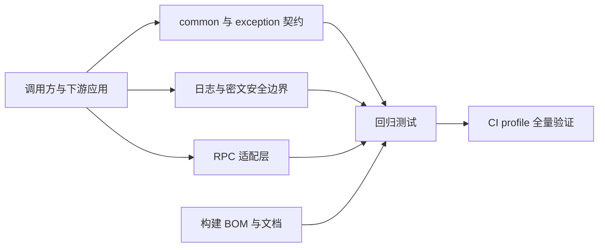

# 技术债修复 — Design（完整型）

## Context

技术债核对确认了参数响应、日志与密文安全、RPC 生命周期、构建默认值和文档可信度的系统性缺口。修复需跨 common、exception、log、rpc、dubbo、feign、nacos、mybatis、test、parent、bom 与文档模块，同时保持 v2.2.1 的兼容承诺。原敏感信息保护专项的 TD-002、TD-005、TD-006、TD-015、TD-016 与 TD-025 在此统一实现和验收，不另设实施计划。

## Goal

- 关闭下表列出的已确认技术债有效部分，并为每项补回归证据。
- 使 CI profile 的全量 Reactor 构建以零失败、零跳过通过。
- 保持旧密文、既有校验响应形状、旧 RPC SPI 和公开 Bean 的源码兼容。

## Non-Goal

- 不用全局 TTL 接管业务线程池的上下文传递。
- 不在 v2.2.1 删除公开 API 或强制所有现有密文迁移。
- 不为 Log4j2 等非 Logback 绑定实现第二套脱敏转换器。
- 不把 CI 预检中的报告数量下限改造成动态质量指标。

## Architecture

数据流分为三类：请求校验与分页数据在 common/exception 内完成边界检查；日志、Nacos 与 MyBatis 在输出或持久化前应用安全保护；RPC 适配器在协议边界捕获、恢复并释放一次调用的上下文。

## Interface Contract

| 编号 | 行为 | 文件与精确变更 | 兼容性 |
|------|------|----------------|--------|
| IC-1 | 校验响应 | `MimirExceptionHandler`：响应 data 直接使用字段名和默认消息；日志参数继续经 `LogSanitizer`。BindException 保留纯消息列表。 | 响应形状不变，恢复被错误删除的非 ASCII 文本。 |
| IC-2 | 分页与枚举 | `PageResult` 拒绝 null、负数和非正 pageSize；`PageRequest` 的 setter 或偏移计算始终先执行既有纠正；`CommonStatus`、`DeleteFlag`、`ErrorCode` 的未知输入返回 null。 | 构造请求继续容错；服务端非法分页值由隐式错误改为明确错误。 |
| IC-3 | 日志脱敏 | `SensitiveDataPattern` 覆盖 JSON、百分号编码键、私钥/访问密钥，移除公钥；`logback-spring.xml` 的 access/sql 使用 `%mask`；修正 converter 与 README 配置说明；修复并发测试的 Future 断言。 | 脱敏仍为 opt-in，新增规则只减少敏感泄露。 |
| IC-4 | 非 Logback 行为 | `LogMaskAutoConfiguration` 在 `ILoggerFactory` 非 `LoggerContext` 时跳过注册并 WARN。 | 不再启动失败。 |
| IC-5 | RPC 生命周期 | `RpcDubboFilter` 使用可容纳 null 的附件复制；异步完成回调临时建立并关闭 trace scope。`RpcDubboSupportHolder` 使用 volatile 快照，并声明单 Spring 上下文。 | 协议与 Hook API 不变。 |
| IC-6 | RPC SPI 与 Feign | `extract` 标注弃用，框架调用 `extractScope`；`RpcExecutionTemplate` 文档化为手工扩展点；Feign host 回退，非敏感多值头拼接，修正 lifecycle logger 类名。 | 旧 SPI 和 Bean 仍可用。 |
| IC-7 | MyBatis 密文 | `CryptoUtils.encrypt/decrypt` 新增 AAD 重载；仅非空白的应用级 `cryptoContext` 写入 `v2:` 密文，旧格式仍按旧路径解密。应用级绑定不承诺字段或记录级完整性。 | 只增 API，旧密文可读。 |
| IC-8 | MyBatis 清理 | `getFinalMapperPackages` 弃用并新增与实际扫描一致的查询方法；修正 README 包名；审计人异常降级为 system 并 WARN；SQL 文本和参数都脱敏。 | 旧方法保留。 |
| IC-9 | Nacos 安全 | 环境后处理器先检查 Nacos 类；遗留 ECB API 每次 WARN，文档明确仅用于迁移。 | Nacos 使用方默认行为不变。 |
| IC-10 | 测试 starter | 删除类路径 `application-test.yml` 中的数据库、副作用和固定应用名；合并日志断言工具；随机用户 ID 使用碰撞安全随机源；`TestAutoConfiguration` 弃用。 | 下游显式测试配置继续有效。 |
| IC-11 | 构建与发布 | 默认 verify 跳过签名，发布/显式 profile 签名；统一 formatter 版本，删除 BOM 孤儿属性，更新消费脚本版本与无效坐标。 | 发布签名仍保留。 |
| IC-12 | 仓库文档 | 添加 Apache-2.0 LICENSE，更新架构解析版本、README Maven 与示例版本，修复 generated/exec-plans 索引链接及技术债记录。 | 仅文档与元数据修正。 |
| IC-13 | MDC 工具 | 文档化 `put` 的空值忽略与 `putAll` 的整体替换语义，并以回归测试锁定。 | 不改变既有工具行为。 |

### 公开 API 与配置签名

| 契约 | 签名或属性 | 空值、错误与并发规则 |
|------|------------|----------------------|
| 分页结果 | `PageResult(List<T>, Long totalCount, Long pageIndex, Long pageSize)`；`setPageIndex(Long)`；`setPageSize(Long)`；`getOffset()` | PageResult 的 totalCount < 0、pageIndex < 1、pageSize < 1 或任一 null 时抛 `IllegalArgumentException`。请求 setter 与 getOffset 先纠正：pageIndex null/<1 为 1，pageSize null/<1 为 10、>1000 为 1000，非法排序方向为 ASC。 |
| 状态转换 | `CommonStatus fromCode(Integer)`、`DeleteFlag fromCode(Integer)`、`ErrorCode fromCode(String)` | 未知或 null 输入均返回 null；已有 `isXxx` 方法对 null 返回 false。 |
| AAD 密文 | `String encrypt(String plaintext, String key, String aad)`；`String decrypt(String ciphertext, String key, String aad)` | 写入时 aad 仅在 `StringUtils.hasText(aad)` 为 true 时启用；读取 `v2:` 而 aad 无文本、AAD 验证失败、Base64 无效或长度非法均抛 `IllegalStateException("Decryption failed", cause)`，绝不尝试旧格式。AAD 为 `"mimir-boot:v2:application:" + aad` 的 UTF-8 字节，保留原字符串，不 trim 或规范化。 |
| MyBatis 配置 | `String getEffectiveMapperPackages()`；`getFinalMapperPackages()` 标记 `@Deprecated(since="2.2.1", forRemoval=false)`；`String getCryptoContext()` / `void setCryptoContext(String cryptoContext)` | 新 Mapper 方法返回默认包、用户包与自动检测包的去重逗号列表；旧方法保留旧结果。`mimir.boot.mybatis.crypto-context` 仅在 `StringUtils.hasText` 时启用 v2 写入。它是稳定的应用标识；变更后既有 v2 数据不可由新值读取。 |
| MyBatis Handler | `AbstractCryptoTypeHandler(CryptoKeyProvider)`；`AbstractCryptoTypeHandler(CryptoKeyProvider, String cryptoContext)`；`StringCryptoTypeHandler`、`IntegerCryptoTypeHandler`、`LongCryptoTypeHandler` 同样保留单参并新增双参构造器 | 单参构造器委托双参 `(provider, null)`；自动配置的三个 Bean 传入启动时读取的 `properties.getCryptoContext()`。Handler 将 context 设为 `final`，手工单参实例继续写 v1，手工双参实例仅表达应用级 context；不依据 JDBC 参数、列名或 ThreadLocal 猜测字段/行身份。 |
| RPC Trace SPI | `void extract(RpcCallContext, Map<String,String>)`；`RpcTraceScope extractScope(RpcCallContext, Map<String,String>)` | 前者标记 `@Deprecated(since="2.2.1", forRemoval=false)`；框架适配器只调用后者并在同步/回调边界关闭 scope。 |
| MDC 工具 | `put(String, String)`、`putAll(Map<String,String>)`、`setContextMap(Map<String,String>)` | `put` 的 value 为 null 或空字符串时不写入；`putAll` 非空时整体替换当前上下文，null/空 Map 不修改上下文；`setContextMap` 维持 SLF4J 原生整体替换语义。 |
| 旧 Nacos 迁移 API | `com.yggdrasil.labs.nacos.crypto.ConfigCryptoUtils.encrypt(String plaintext, String key, String algorithm)` / `decrypt(String ciphertext, String key, String algorithm)`，以及委托它们的 `com.yggdrasil.labs.nacos.crypto.NacosEncryptUtil` 同签名方法 | 两个公开入口均保持 `@Deprecated(since="2.1.1", forRemoval=false)`；algorithm 为 `AES` 时分别调用 legacy ECB 路径并每次记录一条 WARN。加密结果为无 `v1:` 前缀的 Base64，解密接受同一旧格式；非 AES/GCM 输入仍按既有 IllegalArgumentException 规则失败。 |
| 发布签名 | `-Dgpg.skip=true|false` 与 `-P maven-central` | 普通 verify 默认 `gpg.skip=true`；发布命令显式 `-Dgpg.skip=false`，签名失败终止 deploy。 |

### Behavior、接口与验收追溯

| Spec Behavior | IC | 技术债 | 验收证据 |
|---------------|----|--------|----------|
| 校验与分页输入保持可诊断 | IC-1、IC-2 | TD-001、TD-021 | exception/common 单元测试：中文、形状、PageResult 拒绝、setter 默认/上限/offset。 |
| 未知状态不伪装为已知业务状态 | IC-2 | TD-022 | common 枚举单元测试。 |
| RPC 调用在异常输入与异步完成时保持可观测 | IC-5、IC-6 | TD-003、004、010、012、013、023 | rpc-core、dubbo、feign 单元与 injvm 集成测试。 |
| 结构化日志与专用日志不泄露敏感值 | IC-3、IC-4 | TD-002、005、006、007、008、009、025 | log 资源、单元与手工性能基准。 |
| 安全能力只在明确边界内生效 | IC-4、IC-9 | TD-009、015、025 | 非 Logback 与 Nacos 环境、迁移 API 单元测试。 |
| 字段密文可以选择绑定应用上下文 | IC-7、IC-8 | TD-016（部分缓解）、024、025 | mybatis 单元测试：v1/v2、AAD、SQL、审计与 Mapper API；字段/记录级完整性保留在技术债。 |
| 日志上下文工具维持明确的替换语义 | IC-13 | TD-022 | MdcUtil 单元测试和 Javadoc 文本校验。 |
| MyBatis 与测试扩展提供准确的默认边界 | IC-8、IC-10 | TD-011、014、024、026 | mybatis/starter-test 单元与资源测试。 |
| 构建、测试与文档给出一致的可执行信息 | IC-11、IC-12 | TD-017、018、019、020、027、028、029 | POM、BOM、README、链接与 CI 命令校验。 |

### 组件级数据流

| 入口 | 处理链 | 输出 | 失败或降级 | 测试归属 |
|------|--------|------|------------|----------|
| HTTP 校验 | Exception handler → response factory | 400 data | 日志清洗仅用于日志参数 | IC-1 |
| Dubbo Provider | attachments → trace scope → invocation → async callback scope | Hook 与日志 | null 附件不失败，回调 finally 关闭 scope | IC-5 |
| Feign Client | URI/headers → metadata → Hook | 可观测 metadata | host 三级回退，敏感头排除 | IC-6 |
| Nacos 环境 | 类路径门控 → ENC 检测 → 解密 | 覆盖属性源 | 非 Nacos 不处理，Nacos 密钥错误失败 | IC-9 |
| MyBatis 字段 | properties（启动时读取稳定 context）→ crypto configuration → TypeHandler（final context）→ CryptoUtils | v1 或 v2 密文 | AAD 不匹配、缺失、损坏或无效 v2 包均拒绝明文，不回退 v1 | IC-7 |
| SQL/访问日志 | 参数/字面量掩码 → appender `%mask` | 专用日志 | 非 Logback WARN 降级 | IC-3、IC-4 |

## Data Model

| 数据 | 字段/格式 | 约束 |
|------|-----------|------|
| v1 密文 | `Base64(iv || ciphertext || tag)` | 无前缀、无 AAD；始终可读以兼容存量。 |
| v2 密文 | `v2:` + `Base64(iv || ciphertext || tag)` | 写入时 `cryptoContext` 有文本；解密须使用相同 `mimir-boot:v2:application:` 命名空间的 UTF-8 AAD。 |
| 分页结果 | totalCount、pageIndex、pageSize | totalCount ≥ 0，pageIndex ≥ 1，pageSize ≥ 1。 |

`iv` 固定 12 字节，GCM tag 固定 128 位且位于 ciphertext 末尾；`cryptoContext` 由 `mimir.boot.mybatis.crypto-context` 绑定，空白值等同未配置。旧密文只能是 Base64，因 `:` 不在 Base64 字母表中，不会与 `v2:` 前缀混淆。解析到 `v2:` 后任何格式或认证失败均终止，不降级旧格式。前缀不携带明文上下文；v2 比旧格式额外占用 3 个字符，列长度需预留。应用级 context 不能检测同一应用、同一 context 内的跨字段或跨行替换。

## Non-Functional Requirements

| 维度 | 指标 |
|------|------|
| 性能 | 脱敏新增处理不进行全消息解码；JDK 17、1 KiB/3 敏感字段消息、10 万次预热后 100 万次测量的平均增量不超过 20µs。 |
| 安全 | v2 密文跨应用 context 解密成功率为 0；遗留 ECB 每次调用均产生 WARN；同 context 的字段/记录完整性不在本次声明范围。 |
| 可用性 | 非 Logback 与非 Nacos 应用启动不得因对应 starter 失败。 |
| 可观测性 | 异步 RPC 完成 Hook、审计降级和遗留加密均能在对应单元测试捕获到指定 WARN；非 Logback 每 ApplicationContext 最多一条 WARN。 |

## Error Handling

- v2 密文缺少 context、AAD 验证失败、Base64 无效或长度不足：抛出 `IllegalStateException("Decryption failed", cause)`，经 TypeHandler 包装为 `SystemException`，绝不返回明文；不区分密钥错误、密文损坏和 AAD 不匹配。
- RPC 附件为 null：保留 null 或安全转换，不中止调用。
- 日志框架不支持 `%mask`：WARN 后降级，不影响业务日志输出。
- Nacos 环境存在密文而密钥错误：在 Nacos 场景明确失败；非 Nacos 场景完全不处理。
- 审计人提供者异常：写 WARN 并以 `system` 继续写入。
- Feign URL 无 host：按 host、authority、原始 URL 回退；不拒绝实际请求。非敏感多值头按迭代顺序逗号连接。
- 发布签名：普通 verify 使用 `gpg.skip=true`；Maven Central deploy 强制 `gpg.skip=false`，签名命令的非零退出码直接失败。
- RPC carrier：null Map 视为无 carrier；空或无效 trace/request ID 不覆盖调用线程已有值之外的 scope 恢复规则；scope 关闭异常记录为 Hook 失败并不得覆盖原始业务异常。

## Alternatives Considered

| 决策 | 选择 | 未选方案及原因 |
|------|------|----------------|
| 异步 MDC | 仅框架回调临时 scope | TTL 会扩大 ThreadLocal 影响面且不能覆盖所有执行器。 |
| 旧 API | 弃用而非删除 | 主版本前删除会破坏下游源码兼容。 |
| 非 Logback | WARN 降级 | 多日志框架适配超出本次范围。 |
| 分页输入 | 请求纠正、结果拒绝 | 全面严格拒绝会改变既有请求容错契约。 |
| 密文完整性范围 | 应用级 AAD | 字段/记录身份自动绑定 | 当前 TypeHandler 调用点不具备可靠的字段或主键身份；手工多 String Handler 的注册和读写映射不对称也不能构成字段完整性保证。 |

## Testing Strategy

| 接口/行为 | 层级 | 验证方法 | 通过标准 |
|-----------|------|----------|----------|
| IC-1 | 单元 | MimirExceptionHandlerTest | 场景“中文”→默认消息原样；“绑定”→纯 message 列表。 |
| IC-2 | 单元 | PageResultTest、PageRequestTest、枚举测试 | 场景“结果无效”→IllegalArgumentException；“setter”→1/1000/ASC/0；“未知”→null。 |
| IC-3 | 单元/资源 | SensitiveDataConverterTest、logback 资源测试 | 场景“JSON/编码”→`****`；“公私钥”→仅私钥掩码；“专用日志”→无 secret。 |
| IC-4 | 单元 | LogMaskAutoConfigurationTest | 非 Logback 启动成功；同一 ApplicationContext WARN 计数为 1。 |
| IC-5 | 单元/集成 | RpcDubboFilterTest、EndToEndTest、HolderTest | null 附件不失败；before/终态/cleanup 各一次；完成回调恢复 MDC；volatile 快照文档。 |
| IC-6 | 单元 | MdcRpcTracerBridgeTest、RpcExecutionTemplateTest、RpcFeignClientTest | scope 恢复 MDC；弃用 API 编译；模板/ logger；host 回退与头值 `a,b`。 |
| IC-7 | 单元 | `CryptoUtilsTest`、三类 TypeHandler 测试、`MybatisPlusCryptoConfigurationTest` | v2 同应用 context 往返；异/空白 context、损坏 `v2:` 前缀/载荷均拒绝且不回退；自动配置与手工单/双参 Handler 分别写 v1/v2。 |
| IC-8 | 单元 | MybatisPropertiesTest、SQL/审计测试 | 有效 Mapper 集；旧 API 弃用；SQL 无 secret；system 与 WARN。 |
| IC-9 | 单元 | Nacos 环境后处理器与 ConfigCryptoUtils 测试 | 非 Nacos ENC 原样；Nacos 缺密钥失败；legacy encrypt/decrypt 各一条 WARN，固定旧密文样本可读。 |
| IC-10 | 单元/资源 | starter-test 资源与工具测试 | 无危险资源项；10000 ID 唯一；弃用类型可 Import。 |
| IC-11 | 构建 | 本地 verify、CI verify、Maven Central 发布配置测试 | 本地无 GPG 成功；CI 测试零跳过；发布 `gpg.skip=false` 签名失败可见。 |
| IC-12 | 文档/依赖 | 链接检查、Maven 解析、README 示例校验 | LICENSE、坐标、版本和目录链接均有效。 |
| IC-13 | 单元/文档 | MdcUtilTest、Javadoc 文本校验 | value null/空不写入；putAll 替换；null/空 Map 不修改；文档写明非合并。 |
| 性能证据 | 手工 | 在 JDK 17 下连续独立执行 3 次 `mise exec java@17 -- ./mvnw -pl :mimir-boot-starter-log -Dtest=SensitiveDataConverterBenchmarkTest test`，每次固定 1 KiB/3 敏感字段、预热 100000 次、测量 1000000 次 | 每次输出平均增量；以三次均值与最大值记录到 `docs/active/v2.2.1/release.md`，均值不超过 20µs；不纳入 CI gate。 |

## Milestones

| 阶段 | 产出 | 依赖 |
|------|------|------|
| Phase 1 | common、exception、日志安全 | 无 |
| Phase 2 | RPC、Nacos、MyBatis 安全 | Phase 1 的契约测试模式 |
| Phase 3 | 测试 starter、构建、BOM、文档 | Phase 1、Phase 2 的版本与配置结论 |
| Phase 4 | 全量 CI 验收与技术债闭环 | 全部阶段 |
