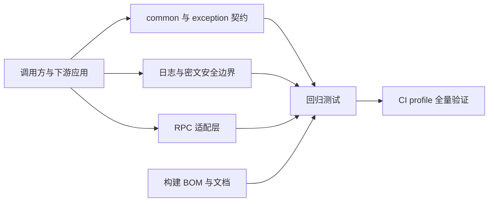

# 技术债修复 — Design（完整型）

## Context

技术债核对确认了参数响应、日志与密文安全、RPC 生命周期、构建默认值和文档可信度的系统性缺口。修复需跨 common、exception、log、rpc、dubbo、feign、nacos、mybatis、test、parent、bom 与文档模块，同时保持公开类型、方法和配置可绑定性的源码/二进制兼容。原敏感信息保护专项的 TD-002、TD-005、TD-006、TD-015、TD-016，以及 TD-025 中已由代码证实的 Nacos 部分在此统一实现和验收，不另设实施计划。兼容性复核打开的 DG-1、DG-2、DG-3 已全部选择 A 并固化为下述契约。

## Goal

- 关闭下表列出的已确认技术债有效部分，并为每项补回归证据；TD-013、TD-023 的旧公开扩展入口仅部分缓解并继续留在技术债追踪中。
- 使 CI profile 的全量 Reactor 构建以零失败、零跳过通过。
- 保持旧密文可读、既有校验响应形状、旧 RPC SPI 和公开 Bean 的源码/二进制兼容；所有语义或默认值调整均进入兼容矩阵和发布迁移说明。

## Non-Goal

- 不用全局 TTL 接管业务线程池的上下文传递。
- 不在 v2.2.1 删除公开 API 或强制所有现有密文迁移。
- 不为 Log4j2 等非 Logback 绑定实现第二套脱敏转换器。
- 不把 CI 预检中的报告数量下限改造成动态质量指标。

## Architecture

数据流分为三类：请求校验与分页数据在 common/exception 内完成边界检查；日志、Nacos 与 MyBatis 在输出或持久化前应用安全保护；RPC 适配器在协议边界捕获、恢复并释放一次调用的上下文。

## Interface Contract

| 编号 | 行为 | 文件与精确变更 | 兼容性 |
|------|------|----------------|--------|
| IC-1 | 校验响应 | `MimirExceptionHandler`：响应 data 直接使用字段名和默认消息；日志参数继续经 `LogSanitizer`。BindException 保留纯消息列表。 | 响应形状不变，恢复被错误删除的非 ASCII 文本。 |
| IC-2 | 分页与枚举 | `PageResult` 的构造器/工厂拒绝数值分页字段的 null、负数和非正 pageSize；`PageRequest` 的 setter 可暂存输入，仅 `getOffset()` 在计算前执行既有纠正；既有枚举转换保留 fallback 并新增 nullable API。 | 请求继续容错；服务端非法分页值由隐式错误改为明确错误；枚举 API 保持源码/二进制兼容。 |
| IC-3 | 日志脱敏 | `SensitiveDataPattern` 覆盖 JSON、百分号编码键、私钥/访问密钥，移除公钥；`logback-spring.xml` 的 access/sql 使用 `%mask`；已编译规则与 replacement 封装为单个不可变配置快照并通过原子引用发布，每次转换只读取一次快照，所有既有 converter 实例均能看到刷新；修正 README 与并发 Future 断言。 | 脱敏仍为 opt-in，配置刷新后对既有 converter 实例生效，新增规则只减少敏感泄露。 |
| IC-4 | 非 Logback 行为 | `LogMaskAutoConfiguration` 在 `ILoggerFactory` 非 `LoggerContext` 时跳过注册并 WARN。 | 不再启动失败。 |
| IC-5 | RPC 生命周期 | `RpcDubboFilter` 使用可容纳 null 的附件复制；异步完成回调临时建立并关闭 trace scope。`RpcDubboSupportHolder` 以单个 immutable snapshot 经 volatile 引用原子发布，并声明单 Spring 上下文。 | 协议与 Hook API 不变；读取方不会观察到跨代依赖组合。 |
| IC-6 | RPC SPI 与 Feign | `extract` 标注弃用，框架调用 `extractScope`；默认 `extractScope` 继续委托旧 `extract` 仅用于加载兼容，不虚构未知上下文的恢复保证；`RpcExecutionTemplate` 文档化为手工扩展点；框架内部只使用 `RpcHookChain.open/openAsync`，四个旧直调方法继续弃用但保留；Feign host 回退，非敏感多值头拼接，修正 lifecycle logger 类名。 | 旧 SPI、Bean 和 Hook 直调方法仍可用；TD-013 与 TD-023 的旧入口残余债务继续保留。 |
| IC-7 | MyBatis 密文 | `CryptoUtils.encrypt/decrypt` 新增 AAD 重载；非空白的应用级 `cryptoContext` 提供 v2 读能力，默认关闭的独立写开关决定是否写入 `v2:`，旧格式仍按旧路径解密。应用级绑定不承诺字段或记录级完整性。 | 只增 API，旧密文可读；写入 v2 后不得回退到不支持 v2 的版本。 |
| IC-8 | MyBatis 清理 | `getFinalMapperPackages` 弃用并新增与实际扫描一致的查询方法；`MybatisPlusAutoConfiguration.getFinalMapperPackagesWithAutoDetection()` 改为以 `properties.getEffectiveMapperPackages()` 作为扫描输入，确保 `mapperScannerConfigurer` 的实际路径使用新契约；修正 README 包名；审计人异常降级为 system 并 WARN；SQL 文本和参数都脱敏。 | 旧方法保留；实际扫描与查询结果使用同一有效包集合。 |
| IC-9 | Nacos 安全 | 环境后处理器仅在 `mimir.boot.nacos.encrypt` 或旧前缀已绑定时处理配置；未配置任一前缀时直接返回。遗留 ECB API 的最低实现层 `ConfigCryptoUtils` 每次公开调用记录一条 WARN，`NacosEncryptUtil` 只委托且不得重复告警；文档明确该 API 仅用于迁移。 | 仅配置解密密钥的既有使用方仍按默认 enabled=true 解密；无解密配置的应用不再误触发；每次顶层调用总计恰好一条 WARN。 |
| IC-10 | 测试 starter | 删除类路径 `application-test.yml` 中的数据库、副作用和固定应用名；合并日志断言工具；随机用户 ID 使用碰撞安全随机源；`TestAutoConfiguration` 弃用。 | 下游显式测试配置继续有效；依赖隐式默认值的项目需按迁移说明补显式配置。 |
| IC-11 | 构建与发布 | 默认 verify 跳过签名，发布/显式 profile 签名；根/parent 的 google-java-format 固定 1.23.0；删除 BOM 孤儿属性；RocketMQ 固定 `org.apache.rocketmq:rocketmq-spring-boot-starter:2.3.6`，Elasticsearch 改为 `co.elastic.clients:elasticsearch-java:8.11.0`；consumer 从根 POM 动态读取 revision。测试报告与 JaCoCo 门禁分离，且只消费紧邻 clean 构建的报告。 | 发布签名仍保留；consumer 不再硬编码版本或依赖用户本地已有快照。 |
| IC-12 | 仓库文档 | 添加 Apache-2.0 LICENSE，更新架构解析版本、README Maven 与示例版本，修复 generated/exec-plans 索引链接及技术债记录；先由 `docs/design-docs/arch-technical-debt-remediation.md` 架构 RFC 明确长期约束同步边界并取得批准，再同步受影响 Starter README、产品能力说明、`ARCHITECTURE.md`、`docs/SECURITY.md`、`docs/RELIABILITY.md`、`docs/design-docs/module-boundaries.md` 和 release 迁移记录；同步和验证完成后将 RFC 与设计索引由 draft 更新为 verified。 | 仅文档与元数据修正；长期文档只在 RFC 获批且实现事实落地后更新，不借修订改变依赖方向或公共发布策略；验证失败时 RFC 保持 draft。 |
| IC-13 | MDC 工具 | 文档化 `put` 的空值忽略与 `putAll` 的整体替换语义，并以回归测试锁定。 | 不改变既有工具行为。 |

### 公开 API 与配置签名

| 契约 | 签名或属性 | 空值、错误与并发规则 |
|------|------------|----------------------|
| 分页结果 | `public PageResult()`；`public PageResult(List<T> data, Long totalCount, Long pageIndex, Long pageSize)`；`public static <T extends Serializable> PageResult<T> of(List<T> data, Long totalCount, Long pageIndex, Long pageSize)`；`public static <T extends Serializable> PageResult<T> empty(Long pageIndex, Long pageSize)`；`public static <T extends Serializable> PageResult<T> empty(PageRequest pageRequest)` | 有参数构造器/工厂收到 totalCount < 0、pageIndex < 1、pageSize < 1，或 totalCount/pageIndex/pageSize 任一为 null 时抛 `IllegalArgumentException`；`data` 可按既有契约为 null。既有无参构造和 JavaBean setter 保持兼容，但不纳入“完整分页结果始终满足不变量”的声明；内部生产路径只使用已校验构造器/工厂。 |
| 分页请求 | `public void setPageIndex(Long pageIndex)`；`public void setPageSize(Long pageSize)`；`public void setOrderDirection(String orderDirection)`；`public Long getOffset()` | setter 可暂存输入；`getOffset()` 在计算前调用 `validateAndCorrect()`：pageIndex null/<1 为 1，pageSize null/<1 为 10、>1000 为 1000，非法排序方向为 ASC。 |
| 状态转换 | `CommonStatus`: `public static CommonStatus fromCode(Integer code)`、新增 `public static CommonStatus fromCodeOrNull(Integer code)`；`DeleteFlag`: `public static DeleteFlag fromCode(Integer code)`、新增 `public static DeleteFlag fromCodeOrNull(Integer code)`；`ErrorCode`: `public static ErrorCode fromCode(String code)`、新增 `public static ErrorCode fromCodeOrNull(String code)` | 既有方法的未知/null fallback 分别保持 `DISABLED`、`NOT_DELETED`、`SYSTEM_ERROR`，新增方法返回 null；已有 `isXxx` 方法对 null 均返回 false。 |
| AAD 密文 | `CryptoUtils`: `public static String encrypt(String plaintext, String key, String aad)`；`public static String decrypt(String ciphertext, String key, String aad)` | 写入时 aad 仅在 `StringUtils.hasText(aad)` 为 true 时启用；读取 `v2:` 而 aad 无文本、AAD 验证失败、Base64 无效或长度非法均抛 `IllegalStateException("Decryption failed", cause)`，绝不尝试旧格式。AAD 为 `"mimir-boot:v2:application:" + aad` 的 UTF-8 字节，保留原字符串，不 trim 或规范化。 |
| MyBatis 配置 | `public String getEffectiveMapperPackages()`；`public String getFinalMapperPackages()` 标记 `@Deprecated(since="2.2.1", forRemoval=false)`；`public String getCryptoContext()`；`public void setCryptoContext(String cryptoContext)`；新增 `public boolean isCryptoV2WriteEnabled()`；`public void setCryptoV2WriteEnabled(boolean enabled)` | 新 Mapper 方法返回默认包、用户包与自动检测包的去重逗号列表；旧方法保留旧结果。`mimir.boot.mybatis.crypto-context` 是稳定的应用标识，非空白时提供 v2 读取能力；`mimir.boot.mybatis.crypto-v2-write-enabled` 默认 false，仅在 context 有文本且开关为 true 时写 v2。context 变更后既有 v2 数据不可由新值读取。 |
| MyBatis Handler | `protected AbstractCryptoTypeHandler(CryptoKeyProvider keyProvider)`；`protected AbstractCryptoTypeHandler(CryptoKeyProvider keyProvider, String cryptoContext)`；`protected AbstractCryptoTypeHandler(CryptoKeyProvider keyProvider, String cryptoContext, boolean cryptoV2WriteEnabled)`；`public StringCryptoTypeHandler(CryptoKeyProvider keyProvider)`；`public StringCryptoTypeHandler(CryptoKeyProvider keyProvider, String cryptoContext)`；`public StringCryptoTypeHandler(CryptoKeyProvider keyProvider, String cryptoContext, boolean cryptoV2WriteEnabled)`；`public IntegerCryptoTypeHandler(CryptoKeyProvider keyProvider)`；`public IntegerCryptoTypeHandler(CryptoKeyProvider keyProvider, String cryptoContext)`；`public IntegerCryptoTypeHandler(CryptoKeyProvider keyProvider, String cryptoContext, boolean cryptoV2WriteEnabled)`；`public LongCryptoTypeHandler(CryptoKeyProvider keyProvider)`；`public LongCryptoTypeHandler(CryptoKeyProvider keyProvider, String cryptoContext)`；`public LongCryptoTypeHandler(CryptoKeyProvider keyProvider, String cryptoContext, boolean cryptoV2WriteEnabled)` | 单参构造器继续写 v1且只能读 v1；双参构造器使用 context 获得 v2 读取能力但继续写 v1；只有三参构造器显式传入 `cryptoV2WriteEnabled=true` 才写 v2。自动配置的三个 Bean 使用三参构造器；Handler 将 context 与开关设为 `final`，不依据 JDBC 参数、列名或 ThreadLocal 猜测字段/行身份。 |
| 日志配置快照 | `private record MaskConfigurationSnapshot(List<Pattern> patterns, String replacement)`；`private static final AtomicReference<MaskConfigurationSnapshot> configuration`；`private static MaskConfigurationSnapshot currentConfiguration()`；新增 `public static void publishConfiguration(List<String> enabledPatternNames, List<String> customPatternExpressions, String replacement)`；保留 `public static void reloadConfig()` | 发布入口先完整编译不可变规则列表并解析 replacement，成功后一次原子替换；编译失败的单条规则按既有 WARN 语义忽略。`convert`/`maskSensitiveData` 每次调用只执行一次 `currentConfiguration()` 读取并在整次替换中复用同一快照；`reloadConfig()` 仅使快照失效，保持既有兼容入口。 |
| Dubbo Holder 快照 | `RpcDubboSupportHolder` 嵌套类型：`public record Snapshot(RpcHookChain hookChain, RpcTracerBridge tracerBridge, DubboProperties properties)`；新增 `public static RpcDubboSupportHolder.Snapshot current()`；保留 `public static void set(RpcHookChain hookChain, RpcTracerBridge tracerBridge, DubboProperties properties)`、`public static RpcDubboSupportHolder getInstance()`、`public RpcHookChain getHookChain()`、`public RpcTracerBridge getTracerBridge()`、`public DubboProperties getProperties()` | `set` 只构造并一次 volatile 发布完整 `Snapshot`；`RpcDubboFilter.invoke` 在入口只调用一次 `current()` 并从同一对象读取三个依赖。旧 holder/getter 保留二进制兼容，但框架内部不得用多次 getter 组成一次调用的依赖束。 |
| RPC Trace SPI | `public void extract(RpcCallContext context, Map<String, String> carrier)`；`public default RpcTraceScope extractScope(RpcCallContext context, Map<String, String> carrier)` | 前者标记 `@Deprecated(since="2.2.1", forRemoval=false)`；框架适配器只调用后者并在同步/回调边界关闭 scope。仅实现旧 `extract` 的 Bridge 通过默认方法继续可用，但 noop scope 无法恢复其管理的未知上下文，因此 TD-013 继续保留。 |
| RPC Hook 兼容入口 | `public RpcHookInvocation open(RpcCallContext context)`；`public RpcAsyncHookInvocation openAsync(RpcCallContext context)`；保留 deprecated `public void before(RpcCallContext context)`、`public void after(RpcCallContext context, RpcCallResult result)`、`public void onError(RpcCallContext context, RpcCallResult result)`、`public void cleanup(RpcCallContext context)` | 框架内部只允许 `open/openAsync`。四个旧方法保持既有直调语义和二进制兼容，因缺少调用句柄不能获得完整状态/异常隔离保证，TD-023 继续保留到破坏性版本。 |
| MDC 工具 | `MdcUtil`: `public static void put(String key, String value)`；`public static void putAll(Map<String, String> context)`；`public static void setContextMap(Map<String, String> context)` | `put` 的 value 为 null 或空字符串时不写入；`putAll` 非空时整体替换当前上下文，null/空 Map 不修改上下文；`setContextMap` 维持 SLF4J 原生整体替换语义。 |
| 旧 Nacos 迁移 API | `com.yggdrasil.labs.nacos.crypto.ConfigCryptoUtils`: `public static String encrypt(String plaintext, String key, String algorithm)`、`public static String decrypt(String ciphertext, String key, String algorithm)`；`com.yggdrasil.labs.nacos.util.NacosEncryptUtil`: `public static String encrypt(String plaintext, String key, String algorithm)`、`public static String decrypt(String ciphertext, String key, String algorithm)` | 四个公开入口均保持 `@Deprecated(since="2.1.1", forRemoval=false)`；algorithm 为 `AES` 时由最低实现层 `ConfigCryptoUtils` 调用 legacy ECB 路径并记录一条 WARN，`NacosEncryptUtil` 不额外记录，因此从任一公开入口发起的一次 encrypt/decrypt 总计恰好一条 WARN。加密结果为无 `v1:` 前缀的 Base64，解密接受同一旧格式；非 AES/GCM 输入仍按既有 IllegalArgumentException 规则失败。 |
| 发布签名与构建门禁 | `-Dgpg.skip=true/false` 与 `-P maven-central`；`verify_test_reports()`；`verify_jacoco_reports()` | 普通 clean verify 默认 `gpg.skip=true`，只调用测试 XML 门禁；CI 以独立 clean 构建同时调用测试与 JaCoCo 门禁；发布命令显式 `-Dgpg.skip=false`，签名失败终止 deploy。 |

### 修改入口的完整签名

下列入口的签名、可见性和异常声明是实施约束；未列出的既有公开方法保持原签名和语义。

| 组件 | 完整签名 | 变更边界 |
|------|----------|----------|
| 校验异常入口 | `public Object handleMethodArgumentNotValidException(MethodArgumentNotValidException e, HttpServletRequest request)`；`public Object handleBindException(BindException e, HttpServletRequest request)` | 只调整响应 data 的消息来源；注解、返回类型和日志清洗边界不变。 |
| 日志转换与刷新 | `public String convert(ILoggingEvent event)`；`public String maskSensitiveData(String message)`；`public static void publishConfiguration(List<String> enabledPatternNames, List<String> customPatternExpressions, String replacement)`；`public static void reloadConfig()`；`public void transferConfig(ContextRefreshedEvent event)` | `convert` 与 `maskSensitiveData` 每次只读取一次共享快照；刷新入口原子发布；既有 reload 继续可调用。 |
| RPC 核心与适配器 | `public Result invoke(Invoker<?> invoker, Invocation invocation) throws RpcException`；`public Response execute(Request request, Request.Options options) throws IOException`；`public void execute(RpcCallContext context, Runnable runnable)`；`public <T> T execute(RpcCallContext context, Callable<T> callable)` | Filter/Client 签名不变；`RpcExecutionTemplate` 继续是手工扩展点，不替换协议适配器。 |
| Nacos 环境与迁移入口 | `public void postProcessEnvironment(ConfigurableEnvironment environment, SpringApplication application)`；`public void process(ConfigurableEnvironment environment)`；`public static String encrypt(String plaintext, String key, String algorithm)`；`public static String decrypt(String ciphertext, String key, String algorithm)` | 环境入口增加配置前缀门控；四个遗留迁移入口签名与弃用注解不变。 |
| MyBatis 自动配置 | `public MapperScannerConfigurer mapperScannerConfigurer(MybatisProperties properties)`；保留 `public StringCryptoTypeHandler stringCryptoTypeHandler(CryptoKeyProvider keyProvider)`、`public LongCryptoTypeHandler longCryptoTypeHandler(CryptoKeyProvider keyProvider)`、`public IntegerCryptoTypeHandler integerCryptoTypeHandler(CryptoKeyProvider keyProvider)`；新增 `@Bean("stringCryptoTypeHandler") public StringCryptoTypeHandler configuredStringCryptoTypeHandler(CryptoKeyProvider keyProvider, MybatisProperties properties)`、`@Bean("longCryptoTypeHandler") public LongCryptoTypeHandler configuredLongCryptoTypeHandler(CryptoKeyProvider keyProvider, MybatisProperties properties)`、`@Bean("integerCryptoTypeHandler") public IntegerCryptoTypeHandler configuredIntegerCryptoTypeHandler(CryptoKeyProvider keyProvider, MybatisProperties properties)` | scanner 使用有效包集合。三个旧单参方法保留可调用并返回 v1-only Handler，但移除其 `@Bean` 注解；三个新方法显式复用原 Bean name，从同一 `MybatisProperties` 读取 context 与写开关并调用三参构造器，因此公开方法以及 Bean 名称/类型均保持兼容。 |
| MyBatis SQL 与审计入口 | `public void beforePrepare(StatementHandler sh, Connection connection, Integer transactionTimeout)`；`public static Object maskParams(Object params)`；`public void insertFill(MetaObject metaObject)`；`public void updateFill(MetaObject metaObject)` | 方法签名不变；SQL 文本和参数都脱敏，审计人异常时 WARN 并回退 `system`。 |
| 测试扩展入口 | `@Deprecated(since="2.2.1", forRemoval=false) public class TestAutoConfiguration`；`public static String randomUserId()` | 类型只弃用不删除；随机 ID 实现更换但返回类型不变。 |

### Behavior、接口与验收追溯

| Spec Behavior | IC | 技术债 | 验收证据 |
|---------------|----|--------|----------|
| 校验与分页输入保持可诊断 | IC-1、IC-2 | TD-001、TD-021 | exception/common 单元测试：中文、错误项格式、PageResult 拒绝、setter 默认/上限/offset。 |
| 未知状态不伪装为已知业务状态 | IC-2 | TD-022 | common 枚举单元测试。 |
| RPC 调用在异常输入与异步完成时保持可观测 | IC-5、IC-6 | TD-003、TD-004、TD-010、TD-012、TD-013、TD-023 | rpc-core、dubbo、feign 单元与 injvm 集成测试；TD-013 只缓解内置 Bridge，TD-023 只修复框架内部调用、Feign 与 logger，两个旧公开扩展入口残余债务均保留。 |
| 结构化日志与专用日志不泄露敏感值 | IC-3、IC-4 | TD-002、TD-005、TD-006、TD-007、TD-008、TD-009 | log 资源、配置生命周期测试、单元与手工性能基准。 |
| 安全能力只在明确边界内生效 | IC-4、IC-9 | TD-009、TD-015、TD-025 | 非 Logback 与 Nacos 环境、迁移 API 单元测试。 |
| 字段密文可以选择绑定应用上下文 | IC-7、IC-8 | TD-016（部分缓解）、TD-024 | mybatis 单元测试：v1/v2、AAD、SQL、审计与 Mapper API；字段/记录级完整性保留在技术债。 |
| 日志上下文工具维持明确的替换语义 | IC-13 | TD-022 | MdcUtil 单元测试和 Javadoc 文本校验。 |
| 持久化与测试扩展提供准确的默认边界 | IC-8、IC-10 | TD-011、TD-014、TD-024、TD-026 | mybatis/starter-test 单元、资源与下游显式配置消费测试。 |
| 构建、测试与文档给出一致的可执行信息 | IC-11、IC-12 | TD-017、TD-018、TD-019、TD-020、TD-027、TD-028、TD-029 | POM、BOM、README、链接与 CI 命令校验。 |

### 组件级数据流

| 入口 | 处理链 | 输出 | 失败或降级 | 测试归属 |
|------|--------|------|------------|----------|
| HTTP 校验 | Exception handler → response factory | 400 data | 日志清洗仅用于日志参数 | IC-1 |
| Dubbo Provider | attachments → trace scope → invocation → async callback scope | Hook 与日志 | null 附件不失败，回调 finally 关闭 scope | IC-5 |
| Feign Client | URI/headers → metadata → Hook | 可观测 metadata | host 三级回退，敏感头排除 | IC-6 |
| Nacos 环境 | 解密配置前缀门控 → ENC 检测 → 解密 | 覆盖属性源 | 无解密配置不处理，已配置场景的密钥错误明确失败 | IC-9 |
| MyBatis 字段 | properties（启动时读取稳定 context 与 v2 写入开关）→ crypto configuration → TypeHandler（final 配置）→ CryptoUtils | v1 或 v2 密文 | AAD 不匹配、缺失、损坏或无效 v2 包均拒绝明文，不回退 v1；禁止未完成全实例读能力升级时写 v2 | IC-7 |
| SQL/访问日志 | 参数/字面量掩码 → appender `%mask` | 专用日志 | 非 Logback WARN 降级 | IC-3、IC-4 |

## Data Model

| 数据 | 字段/格式 | 约束 |
|------|-----------|------|
| v1 密文 | `Base64(iv + ciphertext + tag)` | 无前缀、无 AAD；始终可读以兼容存量。 |
| v2 密文 | `v2:` + `Base64(iv + ciphertext + tag)` | 写入时 `cryptoContext` 有文本且 v2 写入开关为 true；解密须使用相同 `mimir-boot:v2:application:` 命名空间的 UTF-8 AAD。 |
| 通过已校验构造器/工厂创建的分页结果 | totalCount、pageIndex、pageSize | totalCount ≥ 0，pageIndex ≥ 1，pageSize ≥ 1；无参 JavaBean 填充路径不宣称持续满足该不变量。 |
| 日志配置快照 | `patterns: List<Pattern>`、`replacement: String` | `patterns` 为不可变列表，快照非 null；初始快照由默认规则构建。单条自定义规则编译失败只忽略该规则，完整新快照构建成功后才替换原引用。 |
| Dubbo 依赖快照 | `hookChain: RpcHookChain`、`tracerBridge: RpcTracerBridge`、`properties: DubboProperties` | volatile snapshot 引用初始为 null；`set` 把当次传入的三项（包括兼容调用传入的 null）封装为一个 Snapshot 并一次发布。Filter 只读一次引用；引用为 null 或任一组件为 null 时整体直通，绝不分别读取三代字段。 |
| 密文发布实例能力 | `instanceId: String`、`v2Readable: boolean`、`cryptoContext: String`、`declaredColumnCapacity: int` | fixture 只在所有实例 `v2Readable=true`、context 完全相同且容量不小于固定 v2 样本长度时允许开写；回退目标同样必须支持 v2 且 context 相同。fixture 不进入生产 API。 |

`iv` 固定 12 字节，GCM tag 固定 128 位且位于 ciphertext 末尾；`cryptoContext` 由 `mimir.boot.mybatis.crypto-context` 绑定，空白值等同未配置。旧密文只能是 Base64，因 `:` 不在 Base64 字母表中，不会与 `v2:` 前缀混淆。解析到 `v2:` 后任何格式或认证失败均终止，不降级旧格式。前缀不携带明文上下文；v2 比旧格式额外占用 3 个字符，列长度需预留。应用级 context 不能检测同一应用、同一 context 内的跨字段或跨行替换。

## Compatibility and Rollout

| 变更 | 源码/二进制兼容 | 可观察行为 | 发布与回退要求 |
|------|-----------------|------------|----------------|
| 枚举未知码 | 既有方法签名和语义保持不变，只增 API | 既有方法保留 fallback，新增 nullable API 返回 null | release 说明新增 API；下游无需迁移既有调用。 |
| 测试 starter 默认资源 | 类型与配置绑定保持不变 | 不再隐式注入 create-drop、show-sql 和固定应用名 | release 迁移说明给出下游显式测试配置；消费测试验证不再依赖类路径副作用。 |
| MyBatis v2 密文 | 旧 API 与 v1 读取保持可用 | 独立开关控制 v2 写入，非空 context 只提供 v2 读取能力 | 先让所有实例在同一 context 下读 v2、写 v1，再统一开启写开关。写入 v2 后只允许回退到支持 v2 且使用相同 context 的版本。 |
| RPC 旧 extract SPI | 旧实现继续加载和调用 | 默认 noop scope 不保证恢复自定义 Bridge 的未知上下文 | TD-013 保留；彻底替换 SPI 推迟到破坏性版本/RFC。 |

### Decision Log

| 编号 | 决定 | 状态 | 影响 |
|------|------|------|------|
| DG-1 | 保留既有 `fromCode` fallback，新增三个 `fromCodeOrNull` | 已确认（A） | 避免补丁版本行为破坏，新增 API 只增不改。 |
| DG-2 | 接受 v2.2.1 的部分修复并保留 TD-013 | 已确认（A） | 内置 Bridge 获得 scope 恢复；旧自定义 Bridge 只保证加载兼容。 |
| DG-3 | 新增默认 false 的 v2 写入开关 | 已确认（A） | 支持全实例先读 v2/写 v1，再零停机统一开启写入。 |
| IG-1 | 单参 Handler 只读写 v1，双参读 v2/写 v1，三参 true 才写 v2 | 已固化 | 所有构造入口都服从 DG-3，不因仅提供 context 提前开写。 |
| IG-2 | formatter=1.23.0、RocketMQ=2.3.6、consumer 动态读取 revision | 已固化 | 消除 T7 二次选型与硬编码版本债务。 |
| IG-3 | 保留 RpcHookChain 四个弃用直调方法，框架内部只使用调用级 Invocation | 已固化 | 避免补丁版本删 API 或引入全局 context 状态；TD-023 残余项继续跟踪。 |

三个 DG 决策均由用户于 2026-08-24 确认；IG-1、IG-2、IG-3 是终审后对已确认方向的兼容性收敛与机械化实施约束。Spec、Design、实施计划、技术债追踪和 release 迁移记录采用上述口径。

## Non-Functional Requirements

| 维度 | 指标 |
|------|------|
| 性能 | 脱敏新增处理不进行全消息解码。基准在同一 JVM 进程内对同一固定 1 KiB 消息比较“无脱敏规则”的基线路径与“启用 3 个敏感字段规则”的候选路径；先各预热 100000 次，再各测量 1000000 次，以 `candidate average ns/op - baseline average ns/op` 作为单次有符号增量。JDK 17 下连续独立运行 3 次，不剔除离群值，三次算术平均值不超过 20µs，并记录三次原值与最大值。 |
| 安全 | v2 密文跨应用 context 解密成功率为 0；遗留 ECB 每次调用均产生 WARN；同 context 的字段/记录完整性不在本次声明范围。 |
| 可用性 | 非 Logback 应用和未配置 Nacos 解密前缀的应用启动不得因对应 starter 失败。 |
| 可观测性 | 异步 RPC 完成 Hook、审计降级和遗留加密均能在对应单元测试捕获到指定 WARN；非 Logback 每 ApplicationContext 最多一条 WARN。 |

## Error Handling

- v2 密文缺少 context、AAD 验证失败、Base64 无效或长度不足：抛出 `IllegalStateException("Decryption failed", cause)`，经 TypeHandler 包装为 `SystemException`，绝不返回明文；不区分密钥错误、密文损坏和 AAD 不匹配。
- RPC 附件为 null：保留 null 或安全转换，不中止调用。
- 日志框架不支持 `%mask`：WARN 后降级，不影响业务日志输出。
- 已配置 Nacos 解密前缀且存在密文，但密钥缺失或错误：明确失败；未配置当前或旧解密前缀时完全不处理。
- 审计人提供者异常：写 WARN 并以 `system` 继续写入。
- Feign URL 无 host：按 host、authority、原始 URL 回退；不拒绝实际请求。非敏感多值头按迭代顺序逗号连接。
- 发布签名：普通 verify 使用 `gpg.skip=true`；Maven Central deploy 强制 `gpg.skip=false`，签名命令的非零退出码直接失败。
- RPC carrier：null Map 视为无 carrier；空或无效 trace/request ID 不覆盖调用线程已有值之外的 scope 恢复规则。scope 关闭失败统一 WARN：同步成功时不得把成功结果改成失败；同步业务失败时，仅当关闭异常不是原异常同一实例才作为 suppressed 附加，随后继续抛原异常；同一实例时禁止 self-suppression。异步完成时只记录 WARN，不改变完成结果。任一路径的终态 Hook 与 cleanup 仍各执行一次。
- v2 密文发布：任一仍读写同一数据集的实例不支持 v2 时禁止开始写 v2；context 可先部署但写开关必须保持 false，完成全实例读能力升级和列长度预检后才能开启；写入 v2 后回退到旧二进制属于不受支持操作，发布检查必须提前阻止。

## Alternatives Considered

| 决策 | 选择 | 未选方案及原因 |
|------|------|----------------|
| 异步 MDC | 仅框架回调临时 scope | TTL 会扩大 ThreadLocal 影响面且不能覆盖所有执行器。 |
| 旧 API | 弃用而非删除 | 主版本前删除会破坏下游源码兼容。 |
| 非 Logback | WARN 降级 | 多日志框架适配超出本次范围。 |
| 分页输入 | 请求纠正、结果拒绝 | 全面严格拒绝会改变既有请求容错契约。 |
| 密文完整性范围 | 应用级 AAD | 当前 TypeHandler 调用点不具备可靠的字段或主键身份；字段/记录身份自动绑定与迁移留作后续设计。 |

## Testing Strategy

| 接口/行为 | 层级 | 验证方法 | 通过标准 |
|-----------|------|----------|----------|
| IC-1 | 单元 | MimirExceptionHandlerTest | 场景“中文”→默认消息原样且日志捕获仍不含原始恶意参数；“绑定”→纯 message 列表。 |
| IC-2 | 单元 | PageResultTest、PageRequestTest、枚举测试 | 场景“结果无效”→IllegalArgumentException；请求“setter”→1/1000/ASC/0；已知 1/0 返回原枚举且对应 `isXxx` 为 true；未知值的全部已知态 predicate 为 false；既有枚举 API 保留 fallback，nullable API 对未知/null 返回 null。 |
| IC-3 | 单元/资源/生命周期 | SensitiveDataConverterTest、LogMaskAutoConfigurationTest、logback 资源测试 | 两个已初始化 converter 先缓存默认快照，再并发发布 Spring 配置；后续均使用新规则与 replacement，更新期间每次转换只观察到完整旧快照或完整新快照；“JSON/编码”→`****`；“公私钥”→仅私钥掩码；“专用日志”→无 secret。 |
| IC-4 | 单元 | LogMaskAutoConfigurationTest | 非 Logback 启动成功；同一 ApplicationContext WARN 计数为 1。 |
| IC-5 | 单元/集成 | RpcDubboFilterTest、EndToEndTest、HolderTest | null 附件不失败；before/终态/cleanup 各一次；完成回调恢复 MDC；并发读写只观察到完整的同代 Holder snapshot；throwing-scope fixture 覆盖同步成功、业务失败、异步完成及关闭重抛主异常同一实例，证明关闭失败只 WARN、禁止 self-suppression，原返回值/原异常/异步结果不被替换。 |
| IC-6 | 单元 | MdcRpcTracerBridgeTest、RpcExecutionTemplateTest、RpcFeignClientTest、legacy Bridge 兼容测试 | 内置 scope 恢复 MDC；仅实现旧 extract 的 Bridge 可加载但默认 scope 不虚构恢复保证；弃用 API 编译；模板/logger；host 回退与头值 `a,b`。 |
| IC-7 | 单元/发布检查 | `CryptoUtilsTest`、三类 TypeHandler 测试、`MybatisPlusCryptoConfigurationTest`、`MybatisCryptoRolloutContractTest`、release 迁移检查 | 固定 v1 样本始终可读；v2 同应用 context 往返；异/空白 context、损坏 `v2:` 前缀/载荷均拒绝且不回退；同一 context 内跨字段/跨记录交换仍可解密，作为 TD-016 的可执行边界证据；单参只读写 v1，双参可读 v2/写 v1，三参在开关 false 时读 v2/写 v1、true 时写 v2且无 context 时拒绝启用；自动配置测试同时证明旧公开单参方法仍可调用、原三个 Bean name/type 不变；rollout fixture 明确断言所有实例已具备 v2 读能力且声明列容量不小于固定 v2 样本长度后才允许开写；release 记录包含切换顺序和回退下限。 |
| IC-8 | 单元 | MybatisPropertiesTest、MybatisPlusAutoConfigurationTest、SQL/审计测试 | 有效 Mapper 集与 `mapperScannerConfigurer` 实际扫描输入一致；旧 API 弃用；SQL 无 secret；system 与 WARN。 |
| IC-9 | 单元 | Nacos 环境后处理器、ConfigCryptoUtils 与 NacosEncryptUtil 测试 | 未绑定当前/旧解密前缀时 ENC 原样；已显式启用但缺密钥时失败；仅配置 key 时保持默认解密；从工具类或委托类发起的 legacy encrypt/decrypt 每次总计恰好一条 WARN，固定旧密文样本可读。 |
| IC-10 | 单元/资源/消费 | starter-test 资源与工具测试、最小下游消费 fixture、`DeprecatedApiCompilationTest` | 无危险资源项；未提供显式数据库策略时 starter 不注入默认值；下游显式测试配置可生效；10000 ID 唯一；JDK `JavaCompiler` 启用 `-Xlint:deprecation` 后旧类型编译成功且产生指向该类型的弃用诊断。 |
| IC-11 | 构建/隔离消费 | Java 17 下的普通 clean verify、CI clean verify、`scripts/verify-build-model.py`、`scripts/test-suite-consumer.sh`、`scripts/verify-release-signing.sh` | 普通 `./mvnw clean verify` 后只聚合本次 Surefire/Failsafe XML，确认至少各一份且零失败、零错误、零跳过；CI 脚本执行另一次 `clean -Pci verify` 并额外要求 JaCoCo XML。构建模型脚本逐个生成 Reactor POM 的 default/`maven-central` effective POM，以 XML 解析断言属性及所有 GPG execution 的 skip 一致为 true/false。consumer 动态读取 revision，向隔离文件仓库部署候选制品，临时项目从 BOM 引入八个受影响 Starter，并无版本声明解析 RocketMQ Starter 与 Elasticsearch Java Client 为 2.3.6/8.11.0，再验证 MyBatis→log 脱敏流。签名脚本在 0700 临时 GNUPGHOME 生成一次性密钥，比较全部 deployable artifact 与可验证 `.asc` 集合，并用返回非零的临时 GPG fixture 验证失败阻断且仓库无半成功发布。 |
| IC-12 | 文档/依赖 | 链接检查、Maven 解析、README 示例与发布迁移校验 | LICENSE、坐标、版本和目录链接均有效；受影响 README、产品能力、安全、可靠性、release 和技术债状态与实现一致。 |
| IC-13 | 单元/文档 | MdcUtilTest、Javadoc 文本校验 | value null/空不写入；putAll 替换；null/空 Map 不修改；文档写明非合并。 |
| 性能证据 | 手工 | 测试类命名为 `SensitiveDataConverterBenchmark`（不匹配普通 Surefire `*Test`/`*Tests` include）；在 JDK 17 下连续独立执行 3 次 `mise exec java@17 -- ./mvnw -pl :mimir-boot-starter-log -am -Dsurefire.failIfNoSpecifiedTests=false -Dtest=SensitiveDataConverterBenchmark test`。每次在同一 JVM 中对同一固定 1 KiB 消息分别执行无规则 baseline 与 3 字段 candidate，各预热 100000 次、测量 1000000 次，并输出两者 ns/op 及有符号差值。 | 普通 `-Pci verify` 的 Surefire 报告不得包含该类；三次均不剔除，release 记录每次 baseline、candidate、差值、三次差值算术均值及最大值，均值不超过 20µs；不纳入 CI gate。 |

## Milestones

| 阶段 | 产出 | 依赖 |
|------|------|------|
| Phase 0 | 固化 DG-1、DG-2、DG-3 并生成可执行 plan 与兼容矩阵 | 已完成 |
| Phase 1 | common、exception、日志安全 | Phase 0 |
| Phase 2 | RPC、Nacos、MyBatis 安全 | Phase 1 的契约测试模式 |
| Phase 3 | 测试 starter、构建与 BOM | Phase 1、Phase 2 的版本与配置结论 |
| Phase 4 | 创建并批准长期约束同步 RFC | Phase 1、Phase 2、Phase 3 的落地事实 |
| Phase 5 | 消费文档、长期约束、全量 CI 验收、技术债闭环与最终状态发布 | 全部实现阶段及已批准 RFC |
