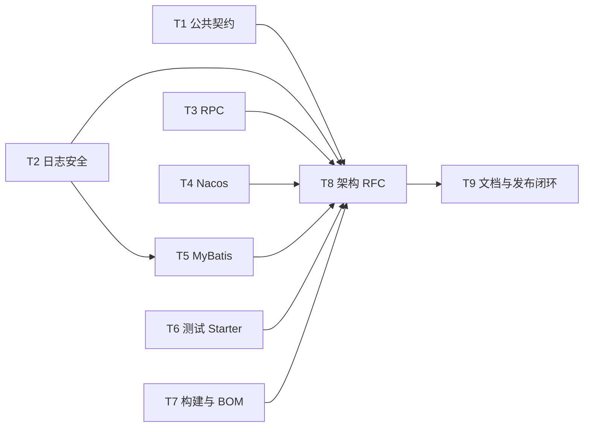

# 技术债修复实施计划

**Branch:** [待填充]
**Baseline SHA:** [待填充]
**Worktree Path:** [待填充]
**Started At:** [待填充]
**Updated At:** [待填充]

**Goal:** 在 v2.2.1 中以可回归、可迁移、可回退的方式修复 29 条已核对技术债的有效部分，并明确保留 TD-013、TD-016 与 TD-023 的残余风险。
**Architecture:** 按模块边界分别修复 common/exception、log、RPC、Nacos、MyBatis、test starter 与构建元数据，通过兼容 API 和原子快照避免补丁版本破坏。MyBatis v2 密文将读取 context 与写入开关分离，所有实现任务完成后统一同步消费文档、迁移说明和技术债状态。
**Tech Stack:** Java 17、Spring Boot 3.3.13、Maven Wrapper 3.9.16、JUnit 5、Mockito、AssertJ、Bash、Python 3 标准库、Markdown
**Commit Mode:** per-task
**Effective Execution Mode:** [待填充]
**Ledger Mode:** controller-commits

**Plan Verdict:**

- **Status:** pending
- **Verified At:** null
- **Evidence:** null
- **Blocked Tasks:** none
- **Concerns:** none

**Accepted Risks:**

| Risk ID | Risk | Accepted By | Accepted At | Source |
|---------|------|-------------|-------------|--------|
| DG-1 | 既有 `fromCode` 仍会把未知码映射到 fallback；未迁移到 `fromCodeOrNull` 的调用方继续承担误判风险。 | YoungerYang-Y | 2026-08-24 | 用户决定 DG-1 A |
| TD-013 | 仅实现旧 `extract` 的自定义 `RpcTracerBridge` 仍无法由默认 noop scope 恢复其未知上下文。 | YoungerYang-Y | 2026-08-24 | 用户决定 DG-2 A |
| TD-016 | v2.2.1 仅提供应用级 AAD；同一 context 内的跨字段或跨记录调换仍不保证被识别。 | YoungerYang-Y | 2026-08-24 | 已确认的 v2.2.1 范围 |
| TD-023 | `RpcHookChain` 四个已弃用直调方法缺少调用句柄，无法获得完整调用级状态与异常隔离；框架内部不再使用，但公开方法保留兼容。 | 项目兼容性约束 | 2026-08-25 | AGENTS.md + IG-3 |
| DG-3 | 数据集中出现 v2 密文后，回退到仅支持 v1 的二进制会导致不可读；只能回退到支持 v2 且 context 相同的版本。 | YoungerYang-Y | 2026-08-24 | 用户决定 DG-3 A |

## Global Constraints

- 兼容基线固定为 Java 17、Spring Boot 3.3.13 和 Maven Wrapper 3.9.16。
- 不新增第三方依赖，不删除公开类型、方法、Bean 或配置绑定属性。
- 既有异常响应形状、旧密文读取、`RpcExecutionTemplate` Bean 和旧 `RpcTracerBridge.extract` 保持源码/二进制可用。
- `CommonStatus.fromCode`、`DeleteFlag.fromCode`、`ErrorCode.fromCode` 保留既有 fallback；只新增三个 `fromCodeOrNull`。
- TD-013 只修复框架内置 Bridge，旧自定义 Bridge 的未知上下文恢复风险继续跟踪；TD-016 只提供应用级 AAD，不声明字段或记录级完整性；TD-023 只修复框架内部 Hook 调用、Feign 与 logger，四个旧直调方法继续保留残余风险。
- `mimir.boot.mybatis.crypto-v2-write-enabled` 默认 false；所有实例先使用同一 `cryptoContext` 获得 v2 读取能力并继续写 v1，完成全量升级和列长度预检后才能开启 v2 写入。
- 所有 Maven 与调用 Maven 的脚本验收均通过 `mise exec java@17 --` 执行；普通 `./mvnw clean verify` 不依赖 GPG 私钥，Maven Central 发布必须显式设置 `gpg.skip=false` 并在签名失败时终止。
- CI 验收测试目标零失败、零跳过；签名插件的显式跳过不计入测试跳过数。
- 脱敏性能在 JDK 17、同一 JVM 与同一固定 1 KiB 消息下比较“无规则 baseline”和“3 个敏感字段 candidate”；各预热 100000 次、测量 1000000 次，以 `candidate ns/op - baseline ns/op` 为单次有符号增量，连续独立运行 3 次且不剔除离群值，三次算术平均值不超过 20µs；该基准只作为发布证据，不进入普通 CI。
- 所有新增或修改缺陷遵循 Red → Green → Verify；每个 Task 独占有序实现提交链，Task 提交不得包含 `plan.md`，controller 单独提交 ledger。

## Dependency Graph



| Task | 依赖 | 可并行组 |
|------|------|----------|
| T1 | 无 | A |
| T2 | 无 | A |
| T3 | 无 | A |
| T4 | 无 | A |
| T6 | 无 | A |
| T7 | 无 | A |
| T5 | T2 | B |
| T8 | T1、T2、T3、T4、T5、T6、T7 | C |
| T9 | T8 | D |

> 可并行组：同组内 Task 文件互不重叠，可由独立 implementer 并行执行。

## Scenario Coverage Matrix

| Spec Scenario | Task | 可执行证据 |
|---------------|------|------------|
| 中文校验消息返回给调用方 | T1 | `MimirExceptionHandlerTest` 同时断言响应保留中文、捕获日志不含原始恶意参数。 |
| 绑定错误维持既有错误项格式 | T1 | `MimirExceptionHandlerTest` 断言 BindException data 为纯消息列表且无字段名前缀。 |
| 分页结果收到无效服务端值 | T1 | `PageResultTest` 参数化覆盖三个 null 与 totalCount/pageIndex/pageSize 非法边界。 |
| 分页请求在属性赋值后仍保持可用 | T1 | `PageRequestTest` 连续 setter 后精确断言 `1/1000/ASC/0`。 |
| JSON 与编码键被脱敏 | T2 | `SensitiveDataPatternTest`、`SensitiveDataConverterTest` 断言 JSON/百分号编码 secret 均消失。 |
| 私钥保护而公钥保持可见 | T2 | converter 参数化测试断言 private/secret/access key 被掩码而 public key 保留。 |
| 专用输出承接脱敏结果 | T2 | `LogbackMaskResourceTest` 解析 access/sql pattern 并用固定 secret 验证 `%mask` 输出。 |
| 已初始化脱敏处理实例接收配置刷新 | T2 | 双实例并发测试收集全部 Future，断言每条输出只属于完整旧快照或完整新快照。 |
| 已知状态保持原含义 | T1 | 三个枚举测试覆盖已知 `1/0` 等输入，并断言对应 `isXxx` 为 true。 |
| 未知状态可被调用方识别 | T1 | 枚举测试同时断言旧 fallback、新 nullable 结果为 null、全部已知态 predicate 为 false。 |
| 空错误码不伪装为系统故障 | T1 | `ErrorCodeTest` 断言 null/空值的旧 fallback 与 nullable null 结果。 |
| RPC 附件中含空值 | T3 | `RpcDubboFilterTest` 断言调用继续及 before/单一终态/cleanup 精确次数。 |
| 异步完成回调保留原链路标识 | T3 | `RpcDubboFilterEndToEndTest` 断言回调 traceId、结束后的原 MDC，以及 throwing-scope 不改变异步结果。 |
| 非标准客户端地址与多值头 | T3 | `RpcFeignClientTest` 断言 host/authority/raw URL 回退及头值 `a,b`。 |
| 仅实现旧提取契约的自定义追踪扩展 | T3 | `LegacyRpcTracerBridgeCompatibilityTest` 断言默认 scope 为 noop；`RpcHookChainTest` 锁定旧直调 API 可编译且无调用级保证。 |
| 未配置解密能力的应用包含普通 ENC 文本 | T4 | 环境后处理器测试断言两类前缀均未绑定时 ENC 原样且不取密钥。 |
| 日志绑定不支持专用脱敏能力 | T2 | `LogMaskAutoConfigurationTest` 用非 LoggerContext fixture 断言启动成功且单次应用启动 WARN=1。 |
| 遗留密文 API 被调用 | T4 | `ConfigCryptoUtilsTest`、`NacosEncryptUtilTest` 分别从两层入口调用并断言每次总计一条 WARN。 |
| 持久化接口包查询反映实际扫描范围 | T5 | `MybatisPropertiesTest` 与 `MybatisPlusAutoConfigurationTest` 对照有效集合及实际 scanner 输入。 |
| 审计人获取失败与持久化语句输出 | T5 | 审计/SQL 测试断言 `system`、WARN、SQL 文本与参数均无 secret。 |
| 下游测试工具使用弃用类型和随机用户标识 | T6 | `DeprecatedApiCompilationTest` 以 `-Xlint:deprecation` 断言编译成功且捕获目标弃用诊断；`TestUtilsTest` 断言 10000 元素 Set 大小。 |
| 下游测试启用测试环境 | T6 | `TestStarterConsumerTest` 断言三项危险属性不存在且显式配置可生效。 |
| 配置上下文后的新密文 | T5 | 三类 Handler 与 `CryptoUtilsTest` 断言相同 context 的 v2 往返。 |
| 跨上下文密文搬移 | T5 | `CryptoUtilsTest` 断言不同 context 认证失败且无明文回退。 |
| 未配置上下文或读取旧密文 | T5 | 固定 v1 fixture 与单参 Handler 测试断言旧格式持续可读写。 |
| 应用级绑定不伪装为字段或记录绑定 | T5 | `CryptoUtilsTest` 交换同 key/context 的两个 v2 密文并断言仍可解密，锁定 TD-016 边界。 |
| 滚动升级后启用应用上下文 | T5 | `MybatisCryptoRolloutContractTest` 用多实例/列容量 fixture 断言全实例可读且容量达标前不得开写。 |
| 已写入 v2 密文后的版本回退 | T5、T9 | rollout contract 拒绝不支持 v2/不同 context 的回退目标，release 记录允许下限。 |
| 单个空值写入 | T2 | `MdcUtilTest` 断言已有 traceId 保留且 null/空值键不存在。 |
| 批量上下文写入 | T2 | `MdcUtilTest` 断言非空 Map 整体替换旧 MDC。 |
| 调用方需要增量更新 | T2 | `MdcUtilTest` 锁定单键增量语义，Javadoc 文本断言批量 API 非合并。 |
| 本地质量验证 | T7 | 普通 `./mvnw clean verify` 后只聚合本次 Surefire/Failsafe XML，断言失败/错误/跳过均为 0。 |
| 显式发布签名 | T7 | `scripts/verify-release-signing.sh` 对齐发布制品与 `.asc`，并用失败 GPG fixture 断言构建非零退出。 |
| 依赖与文档被消费 | T7、T9 | 消费脚本解析 BOM/Starter；文档健康、链接与版本扫描验证最终消费面。 |

## Interface and Decision Traceability Matrix

| Interface Contract | Decisions | Task | 直接证据 |
|--------------------|-----------|------|----------|
| IC-1 校验响应 | D-02 | T1、T9 | 异常响应测试锁定格式，T9 同步消费说明。 |
| IC-2 分页与枚举 | D-01、D-05 | T1、T9 | 分页/枚举测试锁定兼容 API，T9 记录 fallback 风险。 |
| IC-3 日志脱敏 | D-14 | T2、T9 | 快照、资源和并发测试，T9 同步日志 Starter 文档。 |
| IC-4 非 Logback 行为 | D-14 | T2 | 非 Logback fixture 断言 WARN 降级。 |
| IC-5 RPC 生命周期 | D-11、D-12 | T3 | Holder 并发、同步/异步 scope 与 Hook 次数测试。 |
| IC-6 RPC SPI 与 Feign | D-08、D-09、D-10、D-16 | T3、T9 | legacy SPI/Hook 编译与行为测试，T9 记录残余边界。 |
| IC-7 MyBatis 密文 | D-03、D-20、D-21 | T5、T9 | v1/v2、Handler 与 rollout contract 测试，T9 写发布顺序。 |
| IC-8 MyBatis 清理 | D-18、D-19 | T5、T9 | Mapper、SQL、审计测试，T9 同步 MyBatis 文档。 |
| IC-9 Nacos 安全 | D-04、D-13 | T4、T9 | 环境门控与 legacy WARN 测试，T9 写迁移说明。 |
| IC-10 测试 Starter | D-07、D-17 | T6、T9 | 资源、工具和下游消费测试，T9 写配置迁移。 |
| IC-11 构建与发布 | D-06、D-22 | T7、T9 | clean 构建、报告门禁、隔离 consumer 与签名检查。 |
| IC-12 仓库文档 | D-03、D-06、D-07、D-09、D-10、D-17、D-20、D-22 | T7、T8、T9 | LICENSE、RFC、消费文档、技术债闭环及最终状态发布。 |
| IC-13 MDC 工具 | D-15 | T2、T9 | MDC 测试与 Javadoc 文本校验。 |

矩阵中的 D-01 至 D-22 与 `brainstorm.md` 的稳定 ID 一一对应；每个决策至少出现一次，每个 IC 恰好出现一行，执行者不需要根据自然语言推断归属。

## Technical Debt Closure Matrix

| Debt | Task | 直接验证与关闭/保留规则 |
|------|------|------------------------|
| TD-001 | T1 | `MimirExceptionHandlerTest` 验证中文响应和两类错误项形状；T9 以 T1 SHA 关闭。 |
| TD-002 | T2 | pattern/converter 测试验证 JSON 与编码键；T9 以 T2 SHA 关闭。 |
| TD-003 | T3 | `RpcDubboFilterTest` 验证 null 附件值和 Hook 精确次数；T9 以 T3 SHA 关闭。 |
| TD-004 | T3 | Dubbo 端到端测试验证异步 trace scope、关闭失败和 MDC 恢复；T9 以 T3 SHA 关闭。 |
| TD-005 | T2 | 公私钥参数化测试验证 private/secret/access key 掩码且 public key 可见；T9 以 T2 SHA 关闭。 |
| TD-006 | T2、T5 | T2 验证 access/sql `%mask`，T5 验证 SQL 文本与参数无 secret；两项 SHA 齐全后关闭。 |
| TD-007 | T2 | 并发测试收集全部 Future 并传播断言失败；T9 以 T2 SHA 关闭。 |
| TD-008 | T2、T9 | T2 锁定配置快照与 replacement，T9 同步 README；代码和文档证据齐全后关闭。 |
| TD-009 | T2 | 非 Logback fixture 验证启动成功且每次启动 WARN=1；T9 以 T2 SHA 关闭。 |
| TD-010 | T3 | Holder 并发测试证明只观察完整同代快照；T9 以 T3 SHA 关闭。 |
| TD-011 | T6 | 下游消费 fixture 验证 test profile 不注入危险默认值；T9 以 T6 SHA 关闭。 |
| TD-012 | T3、T9 | T3 锁定 `RpcExecutionTemplate` 手工扩展点语义，T9 同步文档；两项证据齐全后关闭。 |
| TD-013 | T3、T9 | T3 只修复内置 Bridge 并验证 legacy noop scope；T9 保留残余债务，不得关闭。 |
| TD-014 | T6 | 工具与三类基类测试证明日志断言和生命周期实现收敛；T9 以 T6 SHA 关闭。 |
| TD-015 | T4、T9 | T4 验证每次 legacy ECB 调用恰好一条 WARN，T9 写迁移说明；两项证据齐全后关闭。 |
| TD-016 | T5、T9 | T5 验证应用级 AAD 与同 context 调换残余边界；T9 保留字段/记录级债务，不得关闭。 |
| TD-017 | T7 | 普通 clean verify 无私钥通过，发布签名失败阻断隔离 deploy；T9 以 T7 SHA 关闭。 |
| TD-018 | T7、T9 | T7 拆分普通/CI 门禁，T9 修正文档命令；两项证据齐全后关闭。 |
| TD-019 | T7、T9 | T7 添加 Apache-2.0 LICENSE，T9 验证所有许可证链接；两项证据齐全后关闭。 |
| TD-020 | T9 | 以 effective POM/依赖树同步长期文档并经 T8 RFC 授权后关闭。 |
| TD-021 | T1 | PageResult/PageRequest 边界测试通过后以 T1 SHA 关闭。 |
| TD-022 | T1、T2、T9 | T1 提供 nullable 枚举 API，T2 锁定 MDC 语义，T9 记录旧 fallback 风险；证据齐全后关闭。 |
| TD-023 | T3、T9 | T3 让框架内部只使用调用级 Invocation，并修复 Feign/logger；T9 保留四个弃用直调方法的残余债务，不得关闭。 |
| TD-024 | T5、T9 | T5 清理 Mapper/日志/审计事实，T9 同步 MyBatis README；两项证据齐全后关闭。 |
| TD-025 | T4 | Nacos 无前缀、key-only 与错误配置测试通过后以 T4 SHA 关闭。 |
| TD-026 | T6 | 测试基类、工具、随机 ID 和弃用兼容测试通过后以 T6 SHA 关闭。 |
| TD-027 | T7 | formatter 1.23.0、动态 revision、报告门禁和 BOM 属性验证通过后以 T7 SHA 关闭。 |
| TD-028 | T9 | 文档健康、链接、Maven/示例版本扫描全绿后以 T9 SHA 关闭。 |
| TD-029 | T7 | RocketMQ 2.3.6 与正确 Elasticsearch 坐标经隔离 BOM consumer 解析后以 T7 SHA 关闭。 |

---

### T1: 公共模型与异常响应契约

**Depends on:** 无

**Files:**

- Modify: `mimir-boot-common/src/main/java/com/yggdrasil/labs/common/page/PageResult.java`
- Modify: `mimir-boot-common/src/main/java/com/yggdrasil/labs/common/page/PageRequest.java`
- Modify: `mimir-boot-common/src/main/java/com/yggdrasil/labs/common/enums/CommonStatus.java`
- Modify: `mimir-boot-common/src/main/java/com/yggdrasil/labs/common/enums/DeleteFlag.java`
- Modify: `mimir-boot-common/src/main/java/com/yggdrasil/labs/common/exception/ErrorCode.java`
- Modify: `mimir-boot-starters/mimir-boot-starter-exception/src/main/java/com/yggdrasil/labs/exception/handler/MimirExceptionHandler.java`
- Test: `mimir-boot-common/src/test/java/com/yggdrasil/labs/common/page/PageResultTest.java`
- Test: `mimir-boot-common/src/test/java/com/yggdrasil/labs/common/page/PageRequestTest.java`
- Test: `mimir-boot-common/src/test/java/com/yggdrasil/labs/common/enums/CommonStatusTest.java`
- Test: `mimir-boot-common/src/test/java/com/yggdrasil/labs/common/enums/DeleteFlagTest.java`
- Test: `mimir-boot-common/src/test/java/com/yggdrasil/labs/common/exception/ErrorCodeTest.java`
- Test: `mimir-boot-starters/mimir-boot-starter-exception/src/test/java/com/yggdrasil/labs/exception/handler/MimirExceptionHandlerTest.java`

**Interfaces:**

- Consumes: none
- Produces: `CommonStatus`: `public static CommonStatus fromCodeOrNull(Integer code)`
- Produces: `DeleteFlag`: `public static DeleteFlag fromCodeOrNull(Integer code)`
- Produces: `ErrorCode`: `public static ErrorCode fromCodeOrNull(String code)`
- Produces: `PageRequest`: `public Long getOffset()` with defensive correction
- Produces: validated `public PageResult(List<T> data, Long totalCount, Long pageIndex, Long pageSize)`
- Produces: validated `public static <T extends Serializable> PageResult<T> of(List<T> data, Long totalCount, Long pageIndex, Long pageSize)`
- Produces: validated `public static <T extends Serializable> PageResult<T> empty(Long pageIndex, Long pageSize)` and `public static <T extends Serializable> PageResult<T> empty(PageRequest pageRequest)`；保留 `public PageResult()`
- Preserves: `public Object MimirExceptionHandler.handleMethodArgumentNotValidException(MethodArgumentNotValidException e, HttpServletRequest request)` 与 `public Object MimirExceptionHandler.handleBindException(BindException e, HttpServletRequest request)`

**Behavior:**
恢复中文校验消息但不改变绑定错误的纯消息列表形状。分页请求在计算偏移前纠正 null、越界页码和排序方向，分页结果的已校验构造路径拒绝无效数值；枚举既有 fallback 不变，新增 nullable 查询供调用方识别未知码。

**Acceptance Criteria:**

- [ ] 中文默认校验消息原样进入 400 响应 data，MethodArgumentNotValid 与 BindException 保持各自既有错误项格式，日志捕获仍证明原始恶意参数经过安全清洗。
- [ ] `PageResult` 对 null 数值字段、负 totalCount、pageIndex < 1、pageSize < 1 抛 `IllegalArgumentException`，无参 JavaBean 路径仍可用。
- [ ] `PageRequest.getOffset()` 将 pageIndex null/<1 修正为 1、pageSize null/<1 修正为 10、>1000 修正为 1000、非法方向修正为 ASC，并返回 offset 0。
- [ ] 三个既有 `fromCode` fallback 分别保持 `DISABLED`、`NOT_DELETED`、`SYSTEM_ERROR`，三个新增 `fromCodeOrNull` 对未知/null 返回 null；已知 `1/0` 等输入的对应 `isXxx` 为 true，未知输入的全部已知态 predicate 为 false。

**Execution:**

- **Status:** pending
- **Commit SHAs:** []
- **Dispatch Base SHA:** null
- **Dispatch Ref:** null
- **Attempts:** 0
- **Blocked Reason:** null
- **Red Result:** null
- **Verify Result:** null
- **AC Result:** null
- **Concerns:** none

**Task Completion Gate:**

- [ ] Red Result exists and passed
- [ ] Verify Result exists and passed
- [ ] AC Result: total > 0 AND pass + deferred.length == total, non-deferred AC all verified
- [ ] Every Commit SHA in the ordered task chain belongs to this task only
- [ ] Per-task AC checkbox synced

**Step 1: Red**

在上述六个测试类中先加入中文响应与日志安全捕获、分页非法输入、setter 后偏移、已知 `1/0` predicate、未知值全部已知态 predicate 以及 nullable 枚举 API 断言。

Run: `mise exec java@17 -- ./mvnw -pl :mimir-boot-common,:mimir-boot-starter-exception -am -Dsurefire.failIfNoSpecifiedTests=false -Dtest=PageResultTest,PageRequestTest,CommonStatusTest,DeleteFlagTest,ErrorCodeTest,MimirExceptionHandlerTest test`
Expected: **FAIL** — 缺少 nullable API、分页非法值仍产生 NPE/错误页数或中文消息仍被清洗。

**Step 2: Green**

- 日志参数继续使用安全清洗，响应 data 直接使用字段名和默认消息。
- `PageResult` 在构造器/工厂统一校验三个数值字段；不改变无参构造和 setter。
- `PageRequest.getOffset()` 先调用既有 `validateAndCorrect()`。
- 新增三个 `fromCodeOrNull`，既有 `fromCode` 实现和 fallback 保持不变。

**Step 3: Verify**

Run: `mise exec java@17 -- ./mvnw -pl :mimir-boot-common,:mimir-boot-starter-exception -am -Dsurefire.failIfNoSpecifiedTests=false -Dtest=PageResultTest,PageRequestTest,CommonStatusTest,DeleteFlagTest,ErrorCodeTest,MimirExceptionHandlerTest test`
Expected: **PASS**

**AC Verification:**

- [ ] AC1: `MimirExceptionHandlerTest` 断言中文文本、两类响应 data 结构及日志不含原始恶意参数 → 全部通过。
- [ ] AC2: `PageResultTest` 参数化覆盖三个 null 和三个非法边界 → 全部抛 `IllegalArgumentException`。
- [ ] AC3: `PageRequestTest` 在连续 setter 后断言 `1/1000/ASC/0` → 精确匹配。
- [ ] AC4: 三个枚举测试同时断言已知 `1/0` 与 `isXxx=true`、旧 fallback、新 nullable 结果和未知值全部已知态 predicate=false → 精确匹配。

**Step 4: Commit**

提交：`fix(common): 修复分页与枚举兼容契约`。提交只包含本 Task 文件，body 使用中文 bullet，追加 `Task-ID: T1` 与单行 `Red-Evidence: {"commands":["mise exec java@17 -- ./mvnw -pl :mimir-boot-common,:mimir-boot-starter-exception -am -Dsurefire.failIfNoSpecifiedTests=false -Dtest=PageResultTest,PageRequestTest,CommonStatusTest,DeleteFlagTest,ErrorCodeTest,MimirExceptionHandlerTest test"]}` trailers。

---

### T2: 日志脱敏、配置生命周期与 MDC 语义

**Depends on:** 无

**Files:**

- Modify: `mimir-boot-starters/mimir-boot-starter-log/src/main/java/com/yggdrasil/labs/log/converter/SensitiveDataPattern.java`
- Modify: `mimir-boot-starters/mimir-boot-starter-log/src/main/java/com/yggdrasil/labs/log/converter/SensitiveDataConverter.java`
- Modify: `mimir-boot-starters/mimir-boot-starter-log/src/main/java/com/yggdrasil/labs/log/config/LogMaskAutoConfiguration.java`
- Modify: `mimir-boot-starters/mimir-boot-starter-log/src/main/java/com/yggdrasil/labs/log/config/LogMaskProperties.java`
- Modify: `mimir-boot-starters/mimir-boot-starter-log/src/main/java/com/yggdrasil/labs/log/util/MdcUtil.java`
- Modify: `mimir-boot-starters/mimir-boot-starter-log/src/main/resources/logback-spring.xml`
- Test: `mimir-boot-starters/mimir-boot-starter-log/src/test/java/com/yggdrasil/labs/log/converter/SensitiveDataPatternTest.java`
- Test: `mimir-boot-starters/mimir-boot-starter-log/src/test/java/com/yggdrasil/labs/log/converter/SensitiveDataConverterTest.java`
- Test: `mimir-boot-starters/mimir-boot-starter-log/src/test/java/com/yggdrasil/labs/log/config/LogMaskAutoConfigurationTest.java`
- Test: `mimir-boot-starters/mimir-boot-starter-log/src/test/java/com/yggdrasil/labs/log/config/LogMaskPropertiesTest.java`
- Test: `mimir-boot-starters/mimir-boot-starter-log/src/test/java/com/yggdrasil/labs/log/util/MdcUtilTest.java`
- Create: `mimir-boot-starters/mimir-boot-starter-log/src/test/java/com/yggdrasil/labs/log/config/LogbackMaskResourceTest.java`
- Create: `mimir-boot-starters/mimir-boot-starter-log/src/test/java/com/yggdrasil/labs/log/converter/SensitiveDataConverterBenchmark.java`

**Interfaces:**

- Consumes: none
- Produces: `private record MaskConfigurationSnapshot(List<Pattern> patterns, String replacement)` 与 `private static final AtomicReference<MaskConfigurationSnapshot> configuration`
- Produces: `SensitiveDataConverter`: `private static MaskConfigurationSnapshot currentConfiguration()`、`public static void publishConfiguration(List<String> enabledPatternNames, List<String> customPatternExpressions, String replacement)`；保留 `public static void reloadConfig()`
- Preserves: `public String SensitiveDataConverter.convert(ILoggingEvent event)`、`public String SensitiveDataConverter.maskSensitiveData(String message)`、`public void LogMaskAutoConfiguration.transferConfig(ContextRefreshedEvent event)`
- Produces: `MdcUtil`: `public static void put(String key, String value)`、`public static void putAll(Map<String, String> context)`、`public static void setContextMap(Map<String, String> context)` with documented existing semantics

**Behavior:**
脱敏覆盖 JSON、百分号编码键、私钥和访问密钥，访问日志与 SQL 专用 appender 也必须使用 `%mask`。Spring 刷新规则时以单个不可变快照原子发布，已初始化 converter 在并发转换中只能观察完整旧代或完整新代配置；非 Logback 绑定只 WARN 一次且不阻断启动。

**Acceptance Criteria:**

- [ ] JSON 和百分号编码 password 的值均变为 `****`，privateKey/secretKey/accessKey 被掩码而 publicKey 保持原值。
- [ ] 两个已初始化 converter 在并发刷新后都使用新规则与 replacement，每次转换只观察完整旧快照或完整新快照。
- [ ] access/sql appender 使用 `%mask`，非 Logback ApplicationContext 正常启动且最多记录一条 WARN。
- [ ] MDC 单值 null/空字符串不写入，批量非空 Map 整体替换，null/空 Map 不改变当前上下文。
- [ ] 手工基准类不进入普通 Surefire include，显式 `-Dtest=SensitiveDataConverterBenchmark` 可运行并输出固定测量参数。

**Execution:**

- **Status:** pending
- **Commit SHAs:** []
- **Dispatch Base SHA:** null
- **Dispatch Ref:** null
- **Attempts:** 0
- **Blocked Reason:** null
- **Red Result:** null
- **Verify Result:** null
- **AC Result:** null
- **Concerns:** none

**Task Completion Gate:**

- [ ] Red Result exists and passed
- [ ] Verify Result exists and passed
- [ ] AC Result: total > 0 AND pass + deferred.length == total, non-deferred AC all verified
- [ ] Every Commit SHA in the ordered task chain belongs to this task only
- [ ] Per-task AC checkbox synced

**Step 1: Red**

先加入 JSON/编码键、公私钥、双 converter 并发刷新、非 Logback、专用资源和 MDC 语义断言，并创建不匹配 `*Test`/`*Tests` 的基准类。

Run: `mise exec java@17 -- ./mvnw -pl :mimir-boot-starter-log -am -Dsurefire.failIfNoSpecifiedTests=false -Dtest=SensitiveDataPatternTest,SensitiveDataConverterTest,LogMaskAutoConfigurationTest,LogMaskPropertiesTest,LogbackMaskResourceTest,MdcUtilTest test`
Expected: **FAIL** — 当前规则、静态缓存生命周期、强制 Logback 转型或资源 `%msg` 至少一项违反断言。

**Step 2: Green**

```text
1. 编译 patterns 与 replacement 为同一个 `MaskConfigurationSnapshot`，规则列表不可变。
2. `publishConfiguration(...)` 在完整编译后只原子替换一次 snapshot；convert/mask 每次只调用一次 `currentConfiguration()` 并复用该引用。
3. 所有 converter 实例通过共享发布点读取当前 snapshot，不缓存独立旧值。
4. 非 LoggerContext 时跳过注册并以 ApplicationContext 粒度抑制重复 WARN。
5. access/sql appender 将 %msg 改为 %mask，MDC 实现不改变既有替换语义。
```

**Step 3: Verify**

Run: `mise exec java@17 -- ./mvnw -pl :mimir-boot-starter-log -am test`
Expected: **PASS**

Run: `mise exec java@17 -- ./mvnw -pl :mimir-boot-starter-log -am -Dsurefire.failIfNoSpecifiedTests=false -Dtest=SensitiveDataConverterBenchmark test`
Expected: **PASS** — 同一 JVM 内对同一 1 KiB 固定消息分别执行无规则 baseline 与 3 字段 candidate，各输出 100000 预热、1000000 测量、baseline ns/op、candidate ns/op 和有符号差值；执行时间数据留到发布验收记录。

**AC Verification:**

- [ ] AC1: converter/pattern 参数化测试断言输出不含 secret/private/access key → 全部通过。
- [ ] AC2: 双实例并发测试收集全部 Future 并断言无混代配置 → 全部通过。
- [ ] AC3: 资源测试解析 access/sql pattern，非 Logback 测试断言启动成功和 WARN=1 → 全部通过。
- [ ] AC4: `MdcUtilTest` 断言 null、空、替换和保留场景 → 全部通过。
- [ ] AC5: 普通模块测试报告不含 benchmark，显式命令报告包含 benchmark 及 baseline/candidate/delta 三个数值 → 证据齐全。

**Step 4: Commit**

提交：`fix(log): 完善脱敏与配置刷新边界`。提交只包含本 Task 文件，body 使用中文 bullet，追加 `Task-ID: T2` 与单行 `Red-Evidence: {"commands":["mise exec java@17 -- ./mvnw -pl :mimir-boot-starter-log -am -Dsurefire.failIfNoSpecifiedTests=false -Dtest=SensitiveDataPatternTest,SensitiveDataConverterTest,LogMaskAutoConfigurationTest,LogMaskPropertiesTest,LogbackMaskResourceTest,MdcUtilTest test"]}` trailers。

---

### T3: RPC 生命周期、Trace SPI 与 Feign 元数据

**Depends on:** 无

**Files:**

- Modify: `mimir-boot-starters/mimir-boot-starter-rpc-core/src/main/java/com/yggdrasil/labs/rpc/core/tracing/RpcTracerBridge.java`
- Modify: `mimir-boot-starters/mimir-boot-starter-rpc-core/src/main/java/com/yggdrasil/labs/rpc/core/tracing/MdcRpcTracerBridge.java`
- Modify: `mimir-boot-starters/mimir-boot-starter-rpc-core/src/main/java/com/yggdrasil/labs/rpc/core/hook/RpcHookChain.java`
- Modify: `mimir-boot-starters/mimir-boot-starter-rpc-core/src/main/java/com/yggdrasil/labs/rpc/core/hook/RpcHookLifecycle.java`
- Modify: `mimir-boot-starters/mimir-boot-starter-rpc-core/src/main/java/com/yggdrasil/labs/rpc/core/support/RpcExecutionTemplate.java`
- Modify: `mimir-boot-starters/mimir-boot-starter-dubbo/src/main/java/com/yggdrasil/labs/rpc/dubbo/filter/RpcDubboFilter.java`
- Modify: `mimir-boot-starters/mimir-boot-starter-dubbo/src/main/java/com/yggdrasil/labs/rpc/dubbo/support/RpcDubboSupportHolder.java`
- Modify: `mimir-boot-starters/mimir-boot-starter-feign/src/main/java/com/yggdrasil/labs/rpc/feign/client/RpcFeignClient.java`
- Test: `mimir-boot-starters/mimir-boot-starter-rpc-core/src/test/java/com/yggdrasil/labs/rpc/core/tracing/MdcRpcTracerBridgeTest.java`
- Test: `mimir-boot-starters/mimir-boot-starter-rpc-core/src/test/java/com/yggdrasil/labs/rpc/core/hook/RpcHookChainTest.java`
- Test: `mimir-boot-starters/mimir-boot-starter-rpc-core/src/test/java/com/yggdrasil/labs/rpc/core/support/RpcExecutionTemplateTest.java`
- Create: `mimir-boot-starters/mimir-boot-starter-rpc-core/src/test/java/com/yggdrasil/labs/rpc/core/tracing/LegacyRpcTracerBridgeCompatibilityTest.java`
- Test: `mimir-boot-starters/mimir-boot-starter-dubbo/src/test/java/com/yggdrasil/labs/rpc/dubbo/filter/RpcDubboFilterTest.java`
- Test: `mimir-boot-starters/mimir-boot-starter-dubbo/src/test/java/com/yggdrasil/labs/rpc/dubbo/filter/RpcDubboFilterEndToEndTest.java`
- Test: `mimir-boot-starters/mimir-boot-starter-dubbo/src/test/java/com/yggdrasil/labs/rpc/dubbo/support/RpcDubboSupportHolderTest.java`
- Test: `mimir-boot-starters/mimir-boot-starter-feign/src/test/java/com/yggdrasil/labs/rpc/feign/client/RpcFeignClientTest.java`

**Interfaces:**

- Consumes: none
- Produces: `RpcTracerBridge`: deprecated `public void extract(RpcCallContext context, Map<String, String> carrier)` 与 `public default RpcTraceScope extractScope(RpcCallContext context, Map<String, String> carrier)`
- Preserves: `public RpcHookInvocation RpcHookChain.open(RpcCallContext context)`、`public RpcAsyncHookInvocation RpcHookChain.openAsync(RpcCallContext context)`，以及 deprecated `public void before(RpcCallContext context)`、`public void after(RpcCallContext context, RpcCallResult result)`、`public void onError(RpcCallContext context, RpcCallResult result)`、`public void cleanup(RpcCallContext context)`
- Produces: `RpcDubboSupportHolder` 嵌套类型 `public record Snapshot(RpcHookChain hookChain, RpcTracerBridge tracerBridge, DubboProperties properties)`
- Produces: `public static RpcDubboSupportHolder.Snapshot current()`；保留 `public static void set(RpcHookChain hookChain, RpcTracerBridge tracerBridge, DubboProperties properties)`、`public static RpcDubboSupportHolder getInstance()`、`public RpcHookChain getHookChain()`、`public RpcTracerBridge getTracerBridge()`、`public DubboProperties getProperties()`
- Preserves: `public Result RpcDubboFilter.invoke(Invoker<?> invoker, Invocation invocation) throws RpcException`
- Preserves: `public Response RpcFeignClient.execute(Request request, Request.Options options) throws IOException`
- Preserves: `public void RpcExecutionTemplate.execute(RpcCallContext context, Runnable runnable)` 与 `public <T> T RpcExecutionTemplate.execute(RpcCallContext context, Callable<T> callable)`

**Behavior:**
Dubbo 对 null 附件不中止调用，并在异步完成回调中恢复调用 trace scope，保证 before、一个终态 Hook 和 cleanup 各执行一次。scope 关闭失败只记录 WARN；业务失败时作为 suppressed 附加到原异常，成功和异步结果不被关闭失败替换。框架内部只调用可关闭的 `extractScope`；旧自定义 Bridge 仍可加载但不承诺未知上下文恢复，Feign 服务标识和非敏感多值头生成完整元数据。

**Acceptance Criteria:**

- [ ] null 附件值不抛异常，Hook 顺序为 before、一个终态、cleanup 且各一次。
- [ ] 异步完成 Hook 和日志使用原 traceId，回调结束后恢复线程原 MDC。
- [ ] Holder 并发读写只能观察完整同代依赖快照，单 Spring 上下文边界写入 Javadoc。
- [ ] 内置 Bridge 的 scope 可恢复 MDC；仅实现旧 extract 的 Bridge 可加载和调用，默认 noop scope 不宣称恢复保证。
- [ ] 全仓生产代码扫描证明只调用 `RpcHookChain.open/openAsync`；四个弃用直调方法继续可编译且保持既有签名，测试和 Javadoc 明确它们不提供调用级状态/异常隔离保证，TD-023 继续保留。
- [ ] throwing-scope fixture 分别覆盖同步成功、同步业务失败与异步完成：关闭失败均 WARN；成功结果与异步结果不变，业务异常仍为主异常且包含 suppressed 关闭异常；终态 Hook 与 cleanup 仍各一次。
- [ ] Feign host 按 host、authority、原始 URL 回退，两个非敏感同名头按迭代顺序保存为 `a,b`。

**Execution:**

- **Status:** pending
- **Commit SHAs:** []
- **Dispatch Base SHA:** null
- **Dispatch Ref:** null
- **Attempts:** 0
- **Blocked Reason:** null
- **Red Result:** null
- **Verify Result:** null
- **AC Result:** null
- **Concerns:** none

**Task Completion Gate:**

- [ ] Red Result exists and passed
- [ ] Verify Result exists and passed
- [ ] AC Result: total > 0 AND pass + deferred.length == total, non-deferred AC all verified
- [ ] Every Commit SHA in the ordered task chain belongs to this task only
- [ ] Per-task AC checkbox synced

**Step 1: Red**

先补 null 附件、异步 MDC、Holder 并发快照、legacy Bridge、Feign host/多值头、Hook lifecycle logger 和 throwing-scope 的同步成功/业务失败/异步完成断言。

Run: `mise exec java@17 -- ./mvnw -pl :mimir-boot-starter-rpc-core,:mimir-boot-starter-dubbo,:mimir-boot-starter-feign -am test`
Expected: **FAIL** — 当前附件复制、异步 scope、静态 Holder 或 Feign 元数据至少一项违反断言。

**Step 2: Green**

```text
1. 以允许 null value 的显式循环复制 Dubbo attachments。
2. 捕获调用 trace carrier；异步完成时建立临时 scope，在 finally 中通过统一 `closeScope(scope, primaryFailure)` 关闭。关闭失败在无主异常时只 WARN；有主异常且 `closeFailure != primaryFailure` 时先 `primaryFailure.addSuppressed(closeFailure)` 再 WARN；若为同一 Throwable 实例则跳过 self-suppression、仍 WARN，任何情况都不替换原返回值、业务异常或异步结果。
3. Holder 的 `public static void set(RpcHookChain hookChain, RpcTracerBridge tracerBridge, DubboProperties properties)` 将三个依赖组合为一个 `Snapshot` 并经 volatile 引用一次发布；Filter 入口只调用一次 `public static RpcDubboSupportHolder.Snapshot current()`，从同一对象读取三项依赖。
4. 框架适配器只调用 extractScope；默认实现委托旧 extract 并返回 noop scope。
5. 框架生产代码只使用 `RpcHookChain.open/openAsync`；四个弃用直调方法只补 `since="2.2.1"` 与残余风险 Javadoc，不引入全局 context→Invocation 映射，不宣称已获得调用级状态。
6. Feign 元数据依次尝试 host、authority、原始 URL，并拼接非敏感多值头。
```

**Step 3: Verify**

Run: `mise exec java@17 -- ./mvnw -pl :mimir-boot-starter-rpc-core,:mimir-boot-starter-dubbo,:mimir-boot-starter-feign -am test`
Expected: **PASS**

Run: `! rg -n '\bhookChain\.(before|after|onError|cleanup)\(' mimir-boot-starters/mimir-boot-starter-rpc-core/src/main/java mimir-boot-starters/mimir-boot-starter-dubbo/src/main/java mimir-boot-starters/mimir-boot-starter-feign/src/main/java -g '*.java' -g '!**/RpcHookChain.java'`
Expected: **PASS** — 定义文件之外没有通过 `hookChain` 调用四个弃用直调方法。

Run: `rg -n '\bhookChain\.(open|openAsync)\(' mimir-boot-starters/mimir-boot-starter-rpc-core/src/main/java mimir-boot-starters/mimir-boot-starter-dubbo/src/main/java mimir-boot-starters/mimir-boot-starter-feign/src/main/java -g '*.java'`
Expected: **PASS** — rpc-core、Dubbo 与 Feign 的生产入口均命中调用级 API。

**AC Verification:**

- [ ] AC1: `RpcDubboFilterTest` 断言 null 附件和 Hook 精确次数 → 通过。
- [ ] AC2: `RpcDubboFilterEndToEndTest` 断言完成回调 traceId 和 MDC 恢复 → 通过。
- [ ] AC3: `RpcDubboSupportHolderTest` 并发采样无跨代组合 → 通过。
- [ ] AC4: Bridge 兼容测试分别覆盖内置 scope 与旧实现 noop scope → 通过。
- [ ] AC5: `RpcDubboFilterTest` 与端到端测试使用 throwing-scope 覆盖同步成功、业务失败、异步完成及“关闭重抛主异常同一实例”，断言 WARN、非 self-suppression、结果/异常优先级及 Hook/cleanup 精确次数 → 通过。
- [ ] AC6: 失败式 source scan、`open/openAsync` 正向 scan 与 `RpcHookChainTest` 共同证明生产代码只使用调用级 API、旧直调 API 仍可编译且残余边界已写入 Javadoc → 通过。
- [ ] AC7: `RpcFeignClientTest` 断言三级回退和头值 `a,b` → 通过。

**Step 4: Commit**

提交：`fix(rpc): 修复异步上下文与元数据边界`。提交只包含本 Task 文件，body 使用中文 bullet，追加 `Task-ID: T3` 与单行 `Red-Evidence: {"commands":["mise exec java@17 -- ./mvnw -pl :mimir-boot-starter-rpc-core,:mimir-boot-starter-dubbo,:mimir-boot-starter-feign -am test"]}` trailers。

---

### T4: Nacos 解密门控与遗留密文告警

**Depends on:** 无

**Files:**

- Modify: `mimir-boot-starters/mimir-boot-starter-nacos/src/main/java/com/yggdrasil/labs/nacos/config/NacosEncryptEnvironmentPostProcessor.java`
- Modify: `mimir-boot-starters/mimir-boot-starter-nacos/src/main/java/com/yggdrasil/labs/nacos/config/NacosEncryptPropertiesResolver.java`
- Modify: `mimir-boot-starters/mimir-boot-starter-nacos/src/main/java/com/yggdrasil/labs/nacos/decrypt/ConfigDecryptProcessor.java`
- Modify: `mimir-boot-starters/mimir-boot-starter-nacos/src/main/java/com/yggdrasil/labs/nacos/crypto/ConfigCryptoUtils.java`
- Modify: `mimir-boot-starters/mimir-boot-starter-nacos/src/main/java/com/yggdrasil/labs/nacos/util/NacosEncryptUtil.java`
- Test: `mimir-boot-starters/mimir-boot-starter-nacos/src/test/java/com/yggdrasil/labs/nacos/config/NacosEncryptAutoConfigurationTest.java`
- Test: `mimir-boot-starters/mimir-boot-starter-nacos/src/test/java/com/yggdrasil/labs/nacos/config/NacosEncryptPropertiesTest.java`
- Test: `mimir-boot-starters/mimir-boot-starter-nacos/src/test/java/com/yggdrasil/labs/nacos/decrypt/ConfigDecryptProcessorTest.java`
- Test: `mimir-boot-starters/mimir-boot-starter-nacos/src/test/java/com/yggdrasil/labs/nacos/crypto/ConfigCryptoUtilsTest.java`
- Test: `mimir-boot-starters/mimir-boot-starter-nacos/src/test/java/com/yggdrasil/labs/nacos/util/NacosEncryptUtilTest.java`

**Interfaces:**

- Consumes: none
- Produces: `ConfigCryptoUtils` 与 `NacosEncryptUtil` 各自保留 deprecated `public static String encrypt(String plaintext, String key, String algorithm)`、`public static String decrypt(String ciphertext, String key, String algorithm)`；WARN 只由最低实现层 `ConfigCryptoUtils` 发出
- Preserves: `public void NacosEncryptEnvironmentPostProcessor.postProcessEnvironment(ConfigurableEnvironment environment, SpringApplication application)` 与 `public void ConfigDecryptProcessor.process(ConfigurableEnvironment environment)`

**Behavior:**
环境后处理器只在当前或旧 Nacos 解密配置前缀实际绑定时扫描并处理 `ENC(...)`。未配置解密能力的应用保持普通文本并正常启动；遗留 AES/ECB API 保持旧格式兼容，但每次调用都产生明确迁移告警。

**Acceptance Criteria:**

- [ ] 未绑定 `mimir.boot.nacos.encrypt` 或 `mimir.nacos.encrypt` 时，任意普通 `ENC(` 文本保持原值且不要求密钥。
- [ ] 仅配置既有 key 的使用方保持默认 enabled=true 解密；显式启用但缺少或使用错误密钥时明确失败。
- [ ] 从 `ConfigCryptoUtils` 或 `NacosEncryptUtil` 发起的每次 legacy AES encrypt/decrypt 调用，总计恰好记录一条含 `legacy ECB migration API` 的 WARN；委托层不得重复记录。
- [ ] 固定旧 Base64 密文样本仍可解密为原明文，非 AES/GCM 参数继续按既有异常规则失败。

**Execution:**

- **Status:** pending
- **Commit SHAs:** []
- **Dispatch Base SHA:** null
- **Dispatch Ref:** null
- **Attempts:** 0
- **Blocked Reason:** null
- **Red Result:** null
- **Verify Result:** null
- **AC Result:** null
- **Concerns:** none

**Task Completion Gate:**

- [ ] Red Result exists and passed
- [ ] Verify Result exists and passed
- [ ] AC Result: total > 0 AND pass + deferred.length == total, non-deferred AC all verified
- [ ] Every Commit SHA in the ordered task chain belongs to this task only
- [ ] Per-task AC checkbox synced

**Step 1: Red**

先加入无前缀普通 ENC、key-only 兼容、显式错误配置、每次调用 WARN 和固定旧密文样本断言。

Run: `mise exec java@17 -- ./mvnw -pl :mimir-boot-starter-nacos -am -Dsurefire.failIfNoSpecifiedTests=false -Dtest=NacosEncryptAutoConfigurationTest,NacosEncryptPropertiesTest,ConfigDecryptProcessorTest,ConfigCryptoUtilsTest,NacosEncryptUtilTest test`
Expected: **FAIL** — 当前无条件后处理或 legacy API 无告警导致至少一个新断言失败。

**Step 2: Green**

- 在 EnvironmentPostProcessor 最前端检测当前/旧配置前缀是否已绑定，均未绑定时直接返回。
- 保留 key-only 场景的 enabled 默认值，不以 Nacos 类路径作为门控。
- legacy AES 分支保留旧 ECB 字节格式，仅在 `ConfigCryptoUtils` 的最低实现层记录固定 WARN；`NacosEncryptUtil` 只委托，不重复记录。

**Step 3: Verify**

Run: `mise exec java@17 -- ./mvnw -pl :mimir-boot-starter-nacos -am test`
Expected: **PASS**

**AC Verification:**

- [ ] AC1: 环境处理器测试断言无前缀时 ENC 原样和启动成功 → 通过。
- [ ] AC2: properties/decrypt 测试断言 key-only 成功及缺/错 key 失败 → 通过。
- [ ] AC3: 两层入口测试分别捕获一次顶层调用总计一条固定 WARN，且委托入口没有双重 WARN → 通过。
- [ ] AC4: 固定样本与错误算法测试锁定兼容结果 → 通过。

**Step 4: Commit**

提交：`fix(nacos): 收紧解密门控并标记遗留加密`。提交只包含本 Task 文件，body 使用中文 bullet，追加 `Task-ID: T4` 与单行 `Red-Evidence: {"commands":["mise exec java@17 -- ./mvnw -pl :mimir-boot-starter-nacos -am -Dsurefire.failIfNoSpecifiedTests=false -Dtest=NacosEncryptAutoConfigurationTest,NacosEncryptPropertiesTest,ConfigDecryptProcessorTest,ConfigCryptoUtilsTest,NacosEncryptUtilTest test"]}` trailers。

---

### T5: MyBatis 日志、审计、Mapper 与应用级 AAD

**Depends on:** T2

**Files:**

- Modify: `mimir-boot-starters/mimir-boot-starter-mybatis/src/main/java/com/yggdrasil/labs/mybatis/config/MybatisProperties.java`
- Modify: `mimir-boot-starters/mimir-boot-starter-mybatis/src/main/java/com/yggdrasil/labs/mybatis/config/MybatisPlusAutoConfiguration.java`
- Modify: `mimir-boot-starters/mimir-boot-starter-mybatis/src/main/java/com/yggdrasil/labs/mybatis/config/MybatisPlusCryptoConfiguration.java`
- Modify: `mimir-boot-starters/mimir-boot-starter-mybatis/src/main/java/com/yggdrasil/labs/mybatis/config/MybatisPlusLoggingConfiguration.java`
- Modify: `mimir-boot-starters/mimir-boot-starter-mybatis/src/main/java/com/yggdrasil/labs/mybatis/crypto/CryptoUtils.java`
- Modify: `mimir-boot-starters/mimir-boot-starter-mybatis/src/main/java/com/yggdrasil/labs/mybatis/typehandler/AbstractCryptoTypeHandler.java`
- Modify: `mimir-boot-starters/mimir-boot-starter-mybatis/src/main/java/com/yggdrasil/labs/mybatis/typehandler/StringCryptoTypeHandler.java`
- Modify: `mimir-boot-starters/mimir-boot-starter-mybatis/src/main/java/com/yggdrasil/labs/mybatis/typehandler/IntegerCryptoTypeHandler.java`
- Modify: `mimir-boot-starters/mimir-boot-starter-mybatis/src/main/java/com/yggdrasil/labs/mybatis/typehandler/LongCryptoTypeHandler.java`
- Modify: `mimir-boot-starters/mimir-boot-starter-mybatis/src/main/java/com/yggdrasil/labs/mybatis/log/JsonSqlLogInnerInterceptor.java`
- Modify: `mimir-boot-starters/mimir-boot-starter-mybatis/src/main/java/com/yggdrasil/labs/mybatis/util/SqlLogMaskUtils.java`
- Modify: `mimir-boot-starters/mimir-boot-starter-mybatis/src/main/java/com/yggdrasil/labs/mybatis/audit/AuditMetaObjectHandler.java`
- Test: `mimir-boot-starters/mimir-boot-starter-mybatis/src/test/java/com/yggdrasil/labs/mybatis/config/MybatisPropertiesTest.java`
- Test: `mimir-boot-starters/mimir-boot-starter-mybatis/src/test/java/com/yggdrasil/labs/mybatis/config/MybatisPlusAutoConfigurationTest.java`
- Test: `mimir-boot-starters/mimir-boot-starter-mybatis/src/test/java/com/yggdrasil/labs/mybatis/config/MybatisPlusCryptoConfigurationTest.java`
- Test: `mimir-boot-starters/mimir-boot-starter-mybatis/src/test/java/com/yggdrasil/labs/mybatis/config/MybatisPlusLoggingConfigurationTest.java`
- Test: `mimir-boot-starters/mimir-boot-starter-mybatis/src/test/java/com/yggdrasil/labs/mybatis/crypto/CryptoUtilsTest.java`
- Test: `mimir-boot-starters/mimir-boot-starter-mybatis/src/test/java/com/yggdrasil/labs/mybatis/typehandler/StringCryptoTypeHandlerTest.java`
- Test: `mimir-boot-starters/mimir-boot-starter-mybatis/src/test/java/com/yggdrasil/labs/mybatis/typehandler/IntegerCryptoTypeHandlerTest.java`
- Test: `mimir-boot-starters/mimir-boot-starter-mybatis/src/test/java/com/yggdrasil/labs/mybatis/typehandler/LongCryptoTypeHandlerTest.java`
- Test: `mimir-boot-starters/mimir-boot-starter-mybatis/src/test/java/com/yggdrasil/labs/mybatis/log/JsonSqlLogInnerInterceptorTest.java`
- Test: `mimir-boot-starters/mimir-boot-starter-mybatis/src/test/java/com/yggdrasil/labs/mybatis/util/SqlLogMaskUtilsTest.java`
- Test: `mimir-boot-starters/mimir-boot-starter-mybatis/src/test/java/com/yggdrasil/labs/mybatis/audit/AuditMetaObjectHandlerTest.java`
- Create: `mimir-boot-starters/mimir-boot-starter-mybatis/src/test/java/com/yggdrasil/labs/mybatis/config/MybatisCryptoRolloutContractTest.java`

**Interfaces:**

- Consumes: T2 atomic log mask behavior for SQL output
- Produces: `CryptoUtils`: `public static String encrypt(String plaintext, String key, String aad)`、`public static String decrypt(String ciphertext, String key, String aad)`
- Produces: `MybatisProperties`: `public String getEffectiveMapperPackages()`、deprecated `public String getFinalMapperPackages()`、`public String getCryptoContext()`、`public void setCryptoContext(String cryptoContext)`、`public boolean isCryptoV2WriteEnabled()`、`public void setCryptoV2WriteEnabled(boolean enabled)`
- Produces: `protected AbstractCryptoTypeHandler(CryptoKeyProvider keyProvider)`、`protected AbstractCryptoTypeHandler(CryptoKeyProvider keyProvider, String cryptoContext)`、`protected AbstractCryptoTypeHandler(CryptoKeyProvider keyProvider, String cryptoContext, boolean cryptoV2WriteEnabled)`
- Produces: `public StringCryptoTypeHandler(CryptoKeyProvider keyProvider)`、`public StringCryptoTypeHandler(CryptoKeyProvider keyProvider, String cryptoContext)`、`public StringCryptoTypeHandler(CryptoKeyProvider keyProvider, String cryptoContext, boolean cryptoV2WriteEnabled)`
- Produces: `public IntegerCryptoTypeHandler(CryptoKeyProvider keyProvider)`、`public IntegerCryptoTypeHandler(CryptoKeyProvider keyProvider, String cryptoContext)`、`public IntegerCryptoTypeHandler(CryptoKeyProvider keyProvider, String cryptoContext, boolean cryptoV2WriteEnabled)`
- Produces: `public LongCryptoTypeHandler(CryptoKeyProvider keyProvider)`、`public LongCryptoTypeHandler(CryptoKeyProvider keyProvider, String cryptoContext)`、`public LongCryptoTypeHandler(CryptoKeyProvider keyProvider, String cryptoContext, boolean cryptoV2WriteEnabled)`
- Produces: `public MapperScannerConfigurer MybatisPlusAutoConfiguration.mapperScannerConfigurer(MybatisProperties properties)`
- Preserves: `public StringCryptoTypeHandler MybatisPlusCryptoConfiguration.stringCryptoTypeHandler(CryptoKeyProvider keyProvider)`、`public LongCryptoTypeHandler MybatisPlusCryptoConfiguration.longCryptoTypeHandler(CryptoKeyProvider keyProvider)`、`public IntegerCryptoTypeHandler MybatisPlusCryptoConfiguration.integerCryptoTypeHandler(CryptoKeyProvider keyProvider)`
- Produces: `@Bean("stringCryptoTypeHandler") public StringCryptoTypeHandler MybatisPlusCryptoConfiguration.configuredStringCryptoTypeHandler(CryptoKeyProvider keyProvider, MybatisProperties properties)`、`@Bean("longCryptoTypeHandler") public LongCryptoTypeHandler MybatisPlusCryptoConfiguration.configuredLongCryptoTypeHandler(CryptoKeyProvider keyProvider, MybatisProperties properties)`、`@Bean("integerCryptoTypeHandler") public IntegerCryptoTypeHandler MybatisPlusCryptoConfiguration.configuredIntegerCryptoTypeHandler(CryptoKeyProvider keyProvider, MybatisProperties properties)`
- Preserves: `public void JsonSqlLogInnerInterceptor.beforePrepare(StatementHandler sh, Connection connection, Integer transactionTimeout)`、`public static Object SqlLogMaskUtils.maskParams(Object params)`、`public void AuditMetaObjectHandler.insertFill(MetaObject metaObject)`、`public void AuditMetaObjectHandler.updateFill(MetaObject metaObject)`

**Behavior:**
MyBatis 的有效 Mapper 包查询反映默认、配置和检测结果并去重，旧查询 API 保持可调用。SQL 文本和参数都必须脱敏，审计人提供者异常时使用 system 并 WARN；应用级 AAD 支持 v1 兼容读取和 v2 认证，读取 context 与默认关闭的 v2 写入开关分离。

**Acceptance Criteria:**

- [ ] 有效 Mapper 包集合包含默认包、配置包和检测包且去重，`mapperScannerConfigurer` 的实际扫描输入与该集合一致，旧 API 保留并标记 `@Deprecated(since="2.2.1", forRemoval=false)`。
- [ ] 审计人提供者异常时写入 system 并记录 WARN；结构化 SQL 的文本和参数均不包含 secret。
- [ ] 固定 v1 密文始终可读；同 context 的 v2 往返成功，异 context、空白 context、损坏前缀/载荷均以 `IllegalStateException("Decryption failed", cause)` 失败且不回退 v1。
- [ ] context 有文本且写开关 false 时可读 v2但写 v1；开关 true 时写 v2；无 context 时禁止开启 v2 写入。
- [ ] 单参 Handler 只读写 v1；双参手工 Handler 使用 context 读 v2但继续写 v1；只有三参 Handler 显式传 true 才写 v2，三个数据类型行为一致。
- [ ] `MybatisPlusCryptoConfiguration` 三个旧单参公开方法继续可调用；Spring 上下文中的 Bean name 仍为 `stringCryptoTypeHandler`、`longCryptoTypeHandler`、`integerCryptoTypeHandler`，类型不变，配置方法使用三参构造器。
- [ ] 同一 key/context 下交换不同字段或记录的 v2 密文仍可解密，该可执行断言仅用于锁定 TD-016 的残余边界，不得误报为字段/记录绑定。
- [ ] rollout fixture 只有在全部实例声明 v2 读能力、context 一致且声明列容量不少于固定 v2 样本长度时才允许开启写入；否则断言拒绝。
- [ ] rollout fixture 拒绝仅支持 v1 或使用不同 context 的回退目标，只允许支持 v2 且 context 相同的回退目标。

**Execution:**

- **Status:** pending
- **Commit SHAs:** []
- **Dispatch Base SHA:** null
- **Dispatch Ref:** null
- **Attempts:** 0
- **Blocked Reason:** null
- **Red Result:** null
- **Verify Result:** null
- **AC Result:** null
- **Concerns:** none

**Task Completion Gate:**

- [ ] Red Result exists and passed
- [ ] Verify Result exists and passed
- [ ] AC Result: total > 0 AND pass + deferred.length == total, non-deferred AC all verified
- [ ] Every Commit SHA in the ordered task chain belongs to this task only
- [ ] Per-task AC checkbox synced

**Step 1: Red**

先加入 Mapper 合并与实际 scanner 输入、审计 WARN、SQL 全文/参数脱敏、固定 v1、v2 AAD、损坏密文、读写开关、三类 Handler 构造路径、同 context 跨字段/记录交换边界，以及多实例读能力/列容量/回退目标 rollout fixture 断言；回退 fixture 必须分别覆盖“仅 v1”“不同 context”“支持 v2 且相同 context”。

Run: `mise exec java@17 -- ./mvnw -pl :mimir-boot-starter-mybatis -am -Dsurefire.failIfNoSpecifiedTests=false -Dtest=MybatisPropertiesTest,MybatisPlusAutoConfigurationTest,MybatisPlusCryptoConfigurationTest,MybatisPlusLoggingConfigurationTest,CryptoUtilsTest,StringCryptoTypeHandlerTest,IntegerCryptoTypeHandlerTest,LongCryptoTypeHandlerTest,JsonSqlLogInnerInterceptorTest,SqlLogMaskUtilsTest,AuditMetaObjectHandlerTest,MybatisCryptoRolloutContractTest test`
Expected: **FAIL** — 当前缺少 AAD/写开关/API，或 SQL/审计/Mapper 行为不满足新增断言。

**Step 2: Green**

```text
1. CryptoUtils 保留旧重载；新重载以 mimir-boot:v2:application:<context> UTF-8 字节作为 AAD。
2. v2 格式固定为 v2: + Base64(iv + ciphertext + tag)；v2 解析/认证失败绝不降级。
3. MybatisProperties 新增 context 和默认 false 的写开关；开关 true 且 context 无文本时启动失败。
4. Handler 保存 final context/开关：单参委托 `(provider, null, false)`，双参委托 `(provider, context, false)`，三参保存显式开关；解密始终可使用 context，只有三参传入 true 时调用 AAD encrypt。
5. `MybatisPlusCryptoConfiguration` 保留三个旧单参公开方法并让其返回 v1-only Handler；移除这些方法的 `@Bean`，新增三个不同 Java 方法名的双参配置方法，以 `@Bean("原BeanName")` 显式复用原 Bean name 并调用三参构造器。测试锁定旧方法可调用及 Bean name/type 不变。
6. Mapper 查询合并去重；`getFinalMapperPackagesWithAutoDetection()` 以 `properties.getEffectiveMapperPackages()` 作为 `mapperScannerConfigurer` 的实际输入；SQL 文本和参数统一脱敏；审计异常 WARN 后返回 system。
7. rollout contract 使用固定 v2 密文样本长度、实例读能力与 context fixture，机械判断是否允许开写；并以回退目标的 v2 读能力和 context 判断是否允许回退。它不引入生产运行时 API。
```

**Step 3: Verify**

Run: `mise exec java@17 -- ./mvnw -pl :mimir-boot-starter-mybatis -am test`
Expected: **PASS**

**AC Verification:**

- [ ] AC1: `MybatisPropertiesTest` 断言有效包集合和弃用方法兼容，`MybatisPlusAutoConfigurationTest` 断言实际 scanner 使用相同集合 → 通过。
- [ ] AC2: SQL/审计测试断言无 secret、system 和 WARN → 通过。
- [ ] AC3: `CryptoUtilsTest` 断言固定 v1、v2 往返、所有失败路径及同 context 跨字段/记录交换仍可解密的残余边界 → 通过。
- [ ] AC4: 配置测试覆盖 false/true/无 context 三种写入状态 → 通过。
- [ ] AC5: 三类 Handler 测试分别断言单参只读写 v1、双参读 v2/写 v1、三参 false 读 v2/写 v1、三参 true 写 v2 → 通过。
- [ ] AC6: `MybatisPlusCryptoConfigurationTest` 断言三个旧单参方法仍可调用，ApplicationContext 中原 Bean name/type 不变且配置方法遵循 context/开关 → 通过。
- [ ] AC7: `MybatisCryptoRolloutContractTest` 对“实例未全部可读”“context 不一致”“列容量不足”逐一拒绝，仅完整就绪 fixture 允许开写 → 通过。
- [ ] AC8: `MybatisCryptoRolloutContractTest` 拒绝仅支持 v1 和不同 context 的回退目标，允许支持 v2 且 context 相同的回退目标 → 通过。

**Step 4: Commit**

提交：`fix(mybatis): 增强密文上下文与日志边界`。提交只包含本 Task 文件，body 使用中文 bullet，追加 `Task-ID: T5` 与单行 `Red-Evidence: {"commands":["mise exec java@17 -- ./mvnw -pl :mimir-boot-starter-mybatis -am -Dsurefire.failIfNoSpecifiedTests=false -Dtest=MybatisPropertiesTest,MybatisPlusAutoConfigurationTest,MybatisPlusCryptoConfigurationTest,MybatisPlusLoggingConfigurationTest,CryptoUtilsTest,StringCryptoTypeHandlerTest,IntegerCryptoTypeHandlerTest,LongCryptoTypeHandlerTest,JsonSqlLogInnerInterceptorTest,SqlLogMaskUtilsTest,AuditMetaObjectHandlerTest,MybatisCryptoRolloutContractTest test"]}` trailers。

---

### T6: 测试 Starter 安全默认值与工具清理

**Depends on:** 无

**Files:**

- Modify: `mimir-boot-starters/mimir-boot-starter-test/src/main/resources/application-test.yml`
- Modify: `mimir-boot-starters/mimir-boot-starter-test/src/main/java/com/yggdrasil/labs/test/config/TestAutoConfiguration.java`
- Modify: `mimir-boot-starters/mimir-boot-starter-test/src/main/java/com/yggdrasil/labs/test/annotation/MimirBootTest.java`
- Modify: `mimir-boot-starters/mimir-boot-starter-test/src/main/java/com/yggdrasil/labs/test/base/BaseUnitTest.java`
- Modify: `mimir-boot-starters/mimir-boot-starter-test/src/main/java/com/yggdrasil/labs/test/base/BaseIntegrationTest.java`
- Modify: `mimir-boot-starters/mimir-boot-starter-test/src/main/java/com/yggdrasil/labs/test/base/BaseWebTest.java`
- Modify: `mimir-boot-starters/mimir-boot-starter-test/src/main/java/com/yggdrasil/labs/test/util/AssertUtils.java`
- Modify: `mimir-boot-starters/mimir-boot-starter-test/src/main/java/com/yggdrasil/labs/test/util/LogTestUtils.java`
- Modify: `mimir-boot-starters/mimir-boot-starter-test/src/main/java/com/yggdrasil/labs/test/util/TestUtils.java`
- Test: `mimir-boot-starters/mimir-boot-starter-test/src/test/java/com/yggdrasil/labs/test/annotation/MimirBootTestTest.java`
- Test: `mimir-boot-starters/mimir-boot-starter-test/src/test/java/com/yggdrasil/labs/test/base/BaseUnitTestTest.java`
- Test: `mimir-boot-starters/mimir-boot-starter-test/src/test/java/com/yggdrasil/labs/test/base/BaseIntegrationTestTest.java`
- Test: `mimir-boot-starters/mimir-boot-starter-test/src/test/java/com/yggdrasil/labs/test/base/BaseWebTestTest.java`
- Test: `mimir-boot-starters/mimir-boot-starter-test/src/test/java/com/yggdrasil/labs/test/util/AssertUtilsTest.java`
- Test: `mimir-boot-starters/mimir-boot-starter-test/src/test/java/com/yggdrasil/labs/test/util/LogTestUtilsTest.java`
- Test: `mimir-boot-starters/mimir-boot-starter-test/src/test/java/com/yggdrasil/labs/test/util/TestUtilsTest.java`
- Create: `mimir-boot-starters/mimir-boot-starter-test/src/test/java/com/yggdrasil/labs/test/config/TestStarterConsumerTest.java`
- Create: `mimir-boot-starters/mimir-boot-starter-test/src/test/java/com/yggdrasil/labs/test/config/DeprecatedApiCompilationTest.java`

**Interfaces:**

- Consumes: none
- Produces: `@Deprecated(since="2.2.1", forRemoval=false) public class TestAutoConfiguration`
- Produces: `TestUtils`: collision-safe `public static String randomUserId()`

**Behavior:**
测试 starter 不再通过类路径资源隐式注入 create-drop、show-sql 或固定应用名，下游显式测试配置仍生效。重复日志断言和基类生命周期代码收敛，公开的旧测试自动配置先弃用而不删除，随机用户标识在 10000 次生成中不碰撞。

**Acceptance Criteria:**

- [ ] 启用 test profile 但未显式配置数据库策略时，starter 不注入 create-drop、show-sql 或固定应用名。
- [ ] 下游显式测试配置可覆盖并生效，`TestAutoConfiguration` 手工 Import 仍可编译运行且报告弃用。
- [ ] 连续生成 10000 个 `randomUserId` 全部唯一。
- [ ] 合并后的日志断言工具不直接依赖 Logback 内部 `appender.list`，三类测试基类共享一致的 setup/teardown 行为。

**Execution:**

- **Status:** pending
- **Commit SHAs:** []
- **Dispatch Base SHA:** null
- **Dispatch Ref:** null
- **Attempts:** 0
- **Blocked Reason:** null
- **Red Result:** null
- **Verify Result:** null
- **AC Result:** null
- **Concerns:** none

**Task Completion Gate:**

- [ ] Red Result exists and passed
- [ ] Verify Result exists and passed
- [ ] AC Result: total > 0 AND pass + deferred.length == total, non-deferred AC all verified
- [ ] Every Commit SHA in the ordered task chain belongs to this task only
- [ ] Per-task AC checkbox synced

**Step 1: Red**

先加入最小下游消费、显式配置覆盖、弃用编译诊断、10000 ID 唯一和共享日志/生命周期断言。

Run: `mise exec java@17 -- ./mvnw -pl :mimir-boot-starter-test -am test`
Expected: **FAIL** — 当前类路径默认配置、毫秒 ID 或重复工具实现至少一项违反断言。

**Step 2: Green**

- 从 `application-test.yml` 删除数据库副作用和固定应用名；保留无风险测试配置或删除空资源。
- 为 `TestAutoConfiguration` 添加 `@Deprecated(since="2.2.1", forRemoval=false)`，保留类型与自动配置入口。
- `DeprecatedApiCompilationTest` 使用 JDK `JavaCompiler` 和当前测试 classpath 编译一段手工 Import/实例化旧类型的最小源码，启用 `-Xlint:deprecation`；断言编译成功，且 `DiagnosticCollector` 至少包含一条指向 `TestAutoConfiguration` 的 `MANDATORY_WARNING`/`WARNING` 弃用诊断。
- 使用碰撞安全随机源生成用户 ID，合并日志断言实现并让基类共享生命周期辅助逻辑。
- 清理 `MimirBootTest` 废弃属性和误导注释时保持现有公开注解成员的二进制兼容。

**Step 3: Verify**

Run: `mise exec java@17 -- ./mvnw -pl :mimir-boot-starter-test -am test`
Expected: **PASS**

**AC Verification:**

- [ ] AC1: `TestStarterConsumerTest` 检查三项危险属性均不存在 → 通过。
- [ ] AC2: 消费测试显式配置生效；`DeprecatedApiCompilationTest` 断言旧类型源码编译成功且捕获到指向该类型的弃用诊断 → 通过。
- [ ] AC3: `TestUtilsTest` 的 10000 元素 Set 大小为 10000 → 通过。
- [ ] AC4: 工具和三类基类测试锁定单一日志断言与一致生命周期 → 通过。

**Step 4: Commit**

提交：`fix(test): 移除危险默认值并收敛测试工具`。提交只包含本 Task 文件，body 使用中文 bullet，追加 `Task-ID: T6` 与单行 `Red-Evidence: {"commands":["mise exec java@17 -- ./mvnw -pl :mimir-boot-starter-test -am test"]}` trailers。

---

### T7: 构建、发布签名、BOM 与仓库元数据

**Depends on:** 无

**Files:**

- Modify: `pom.xml`
- Modify: `mimir-boot-parent/pom.xml`
- Modify: `mimir-boot-bom/pom.xml`
- Modify: `scripts/ci-preflight.sh`
- Modify: `scripts/test-suite-consumer.sh`
- Create: `scripts/verify-build-model.py`
- Create: `scripts/verify-release-signing.sh`
- Create: `LICENSE`

**Interfaces:**

- Consumes: none
- Produces: Maven `gpg.skip` default true with Maven Central release override false
- Produces: google-java-format `1.23.0`
- Produces: `org.apache.rocketmq:rocketmq-spring-boot-starter:2.3.6` 与 `co.elastic.clients:elasticsearch-java:${elasticsearch.version}`
- Produces: `verify_test_reports()` 与 `verify_jacoco_reports()` 两个独立 Bash 门禁
- Produces: 枚举 Reactor POM 并解析默认/发布 effective POM 的 `scripts/verify-build-model.py`
- Produces: 从根 POM `revision` 动态取版本、向隔离文件仓库部署候选制品并仅通过 BOM 消费受影响 Starter 及两个 BOM 托管依赖的自包含 consumer 脚本

**Behavior:**
普通 clean verify 在没有 GPG 私钥时可执行，`maven-central` profile 明确把 `gpg.skip` 覆盖为 false 并在签名失败时终止。根/parent 的 formatter 固定为 1.23.0，BOM 删除孤儿属性并把 RocketMQ 固定为 2.3.6、Elasticsearch 改为正确 group。测试 XML 与 JaCoCo 门禁分离，所有报告都来自紧邻的 clean 构建。消费脚本从根 POM 动态读取 revision，把候选制品部署到隔离文件仓库，再由干净临时项目只通过 BOM 与该仓库消费受影响 Starter、无版本声明解析两个托管依赖，并验证跨模块安全数据流。

**Acceptance Criteria:**

- [ ] `mise exec java@17 -- ./mvnw clean verify` 默认不会因 GPG 私钥缺失失败，Maven Central 发布配置解析出 `gpg.skip=false`。
- [ ] 根/parent 的 google-java-format 都固定为 1.23.0，BOM 不再包含未消费的 redis/kafka 属性。
- [ ] RocketMQ 精确使用 `org.apache.rocketmq:rocketmq-spring-boot-starter:2.3.6`，Elasticsearch Java Client 使用 `co.elastic.clients:elasticsearch-java:${elasticsearch.version}`，旧错误坐标完全移除。
- [ ] `verify_test_reports` 只聚合紧邻 clean 构建产生的 Surefire/Failsafe XML 并要求至少各一份、failures/errors/skipped 均为 0；`verify_jacoco_reports` 只用于 `-Pci` 构建且要求非空 JaCoCo XML。
- [ ] 构建模型检查逐个枚举 Reactor POM，默认与 `maven-central` 两种模型分别断言唯一 `gpg.skip=true/false`，并断言每个 effective `maven-gpg-plugin` 顶层和 execution 的 `skip` 都解析为同一期望值；不得用多模块共享 output 文件覆盖结果。
- [ ] consumer 脚本动态读取当前 revision，将 Reactor 候选制品部署到隔离文件仓库；干净临时项目从 BOM 引入 exception/log/rpc-core/dubbo/feign/nacos/mybatis/test Starter，并无版本声明 `org.apache.rocketmq:rocketmq-spring-boot-starter` 与 `co.elastic.clients:elasticsearch-java`；`dependency:tree` 精确解析为 2.3.6/8.11.0，随后启动安全默认配置并验证 MyBatis SQL 经日志脱敏后不含固定 secret；POM、classpath 和命令均不引用 Reactor 内部模块路径。
- [ ] 根目录存在完整 Apache License 2.0 文本，POM 许可证声明与文件一致。
- [ ] 发布签名检查枚举所有 deployable artifact 并逐一匹配 `.asc`；临时 GPG fixture 返回非零时 Maven 发布生命周期必须非零退出。

**Execution:**

- **Status:** pending
- **Commit SHAs:** []
- **Dispatch Base SHA:** null
- **Dispatch Ref:** null
- **Attempts:** 0
- **Blocked Reason:** null
- **Red Result:** null
- **Verify Result:** null
- **AC Result:** null
- **Concerns:** none

**Task Completion Gate:**

- [ ] Red Result exists and passed
- [ ] Verify Result exists and passed
- [ ] AC Result: total > 0 AND pass + deferred.length == total, non-deferred AC all verified
- [ ] Every Commit SHA in the ordered task chain belongs to this task only
- [ ] Per-task AC checkbox synced

**Step 1: Red**

```bash
test ! -f LICENSE
test ! -e scripts/verify-build-model.py
test ! -e scripts/verify-release-signing.sh
rg -n '<artifactId>maven-gpg-plugin</artifactId>' pom.xml mimir-boot-parent/pom.xml
rg -n '<googleJavaFormat>' pom.xml mimir-boot-parent/pom.xml
rg -n '<(redis|kafka)\.version>' mimir-boot-bom/pom.xml
rg -n 'rocketmq-spring-boot-starter|org\.elasticsearch\.client' mimir-boot-bom/pom.xml
rg -n '2\.1\.2-SNAPSHOT' scripts/test-suite-consumer.sh
rg -n 'failsafe_reports\[@\].*-ge 2|testcase.*-ge 11' scripts/ci-preflight.sh
```

Expected: **PASS（Red pre-condition 已命中）** — 三个目标文件尚不存在，各 `rg` 查询至少命中对应待移除或待重构的构建事实；Red 不依赖本机是否恰好存在 GPG 私钥。

**Step 2: Green**

- 根属性默认 `gpg.skip=true`，所有 GPG plugin/execution 的 `skip` 统一引用该属性；`maven-central` profile 以 profile property 强制 `gpg.skip=false`，发布工作流同时显式传入 false。
- 根/parent 的 google-java-format 都固定为 1.23.0；删除仅声明未消费的 BOM 属性。
- RocketMQ 固定 `2.3.6`，Elasticsearch Java Client 保留 `8.11.0` 版本属性但将坐标改为 `co.elastic.clients:elasticsearch-java`。
- 把预检拆为 `verify_test_reports` 和 `verify_jacoco_reports`：前者要求本次 clean 构建至少生成一份非空 Surefire 和一份非空 Failsafe XML，并聚合实际 failures/errors/skipped；后者只检查 CI 构建的非空 JaCoCo XML。删除固定报告数和用例数阈值。
- 新增仅使用 Python 标准库的 `scripts/verify-build-model.py`：启动时执行 `java -version` 并要求 major=17，否则立即失败；从根 Reactor `<modules>` 递归枚举所有 POM，为每个 POM 分别以 `-N -f <pom>` 生成独立临时 default/`maven-central` effective POM；用 namespace-aware XML 解析断言 `gpg.skip` 唯一且分别为 true/false，并枚举每个 `maven-gpg-plugin` 的顶层与 execution `configuration/skip`，要求全部解析为对应值。任一 POM、profile、plugin 或 execution 缺失/不一致即非零退出；临时目录自动清理。
- 添加标准 Apache License 2.0 全文。
- 重写 `scripts/test-suite-consumer.sh`：使用 `help:evaluate -Dexpression=revision -q -DforceStdout` 读取根版本；创建隔离 Maven cache 与 file repository；以 `clean deploy -Dmaven.repo.local=<isolated-cache> -DskipTests -Dgpg.skip=true -Dmaven.deploy.skip=false -DaltDeploymentRepository=...` 部署候选制品；临时 consumer 使用同一隔离 cache，只配置该文件仓库、导入当前 BOM、声明八个受影响 Starter，并额外无版本声明 RocketMQ Starter 与 Elasticsearch Java Client；先以 `dependency:tree`/`dependency:resolve` 断言两者解析为 2.3.6/8.11.0，再以最小 Spring fixture 验证自动配置启动和 MyBatis SQL 经 `%mask` 输出后固定 secret 消失。脚本用 trap 清理，不读取用户本地仓库中已有的 Mimir 快照。
- 新增 `scripts/verify-release-signing.sh`：从 Reactor/effective POM 枚举 deployable artifact；创建权限 0700 的临时 `GNUPGHOME`，用系统 GPG 的 batch/无口令模式生成一次性测试密钥；将 `altDeploymentRepository` 指向 `mktemp -d` 的本地文件仓库并执行显式签名 deploy，验证每个主制品与附加制品都生成可由该临时公钥校验的 `.asc`。再在另一个空文件仓库中把 `-Dgpg.executable` 指向固定返回 7 的临时 fixture 执行隔离 deploy，断言命令非零且仓库中没有半成功发布。脚本用 trap 清理临时 keyring/cache/repository，不接触用户 GPG home 或远程仓库。

**Step 3: Verify**

Run: `mise exec java@17 -- ./mvnw clean verify`
Expected: **PASS** — 无 GPG 私钥也不因签名中断。

Run: `bash -c 'source scripts/ci-preflight.sh; verify_test_reports'`
Expected: **PASS** — 刚生成的普通 clean verify 报告至少包含一份 Surefire 与一份 Failsafe XML，且聚合为零失败、零错误、零跳过；不检查 JaCoCo。

Run: `mise exec java@17 -- bash scripts/ci-preflight.sh`
Expected: **PASS** — 脚本执行独立的 `clean -Pci verify`，随后测试报告门禁与 JaCoCo 门禁都通过，不复用普通构建报告。

Run: `mise exec java@17 -- mise exec python@3 -- python scripts/verify-build-model.py`
Expected: **PASS** — 每个 Reactor POM 的两套独立 effective POM 均完成 XML-aware 断言，默认/发布属性及全部 GPG plugin/execution skip 分别一致为 true/false，无 output 覆盖。

Run: `mise exec java@17 -- bash scripts/test-suite-consumer.sh`
Expected: **PASS** — 隔离仓库部署完成；干净 consumer 只通过 BOM 解析八个受影响 Starter，自动配置启动并证明跨 MyBatis/log 的输出不含固定 secret。

Run: `mise exec java@17 -- bash scripts/verify-release-signing.sh`
Expected: **PASS** — 临时 keyring 生成的签名可验证，本地文件仓库中的每个 deployable artifact 均有对应 `.asc`；失败 GPG fixture 使隔离 deploy 非零退出，失败仓库没有半成功发布。

**AC Verification:**

- [ ] AC1: `verify-build-model.py` 对全部 Reactor POM 的 default/`maven-central` fresh effective POM 完成属性与每个 GPG execution 的 XML-aware true/false 断言，发布工作流仍显式传入 false → 通过。
- [ ] AC2: `rg` 确认根/parent formatter 都为 1.23.0 且孤儿属性不存在 → 通过。
- [ ] AC3: 隔离 BOM consumer 对两个无版本声明的 managed dependency 运行 `dependency:tree`/`dependency:resolve`，精确得到 RocketMQ 2.3.6 与 `co.elastic.clients:elasticsearch-java:8.11.0`；八个受影响 Starter 同时解析，`rg` 确认旧坐标不存在 → 通过。
- [ ] AC4: 普通 clean verify 后只调用 `verify_test_reports`；`bash scripts/ci-preflight.sh` 自行执行新的 clean CI 构建并依次调用测试与 JaCoCo 门禁；两条路径均不依赖旧报告或固定数量阈值 → 通过。
- [ ] AC5: `test -f LICENSE` 且许可证标题/版权条款可检索 → 通过。
- [ ] AC6: Java 17 下普通 `./mvnw clean verify` 后独立调用 `verify_test_reports`，本次 Surefire/Failsafe XML 的 failures/errors/skipped 聚合均为 0 → 通过。
- [ ] AC7: `verify-release-signing.sh` 证明临时 GNUPGHOME 不接触用户密钥、每个发布制品的 `.asc` 可由临时公钥验证，且返回 7 的 GPG fixture 阻断隔离 deploy、失败仓库无半成功产物 → 通过。

**Step 4: Commit**

提交：`build: 修复签名默认值与依赖元数据`。提交只包含本 Task 文件，body 使用中文 bullet，追加 `Task-ID: T7` 与单行 `Red-Evidence: {"commands":["test ! -f LICENSE","test ! -e scripts/verify-build-model.py","test ! -e scripts/verify-release-signing.sh","rg -n '2\\.1\\.2-SNAPSHOT' scripts/test-suite-consumer.sh","rg -n 'failsafe_reports\\[@\\].*-ge 2|testcase.*-ge 11' scripts/ci-preflight.sh"]}` trailers。

---

### T8: 长期约束同步架构 RFC

**Depends on:** T1、T2、T3、T4、T5、T6、T7

**Files:**

- Create: `docs/design-docs/arch-technical-debt-remediation.md`
- Modify: `docs/design-docs/index.md`

**Interfaces:**

- Consumes: T1-T7 已验证实现事实，以及 `ARCHITECTURE.md`、`docs/design-docs/core-beliefs.md`、`docs/design-docs/module-boundaries.md`、`docs/SECURITY.md`、`docs/RELIABILITY.md` 的现有长期约束
- Produces: status 为 draft 的 `arch-technical-debt-remediation` RFC 与索引项
- Produces: T9 可消费的明确批准记录；未批准时 T9 不得修改任何长期约束文件

**Behavior:**
RFC 只授权把已落地且已验证的版本、安全、可靠性和模块边界事实同步到长期文档，不改变模块依赖方向、公开 API、发布结构或安全策略。它必须逐文件列出允许的事实性修订、禁止借机扩大的范围、兼容性影响、验证方式和回退方案，并在获得用户/架构负责人明确批准后记录批准人、日期与依据。

**Acceptance Criteria:**

- [ ] RFC 使用 `arch-` 前缀，包含模板全部章节，并逐项映射四个长期文档及 `ARCHITECTURE.md` 的允许修改边界。
- [ ] RFC 明确“不改变架构方向，只同步已验证实现事实”，列出越界时停止实施的规则。
- [ ] `docs/design-docs/index.md` 包含可解析的 RFC 行，初始状态为 draft。
- [ ] T9 开始前 RFC 已记录明确批准人、批准日期和批准依据；未获批即把 T9 标记 blocked，不得自行假设授权。

**Execution:**

- **Status:** pending
- **Commit SHAs:** []
- **Dispatch Base SHA:** null
- **Dispatch Ref:** null
- **Attempts:** 0
- **Blocked Reason:** null
- **Red Result:** null
- **Verify Result:** null
- **AC Result:** null
- **Concerns:** none

**Task Completion Gate:**

- [ ] Red Result exists and passed
- [ ] Verify Result exists and passed
- [ ] AC Result: total > 0 AND pass + deferred.length == total, non-deferred AC all verified
- [ ] Every Commit SHA in the ordered task chain belongs to this task only
- [ ] Per-task AC checkbox synced
- [ ] Approval evidence exists before T9 dispatch

**Step 1: Red**

Run: `test ! -e docs/design-docs/arch-technical-debt-remediation.md`
Expected: **PASS（Red pre-condition 已命中）** — 当前不存在授权长期约束同步的架构 RFC。

**Step 2: Green**

- 以 `docs/design-docs/_template.md` 为结构创建 RFC，frontmatter 使用 `id: arch-technical-debt-remediation`、`status: draft`、owner 和日期。
- “标准做法”逐文件列出 T9 允许同步的实现事实；“反模式”禁止改变依赖方向、公共契约、发布策略或把残余 TD-013/TD-016/TD-023 写成已关闭。
- 新增“批准记录”章节，固定字段为 `批准人:`、`批准日期:`、`批准依据:`。在索引加入 status=draft 的条目。向用户/架构负责人提交 RFC 评审；只有明确批准后才填写实际值并解锁 T9。

**Step 3: Verify**

Run: `mise exec node@22 -- node /mnt/c/Users/YangYang/.codex/skills/docs-evolve/scripts/lint-docs.mjs`
Expected: **PASS** — RFC frontmatter、索引链接和文档结构有效。

Run: `rg -n 'ARCHITECTURE\.md|docs/SECURITY\.md|docs/RELIABILITY\.md|docs/design-docs/module-boundaries\.md' docs/design-docs/arch-technical-debt-remediation.md`
Expected: **PASS** — 所有长期文档边界均存在。

Run: `rg -n '^批准人: .+[^[:space:]]$' docs/design-docs/arch-technical-debt-remediation.md`
Expected: **PASS** — 批准人是非空、非纯空白值。

Run: `rg -n '^批准日期: 20[0-9]{2}-(0[1-9]|1[0-2])-(0[1-9]|[12][0-9]|3[01])$' docs/design-docs/arch-technical-debt-remediation.md`
Expected: **PASS** — 批准日期为非空 ISO 日期。

Run: `rg -n '^批准依据: .+[^[:space:]]$' docs/design-docs/arch-technical-debt-remediation.md`
Expected: **PASS** — 批准依据是非空、非纯空白值。

Run: `! rg -n '^批准(人|日期|依据):.*(待填充|TBD|null)' docs/design-docs/arch-technical-debt-remediation.md`
Expected: **PASS** — 三个批准字段均不含占位值。

**AC Verification:**

- [ ] AC1: RFC 与索引通过文档健康检查，链接可解析 → 通过。
- [ ] AC2: RFC 对五个长期文档逐项限定允许事实和禁止变更 → 通过。
- [ ] AC3: 批准人、日期与依据均为明确值，且批准发生在 T9 dispatch 之前 → 通过。

**Step 4: Commit**

提交：`docs(architecture): 提交技术债修复约束同步 RFC`。提交只包含本 Task 文件，body 使用中文 bullet，追加 `Task-ID: T8` 与单行 `Red-Evidence: {"commands":["test ! -e docs/design-docs/arch-technical-debt-remediation.md"]}` trailers。

---

### T9: 消费文档、迁移说明与技术债闭环

**Depends on:** T8

**Files:**

- Modify: `README.md`
- Modify: `ARCHITECTURE.md`
- Modify: `AGENTS.md`
- Modify: `mimir-boot-bom/README.md`
- Modify: `mimir-boot-starters/mimir-boot-starter-log/README.md`
- Modify: `mimir-boot-starters/mimir-boot-starter-rpc-core/README.md`
- Modify: `mimir-boot-starters/mimir-boot-starter-nacos/README.md`
- Modify: `mimir-boot-starters/mimir-boot-starter-mybatis/README.md`
- Modify: `mimir-boot-starters/mimir-boot-starter-test/README.md`
- Modify: `docs/PRODUCT_SENSE.md`
- Modify: `docs/SECURITY.md`
- Modify: `docs/RELIABILITY.md`
- Modify: `docs/index.md`
- Modify: `docs/design-docs/arch-technical-debt-remediation.md`
- Modify: `docs/design-docs/index.md`
- Modify: `docs/design-docs/module-boundaries.md`
- Modify: `docs/active/v2.2.1/release.md`
- Modify: `docs/active/tech-debt-tracker.md`
- Modify: `docs/active/v2.2.1/index.md`（仅第二个 T9 状态提交）
- Modify: `docs/active/v2.2.1/technical-debt-remediation/index.md`（仅第二个 T9 状态提交）
- Modify: `docs/active/v2.2.1/technical-debt-remediation/spec.md`（仅第二个 T9 状态提交）
- Modify: `docs/active/v2.2.1/technical-debt-remediation/design.md`（仅第二个 T9 状态提交）

**Interfaces:**

- Consumes: T1-T7 verified implementation contracts、迁移证据与 T8 已批准 RFC
- Produces: `docs/active/v2.2.1/release.md` compatibility matrix and rollout/rollback procedure
- Produces: `docs/active/tech-debt-tracker.md` final debt state

**Behavior:**
所有消费者文档必须描述实际可用的配置、API、依赖版本和验证命令。发布说明记录测试 starter 行为调整、nullable 枚举 API、旧 Trace/Hook RPC 入口残余风险、Nacos legacy 告警和 MyBatis v2 双开关发布/回退顺序；技术债追踪只关闭有实现与测试证据的条目，保留 TD-013、TD-016 与 TD-023。

**Acceptance Criteria:**

- [ ] README、架构、产品、安全、可靠性和 Starter 文档中的版本、坐标、包名、配置键及链接与最终代码一致。
- [ ] release 迁移矩阵明确 test profile 行为调整、三个 `fromCodeOrNull`、旧 RPC SPI 边界、legacy ECB WARN 和 v2 密文零停机启用/回退下限。
- [ ] 技术债追踪删除已完成条目，只保留 TD-013、TD-016、TD-023 及任何有新证据的未完成债务，并记录对应实施提交。
- [ ] 文档索引不再链接不存在的 `docs/generated/` 或 `docs/exec-plans/`，Maven、示例版本和 LICENSE 链接可解析。
- [ ] 手工脱敏基准连续运行三次，release 记录每次 baseline ns/op、candidate ns/op、有符号 delta、三次 delta 算术均值和最大值，三次均值不超过 20µs。
- [ ] `ARCHITECTURE.md`、`docs/SECURITY.md`、`docs/RELIABILITY.md`、`docs/design-docs/module-boundaries.md` 的每处修改都落在 T8 RFC 逐项批准边界内；未批准内容保持不变。
- [ ] 长期文档同步与验证完成后，RFC 及设计索引状态从 draft 更新为 verified，并填写实际 verified 日期；任一验证未通过时保持 draft。
- [ ] 第一个 T9 提交完成且 Pre-Publication Gate 全绿后，第二个 T9 提交只把 Spec、Design、需求索引和版本索引发布为最终状态；门禁失败时四个文件保持实施前状态。

**Execution:**

- **Status:** pending
- **Commit SHAs:** []
- **Dispatch Base SHA:** null
- **Dispatch Ref:** null
- **Attempts:** 0
- **Blocked Reason:** null
- **Red Result:** null
- **Verify Result:** null
- **AC Result:** null
- **Concerns:** none

**Task Completion Gate:**

- [ ] Red Result exists and passed
- [ ] Verify Result exists and passed
- [ ] AC Result: total > 0 AND pass + deferred.length == total, non-deferred AC all verified
- [ ] Every Commit SHA in the ordered task chain belongs to this task only
- [ ] Per-task AC checkbox synced

**Step 1: Red**

Run: `rg -n '^\| TD-001 \|' docs/active/tech-debt-tracker.md`
Expected: **PASS（Red pre-condition 已命中）** — TD-001 尚在活跃追踪表，最终关闭证据尚未回写。

**Step 2: Green**

- 以最终代码和 effective POM 为来源同步版本、坐标、配置键、API 签名和验证命令；长期文档仅应用 T8 RFC 已逐项批准的事实性修订。
- release 写清 v2 context 先全量部署、写开关保持 false、列长度预检、统一开写和回退下限。
- 运行三次显式 benchmark；每次记录 baseline ns/op、candidate ns/op 与有符号 delta，三次不剔除离群值，记录 delta 算术均值和最大值。
- 根据 T1-T7 的提交和测试证据逐条更新 29 项技术债；TD-013、TD-016、TD-023 不得标记已关闭。
- 仅在长期文档 diff 对照 RFC 和全量文档验证均通过后，将 RFC frontmatter 与项目级设计索引状态更新为 verified 并记录 verified 日期。

**Step 3: Verify**

Run: `mise exec node@22 -- node /mnt/c/Users/YangYang/.codex/skills/docs-evolve/scripts/lint-docs.mjs`
Expected: **PASS** — 0 error、0 warning。

Run: `mise exec node@22 -- env npm_config_cache=/tmp/mimir-boot-markdownlint-cache npx --yes markdownlint-cli2@0.23.2 "docs/**/*.md" "*.md"`
Expected: **PASS** — 0 issues。

Run: `mise exec java@17 -- ./mvnw -pl :mimir-boot-starter-log -am -Dsurefire.failIfNoSpecifiedTests=false -Dtest=SensitiveDataConverterBenchmark test`，连续独立执行 3 次。
Expected: **PASS** — release 中逐次记录 baseline/candidate/delta，并记录三次 delta 算术均值与最大值；均值不超过 20µs。

**AC Verification:**

- [ ] AC1: 全仓版本/坐标/配置键扫描与 effective POM 对照无矛盾 → 通过。
- [ ] AC2: release 迁移矩阵包含五类行为调整和明确 rollout/rollback 顺序 → 通过。
- [ ] AC3: tracker 中已关闭项有实现 SHA/测试证据，TD-013、TD-016、TD-023 仍存在 → 通过。
- [ ] AC4: 文档健康检查、Markdown lint 和链接检查均无错误 → 通过。
- [ ] AC5: 三次基准输出及聚合值写入 release，三次均值 ≤20µs → 通过。
- [ ] AC6: `git diff` 对照 T8 RFC，长期文档没有任何未获批准的改动 → 通过。
- [ ] AC7: RFC 与设计索引均为 verified，verified 日期不早于 T9 验证完成时间 → 通过。

**Step 4: Commit**

提交：`docs: 同步技术债修复与迁移说明`。这是 T9 的第一个提交，只包含消费文档、release、RFC/长期文档和 tracker，不包含四个需求状态文件；body 使用中文 bullet，追加 `Task-ID: T9`、`Task-Phase: content` 与单行 `Red-Evidence: {"commands":["rg -n '^\\| TD-001 \\|' docs/active/tech-debt-tracker.md"]}` trailers。

**Step 5: Pre-Publication Gate**

1. 保持四个需求状态文件不变，执行下述全局 AC1-AC5 与 Pre-Publication Gate；证据必须覆盖 T1-T8 的完整任务提交和 T9 第一个 content 提交。
2. 任一检查失败即停止，Spec/Design 继续为 draft、需求索引继续为 planned/“待实施验证”、版本索引继续为“已规划”，不得创建 T9 第二个提交。

**Step 6: Publish and Verify Final Status**

- 全部门禁通过后，Spec 改为 `shipped`、Design 改为 `verified`、需求索引 frontmatter 改为 `verified` 且表格改为“已验证”、版本索引表格改为“已完成”；同步日期和状态说明，不得改动 Scenario、IC、签名、Task 或风险内容。

Run: `mise exec node@22 -- node /mnt/c/Users/YangYang/.codex/skills/docs-evolve/scripts/lint-docs.mjs`
Expected: **PASS** — 状态机、索引与链接一致。

Run: `mise exec node@22 -- env npm_config_cache=/tmp/mimir-boot-markdownlint-cache npx --yes markdownlint-cli2@0.23.2 "docs/**/*.md" "*.md"`
Expected: **PASS** — 0 issues。

Run: `rg -n '^status: shipped$' docs/active/v2.2.1/technical-debt-remediation/spec.md`
Expected: **PASS** — Spec 精确进入 shipped。

Run: `rg -n '^status: verified$' docs/active/v2.2.1/technical-debt-remediation/design.md`
Expected: **PASS** — Design 精确进入 verified。

Run: `rg -c '^status: verified$|^\| \[(spec|design)\.md\].*\| 已验证 \|' docs/active/v2.2.1/technical-debt-remediation/index.md | rg '^3$'`
Expected: **PASS** — 需求索引 frontmatter 为 verified，且 Spec/Design 两行均为“已验证”。

Run: `rg -n '^\| \[技术债修复\].*\| 已完成 \|' docs/active/v2.2.1/index.md`
Expected: **PASS** — 版本索引中的本需求精确为“已完成”。

Run: `! rg -n '已规划|待执行|待实施验证|status: planned' docs/active/v2.2.1/technical-debt-remediation/index.md docs/active/v2.2.1/index.md`
Expected: **PASS** — 最终状态说明中不再残留实施前措辞。

**Step 7: Commit Final Status**

提交：`docs: 发布技术债修复验收状态`。这是 T9 的第二个提交，只包含四个需求状态文件；body 使用中文 bullet，追加 `Task-ID: T9`、`Task-Phase: status` 与单行 `Pre-Publication-Evidence: <本次门禁证据摘要>` trailer。T9 的 `Commit SHAs` 按 content、status 顺序记录两个 SHA，Task Completion Gate 只在第二个 SHA 验证后通过。

---

## Acceptance Criteria

- [ ] AC1: T1-T7 定向测试全部有 Red/Green 证据；`mise exec java@17 --` 下普通 `./mvnw clean verify` 完成全 Reactor 并只通过 `verify_test_reports`，随后同一 Java 17 环境执行 `bash scripts/ci-preflight.sh`，以独立 `clean -Pci verify` 完成测试报告与 JaCoCo 门禁；两次构建 failures、errors、skipped 全部为 0，普通构建不依赖 GPG 私钥，任一路径都不复用旧报告。
- [ ] AC2: T7 从 Reactor 向隔离文件仓库部署 release candidate；干净临时 consumer 只通过该仓库中的已部署 BOM 引入 exception/log/rpc-core/dubbo/feign/nacos/mybatis/test Starter，并无版本声明解析 RocketMQ/Elasticsearch 为 2.3.6/8.11.0，完成自动配置启动与 MyBatis→log 跨模块脱敏流验证，且不直接引用 Reactor 内部模块路径或用户本地已有 Mimir 快照。
- [ ] AC3: `MybatisCryptoRolloutContractTest` 与 release 演练记录共同证明全实例可先读 v2/写 v1，只有全实例读能力、相同 context 与列容量预检全部满足时才能开写；回退目标必须满足同一检查。
- [ ] AC4: Pre-Publication Gate 时，`git log --oneline <Baseline SHA>..HEAD` 和 `git diff --name-only <Baseline SHA>..HEAD` 显示 T1-T8 完整任务提交及 T9 content 提交有序且无文件混入；工作区只允许 controller 尚未提交的 `plan.md` ledger 变更，四个状态文件仍未修改。
- [ ] AC5: T8 RFC 的批准时间早于 T9 dispatch；长期文档 diff 全部落在 RFC 边界内，文档健康与 Markdown lint 全绿，29 条技术债都有关闭或保留证据且 TD-013、TD-016、TD-023 未被误报为已解决。

## Pre-Publication Gate

1. 用 `git log --oneline <Baseline SHA>..HEAD` 核对 T1-T8 完整任务提交与 T9 content 提交，并确认 T8 批准证据早于 T9 dispatch。
2. 对已产生的每个 Task SHA 执行 `git diff-tree --no-commit-id --name-only -r <TASK_COMMIT_SHA>`，确认文件归属与 Task 阶段声明一致且不含 `plan.md`；T9 content SHA 不得包含四个状态文件。
3. 用 `git diff --name-only <Baseline SHA>..HEAD` 核对完整实施范围；仅用当前 `git diff --name-only` 检查未提交残留。
4. 通过 `mise exec java@17 --` 运行普通 `./mvnw clean verify` 并只调用 `verify_test_reports`；在同一 Java 17 环境再运行会自行执行独立 `clean -Pci verify` 的 `bash scripts/ci-preflight.sh`、隔离 BOM consumer、发布签名检查和三次手工基准，并运行文档健康检查与 Markdown lint，逐条同步全局 AC。

## Post-Publication Gate

1. T9 status 提交后，用 `git log --oneline <Baseline SHA>..HEAD` 核对 T1-T9 有序任务链；T9 必须按 content、status 顺序恰有两个 SHA，对 status SHA 运行 `git diff-tree --no-commit-id --name-only -r <T9_STATUS_SHA>` 并确认只含四个状态文件。
2. 重跑文档健康、Markdown lint 与 T9 精确状态扫描，确认状态发布没有改变实现验收结果。
3. 将 Plan Verdict 更新为 `completed`、`completed_with_concerns` 或 `blocked`，填写 Verified At、Evidence、Blocked Tasks、Concerns，并创建只包含 `plan.md` 的最终 controller ledger commit。
