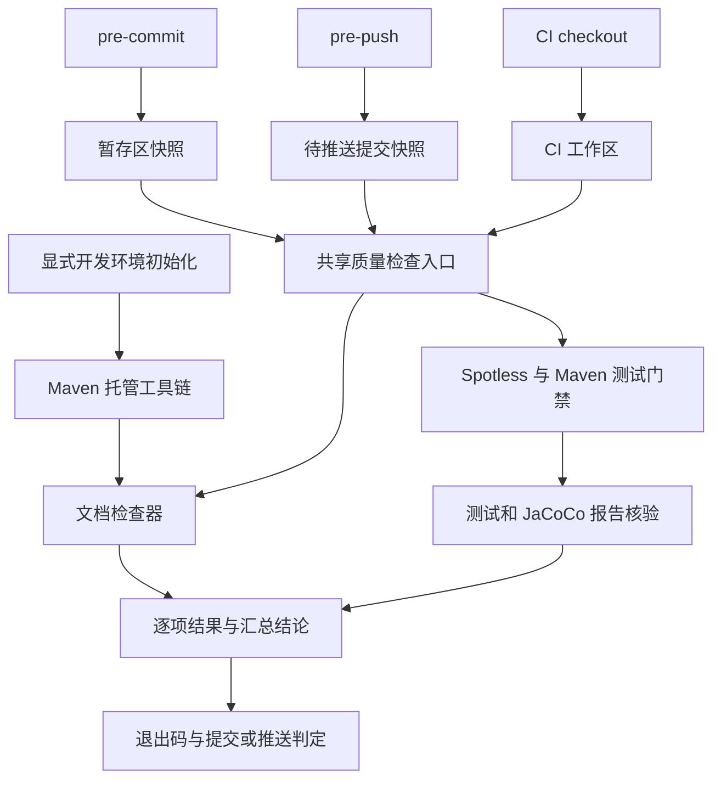

# Agent 文档治理与本地质量门禁 — 技术设计

> 阅读边界：下方保留初始方案。后续日常离线检查调整已将 pre-push 从 full 改为提交快照上的 quick；CI 与发布仍执行 full。当前操作入口与触发条件以[测试与质量指南](../../../engineering/testing.md)及其链接的实现为准。

## Context

用户已在会话中确认 docs 优先服务 Agent、人主要阅读 README、目录收敛和完整的本地质量门禁。基线为 `6275137bd17b3c5543ed852ee3abec4bb9af16fb`。规划目录 v2.3.0 按 main 与最近 v2.2.1 tag 推导；根 POM 当前仍为 2.2.2-SNAPSHOT，规划版本不构成发版承诺。

历史基线（非当前实现）的 CI 使用独立 Markdown action，再调用旧 `scripts/ci-preflight.sh` 执行 Maven 与报告核验。该基线记录了 TD-043 的 JaCoCo 报告早于集成测试、TD-044 的 Spotless 无源配置继承漏扫，以及 gardening 人工提示返回 1 后短路后续检查的问题；当前实现统一由下述质量入口编排。

另一会话在 `.worktrees/fix-markdown-prepush` 留有未提交草稿：Markdown 修复、npm 清单、pre-push 和安装脚本。草稿只检查工作区，尚未满足本设计的 Maven 托管和精确版本检查要求。实施时先记录该工作树 diff，与对应会话协调后逐项复用；不直接 merge、reset、删除或覆盖该工作树。

## Goal

- 8 个 Behavior、27 个 Scenario 均有实现任务和验收断言。
- 7 个接口契约共用工具版本、规则和报告结构；强制检查没有未执行项时才允许通过。
- 指令覆盖率 0.60、分支覆盖率 0.50；最终 XML 包含单元和集成测试覆盖数据。
- 每个受保护的源码模块必须通过格式负向验证；每份有效文档均有权威位置和入口路径。

## Non-Goal

- 不改变业务公共 API、配置默认语义、依赖版本基线或发布仓库。
- 不提高覆盖率百分比，不新增独立单元测试覆盖率指标，不让首版按改动范围省略推送全量验证。
- 不修改远端分支保护，不认为本地 hook 无法绕过；不在本轮自动归档 v2.2.1。
- 不建设文档网站、不生成空目录、不重写历史事实，不修改个人技能库的固定路径规则。
- 文档目录迁移及缺少专项证据的场景仍按计划跟踪；当前可执行入口见 Testing Strategy，命令存在不代表全部验收完成。

## Architecture

仓库以 `tools/engineering/` 统一存放 Node 清单、锁文件和工程检查实现，`src/docs/`、`src/quality/`、`src/release/` 分别负责文档、质量和发布验收；`scripts/engineering.sh` 提供统一命令，`scripts/quality-check.sh` 与 `scripts/lib/` 保留运行时准备及 Git 快照适配；`.githooks/` 只做适配。根 POM 的显式 `docs-check` profile 使用 frontend-maven-plugin 下载项目本地 Node/npm，插件声明设置 `inherited=false`。工具依赖不得加入发布 Parent 的正常构建路径。

`bash scripts/engineering.sh quality --mode full --source worktree` 是本地和 CI 共用的统一完整验收入口。Node 调度器固定执行文档、构建模型、发布契约、隔离消费者和签名，再运行 Java 子检查 `bash scripts/engineering.sh java`；不因环境或变更分类跳过基础检查。默认 `RUN_SONAR=false`，因此本地 full 只等价 CI 基础检查，不包含 Sonar。独立检查失败仍汇总其他检查结果。普通 `./mvnw verify` 和依赖安装不修改 Git 配置。

工具目录的 Node、npm、markdownlint-cli2 和插件版本由精确版本配置与锁文件管理；实现 T1 以 CI 已使用的检查器版本为兼容基线，锁定实际验证的组合。不在全局 README 重复写易变版本。工具缓存位于仓库共同 Git 目录下的 `mimir-quality/cache/`，以平台、运行时版本和锁文件内容摘要分区；临时执行目录按运行唯一创建，不在多个 worktree 之间共享可变 node_modules。

`scripts/lib/engineering-tool.sh` 负责准备、校验和启动 `tools/engineering/` 的受管 Node，透传参数与退出码并拒绝入口路径逃逸；对外使用 `bash scripts/engineering.sh <命令> [参数...]`。已安装且校验和匹配时不覆盖正在运行的 Node，支持发布契约的嵌套命令。

## Interface Contract

### IC-01 显式初始化（B2）

- 接口：`bash scripts/setup-dev.sh`；输入为当前非裸仓库和 Java 17 环境；成功返回 0，环境、下载或 hook 冲突返回 2。
- 步骤：解析当前工作树及 common Git dir，检查有效 hooksPath 和默认 hook 中是否已有自定义内容；准备精确版本工具并运行自检，再设置仓库本地 `core.hooksPath=.githooks`。
- 重复初始化相同路径为幂等操作；遇到其他有效 hook 路径或自定义 hook 内容时退出并说明迁移方法，不自行覆盖、串联或使用 `--global`。
- 该配置会影响共用 Git 配置的 worktree，必须检查已存在工作树是否都具有目标 hook 文件及可执行位。`.githooks` 相对路径按 Git 执行 hook 时的当前工作树根解析；若存在 worktree 级 hooksPath 覆盖而与目标不一致，也视为冲突。所有已存在 worktree 的有效路径和可执行文件一致后才写共同 local 配置。以后创建或切换到缺 hook 的分支需要重新 setup 校验，本地 hook 不能证明自身始终已启用，CI 继续独立检查。缺失时拒绝统一启用，列出工作树，交由维护者先对齐；不得静默使其他工作树失去门禁。
- 单独准备工具的 Maven profile 不安装 hook；只有显式 setup 命令安装。失败前后配置和源文件不变，下载缓存可以保留。

### IC-02 文档检查（B1、B3、B8）

- 接口：`./mvnw -N -Pdocs-check verify`，默认扫描当前仓库受 Git 跟踪的全部 Markdown。
- 可选属性：`-Ddocs.mode=format|full` 选择模式（Maven profile 默认 format），`-Ddocs.selfTest=true` 显式执行检查器自检，`-Ddocs.report=<absolute-json-file>` 指定报告输出。Node 入口支持 `docs --root <absolute-path> --mode full --report <absolute-json-file>`；hook 快照通过内部运行清单传递源 tree/commit。format/full 均读取同一份文档策略。
- 内核：`runDocsCheck({root: string, files: string[], mode: 'format' | 'full', reportPath: string}): Promise<CheckReport>`，由 `tools/engineering/src/docs/check.mjs` 提供。
- `format` 使用 markdownlint-cli2；`full` 加入内部链接与锚点、索引可达性检查。扫描排除 `.git`、`.worktrees`、node_modules、target、缓存与临时目录；不因文件未被某个宽泛 glob 匹配而跳过应检查的 tracked Markdown。
- 沿用 `.markdownlint.json` 规则。CHANGELOG 等既有格式豁免在 `policy.json` 显式登记，仍检查它们的内部链接；新文档不自动扩大豁免。
- 链接使用 Markdown 解析器处理 inline/reference link、图片、相对路径、目录 index/README、URL 编码和中文/重复标题锚点；不从代码块或行内代码识别普通文档链接。显式 HTML anchor 支持 GitHub 页面行为。外部网络 URL 不作为本地阻断检查。
- 可达性从 AGENTS.md、README.md、docs/index.md 出发，并正确解析目录链接的 index/README。所有发现到的 Markdown 默认参与导航；只有 `docs/archive/**`、设计模板和 CHANGELOG 等显式例外不要求可达。文档新增或迁移无需维护 effective/historical 白名单。
- 技术债台账保留为普通 Markdown 文档；质量门禁不再校验技术债 ID、排序、摘要或注册表，也不维护技术债编号注册表。编号治理由文档维护流程和人工评审负责。
- 每个检查返回独立结果；一个普通违规不终止其他独立检查。结构化结果写入失败为工具错误，总体不能返回成功。

发布构建模型检查已由 Python 迁入 `tools/engineering/src/quality/verify-build-model.mjs`，纳入 full，也可通过 `bash scripts/engineering.sh build-model` 单独运行。它使用 XML 解析器核验全部 Reactor 模块在 default/`maven-central` 下的 GPG 属性、插件与 execution 开关，要求 Java 17；可通过 `MIMIR_BUILD_MODEL_M2` 指定 Maven 缓存。执行时会向本地缓存安装根、BOM、Parent 元数据，并生成临时 effective POM。

### IC-03 提交前快速检查（B4）

- 接口：`.githooks/pre-commit` 调用 `bash scripts/engineering.sh quality --mode quick --source index`。
- 输入是 Git 索引的完整快照，包括暂存配置、源码和工具锁文件。导出后执行索引快照内的共享入口，外层 `--source index` 仅负责导出，内层固定调用 `--mode quick --source worktree` 并消费清单，不再次导出；检测已有 QUALITY_SNAPSHOT_MANIFEST 时若仍请求 index/commit，返回参数错误 2，防止递归。采用 IC-04 的重新调用协议；运行清单 source=index、commit=null，并携带相对 HEAD（首次提交为空树）的 changedFiles，快照内不再调用 git diff 猜变更范围。使用索引导出到唯一临时目录，不执行 stash、reset、checkout 或自动 git add；路径处理采用 NUL 分隔，覆盖空格、中文和删除/重命名。
- 工程工具、Shell 入口、Git hooks、Maven 与格式配置变更同时触发文档和 Java 格式检查；普通 Markdown/Java 变更触发对应格式检查。发布验收 fixture 属于 full，quick 不运行。临时 Git/错误注入验收只生成在临时目录，不提交测试目录。
- 其他文件依据暂存变更决定检查类别：Markdown 或文档规则变化触发文档格式检查；Java、POM、格式规则变化触发 Java 格式检查。相应类别先全量检查快照内的受管文件，首版不实现文件级格式增量优化。
- Java 使用快照的 `./mvnw -Pci spotless:check`，不添加 `-N`，覆盖多模块源码，不编译、不执行测试。文档使用 IC-02 的 format 模式，Maven 属性 `-Ddocs.mode=format`；full 验收使用 `bash scripts/engineering.sh docs --root <绝对路径> --mode full --self-test`。没有相关文件变化时记录原因明确的 `not_applicable`。
- 工具缓存不匹配暂存锁文件时拒绝检查并提示重新初始化。已格式化但未暂存的内容不得影响结果；失败不创建 commit，退出码沿用统一结果。

### IC-04 推送前完整检查（B5）

- 接口：`.githooks/pre-push <remote-name> <remote-location>`，从 stdin 读取 Git 提供的 `<local-ref> <local-oid> <remote-ref> <remote-oid>` 行；不自行猜测 origin/main。
- 非删除引用将 local OID 解析到 commit（含 annotated tag）；不能解析为 commit 的对象返回明确不支持错误。每个不同 tree OID 在本次执行中最多完整检查一次；删除行只记录 `not_applicable`。
- 调用：`bash scripts/engineering.sh quality --mode full --source commit --commit <sha>`；新分支也检查完整目标树，不依赖旧远端 SHA 可用，不为取范围执行 fetch。
- 完整快照含待推送提交的构建脚本、配置和工具锁；快照缺失检查契约时返回明确失败，不用当前工作区脚本冒充被推送版本规则。旧版本标签的补推属于单独评估操作，不能静默放行。
- 调度算法：当前 hook 只读取 ref 并导出目标树到临时目录；随后切换到该目录，执行其中的 `bash scripts/engineering.sh quality --mode full --source worktree`，通过由导出器提供的只读运行清单传递 source=commit、commit/tree 和文件清单。`--source commit` 命令也必须执行同样的导出和重新调用过程，不能仅把 root 参数传给当前工作区的检查实现。隔离子进程清除 Git 仓库定位环境变量，所有 Maven、policy、脚本及锁文件均取自目标树；缺入口立即失败，禁止回退当前版本。运行清单路径由 `QUALITY_SNAPSHOT_MANIFEST` 传入，包含 originRoot、source、commit、tree、files、changedFiles（完整模式可为空数组），消费者只读并核对导出内容。
- 快照执行不会触碰当前 worktree 的 target、源文件或索引。一次多引用推送任一目标失败即整体拒绝；日志中记录受检 ref、commit 和 tree。
- 同一运行内可以复用同一 tree 的结果；首版不缓存跨运行的质量通过结论，只缓存依赖和工具。

### IC-05 Java 完整质量与报告核验（B6）

- 接口：`bash scripts/engineering.sh java`，作为 full 的 Java 子检查；在受检执行根中调用 `./mvnw -B -Pci clean verify`，保留既有 RUN_SONAR 环境契约。
- 根 POM 无源 Spotless 配置设置不继承，或采用经 effective POM 验证的等价覆盖；不得通过全局跳过规避 TD-044。每个真实 Java 模块显式验证受检源码范围。
- JaCoCo `report` 从 `test` 移到集成测试结束后的 `verify`，与 `check` 使用相同最终 exec 数据；prepare-agent 同时服务 Surefire/Failsafe 且数据追加，单次构建以 clean 清除旧数据。每模块报告不被后续测试覆盖；构建顺序由 effective POM 和集成覆盖 fixture 核实。
- `check` 读取执行数据判定阈值，并非读取 XML；report 生成的最终 XML 是上传和 Sonar 的输入。二者分别验证，不能只移动 report 就认为阈值检查已经合格。
- 指令/分支门槛仍为 0.60/0.50，BUNDLE 级；沿用既有 entity/dto/vo/Application 排除并在期望报告矩阵登记。纯 POM 或无可测源码模块可以豁免，必须带理由。
- 核验接口：`bash scripts/lib/engineering-tool.sh src/quality/verify-java-reports.mjs --root <execution-root> --expected <expected-report-json> --report <result-json>`，实现位于 `tools/engineering/src/quality/verify-java-reports.mjs`。检测 Surefire/Failsafe XML 的 errors/failures/skipped，以及每个应产出报告模块的报告存在性、内容和当前运行归属。
- 期望报告矩阵来源于本次有效 reactor、源码/测试清单及 effective POM 的包括/排除规则，保存在本次运行目录；不能从已经生成的报告反推应有报告。无某类测试的模块明确豁免；真实测试被 skip 不能豁免。
- 新鲜度：每次执行生成唯一 runId 与 build-manifest.json，记录 executionRoot、开始时间、expectedReports 和 expectedExec。Maven 启动前仅清理这些声明的旧报告/exec 路径并确认全部不存在，清理失败即 error；不删除源码。然后唯一调用 clean verify。仅在 Maven 成功、clean 阶段成功且应有产物重新出现时，计算产物 SHA-256 写入本次 manifest；核验器逐项比对路径、摘要及 runId，缺 manifest、清理失败、构建中断或外来旧报告均不能通过。时间戳只辅助诊断，不作为唯一归属依据。
- Maven 失败时按阶段记录失败和依赖未执行；允许解析已产生报告用于定位，不会将其提升为通过。成功但缺少预期报告仍返回失败。
- Sonar 不是同一次 Maven invocation：仅当 `RUN_SONAR=true` 且 `SONAR_TOKEN`、`SONAR_ORGANIZATION`、`SONAR_PROJECT_KEY` 由环境提供时，在 `clean verify` 成功并完成报告核验后独立执行 `./mvnw -B -Pci sonar:sonar`，并通过 `-Dsonar.qualitygate.wait=true` 等待 Quality Gate。缺少任一变量为配置错误；不记录凭据值。

### IC-06 共享调度与 CI（B3、B5、B7）

- 接口：`bash scripts/engineering.sh quality --mode <quick|full> --source <worktree|index|commit> [--commit <sha>] [--report <absolute-json-path>]`；commit source 必须提供 sha，其他 source 禁止该参数；参数错误返回 2。
- `quick`：IC-03 的格式分类检查；`full`：文档 full、构建模型、`src/release/verify-contracts.mjs`、隔离消费者、临时密钥签名，最后执行 IC-05 的 Java 子检查（`bash scripts/engineering.sh java`，其中包含 `./mvnw -B -Pci clean verify` 及报告核验）。检查清单固定，不受变更路径或 CI 标志影响。
- 文档与 Java 构建是独立检查，分别执行并收集退出码；测试与覆盖率依赖编译，不在编译失败后宣称已运行。禁止仅用一串 `&&` 后输出统一成功，也禁止忽略子进程错误。
- CI 和 Release 发布前验收均调用 `bash scripts/engineering.sh quality --mode full --source worktree`；保留 Java 17、Sonar 条件及 always 上传报告逻辑，CI 中不另写一份本地验收实现。
- 本地 full 默认 `RUN_SONAR=false`，只等价 CI 基础检查，Sonar 标记 `not_applicable`；CI 仅在 push 到 `main`/`develop` 且三个凭据均配置时设置 `RUN_SONAR=true`。若已确认目标项目、分支和上传授权，才可通过环境提供三个变量复现该阶段；Sonar 已被要求执行而失败时不能降级为不适用。
- 无论工作区或快照，原始 Maven stdout/stderr、各门禁结果和工具版本都保存在同一次运行目录。CI 上传质量汇总和现有测试/覆盖率报告，失败日志中标记未执行阶段。

### IC-07 文档职责与迁移（B1、B8）

- 输入：当前有效文档和 [迁移矩阵](./migration.md)；输出：AGENTS.md 任务导航、docs/index.md 文档地图、design-docs 架构设计、standards 项目规范、engineering 操作规程、README 使用契约。
- ARCHITECTURE.md 只保留系统边界、依赖方向与核心基线；arch-module-dependencies.md 负责模块归属与改动落位，避免重抄同一依赖表。
- `docs/SECURITY.md` → `docs/standards/security.md`；`docs/RELIABILITY.md` → `docs/standards/reliability.md`；操作内容分别进入 engineering 开发、测试或发布规程。其余文件按迁移矩阵逐项吸收并删除旧路径。
- 新增 `docs/engineering/{index,development,testing,release,new-starter}.md`，每份规程包含适用任务、前置条件、执行入口、产物、通过标准、失败处置。使用契约和例子链接模块 README。
- 迁移同步更新 AGENTS.md、README 中已有正常文档链接、docs/index.md、设计索引、所有受影响 Markdown 引用及仓库内脚本的旧路径调用。外部技能库不在写入范围；记录外部旧路径依赖，不能删掉被必需工具硬编码依赖的文件后声称兼容。
- 迁移使用显式旧→新路径/锚点映射，支持重复和中文标题；先更新内部引用，再删除旧路径。本轮不保留旧锚点、跳转页或兼容入口；出现外部固定路径消费者时另行评估。
- 历史正文只改链接、格式和必要历史标识，不回写当前实现结论。台账已解决条目须等负向验证及完整门禁通过后才能移出活跃表，记录保留在本需求计划。

## Data Model

`CheckReport` 为 JSON，`schemaVersion=1`。每项检查包含：

| 字段 | 类型 | 约束 |
|---|---|---|
| runId | string | 同一检查运行唯一 |
| startedAt / finishedAt | string | ISO-8601 时间 |
| reportDirectory | string | 本次运行的绝对目录 |
| toolVersions | object | 工具名称到实际版本的映射 |
| source | string | worktree / index / commit |
| commit | string 或 null | commit 模式必填 |
| tree | string | 索引/提交 tree OID；工作区模式为跟踪内容摘要 |
| configurationHash | string | 包含规则、POM、工具清单与锁文件内容摘要 |
| checks | array | 所有适用和必需检查均有唯一 id |
| checks[].id | string | 本次运行唯一检查标识 |
| checks[].command | string[] | 实际 argv；内部检查为空数组，不记录凭证 |
| checks[].dependsOn | string[] | 同报告内其他检查 id，禁止循环 |
| checks[].logPath | string 或 null | 本次报告目录内原始日志；未执行为 null |
| checks[].status | string | passed / failed / error / not_run / not_applicable |
| checks[].required | boolean | 是否为当前模式必需项 |
| checks[].exitCode | integer 或 null | 未执行或无进程时为 null |
| checks[].reason | string 或 null | 非 passed 状态必填 |
| checks[].durationMs | number | 实测；未执行为 0 |
| findings | array | severity=error/warning/info，含 rule、path、line、message |
| overall | string | passed / failed / error |

普通违规整体返回 1；工具或参数错误返回 2；仅所有必需项 passed（或规则明确的 not_applicable）才返回 0。warning 不单独改变退出码；必需 not_run 导致整体 failed，执行依赖缺失为 error。不将“空检查集合”作为 full 模式成功，纯删除推送由 hook 显式处理。

## Error Handling

- 下载与注册表：首次初始化失败返回 2；保留诊断和可复用下载，hook 不临时联网换版本。
- 缓存：校验版本和锁文件摘要后才复用；损坏缓存返回 2 并提示重新初始化，不篡改依赖锁。
- 文件系统/Git：无法导出索引、无法解析对象、临时目录写入失败或信号中断时拒绝提交/推送，并仅清理本次拥有的临时目录。
- 并发：每次使用独立快照、依赖安装目录和报告；共享下载缓存需要锁或原子发布，禁止并发修改当前源码或共用 target。
- 配置：hooksPath 冲突不覆盖；有效 POM 解析失败不假定报告豁免；不支持的链接表达式列出诊断，不静默当作成功。

## Non-Functional Requirements

| 维度 | 指标及依据 |
|---|---|
| 正确性 | 27 个 Scenario 全部有断言或人工语义证据；所有必需检查都有结果 |
| 覆盖率 | 每适用模块指令 ≥ 0.60、分支 ≥ 0.50，沿用现有 POM |
| 可复现性 | 工具使用精确版本与锁文件；本地/CI 无两份独立阈值配置 |
| 隔离性 | hook 前后源码/索引/未跟踪内容变更数为 0；只写本次缓存、快照、报告 |
| 性能 | 不承诺秒级时限；记录首次准备及缓存命中耗时，提交前不运行测试，推送前全量 |
| 平台 | 本轮验证 Linux/WSL、Java 17、仓库 Maven Wrapper；不宣称未验证的原生 Windows 支持 |
| 边界 | 0 个全局 Git 配置写入，0 个发布 Parent 正常路径的 Node 依赖 |

## Alternatives Considered

| 方案 | 优点 | 代价与决定 |
|---|---|---|
| Maven 托管现有检查器 | Java 项目统一入口、保留 Markdown 规则兼容性 | 首次下载 Node/npm；已采纳 |
| 全局 npm 或 npm prepare 安装 hook | 接入代码较少 | 需要开发者管理全局运行时且安装副作用不透明；不采用 |
| Docker 检查器 | 工具环境易固定 | 增加 Docker 可用性、挂载与启动成本；不作为默认 |
| 改用纯 Java Markdown 检查器 | 无 Node 工具链 | 需重验规则等价性和链接解析行为；本轮不替换 |
| 每次 commit 全量测试 | 提交阶段就能发现测试失败 | 打断频繁提交；全量门禁放 pre-push |
| hook 扫描当前工作区 | 实现简单 | 无法证明暂存/待推送内容合格；拒绝 |

## Testing Strategy

| 契约 | 当前可执行入口 | 层级与通过标准 |
|---|---|---|
| IC-01 | `bash scripts/setup-dev.sh`；临时 Git 验收见下方说明 | 显式初始化、重复初始化和 hooksPath 冲突按约定返回；失败不改配置 |
| IC-02 | `bash scripts/engineering.sh docs --root <绝对路径> --mode full --self-test` | 文档格式、链接、导航和工具自检均有结果；必需检查通过才返回 0 |
| IC-03 | `bash scripts/engineering.sh quality --mode quick --source index` | 只检查暂存快照的文档/Java 格式；不运行测试，索引和工作区保持不变 |
| IC-04 | `bash scripts/engineering.sh quality --mode full --source commit --commit <sha>` | 对目标提交执行完整检查；实际推送、多引用失败阻断和远端引用断言见下方临时验收 |
| IC-05 | `bash scripts/engineering.sh java`；Maven 子步骤为 `./mvnw -B -Pci clean verify` | 测试、JaCoCo 最终报告及报告核验通过；满足条件时再独立 Sonar 并等待 Quality Gate |
| IC-06 | `bash scripts/engineering.sh quality --mode full --source worktree` | 文档、发布契约、消费者、签名和 Java 子检查全部有结果；默认只覆盖 CI 基础检查 |
| IC-07 | `bash scripts/engineering.sh docs --root <绝对路径> --mode full --self-test` 与人工迁移矩阵核对 | 全库格式、链接和导航通过；人工核对历史语义、README 契约及旧路径去向 |

上述命令是当前可执行入口，不等于已经完成所有行为断言。现有单独命令无法证明 Git hook 的原子性、暂存内容隔离和故障注入后的不变性；以下仅定义临时验收步骤，不创建仓库内永久测试脚本，也不把未执行步骤写成已验证：

1. 在 `mktemp -d` 创建的临时普通仓库和 bare remote 中，复制待验收入口并建立第二个 worktree；分别记录 setup 前后的 `git config --local --list`、`git status --short`、`git diff --cached` 和 HEAD。验证首次初始化、重复初始化、hooksPath/自定义 hook 冲突及另一 worktree 缺 hook 的预期退出码，确认失败不改配置。
2. 在同一临时仓库制造“工作区已修复、索引仍为错误版本”的部分暂存，运行 `bash scripts/engineering.sh quality --mode quick --source index` 及实际 commit hook；断言检查读取索引、拒绝错误版本，且工作区、索引和 HEAD 的字节摘要不变。向临时 bare remote 发送新分支、非 HEAD、多 ref 一成一败、annotated tag 和删除 ref，断言任一失败时远端引用保持不变。
3. 在临时副本中通过受控 wrapper 或故障 HTTP fixture 注入 Maven/工具缺失、报告写入失败、构建中断、旧报告和 Sonar 失败；分别运行 `bash scripts/engineering.sh contracts`、`bash scripts/engineering.sh java` 或完整入口，核对 `failed`、`error`、`not_run`、`not_applicable` 和退出码 0/1/2 的映射。复核后删除临时目录，不修改当前工作树。

Spotless 负向、JaCoCo 集成测试覆盖和 Sonar Quality Gate 仍须保留真实工具/受控服务证据；没有相应运行记录时只标记为待验收，不以 mock 或文档命令本身宣称通过。

## Milestones

1. T1 工具链与文档格式基线；T2 可信文档检查；T3 修正 Java 门禁。
2. T4 统一调度与快照；T5 安装与 Git hooks；T6 CI 收敛。
3. T7 当前文档迁移；T8 独立全局验收及交付记录。

## 参考

- [需求规格](./spec.md)、[实施计划](./plan.md)、[迁移矩阵](./migration.md)。
- [文档与门禁治理 RFC](../../../design-docs/arch-docs-quality-governance.md)。
- [Maven 生命周期](https://maven.apache.org/guides/introduction/introduction-to-the-lifecycle.html)。
- [frontend-maven-plugin](https://github.com/eirslett/frontend-maven-plugin)。
- [Git hooks](https://git-scm.com/docs/githooks)。
- [JaCoCo report](https://www.jacoco.org/jacoco/trunk/doc/report-mojo.html) 与 [check](https://www.jacoco.org/jacoco/trunk/doc/check-mojo.html)。
