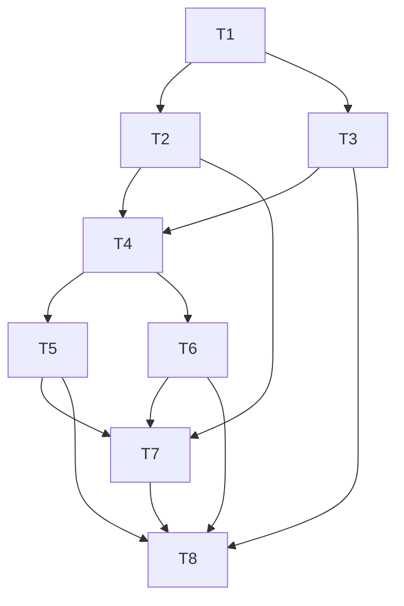

# Agent 文档治理与本地质量门禁 — 实施计划

**Branch:** feature/docs_quality_governance_2.3.0
**Baseline SHA:** 6275137bd17b3c5543ed852ee3abec4bb9af16fb
**Worktree Path:** [待填充]
**Started At:** [待填充]
**Updated At:** 2026-09-14
**Resolved Path:** docs/active/v2.3.0/docs-quality-governance/
**Goal:** 先建立可信本地质量门禁，再完成 Agent 文档职责与目录迁移。
**Architecture:** Maven 托管工具；共享调度器绑定索引或提交快照；Git hooks 和 CI 调用同一检查；README、design-docs、engineering 与历史目录各司其职。
**Tech Stack:** Java 17、Maven Wrapper、Spotless、Surefire/Failsafe、JaCoCo、Maven 托管 Node/markdownlint、Bash、Git。
**Commit Mode:** per-task
**Effective Execution Mode:** [待填充]
**Ledger Mode:** controller-commits

用户已批准按本计划实施。开始执行前仍需完成隔离、基线、计划结构和任务级验证；本计划不授权 push、merge、rebase 或其他历史改写。所有 Task 初始 pending 不表示存在阻塞。

**Plan Verdict:**

- **Status:** pending
- **Verified At:** null
- **Evidence:** null
- **Blocked Tasks:** none
- **Concerns:** none

**Accepted Risks:**

| Risk ID | Risk | Accepted By | Accepted At | Source |
|---|---|---|---|---|
| none | none | none | none | none |

## 方案审查记录

此处仅记录方案审查，独立于上方实施完成状态。2026-09-14 方案审查结论为 PASS：Spec、Design、Plan、Migration、RFC 的正确性、可行性、完整性和可维护性均为 4/5，按公共评分规则加权均分 4.00/5，无未解决 P0/P1。该结论只表示方案可实施，所有实施任务仍为 pending。

首轮发现 5 项 P1、4 项 P2，结论 FAIL（3.58/5）；修订复核确认原问题闭合，并补充 2 项 P1、1 项 P2。最后定点复核确认 T7 迁移执行表、index 重调用防递归及控制文件清单均已补齐。

| 审查项 | 修订位置与处理 |
|---|---|
| 实际受检脚本 | IC-03/04、T4：导出后执行目标树脚本，差异脚本反例验证 |
| 退役编号复用 | IC-02、T2/T8：持久编号注册表、高水位与退役状态 |
| 控制文件触发 | IC-03、T4/T5：明确清单，两类格式检查；quick 仍不运行测试 |
| RFC 提交前范围 | RFC：统一只做格式检查 |
| RFC 状态更新 | T8：通过最终验收后同步 RFC 与设计索引 verified |
| worktree 配置 | IC-01：相对路径、覆盖配置与缺 hook 的处理边界 |
| 结果证据字段 | Data Model、T4：检查 id、命令、依赖、版本、日志和运行时间 |
| 报告新鲜度 | IC-05、T3：运行清单、旧产物清理与本次产物摘要 |
| 迁移目标与兼容 | migration：质量观察唯一去向、外部依赖和兼容入口字段 |

本轮文档验证：10 份新增/调整文档经 markdownlint-cli2 检查为 0 问题；74 份 Markdown 的 220 个 inline 相对链接/锚点检查为 0 断链（临时检查器尚不覆盖全部 Markdown AST）；仓库文件隔离快照通过 docs-evolve 结构检查。主工作区直接运行旧结构脚本会误扫另一 worktree，隔离检查避免此污染，未修改外部技能。全库仍有 4 份旧文档的 5 处 MD028/MD029，归 T1 实施修复，不宣称全库格式已经通过。

审查委派：1 个 luna-worker，完成 2 轮方案审查和 1 轮定点修复验证；预算修订为将最后一轮限定在剩余 3 项发现，未重复扩展范围，停止原因为问题闭合。最多并发 1 个 reviewer，耗时未单独可靠计量。下方 Dispatch Ledger 留给后续实施，当前没有已执行 Task。

## Dispatch Ledger

**Budget:** uninitialized; owner=start-execution; elapsed_budget=unknown; token_budget=unknown; budget_revision=initial

| objective | scope | actor_kind | role | model | started_at | finished_at | status | attempt | attempt_limit | elapsed | stop_reason | strategy_change | evidence | budget_revision |
|-----------|-------|------------|------|-------|------------|-------------|--------|---------|---------------|---------|-------------|-----------------|----------|-----------------|

## Global Constraints

- Java 17；根 POM 2.2.2-SNAPSHOT 不因规划目录 v2.3.0 自动变更；Spring Boot/Cloud 基线不调整。
- 覆盖率按适用模块指令 ≥ 0.60、分支 ≥ 0.50；单元及集成测试覆盖共同贡献，保留并明确既有排除口径。
- Node/npm、Maven 插件与检查器在 T1 锁定实际验证的精确版本并生成锁文件；本地与 CI 使用同份配置，不依赖全局 Node。
- pre-commit 检查实际索引中的相关格式类别且不运行测试；pre-push 首版全量验证实际待推送版本；CI 使用相同核心。
- hook 不自动改源码、暂存或分支；仅显式 setup 写仓库本地 hooksPath，禁止全局配置修改或覆盖已有 hook。
- 独立检查分别收集退出码；依赖无法运行显示 not_run；必需项缺失/失败/错误都不能总体通过。
- 根 README 不引用 TD/技术债台账，保留徽章与核心版本；docs 面向 Agent；历史记录只改必要格式/链接/标识，不自动归档。
- 不修改个人技能库；外部固定路径依赖通过最小跳转入口或显式兼容记录处理。
- 不触碰另一会话 .worktrees/fix-markdown-prepush 未提交草稿；实施前记录清单并协调复用，不把草稿视为已验证实现。
- WSL 需要 Node 时先 source ~/.nvm/nvm.sh；门禁自身仍通过 Maven 管理的运行时执行，不能依赖此全局环境。
- 命令、接口路径与创建文件均为实施契约；在对应 Task 实现前不存在是预期状态，不得伪造已执行证据。

## Dependency Graph

| Task | 依赖 | 可并行组 |
|---|---|---|
| T1 Maven 文档工具链与格式基线 | 无 | A |
| T2 文档规则与可信结果模型 | T1 | B |
| T3 Spotless、覆盖率时序和报告完整性 | T1 | B |
| T4 共享调度器与受检快照 | T2, T3 | C |
| T5 显式安装与 Git 提交推送门禁 | T4 | D |
| T6 CI 统一入口与证据上传 | T4 | D |
| T7 Agent 文档职责与目录迁移 | T2, T5, T6 | E |
| T8 独立验收与实施交付记录 | T3, T5, T6, T7 | F |

B 组 T2 与 T3 不共享写入文件；D 组 T5 与 T6 不共享写入文件。根 POM 由 T1 后交给 T3，CI 由 T6 独占，入口和长期文档在 T7 集中迁移。所有执行者禁止再次委派，controller 负责合并与独立验证。

### T1: Maven 文档工具链与格式基线

**Depends on:** 无

**Files:**

- Create: `tools/docs-check/package.json`、`tools/docs-check/package-lock.json`、`tools/docs-check/check.mjs`、`tools/docs-check/bootstrap.mjs`、`scripts/docs-tool.sh`
- Modify: 根 `pom.xml`、`.gitignore`、`.markdownlint-cli2.jsonc`
- Modify: `mimir-boot-starters/mimir-boot-starter-{rpc-core,dubbo,feign}/README.md`、`docs/active/v2.2.1/foundation-quality-hardening/plan.md`（仅 MD028/MD029 格式修复）
- Test: `tools/docs-check/test/toolchain.test.mjs`

**Interfaces:**

- Consumes: none。
- Produces: `./mvnw -N -Pdocs-check verify`；`bash scripts/docs-tool.sh <entry-relative-path> [args...]` 以受管 Node 执行 tools/docs-check 内入口，缺工具返回 2；IC-02 的 `runDocsCheck({root: string, files: string[], mode: 'format' | 'full', reportPath: string}): Promise<CheckReport>`，此任务只实现 format，full 由 T2 补齐。

**Behavior:**
开发者只使用 Maven 即可下载并运行固定版本文档检查器。配置只作用于本仓库根聚合模块；修复现存 Markdown 错误且保留原文语义，为后续门禁建立真实可执行基线。

**Acceptance Criteria:**

- [ ] AC1: 未安装全局 Node 的 Java 17 环境可经 Maven 完成格式检查；精确工具版本与依赖锁匹配，下载产物被忽略。
- [ ] AC2: 3 份 Starter README 的列表保持同一列表的代码块缩进，历史计划相邻引用修复后实际 markdownlint 返回 0。
- [ ] AC3: 受管工具缺失或锁不匹配明确失败；子模块有效 POM/发布 Parent 正常构建路径不继承 Node 工具链。

**Execution:**

- **Status:** pending
- **Commit SHAs:** []
- **Dispatch Base SHA:** null
- **Dispatch Ref:** null
- **Attempts:** 0
- **Blocked Reason:** null
- **Red Result:** null
- **Verify Result:** null
- **AC Result:** null
- **Concerns:** none

**Task Completion Gate:**

- [ ] Red 证据存在，失败原因或基线状态与本任务一致。
- [ ] Verify 证据存在，退出码和结果通过。
- [ ] 所有 per-task AC 均有已核实证据，未接受的延后项为 0。
- [ ] 有序 Commit SHAs 全部属于本 Task；未获提交授权时不标记此项完成。
- [ ] AC checkbox 与实际验证同步。

**Step 1: Red**

先记录另一 worktree 的未提交 diff；不得覆盖。创建临时文档 MD028/MD029 反例，并运行当前 CI 同版本检查器确认失败；在清理全局 Node PATH 的测试环境执行新入口，确认未实现时失败。

**Step 2: Green**

为根 POM 添加 docs-check profile，工具插件声明设置 inherited=false；使用 frontend-maven-plugin 在 bootstrap 配置中锁定 Node/npm、markdownlint-cli2 与插件精确版本，生成依赖锁。缓存按平台和锁摘要隔离。修复编号时同时缩进列表代码块，不能仅把数字改回或关闭 MD029。补充 scripts/docs-tool.sh 仅解析 tools/docs-check 内入口，不能接受越界路径。

**Step 3: Verify**

`./mvnw -N -Pdocs-check verify -Ddocs.selfTest=true`；`./mvnw -N -Pdocs-check verify`；`git diff --check`。必须分别记录退出码，不用前置巡检串联掩盖后续未执行。

**AC Verification:**

AC1：移除全局 Node PATH 后运行 Maven，自检报告包含精确版本和缓存路径；AC2：实际格式检查 0 错误；AC3：缺工具 fixture 返回 2，effective POM/发布 POM 验证无 Node 执行。

**Step 4: Commit**

获当前任务提交授权后使用 `build(docs): 建立 Maven 托管文档检查入口`；中文正文说明已完成内容，修复类附根因/方案/影响。Task-ID: T1 与 Red-Evidence JSON 记录对应证据。本 Task 独占有序实现提交链，不含 plan.md；controller 单独更新并提交 ledger。普通提交不包含 push 或 amend。

### T2: 文档规则与可信结果模型

**Depends on:** T1

**Files:**

- Modify: `tools/docs-check/check.mjs`、`tools/docs-check/package.json`、`tools/docs-check/package-lock.json`
- Create: `tools/docs-check/{links,navigation,debt,policy,results}.mjs`、`tools/docs-check/policy.json`、`tools/docs-check/debt-id-registry.json`
- Test: `tools/docs-check/test/docs-check.test.mjs`、`tools/docs-check/test/fixtures/`

**Interfaces:**

- Consumes: T1 的 `runDocsCheck({root: string, files: string[], mode: 'format' | 'full', reportPath: string}): Promise<CheckReport>`。
- Produces: 同签名的 full 实现；`CheckReport` schemaVersion=1，状态 passed/failed/error/not_run/not_applicable，退出码 0/1/2。

**Behavior:**
文档检查覆盖真实 Markdown 的格式、内部链接和锚点、导航可达性、技术债一致性及维护约定。独立检查尽量全部执行，提示、违规、执行错误和未执行分开汇总，强制项未通过不能得到整体成功。

**Acceptance Criteria:**

- [ ] AC1: 中文/重复标题、显式 anchor、目录与引用式链接正确解析；代码块不被当成真实链接，外部 URL 不阻断本地检查。
- [ ] AC2: 技术债编号重复、退役 ID 复用、数字排序错误、摘要明细不对应或根 README 引用 TD 时分别失败；必要历史版本和模板示例不误报。
- [ ] AC3: 同时存在格式错误和断链时两项均有诊断；只有归档提示时返回 0；缺工具返回 2，不将空 full 结果判为通过。

**Execution:**

- **Status:** pending
- **Commit SHAs:** []
- **Dispatch Base SHA:** null
- **Dispatch Ref:** null
- **Attempts:** 0
- **Blocked Reason:** null
- **Red Result:** null
- **Verify Result:** null
- **AC Result:** null
- **Concerns:** none

**Task Completion Gate:**

- [ ] Red 证据存在，失败原因或基线状态与本任务一致。
- [ ] Verify 证据存在，退出码和结果通过。
- [ ] 所有 per-task AC 均有已核实证据，未接受的延后项为 0。
- [ ] 有序 Commit SHAs 全部属于本 Task；未获提交授权时不标记此项完成。
- [ ] AC checkbox 与实际验证同步。

**Step 1: Red**

增加格式加断链并存、warning 先发生、缺工具、引用式图片链接、中文重复标题、TD-009/TD-010、退役编号复用、浅层仓库与空 full 集合测试，先证明当前仅格式检查实现无法通过。

**Step 2: Green**

使用成熟 Markdown 解析 AST 实现链接和结构检查，锁定新增解析依赖；policy.json 明确当前有效文档、历史、模板和格式豁免。历史文件不应用终态正文规则。按 Design IC-02 初始化持久注册表并核准历史高水位；退役条目不删除、不得重用。浅层 checkout 与无 Git 元数据快照按同一注册表验证；新增 ID 与注册表变更由基线对比评审。不把语义重复和一切版本字符串交给粗糙正则。每项独立捕获结果，报告写入失败是 error。

**Step 3: Verify**

`./mvnw -N -Pdocs-check verify -Ddocs.selfTest=true`；`./mvnw -N -Pdocs-check verify`。当前库新增问题与既有问题分别列出；验收时必需规则必须通过，不能把真实错误放进无理由白名单。

**AC Verification:**

AC1/AC2：真实解析 fixture 断言 path、rule、status；AC3：结果 JSON 检查多个检查均存在及准确退出码，报告输出失败也拒绝成功。

**Step 4: Commit**

获当前任务提交授权后使用 `feat(docs): 增加文档一致性检查与结果汇总`；中文正文说明已完成内容，修复类附根因/方案/影响。Task-ID: T2 与 Red-Evidence JSON 记录对应证据。本 Task 独占有序实现提交链，不含 plan.md；controller 单独更新并提交 ledger。普通提交不包含 push 或 amend。

### T3: Spotless、覆盖率时序和报告完整性

**Depends on:** T1

**Files:**

- Modify: `pom.xml`、`mimir-boot-parent/pom.xml`、`scripts/ci-preflight.sh`
- Create: `tools/docs-check/verify-reports.mjs`、`scripts/tests/java-quality-gates-test.sh`
- Test: `scripts/tests/fixtures/java-quality/`

**Interfaces:**

- Consumes: T1 的 `bash scripts/docs-tool.sh <entry-relative-path> [args...]`。
- Produces: `bash scripts/ci-preflight.sh`（保留 RUN_SONAR 语义）；`bash scripts/docs-tool.sh verify-reports.mjs --root <execution-root> --expected <expected-report-json> --report <result-json>`。

**Behavior:**
修复根无源配置继承导致的 Java 格式漏检，并让 JaCoCo 最终报告包含单元及集成测试数据。按每个应产出报告的模块核验新鲜证据，沿用 0.60/0.50 门槛，不以任意报告存在证明全仓库验证成功。

**Acceptance Criteria:**

- [ ] AC1: 每个真实 Java 子模块的有效配置包含 main/test 源码，故意错误格式触发实际 Spotless 非零。
- [ ] AC2: 仅由集成测试执行的方法出现在最终 JaCoCo XML 的覆盖计数中；check 与 report 消费同一最终执行数据，阈值保持 0.60/0.50。
- [ ] AC3: 测试失败、被跳过、应有模块报告缺失、旧报告、阈值不足均失败；无源码/无某类测试豁免有明确原因。

**Execution:**

- **Status:** pending
- **Commit SHAs:** []
- **Dispatch Base SHA:** null
- **Dispatch Ref:** null
- **Attempts:** 0
- **Blocked Reason:** null
- **Red Result:** null
- **Verify Result:** null
- **AC Result:** null
- **Concerns:** none

**Task Completion Gate:**

- [ ] Red 证据存在，失败原因或基线状态与本任务一致。
- [ ] Verify 证据存在，退出码和结果通过。
- [ ] 所有 per-task AC 均有已核实证据，未接受的延后项为 0。
- [ ] 有序 Commit SHAs 全部属于本 Task；未获提交授权时不标记此项完成。
- [ ] AC checkbox 与实际验证同步。

**Step 1: Red**

先用 effective POM 和受控子模块格式反例复现 TD-044，用仅 IT 触达方法和报告生成时点复现 TD-043；对旧报告及缺一个模块报告添加反例。所有破坏性 fixture 在临时目录执行。

**Step 2: Green**

限制根 Spotless 无源配置的继承，保持 formatter 规则；把最终 JaCoCo report 放在 IT 结束后，验证 exec 追加与 check 时序。核验器从有效 reactor/POM/测试清单建立期望矩阵，逐模块解析 XML，拒绝 skipped/errors/failures，记录运行快照。暂不移除台账债务，等整体验收后处理。

**Step 3: Verify**

T3 新鲜度验收补充：按 IC-05 创建 build-manifest.json，在启动 Maven 前清理且确认旧报告/exec 缺席；Maven 成功后绑定产物摘要与 runId。分别注入清理失败、clean 失败、构建中断、遗留 XML 和缺 manifest，核验全部阻断。

`bash scripts/tests/java-quality-gates-test.sh`；`bash scripts/ci-preflight.sh`。本轮刻意验证成功和失败两种真实工具行为，不能只跑 mock 进程。

**AC Verification:**

AC1：实际 Spotless 负向退出码及模块列表；AC2：真实 IT fixture XML 计数和最终报告时间点；AC3：每种缺失/失败 fixture 与完整构建报告矩阵。

**Step 4: Commit**

获当前任务提交授权后使用 `fix(build): 修正格式扫描与最终覆盖率门禁`；中文正文说明已完成内容，修复类附根因/方案/影响。Task-ID: T3 与 Red-Evidence JSON 记录对应证据。本 Task 独占有序实现提交链，不含 plan.md；controller 单独更新并提交 ledger。普通提交不包含 push 或 amend。

### T4: 共享调度器与受检快照

**Depends on:** T2, T3

**Files:**

- Create: `scripts/quality-check.sh`、`scripts/lib/quality-snapshot.sh`、`tools/docs-check/quality-result.mjs`
- Test: `scripts/tests/quality-check-test.sh`、`scripts/tests/fixtures/quality-runner/`

**Interfaces:**

- Consumes: T2 CheckReport 与 full 文档检查，T3 `bash scripts/ci-preflight.sh`。
- Produces: `bash scripts/quality-check.sh --mode <quick|full> --source <worktree|index|commit> [--commit <sha>] [--report <absolute-json-path>]`，统一 0/1/2 退出码。

**Behavior:**
统一组织文档、Java、报告和既有发布契约检查，并对暂存或提交构造独立源码快照。index 与 commit 路径严格按 IC-03/IC-04 导出后执行目标树内入口，传递 QUALITY_SNAPSHOT_MANIFEST 并清除 Git 定位变量；禁止继续使用工作区检查脚本。quick 的控制文件触发清单严格消费 IC-03，相关变更同时触发两类格式检查，自测仍仅在 full/CI 执行。检查结果绑定 commit/tree、工具和规则摘要，文档普通失败不能隐藏其他独立检查，编译失败不能被错误记作测试通过。

**Acceptance Criteria:**

- [ ] AC1: quick 不运行测试，full 执行文档与检查器自测、完整 Java 构建及两个现有发布契约脚本；配置/源内容为实际受检快照。
- [ ] AC2: 部分暂存、非当前 HEAD、中文/空格/删除重命名路径以及并发两个 worktree 均不污染当前源码、索引或 target。
- [ ] AC3: 格式失败后其他独立检查仍有结果；编译失败将后续测试标为 not_run；缺工具和报告写失败返回 2；每份报告记录实际状态指纹和完整 schema 字段；schema fixture 验证 id、command、dependsOn、toolVersions、logPath。

**Execution:**

- **Status:** pending
- **Commit SHAs:** []
- **Dispatch Base SHA:** null
- **Dispatch Ref:** null
- **Attempts:** 0
- **Blocked Reason:** null
- **Red Result:** null
- **Verify Result:** null
- **AC Result:** null
- **Concerns:** none

**Task Completion Gate:**

- [ ] Red 证据存在，失败原因或基线状态与本任务一致。
- [ ] Verify 证据存在，退出码和结果通过。
- [ ] 所有 per-task AC 均有已核实证据，未接受的延后项为 0。
- [ ] 有序 Commit SHAs 全部属于本 Task；未获提交授权时不标记此项完成。
- [ ] AC checkbox 与实际验证同步。

**Step 1: Red**

补充“工作区检查脚本放行而目标脚本拒绝”的 fixture，断言只执行目标脚本；增加索引暂存脚本与工作区脚本不同、首次提交及递归保护 fixture；断言只导出一次，内层 source=worktree、报告source=index，已带manifest再次请求index/commit返回2。快照只能使用清单中的 changedFiles 分类。控制文件清单逐项参数化变更测试，确保 quick 触发两类格式但测试调用为 0。构造假检查器产生 0/1/2 与信号退出，编写快照与工作区内容不同的真实 Git fixture；检测当前不存在的共享调度契约而失败。

**Step 2: Green**

导出完整索引或指定 commit 到运行唯一目录；可复用工具下载但不能共用可变安装目录。按暂存扩展名/POM配置判断 quick 类别，全量扫描该类别；full 固定全部检查。独立收集退出码和日志，只有依赖阶段无法执行才 not_run。仅清理本次拥有的临时目录。

**Step 3: Verify**

`bash scripts/tests/quality-check-test.sh`；`bash scripts/quality-check.sh --mode quick --source index`；在包含所需契约的临时提交上运行 full commit 检查。最后一次真实全量运行由 T8 统一完成。

**AC Verification:**

AC1：进程调用计数证明没有重复 test/package/verify；AC2：前后索引/源文件/未跟踪内容摘要一致；AC3：检查 JSON 全项状态和 0/1/2，不以输出含 PASS 字样替代退出码。

**Step 4: Commit**

获当前任务提交授权后使用 `feat(quality): 统一质量检查调度与快照验证`；中文正文说明已完成内容，修复类附根因/方案/影响。Task-ID: T4 与 Red-Evidence JSON 记录对应证据。本 Task 独占有序实现提交链，不含 plan.md；controller 单独更新并提交 ledger。普通提交不包含 push 或 amend。

### T5: 显式安装与 Git 提交推送门禁

**Depends on:** T4

**Files:**

- Create: `.githooks/pre-commit`、`.githooks/pre-push`、`scripts/setup-dev.sh`
- Test: `scripts/tests/setup-dev-test.sh`、`scripts/tests/pre-commit-test.sh`、`scripts/tests/pre-push-test.sh`

**Interfaces:**

- Consumes: T4 `bash scripts/quality-check.sh --mode <quick|full> --source <worktree|index|commit> [--commit <sha>] [--report <absolute-json-path>]`。
- Produces: `bash scripts/setup-dev.sh`；无参数 pre-commit；`pre-push <remote-name> <remote-location>` 接收 Git 四列 stdin。

**Behavior:**
显式初始化后，正常提交自动检查实际暂存内容，推送自动检查每个新增目标提交。工具未就绪和已有 hooks 冲突不能静默跳过；多个引用中任一失败拒绝整次推送，纯删除不构建。

**Acceptance Criteria:**

- [ ] AC1: 初始化成功后两个 hook 具有可执行位；重复初始化幂等；其他 hooksPath/默认自定义 hook/其他工作树缺 hook 时明确拒绝，不改全局配置。
- [ ] AC2: 真实 git commit 的部分暂存错误被拦截，修复并重新暂存后通过；源文件和索引不被 hook 自动修改。
- [ ] AC3: 对本地 bare remote 的真实 git push 验证新分支、非 HEAD、annotated tag、多引用一成一败、纯删除；失败时远端引用保持不变。

**Execution:**

- **Status:** pending
- **Commit SHAs:** []
- **Dispatch Base SHA:** null
- **Dispatch Ref:** null
- **Attempts:** 0
- **Blocked Reason:** null
- **Red Result:** null
- **Verify Result:** null
- **AC Result:** null
- **Concerns:** none

**Task Completion Gate:**

- [ ] Red 证据存在，失败原因或基线状态与本任务一致。
- [ ] Verify 证据存在，退出码和结果通过。
- [ ] 所有 per-task AC 均有已核实证据，未接受的延后项为 0。
- [ ] 有序 Commit SHAs 全部属于本 Task；未获提交授权时不标记此项完成。
- [ ] AC checkbox 与实际验证同步。

**Step 1: Red**

在临时普通/裸 Git 仓库和多 worktree 中运行上述提交/推送测试，确认缺 hook 时错误内容能够通过，测试按预期失败。

**Step 2: Green**

hook 保持薄适配，不重写检查规则；pre-push 读取实际 stdin OID，peel commit，按 tree 去重本次检查。setup 先准备工具、自检、检查所有工作树，再写仓库本地 hooksPath；不在 npm prepare 或 Maven verify 自动安装。用户真实仓库的启用独立于实现测试，只有显式运行 setup 时发生。

**Step 3: Verify**

`bash scripts/tests/setup-dev-test.sh`；`bash scripts/tests/pre-commit-test.sh`；`bash scripts/tests/pre-push-test.sh`。测试用本地 bare remote，不向 GitHub 推送。

**AC Verification:**

AC1：配置快照与不同 worktree 的文件可用性；AC2：HEAD/索引前后比较；AC3：读取本地远端 ref 确认原子阻止与成功路径，不只测试脚本直接返回。

**Step 4: Commit**

获当前任务提交授权后使用 `feat(git): 接入提交与推送前质量门禁`；中文正文说明已完成内容，修复类附根因/方案/影响。Task-ID: T5 与 Red-Evidence JSON 记录对应证据。本 Task 独占有序实现提交链，不含 plan.md；controller 单独更新并提交 ledger。普通提交不包含 push 或 amend。

### T6: CI 统一入口与证据上传

**Depends on:** T4

**Files:**

- Modify: `.github/workflows/ci.yml`
- Create: `scripts/tests/ci-quality-contract-test.sh`

**Interfaces:**

- Consumes: T4 full worktree 入口与结果 schema；T3 RUN_SONAR 原有契约。
- Produces: CI 调用 `bash scripts/quality-check.sh --mode full --source worktree`，上传质量汇总、测试及覆盖率报告。

**Behavior:**
GitHub CI 与本地共用检查器、规则、工具版本和结果模型。保留现有 Java 17、Sonar 事件/凭证条件及失败时上传证据，避免独立 Markdown action 和本地实现发生漂移。

**Acceptance Criteria:**

- [ ] AC1: CI 只有一个共享质量入口，原有 Markdown、Java、报告与两个发布契约检查均未遗漏或重复。
- [ ] AC2: Sonar 不适用与执行失败有不同状态；失败时 always 上传完整质量汇总和已有报告，凭证不进入日志。
- [ ] AC3: 配置契约测试通过，CI 对同一损坏文档 fixture 与本地得到同一失败规则。

**Execution:**

- **Status:** pending
- **Commit SHAs:** []
- **Dispatch Base SHA:** null
- **Dispatch Ref:** null
- **Attempts:** 0
- **Blocked Reason:** null
- **Red Result:** null
- **Verify Result:** null
- **AC Result:** null
- **Concerns:** none

**Task Completion Gate:**

- [ ] Red 证据存在，失败原因或基线状态与本任务一致。
- [ ] Verify 证据存在，退出码和结果通过。
- [ ] 所有 per-task AC 均有已核实证据，未接受的延后项为 0。
- [ ] 有序 Commit SHAs 全部属于本 Task；未获提交授权时不标记此项完成。
- [ ] AC checkbox 与实际验证同步。

**Step 1: Red**

增加 workflow 静态契约和共享入口集成测试，验证现有独立 Markdown action 无法满足单一配置源。

**Step 2: Green**

按照 GitHub Actions 官方文档修改 workflow；保留触发器、权限、并发和报告保留策略，仅收敛检查入口并增加汇总上传。工具依赖由 Maven 准备，CI 不另装不同版本 markdownlint。

**Step 3: Verify**

`bash scripts/tests/ci-quality-contract-test.sh`；`bash scripts/tests/quality-check-test.sh`。本地检查不能宣称远程 CI 已通过；远程运行在后续用户授权推送后确认。

**AC Verification:**

AC1：解析 workflow 断言入口/检查映射；AC2：无凭证/有条件但失败的 fixture；AC3：同一输入与配置摘要对应的诊断对照。

**Step 4: Commit**

获当前任务提交授权后使用 `ci(quality): 复用本地质量检查与结果报告`；中文正文说明已完成内容，修复类附根因/方案/影响。Task-ID: T6 与 Red-Evidence JSON 记录对应证据。本 Task 独占有序实现提交链，不含 plan.md；controller 单独更新并提交 ledger。普通提交不包含 push 或 amend。

### T7: Agent 文档职责与目录迁移

**Depends on:** T2, T5, T6

**Files:**

- Modify: 本需求 `migration.md`（逐章节执行表、旧内容去向和兼容证据）
- Modify: `AGENTS.md`、`ARCHITECTURE.md`、`README.md`、`docs/index.md`、`docs/design-docs/index.md`、`docs/design-docs/{core-beliefs,module-boundaries,documentation-governance}.md`
- Migrate: `docs/{DOMAINS,SECURITY,RELIABILITY,PRODUCT_SENSE,QUALITY_SCORE,SONAR_QUALITY_DISCIPLINE}.md`、`docs/product-specs/{index,new-user-onboarding,starter-capabilities}.md`
- Create: `docs/design-docs/{security,reliability}.md`、`docs/engineering/{index,development,testing,release,new-starter}.md`
- Modify: 各模块 README 仅接入内容承接和链接；其他 Markdown 与仓库脚本仅修改实际旧路径引用。执行前输出精确受影响文件清单，不以通配范围授予源码改动。
- Reference: 本需求 `migration.md` 逐行矩阵；`docs/design-docs/arch-docs-quality-governance.md`

**Interfaces:**

- Consumes: 已批准 RFC 的约束、T2 文档 full 检查、T5 初始化/提交/推送入口、T6 CI 结果。
- Produces: AGENTS.md 任务导航；engineering 操作规程；迁移矩阵每行的目标章节和旧路径去向。

**Behavior:**
docs 维护 Agent 开发契约，README 维护人的使用契约。先按迁移矩阵归并内容，再更新导航和链接；约束与操作分离，历史语义不重写，仍被外部工具硬编码依赖的旧路径按最小跳转入口兼容。

**Acceptance Criteria:**

- [ ] AC1: 依赖修改、新 Starter、配置变更和发布四类 Agent 任务均从 AGENTS 到达权威约束、操作方法和验收入口；人仅凭 README 可找到必要使用信息。
- [ ] AC2: 迁移矩阵所有来源有目标，旧路径/锚点引用可解析，文档 full 检查返回 0；不丢失仍有效的产品验收要求。
- [ ] AC3: 根 README 徽章和核心版本保留且不引用 TD；历史只改变格式/链接/标识，v2.2.1 不被自动归档或认定已发布。

- [ ] AC4: migration.md 的逐章节执行表覆盖所有迁移源；旧路径/锚点、内容类别、唯一目标、外部消费者、兼容入口、验收证据、结果字段均完整，QUALITY_SCORE 每条观察有去向或不迁移依据。

**Execution:**

- **Status:** pending
- **Commit SHAs:** []
- **Dispatch Base SHA:** null
- **Dispatch Ref:** null
- **Attempts:** 0
- **Blocked Reason:** null
- **Red Result:** null
- **Verify Result:** null
- **AC Result:** null
- **Concerns:** none

**Task Completion Gate:**

- [ ] Red 证据存在，失败原因或基线状态与本任务一致。
- [ ] Verify 证据存在，退出码和结果通过。
- [ ] 所有 per-task AC 均有已核实证据，未接受的延后项为 0。
- [ ] 有序 Commit SHAs 全部属于本 Task；未获提交授权时不标记此项完成。
- [ ] AC checkbox 与实际验证同步。

**Step 1: Red**

记录所有拟迁移文档和入链、README 徽章字节、历史正文基线；查明 repo 脚本及外部技能的固定路径依赖。检查当前重复职责与不可执行规程，不用新空文件代替内容迁移。

**Step 2: Green**

逐行执行已审查迁移矩阵，保留/添加必要兼容锚点，更新链接后再移除空目录。engineering 写适用任务、前提、命令、产物、通过标准和失败处理；当前观察只在活跃记录维护，约束文件不堆审计过程。分拆子任务时严格按文件独占写入。

**Step 3: Verify**

`./mvnw -N -Pdocs-check verify`；`git diff --check`；逐行核对 migration.md 并记录来源、目标、入链和语义结果；人工沿四条 Agent 路径和 README 接入路径走读。

**AC Verification:**

AC1：任务导航走读记录；AC2：全库链接和矩阵每行对照；AC3：徽章对照、历史 diff 白名单及发布状态核对。

AC4：逐行检查 migration.md 执行表的所有字段及 QUALITY_SCORE 观察映射，缺一行或字段即失败。

**Step 4: Commit**

获当前任务提交授权后使用 `docs(governance): 收敛文档职责与 Agent 操作规程`；中文正文说明已完成内容，修复类附根因/方案/影响。Task-ID: T7 与 Red-Evidence JSON 记录对应证据。本 Task 独占有序实现提交链，不含 plan.md；controller 单独更新并提交 ledger。普通提交不包含 push 或 amend。

### T8: 独立验收与实施交付记录

**Depends on:** T3, T5, T6, T7

**Files:**

- Create: 本需求 `verification.md`
- Modify: `docs/design-docs/arch-docs-quality-governance.md`、`docs/design-docs/index.md`、`tools/docs-check/debt-id-registry.json`（验收完成后同步 RFC verified 与退役编号）
- Modify: `docs/active/tech-debt-tracker.md`（只有验证通过后处理 TD-043/TD-044）、本需求 `index.md`、`docs/active/v2.3.0/{index,release}.md`
- Controller only: 本需求 `plan.md` 执行账本，独立 ledger 提交

**Interfaces:**

- Consumes: IC-01 至 IC-07 全部产物及按任务提交链。
- Produces: verification.md 的完整证据表、27 个 Scenario 的断言映射、实施状态与剩余限制。

**Behavior:**
用新鲜的待交付版本完成真实 hooks、完整质量门禁和文档迁移验证。报告准确区分本地通过、远程未执行、未决技术债；仅在证据满足验收标准后关闭对应问题。

**Acceptance Criteria:**

- [ ] AC1: 27 个 Scenario 均有成功/失败断言或指定人工语义证据，真实 git commit/push 反例和真实 Spotless/JaCoCo 反例通过。
- [ ] AC2: 最终提交快照的 full 检查成功，每个应有报告模块完整；记录首次与缓存命中耗时，不将 tool mock 当作最终证据。
- [ ] AC3: 仅 TD-043/TD-044 在完整证据下移出活跃清单并保留决策记录；远程 CI 和发布状态未核对时明确未验证；仅全部迁移和门禁验收通过后将 RFC 及设计索引状态同步为 verified。

**Execution:**

- **Status:** pending
- **Commit SHAs:** []
- **Dispatch Base SHA:** null
- **Dispatch Ref:** null
- **Attempts:** 0
- **Blocked Reason:** null
- **Red Result:** null
- **Verify Result:** null
- **AC Result:** null
- **Concerns:** none

**Task Completion Gate:**

- [ ] Red 证据存在，失败原因或基线状态与本任务一致。
- [ ] Verify 证据存在，退出码和结果通过。
- [ ] 所有 per-task AC 均有已核实证据，未接受的延后项为 0。
- [ ] 有序 Commit SHAs 全部属于本 Task；未获提交授权时不标记此项完成。
- [ ] AC checkbox 与实际验证同步。

**Step 1: Red**

审计全部 Task 的 AC 和证据；缺少实际负向验证、报告矩阵或迁移清单时不得进入最终通过。

**Step 2: Green**

补足缺失证据，修复回归归属到原 Task 有序提交链；完成任务后更新需求/版本索引为本地验收状态。无新 Git 授权不提交或推送，仅保留待提交账本。

**Step 3: Verify**

`bash scripts/tests/setup-dev-test.sh`；`bash scripts/tests/pre-commit-test.sh`；`bash scripts/tests/pre-push-test.sh`；`bash scripts/tests/java-quality-gates-test.sh`；`bash scripts/tests/ci-quality-contract-test.sh`；`bash scripts/quality-check.sh --mode full --source commit --commit <验收SHA>`。验收 SHA 必须为实际完成实现的提交；不能填文档基线。

**AC Verification:**

AC1：下面映射表每个 S 都有证据；AC2：提交/tree/配置摘要与结果一致，报告逐模块齐全；AC3：台账 diff、注册表退役状态、RFC 与设计索引 verified 状态及本地/远程声明分别核对；任一验收未过，RFC 保持 draft。

**Step 4: Commit**

获当前任务提交授权后使用 `docs(quality): 记录门禁与文档迁移验收`；中文正文说明已完成内容，修复类附根因/方案/影响。Task-ID: T8 与 Red-Evidence JSON 记录对应证据。本 Task 独占有序实现提交链，不含 plan.md；controller 单独更新并提交 ledger。普通提交不包含 push 或 amend。

## Scenario → 验证映射

| Scenario | Task | 关键断言或证据 |
|---|---|---|
| B1-S1 | T7 | 四类任务入口均到达约束、操作和验收 |
| B1-S2 | T7 | README 接入步骤完整，根 README 无 TD |
| B1-S3 | T2, T7 | orphan fixture 失败；重复契约人工逐行审查 |
| B2-S1 | T1, T5 | 无全局 Node 初始化成功，hook 可执行 |
| B2-S2 | T5 | 重复 setup 幂等且多 worktree 独立 |
| B2-S3 | T1, T5 | 下载/缓存/hook 冲突返回 2 且不写配置 |
| B3-S1 | T2 | 必需文档检查全部 passed，退出 0 |
| B3-S2 | T2 | warning 不短路且不自动归档 |
| B3-S3 | T2, T4 | 格式和链接错误均列出，退出 1 |
| B3-S4 | T2, T4 | 缺工具 error、依赖 not_run，退出 2 |
| B4-S1 | T5 | 正常 git commit 成功，测试调用次数为 0 |
| B4-S2 | T4, T5 | 暂存错误而工作区修复仍拒绝提交 |
| B4-S3 | T3, T5 | 格式错误/缺工具失败，索引不变 |
| B5-S1 | T5, T8 | 完整门禁通过才更新本地 bare remote |
| B5-S2 | T4, T5 | 非 HEAD 的错误 commit 推送失败 |
| B5-S3 | T5 | 多 ref 一成一败整体拒绝，新分支检查，纯删除不构建 |
| B5-S4 | T4 | 编译失败测试 not_run，不产生整体 passed |
| B6-S1 | T3, T8 | 全测试通过且最终 XML 包含 IT 方法 |
| B6-S2 | T3 | 显式无源码豁免及阈值边界通过 |
| B6-S3 | T3 | 格式/失败测试/skipped/阈值以下均失败 |
| B6-S4 | T3 | 缺一个模块报告、clean 失败、构建中断或旧报告拒绝通过 |
| B7-S1 | T6 | 工具/规则摘要一致，相同 fixture 结论一致 |
| B7-S2 | T4, T6 | 本地无 Sonar 不适用，CI 已启用失败不能降级 |
| B7-S3 | T6, T8 | CI 入口独立检查，不读取本地成功缓存 |
| B8-S1 | T7 | 迁移矩阵每行有目标、权威职责和有效入链 |
| B8-S2 | T7 | 历史只修改格式/链接/标识，锚点可解析 |
| B8-S3 | T7, T8 | v2.2.1 状态不被推断为发布或自动归档 |

## Final Gate

- 核对 `git log --oneline 6275137bd17b3c5543ed852ee3abec4bb9af16fb..HEAD`、`git diff --name-only 6275137bd17b3c5543ed852ee3abec4bb9af16fb..HEAD`，验证每个 SHA 所属 Task、文件范围和顺序；基线期间若有其他会话合法提交，实施启动时显式更新基线并记录来源。
- 逐项验收下方全局 AC；生成 verification.md，保留 commit/tree/配置摘要、完整命令、退出码、时间及报告矩阵。
- 对未完成项保持 pending 或记录真实阻塞，不把草案审查通过写成实施完成；远程 CI 未运行只能写未验证。
- 只有实际实施及验收完成后，controller 才将 Plan Verdict 改为 completed 或按已接受风险记录 completed_with_concerns；仅在已有授权下提交只包含 plan.md 的最终 ledger。
- 检查当前工作区仅用于发现未提交残留，不能替代上述提交区间核验。

## Acceptance Criteria

- [ ] GAC1: 在无全局 Node 的 Java 17 环境显式初始化后，真实提交和推送自动执行检查；暂存或待推送内容错误会被拦截，工作区内容不能替代被检版本。
- [ ] GAC2: 同一交付提交在本地 full 和 CI 共享入口中使用相同规则；所有必需检查有结果，失败、缺工具、缺报告、未执行均不能得到成功。
- [ ] GAC3: Spotless 真实扫描全部适用源码模块，单元/IT 全量通过，JaCoCo 最终报告和阈值校验一致，TD-043/TD-044 有真实负向与正向证据。
- [ ] GAC4: Agent 可按任务找到权威约束与操作规程，人可通过 README 接入；迁移矩阵、链接、台账、历史语义与既定版本/徽章约定全部满足。
