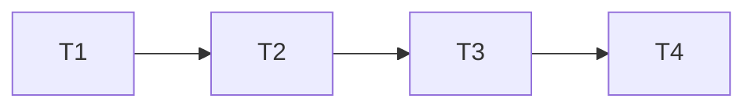

# 日志 JSON 脱敏补全 — 实施计划

**Branch:** [待填充]
**Baseline SHA:** [待填充]
**Plan Schema Version:** 2
**Worktree Path:** [待填充]
**Started At:** [待填充]
**Updated At:** [待填充]
**Effective Execution Mode:** [待填充]

**Goal:** 补齐 10 组字段型规则对带引号标量日志的保护，保留既有配置和文本匹配兼容边界。
**Architecture:** 复用字段扫描器；配置快照将字段规则与纯值正则分流，字段扫描先于后续正则执行。
**Tech Stack:** Java 17、Spring Boot 3.3.13、Maven、JUnit 5、现有 Logback 测试设施。
**Resolved Path:** docs/active/v2.3.0/log-json-masking/

**Plan Verdict:**

- **Status:** pending
- **Verified At:** null
- **Evidence:** null
- **Blocked Tasks:** none
- **Concerns:** none

**Accepted Risks:**

| Risk ID | Risk | Accepted By | Accepted At | Source |
|---|---|---|---|---|
| none | none | none | none | none |

## Dispatch Ledger

**Budget:** uninitialized; owner=start-execution; elapsed_budget=unknown; token_budget=unknown; budget_revision=initial

| objective | scope | actor_kind | role | model | started_at | finished_at | status | attempt | attempt_limit | elapsed | stop_reason | strategy_change | evidence | budget_revision |
|---|---|---|---|---|---|---|---|---|---|---|---|---|---|---|

## Global Constraints

- 本文仅规划。执行前由 start-execution 填充元信息、建立隔离工作区和 baseline manifest；保留已有用户改动以及本轮尚未提交的 SDD，不自动 commit。
- Java 17、Spring Boot 3.3.13；运行时依赖新增 0、公开方法新增 0、配置键改名 0、默认启用规则新增 0；不改 POM revision。
- 10 组字段规则与 4 组纯值规则分类；不修改公开 getPattern() 正则及其返回语义。
- 每条消息使用 1 份不可变快照；无新增 I/O、逐消息正则编译或性能 SLA。
- 后缀匹配不要求左边界；右侧允许 1 个可选引号、空白、等号或冒号；不校验键名引号成对。空引用字符串替换、缺失值保留。
- 仅承诺文本标量保护，对象/数组完整保护不在范围；文档须明确可能泄露后续元素，要求调用方记录前移除或预脱敏。
- 用户要求完整 SDD，不代表授权实施。执行状态初始全部 pending；文档审查结果与 Plan Verdict 分开记录。
- 每个执行者接收本节、当前任务及场景断言矩阵；并非独占工作区，不得回退其他修改。默认有界任务交给 luna-worker，子代理不得再委派。
- 所有任务串行；静态配置测试不得并行运行。恢复配置、编程式规则和日志级别，移除测试 appender，避免全局状态污染。
- 每个任务用 task input/output 快照差集核对实际修改；controller 独占本文状态及 `docs/active/v2.3.0/log-json-masking/plan.md.snapshots.json`。SDD 阶段不创建执行快照。

## Dependency Graph

| Task | 依赖 | 可并行组 |
|---|---|---|
| T1 字段别名归类 | 无 | A（单任务） |
| T2 扫描分流与消费入口回归 | T1 | B（单任务） |
| T3 能力文档同步 | T2 | C（单任务） |
| T4 全局验收与技术债状态 | T3 | D（单任务） |

没有可并行的实施组；只读审查可在作者检查时独立执行。

### T1: 字段别名归类

**Depends on:** 无

**Files:**

- Modify: `mimir-boot-starters/mimir-boot-starter-log/src/main/java/com/yggdrasil/labs/log/converter/SensitiveDataPattern.java`
- Test: `mimir-boot-starters/mimir-boot-starter-log/src/test/java/com/yggdrasil/labs/log/converter/SensitiveDataPatternTest.java`

**Interfaces:**

- Consumes: none
- Produces: `static List<String> SensitiveDataPattern.keyValueFieldNames(Collection<SensitiveDataPattern> patterns)`

**Behavior:**
扩展字段别名集合覆盖全部 10 组规则，返回不可变、按长度降序的列表。4 组纯值规则不返回别名，空集合返回空列表；公开正则与名称不变。

**任务别名副本（与 Spec B1 同步）：**

| 规则 | 别名 |
|---|---|
| password | password、pwd、passwd、%70assword、密码 |
| token | token、access_token、refresh_token |
| secret | secret、private_key、privateKey、secret_key、secretKey、access_key、accessKey、%73ecretKey、私钥 |
| api_key | apikey、api_key、app_key |
| account | account、accountId、account_id、账号 |
| id_card | idcard、id_card、身份证 |
| phone | phone、mobile、tel、手机、电话 |
| bank_card | bankcard、bank_card、银行卡 |
| email | email、mail |
| name | name、realname、真实姓名 |

**Acceptance Criteria:**

- [ ] AC1: 各组别名集合与任务表严格相等，4 组纯值规则与空集合返回空列表，返回列表不可修改且长度非递增。
- [ ] AC2: SensitiveDataPatternTest 全部通过，现有公开名称和正则回归断言保持通过。

**Execution:**

- **Status:** pending
- **Attempts:** 0
- **Blocked Reason:** null
- **Red Result:** null
- **Verify Result:** null
- **AC Result:** null
- **Changed Files:** []
- **Concerns:** none

**Task Completion Gate:**

- [ ] Red Result 存在且证明预期失败或前置状态。
- [ ] Verify Result 存在且通过。
- [ ] AC Result 中所有未延期 AC 均有通过证据；延期需用户明确接受风险。
- [ ] Changed Files 位于声明的 Files 范围。
- [ ] Per-task AC checkbox synced。

**Step 1: Red**

先添加参数化别名集合、排序和不可变性断言。运行 `./mvnw -pl mimir-boot-starters/mimir-boot-starter-log -am -Dtest=SensitiveDataPatternTest -Dsurefire.failIfNoSpecifiedTests=false test`，期望新增 api_key/account 等集合断言因缺少别名失败；保存失败名称及实际/预期值，不接受编译失败作为 Red。

**Step 2: Green**

只扩展字段型分类及别名，保留原始正则和访问器；不引入新公开方法。按长度降序返回不可变列表，不规定同长度别名间次序。

**Step 3: Verify**

运行同一命令，期望 PASS，报告不得是零测试。

**AC Verification:**

- AC1: 逐组 set equality、相邻长度比较、修改抛 UnsupportedOperationException、4 组纯值及空集合断言。
- AC2: 保存 Surefire 汇总与现有 getPattern/getName 测试结果；用 diff 确认未修改公开正则。

### T2: 扫描分流与消费入口回归

**Depends on:** T1

**Files:**

- Modify: `mimir-boot-starters/mimir-boot-starter-log/src/main/java/com/yggdrasil/labs/log/converter/SensitiveDataConverter.java`
- Test: `mimir-boot-starters/mimir-boot-starter-log/src/test/java/com/yggdrasil/labs/log/converter/SensitiveDataConverterTest.java`
- Test: `mimir-boot-starters/mimir-boot-starter-log/src/test/java/com/yggdrasil/labs/log/converter/SensitiveThrowableProxyConverterTest.java`

**Interfaces:**

- Consumes: `static List<String> SensitiveDataPattern.keyValueFieldNames(Collection<SensitiveDataPattern> patterns)` from T1
- Produces: `private static List<String> SensitiveDataConverter.compilePresetPatterns(List<Pattern> target, List<String> names)`
- Produces: `private static String SensitiveDataConverter.maskSensitiveData(String message, MaskConfigurationSnapshot snapshot)`
- Preserves: `public String SensitiveDataConverter.convert(ILoggingEvent event)`
- Preserves: `public String SensitiveDataConverter.maskSensitiveData(String message)`
- Preserves: `public static void SensitiveDataConverter.publishConfiguration(List<String> enabledPatternNames, List<String> customPatternExpressions, String replacement)`
- Preserves: `public String SensitiveThrowableProxyConverter.convert(ILoggingEvent event)`（只验证消费者，不改其生产源码）

**Behavior:**
10 组字段规则仅进入字段扫描，4 组纯值规则继续编译正则；字段扫描后执行纯值、自定义和编程式规则，移除硬编码首字符过滤。保留引号、转义奇偶性、缺失值、后缀匹配和快照发布语义，覆盖格式化消息及异常消费者，严格采用下方场景断言矩阵。

**Acceptance Criteria:**

- [ ] AC1: S01–S14 全文相等断言全部通过，全部别名/10 组规则均有覆盖；尾部保留证明没有字段预置正则二次处理。
- [ ] AC2: S15–S20 全部通过，包括配置告警、新快照替换、原子性及普通/异常消费入口。
- [ ] AC3: 转换器与异常转换器测试及模块 test 全部通过，静态状态恢复后无测试顺序依赖。

**Execution:**

- **Status:** pending
- **Attempts:** 0
- **Blocked Reason:** null
- **Red Result:** null
- **Verify Result:** null
- **AC Result:** null
- **Changed Files:** []
- **Concerns:** none

**Task Completion Gate:**

- [ ] Red Result 存在且证明预期失败或前置状态。
- [ ] Verify Result 存在且通过。
- [ ] AC Result 中所有未延期 AC 均有通过证据；延期需用户明确接受风险。
- [ ] Changed Files 位于声明的 Files 范围。
- [ ] Per-task AC checkbox synced。

**Step 1: Red**

先写 S01/S02 全别名矩阵并以 account 的 JSON 和尾部保留断言证明当前失败；补写其余边界和消费入口断言。运行 `./mvnw -pl mimir-boot-starters/mimir-boot-starter-log -am -Dtest=SensitiveDataConverterTest,SensitiveThrowableProxyConverterTest -Dsurefire.failIfNoSpecifiedTests=false test`，至少新增 JSON account 断言预期 FAIL；原有兼容场景允许通过，不能人为制造失败。

**Step 2: Green**

1. 解析有效枚举名称；10 组字段规则只收集字段名，4 组纯值规则才追加 target；空/未知名称忽略。
2. 删除固定首字符白名单分支及无用帮助方法，每个位置按字段名长度顺序匹配；不引入左边界限制。
3. 复用引号边界扫描：连续反斜杠奇数表示转义，偶数允许闭合；未闭合延伸至消息末尾并补外围引号。
4. 保持 snapshot 构建/发布及 regex 后处理路径不变；用公共入口验证私有逻辑，不为测试公开内部快照。
5. 测试隔离使用现有初始化/清理惯例，并补齐异常测试的清理：clearCustomPatterns()、清理 3 个 system/context 脱敏属性、最后 reloadConfig()；reloadConfig() 本身不会清除编程式规则。CONFIGURATION_CONTEXT 只在 start() 首次设置，优先用显式发布快照测试，不依赖新 LoggerContext 替换已记录上下文。S17 appender 在 finally 中移除并恢复日志级别，告警断言不依赖终端输出。并发测试开始前先发布 A，线程结束后再清理；不把默认配置窗口算入两态结果集合。

**Step 3: Verify**

运行定向命令，再运行 `./mvnw -pl mimir-boot-starters/mimir-boot-starter-log -am test`，期望 PASS。消费者回归使用实际格式化参数和 throwable proxy，不以直接字符串调用代替全部入口验证。

**AC Verification:**

- AC1: 参数化结果逐项 assertEquals，所有闭合值 tail=sentinel 保留；S07 用原始文本构造 Java 字面量，明确反斜杠数量。
- AC2: S15/S16/S17/S20 按矩阵逐项断言全文相等；未启用或已清空规则的值必须按预期保留，不应用统一“原值全部消失”断言。S18 断言当前启用规则保护的原值不存在且消费者格式信息存在；S17 捕获告警，S19 每个结果属于两个合法结果之一。
- AC3: 保存两个 Surefire 汇总，记录非零测试数、失败 0；检查 teardown 未遗漏编程式规则/appender/级别恢复。

### T3: 能力文档同步

**Depends on:** T2

**Files:**

- Modify: `mimir-boot-starters/mimir-boot-starter-log/README.md`
- Modify: `ARCHITECTURE.md`
- Modify: `docs/active/v2.3.0/release.md`

**Interfaces:**

- Consumes: T2 的 `public String SensitiveDataConverter.maskSensitiveData(String message)` 及场景验证结果
- Produces: `mimir-boot-starters/mimir-boot-starter-log/README.md` § 敏感信息脱敏
- Produces: `ARCHITECTURE.md` 日志脱敏能力条目
- Produces: `docs/active/v2.3.0/release.md` TD-038 变更说明

**Behavior:**
仅在实现测试通过后，把“api_key/account 的 JSON 匹配缺口”改为 10 组字段规则支持文本标量的说明。明确后缀可能过度遮罩、空引用值替换、未引用标量类型不保留、对象/数组无完整保护，发布说明不宣称版本已发布。

**Acceptance Criteria:**

- [ ] AC1: README 和发布说明均包含复合值限制样例及业务侧处置要求，架构说明不再声称已修复的 JSON 标量缺口仍存在。
- [ ] AC2: 文档全量检查通过；示例与 T2 测试输出逐项一致。

**Execution:**

- **Status:** pending
- **Attempts:** 0
- **Blocked Reason:** null
- **Red Result:** null
- **Verify Result:** null
- **AC Result:** null
- **Changed Files:** []
- **Concerns:** none

**Task Completion Gate:**

- [ ] Red Result 存在且证明预期失败或前置状态。
- [ ] Verify Result 存在且通过。
- [ ] AC Result 中所有未延期 AC 均有通过证据；延期需用户明确接受风险。
- [ ] Changed Files 位于声明的 Files 范围。
- [ ] Per-task AC checkbox synced。

**Step 1: Red**

运行 `rg -n 'JSON|TD-038|api_key' mimir-boot-starters/mimir-boot-starter-log/README.md ARCHITECTURE.md docs/active/v2.3.0/release.md`，保存 README/架构旧缺口说明的证据；若已被其他变更修正，先核对现状，不覆盖他人文字。

**Step 2: Green**

将旧“api_key、account 等规则当前按普通 key=value 形式匹配”与架构“仍有 JSON 匹配缺口”改为“已启用的 10 组字段型规则支持普通赋值及带引号键名的标量值”。README 和发布说明补充 `{"account":["alice","bob"]}` 不保证完整保护、须记录前移除或预脱敏；补充后缀、空串、未闭合、类型与正则后处理限制。保留默认关闭配置，不升级公开 getPattern() 能力声明。

**Step 3: Verify**

运行 `bash scripts/engineering.sh docs --root "$PWD" --mode full --self-test`，期望退出 0；人工比对 S01/S02/S08/S10/S12 示例输出。

**AC Verification:**

- AC1: 对三份文档 diff 核对能力描述，README/发布说明精确包含限制样例及处置要求。
- AC2: 保存文档检查退出码和汇总；记录每个示例对应通过的测试场景。

### T4: 全局验收与技术债状态

**Depends on:** T3

**Files:**

- Modify: `docs/active/tech-debt-tracker.md`
- Modify: `docs/active/v2.3.0/index.md`
- Modify: `docs/active/v2.3.0/log-json-masking/plan.md`
- Create/Update（controller）: `docs/active/v2.3.0/log-json-masking/plan.md.snapshots.json`

**Interfaces:**

- Consumes: T3 的 `mimir-boot-starters/mimir-boot-starter-log/README.md` § 敏感信息脱敏、`ARCHITECTURE.md` 日志脱敏能力条目、`docs/active/v2.3.0/release.md` TD-038 变更说明
- Produces: `docs/active/v2.3.0/log-json-masking/plan.md` § Plan Verdict、Acceptance Criteria

**Behavior:**
在全部场景、工程质量和工作区范围验证通过后记录实施结果，技术债状态改为已处理并保留 TD-038 历史锚点及证据链接。任何未通过的门禁都保留 pending/blocked 事实，不把本次文档生成或独立文档审查当作实现证据。

**Acceptance Criteria:**

- [ ] AC1: TD-038 状态具有实际命令/测试证据链接，版本索引与 Plan Verdict 一致，没有伪造发布或提交状态。
- [ ] AC2: 完整工作区差集全部位于批准范围，已有用户修改保留，全部最终门禁有退出码和非空汇总。

**Execution:**

- **Status:** pending
- **Attempts:** 0
- **Blocked Reason:** null
- **Red Result:** null
- **Verify Result:** null
- **AC Result:** null
- **Changed Files:** []
- **Concerns:** none

**Task Completion Gate:**

- [ ] Red Result 存在且证明预期失败或前置状态。
- [ ] Verify Result 存在且通过。
- [ ] AC Result 中所有未延期 AC 均有通过证据；延期需用户明确接受风险。
- [ ] Changed Files 位于声明的 Files 范围。
- [ ] Per-task AC checkbox synced。

**Step 1: Red**

记录 `git status --short`，核对 T1–T3 Execution/AC；若缺少证据，阻止最终完成声明。读取 baseline manifest 与当前文件状态，确认当前 TD-038 仍是待实施/实施中而非无证据关闭。

**Step 2: Green**

运行下列门禁并保存证据；全部通过才更新技术债状态及索引。不删除 TD-038 锚点；若未来迁移条目必须保留有效历史链接。controller 按实际证据同步任务 AC、全局 AC、Execution 和 Plan Verdict，不创建 Git commit。

**Step 3: Verify**

依次运行：

- `./mvnw -Pci -pl mimir-boot-starters/mimir-boot-starter-log -am clean verify`
- `bash scripts/engineering.sh quality --mode full --source worktree`
- `git diff --check`

更新状态后重跑文档检查和 diff 检查；生成 final manifest，与实施 baseline 对比，覆盖已跟踪、未跟踪、新增、删除、二进制和文件模式。既有修改单独登记，不能误算成本任务改动或将其清理。无关环境/历史失败须如实记录并阻止“全量通过”声明，不擅自扩展修复范围。

**AC Verification:**

- AC1: 检查每项完成状态指向本轮真实命令证据，发布状态和 POM revision 未改变。
- AC2: manifest 差集与 T1–T4 Files 联集（含 controller 元数据）逐项核对；保存质量门禁退出 0 及测试汇总。若失败，Verdict 写 blocked；全部通过写 completed。只有用户明确接受具体剩余风险，且 Accepted Risks 表已逐项记录稳定 Risk ID、完整风险、Accepted By、ISO-8601 Accepted At、Source（含检查证据位置），才可写 completed_with_concerns；缺少接受记录则保持 blocked，不将未通过检查改写为通过。

## 场景断言矩阵

以下为 T2 自包含测试输入；替换文本默认 ****，仅启用对应字段规则且无其他规则。输入是原始日志文本，不是 Java 转义字面量。S01/S02 使用 T1 全别名表；不得仅测代表别名。

| Spec | Task | 必须存在的断言 |
|---|---|---|
| S01 | T1、T2 | 每个别名 K：{"K":"sensitive","tail":"sentinel"} → {"K":"****","tail":"sentinel"}；T1 另断言别名精确集合。 |
| S02 | T2 | 每个 K：K=sensitive, tail=sentinel → K=****, tail=sentinel；K: sensitive, tail=sentinel → K: ****, tail=sentinel。 |
| S03 | T2 | 无规则以及仅空白/null/未知规则列表，{"account":"alice"} 不变。 |
| S04 | T2 | account：'ACCOUNT' : 'alice', tail=sentinel → 'ACCOUNT' : '****', tail=sentinel。 |
| S05 | T2 | account=123/true/null, tail=sentinel 三例均为 account=****, tail=sentinel。 |
| S06 | T2 | account="alice, bob ] }", tail=sentinel → account="****", tail=sentinel。 |
| S07 | T2 | api_key 双引号内 1 个反斜杠+引号+still-secret 后正常闭合 → api_key="****", tail=sentinel；2 个反斜杠后闭合同输出；单引号内 1 个反斜杠+单引号后再闭合 → api_key='****', tail=sentinel；转义后不闭合 → api_key="****"。 |
| S08 | T2 | api_key="secret, tail=sentinel → api_key="****"；单引号版本 → api_key='****'。 |
| S09 | T2 | account=alice 后接 }、]、空白+tail=sentinel、消息末尾，替换 alice，其他字符严格保留。 |
| S10 | T2 | name：service_name=orders → service_name=****；account：not_account=alice → not_account=****。 |
| S11 | T2 | account_extra=alice 与 account text alice 均不变。 |
| S12 | T2 | account=、account=, tail=sentinel 均不变；account="" → account="****"；account='' → account='****'。 |
| S13 | T2 | null → null；空字符串 → 空字符串。 |
| S14 | T2 | account"=alice → account"=****。 |
| S15 | T2 | 依次单启用 id_card_number/phone_number/bank_card_number/email_address，对 110105194912310021 / 13800138000 / 6222021234567890123 / `alice@example.com` 分别得到 ****。 |
| S16 | T2 | account + 自定义 alice，replacement=[MASK]：account=alice, other=alice → account=[MASK], other=[MASK]；另用自定义 `\*{4},\x20`（匹配逗号后的 1 个空格）、replacement=****，同一输入 → account=****other=alice，证明字段先执行。 |
| S17 | T2 | 清空编程式与预置；custom old-only → 输出 **** new-only；发布 new-only 与 [ → 输出 old-only ****，捕获 WARN。 |
| S18 | T2 | 模板 account={} + alice → account=****；实际 ThrowableProxy 渲染 account=alice, tail=sentinel 后无 alice，有 account=****, tail=sentinel、有异常类型与栈。 |
| S19 | T2 | 先发布 account/A，再与 token/B 并发交替；account=alice token=secret 结果只能为 account=A token=secret 或 account=alice token=B。 |
| S20 | T2 | 无预置和配置式正则；注册 alice 后 other=alice → other=****；清空后 other=alice 不变。 |

## 作者自检

- [x] IC-01–IC-03、两个消费入口、配置生命周期均有任务和断言。
- [x] T1–T4 的依赖无环且串行；执行字段尚未填充，未勾选实施 AC。
- [x] S01–S20 均映射到可执行断言；复合值仅验证文档边界，不伪造完整保护测试。

## Acceptance Criteria

- [ ] G1: S01–S20 场景在公共消息/异常消费链及配置组合下均有通过证据，公开接口、默认配置、纯值规则范围保持兼容。
- [ ] G2: 实际实现、README、架构、发布说明与技术债状态一致，不把标量保护扩张为完整 JSON 安全保证。
- [ ] G3: 模块 verify、完整 worktree 质量门禁和范围核对全部通过；状态和证据可追溯，未自动提交。
