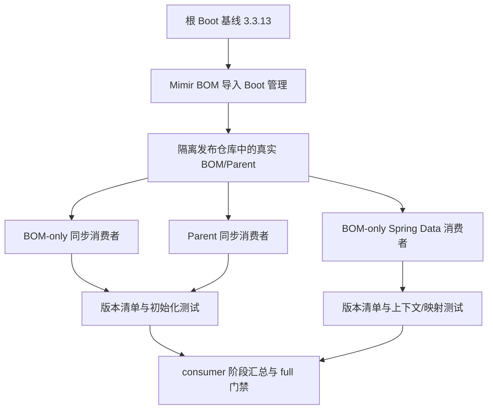

# MongoDB 驱动族兼容 — 技术设计

## Context

[TD-040](../../tech-debt-tracker.md#td-040-mongodb-驱动族) 记录同步驱动初始化时缺少 StreamFactory。源码 BOM 的 `mongodb.version=4.11.5` 仅用于显式管理 sync；已导入的 Boot 3.3.13 管理 core/bson 为 5.0.1。该分裂与错误一致，本轮仅做静态核对，不冒充已运行复现。

[Boot 官方依赖表](https://docs.spring.io/spring-boot/3.3/appendix/dependency-versions/coordinates.html) 与本地缓存的同版本发布 POM 均列出 MongoDB 驱动族 5.0.1、Spring Data MongoDB 4.3.13。[MongoDB 5.0 升级说明](https://www.mongodb.com/docs/drivers/java/sync/v5.0/reference/upgrade/) 明确存在 API/ABI 破坏性变更，包括移除 StreamFactory。选择回归 Boot 基线，而非推断任意同版本组合都已兼容。

范围跨 BOM 发布模型、消费者工程工具和接入说明，采用完整设计。行为来源为 [spec.md](./spec.md)，任务见 [plan.md](./plan.md)。main + 最近 v2.2.1 tag 推导规划 v2.3.0，未命中归档；不修改 revision。此方案沿用“BOM 管版本、Parent 管构建”的既有架构，不新增生产模块或依赖方向。

## Goal / Non-Goal

目标：默认消费 sync/core/bson 三项均解析为 5.0.1；8 项受管族坐标一致；3 种独立消费者覆盖 Spec S01–S10，发布隔离与完整质量门禁可追踪。

非目标：升级 Boot/Spring Data、增加 MongoDB Starter、运行数据库 CRUD/事务/认证/TLS、支持所有 MongoDB 服务器版本、保证旧 4.x API/ABI、强制禁止用户覆盖或改变全局 Maven Enforcer。响应式/legacy/Kotlin 仅检查版本解析，不宣称运行通过。

## Architecture

移除单项覆盖后不再重复维护 MongoDB 版本属性，也不新增驱动 BOM 导入。测试 fixture 放工程工具，不把 BOM 的 pom packaging 改成 jar，不往生产模块塞入测试驱动依赖。

现有 `tools/engineering/src/release/consumer.mjs` 已负责临时发布、第三方缓存、Mimir 来源标记和 online/isolated 阶段。扩展该入口，不创建绕开完整门禁的孤立脚本；已有 RocketMQ、Elasticsearch、Parent Failsafe 故意失败检查保留。

## Interface Contract

### IC-01：默认消费获得一致驱动族（B1）

修改 `mimir-boot-bom/pom.xml`：

- OLD：`<mongodb.version>4.11.5</mongodb.version>`；NEW：删除该属性。
- OLD：groupId=org.mongodb、artifactId=mongodb-driver-sync、version=${mongodb.version} 的完整 dependencyManagement 条目；NEW：删除此显式条目，由已存在的 Boot BOM 导入管理。
- 保留所有其他管理项、导入顺序、根 Boot 基线、制品坐标与发布 profile。

目标坐标均为 org.mongodb：bson、bson-kotlin、bson-record-codec、mongodb-driver-core、mongodb-driver-kotlin-coroutine、mongodb-driver-legacy、mongodb-driver-reactivestreams、mongodb-driver-sync。当前契约版本固定为 5.0.1；未来改 Boot 基线时必须显式更新契约及证据，不从待测 BOM 动态推导期望以掩盖漂移。

正常：BOM-only 与 Parent 均三项同版；边界：8 项解析同版；错误：显式混版不在默认保证范围，测试检查器必须拒绝。无应用错误码；依赖解析失败沿用 Maven 非零退出。

### IC-02：发布消费者与断言协议（B1、B2、B3）

新增 `tools/engineering/src/release/fixture-mongodb.mjs`，JS ESM 导出（类型为文档/JSDoc 契约，不引入 TypeScript）：

- `writeMongoConsumerFixture(directory: string, revision: string, repositoryDir: string, mode: 'bom' | 'parent' | 'spring-data'): Promise<void>`
- `assertMongoDependencyList(source: string, expectedArtifacts: readonly string[], expectedVersion: string): void`

expectedArtifacts 的元素仅为 artifactId，不含 groupId；groupId 固定 org.mongodb。同步模式调用示例：`assertMongoDependencyList(source, ['mongodb-driver-sync', 'mongodb-driver-core', 'bson'], '5.0.1')`；family 模式传 IC-01 的 8 个 artifactId。

fixture 写入唯一临时目录；同目录重复写同参数内容逐字节一致。调用方必须串行写同目录，不承诺并发调用安全，也不要求新增并发检测/锁。未知 mode/空参数拒绝，写入失败传播，不返回假成功。所有 XML 值沿用现有 escapeXml/仓库片段习惯；生成文件不加入 Reactor、不提交。

每个 fixture 生成 pom.xml 与 Java 测试源：

- bom：只导入候选 Mimir BOM，无 Parent/其他 BOM；同步驱动无版本；显式声明无版本的 `org.junit.jupiter:junit-jupiter`，scope 为 `test`，版本由该 BOM 管理。
- parent：继承候选 Mimir Parent，relativePath 为空；同步驱动无版本；显式声明无版本的 `org.junit.jupiter:junit-jupiter`，scope 为 `test`，版本由 Parent 的依赖管理提供，并继承已有插件生命周期。
- spring-data：只导入候选 Mimir BOM，无 Parent/其他 BOM；声明无版本 `spring-boot-starter-data-mongodb`、`spring-boot-starter-test`，继续使用现有的 Spring Boot 测试 starter。
- BOM-only 模式显式配置 maven-compiler-plugin 3.16.0（release=17、parameters=true）、maven-surefire-plugin 3.6.0（failIfNoTests=true）和 maven-dependency-plugin 3.11.0，与当前 Parent 版本一致；parent 模式沿用继承版本。不把插件版本从 dependencyManagement 误当可继承，不启用 Spring Boot 重打包。
- bom 的 `mongo-family` profile 额外声明其余 7 项族坐标（含 core），用于 S03 的纯解析；不向正常初始化测试混入这些额外驱动。
- mode=bom 与 parent 的测试类为 `io.github.yggdrasil.labs.fixture.MongoClientCompatibilityTest`；spring-data 为 `io.github.yggdrasil.labs.fixture.MongoSpringDataCompatibilityTest`。

输出相对 directory 的路径固定为 `pom.xml` 和 `src/test/java/io/github/yggdrasil/labs/fixture/MongoClientCompatibilityTest.java`（bom/parent）或 `src/test/java/io/github/yggdrasil/labs/fixture/MongoSpringDataCompatibilityTest.java`（spring-data）。Sample 是 Spring 测试类的静态内部类，不另建生产源文件。POM 的候选 revision 和 repositoryDir 来自函数参数，repository id 固定 fixture；Java 源不注入 revision。Spring runner 通过 withPropertyValues 注入本次端口构造的 `spring.data.mongodb.uri` 及 `spring.data.mongodb.auto-index-creation=false`。

检查器输入为 Maven `dependency:list -DincludeGroupIds=org.mongodb -DappendOutput=false -DoutputFile=...` 产生的选中依赖列表，不解析含 omitted 节点的树。只匹配完整 group/artifact/type/version/scope 记录，允许 Maven 日志前缀；要求每个 expectedArtifacts 恰好 1 项且版本等于 expectedVersion，已解析的其他 org.mongodb 项也必须同版。空输入、缺项、重复项、格式无法解析或版本不符均抛 Error，错误包含坐标、实际值、期望值；不把缺数据当空集合成功。不新增运行时错误码，consumer 捕获路径继续以非零结束。

单元负例用合成清单 sync=4.11.5/core=bson=5.0.1；还覆盖缺项、重复、空白及多余同族异版。无需实际下载错误依赖即可证明检查器会拒绝混版。

解析协议固定：剥离行首空白和可选 `[INFO]` 前缀，剥离尾部 空白加 `-- module ...` 附注；记录格式为 `org.mongodb:artifactId:jar:version:scope`，或带 classifier 的 `org.mongodb:artifactId:jar:classifier:version:scope`。字段按冒号切分且均非空，scope 仅接受 compile/runtime/test/provided/system；type 非 jar、含 org.mongodb 但不符合记录格式的行均拒绝。空行、标准标题和其他非 Mongo 日志可忽略，但最终零条记录拒绝。以 groupId:artifactId 判重复（即使 classifier/scope 不同也拒绝），expectedArtifacts 本身不得为空或重复。

抛出的 Error.message 使用 `MONGO_DEPENDENCY_CONTRACT coordinate=<GA或input> actual=<值> expected=<值>`；缺项 actual=missing，重复 actual=duplicate，格式错误 actual=malformed，版本失配为实际版本，期望为目标版本或有效格式/唯一记录。契约测试还必须通过 Node 子进程调用同一检查器并经现有 finishMain 结束：正常输入 exit=0，混版 exit=1 且 stderr 含 sync 坐标、4.11.5、5.0.1。此子进程只用于测试，不新增产品 CLI。

### IC-03：同步客户端与 Spring Data 离线验证（B2、B3）

仅测试消费现有第三方 API，不新增应用 API：

- `public static com.mongodb.client.MongoClient MongoClients.create(String connectionString)`
- `com.mongodb.client.MongoDatabase MongoClient.getDatabase(String databaseName)`
- `void MongoClient.close()`
- Spring 测试采用现有版本的 ApplicationContextRunner，加载 MongoAutoConfiguration 与 MongoDataAutoConfiguration；断言 MongoClient、MongoDatabaseFactory、MongoTemplate 各 1 个。
- `void MappingMongoConverter.write(Object source, org.bson.conversions.Bson target)` 与 `<S> S MappingMongoConverter.read(Class<S> clazz, org.bson.conversions.Bson bson)` 用于离线转换；实施时按当前依赖编译校验签名，不新增封装 API。

测试独占绑定 127.0.0.1 的临时端口（ServerSocket 保持打开、不提供 Mongo 协议），构造数据库 td040 的 URI，connectTimeoutMS/socketTimeoutMS/serverSelectionTimeoutMS 均设 200ms。该数值是避免测试异常路径长等待的设置，不是产品 SLA；不执行 ping、索引或数据库操作，不等待后台监控成功。所有客户端、ServerSocket 和上下文在 finally/try-with-resources 或 runner 回调结束时关闭。

最少 3 个同步测试：合法初始化/数据库名、无 Mongo 服务端初始化关闭、非法 URI 参数异常；两种模式均执行。最少 3 个 Spring Data 测试：上下文 bean 断言、样本映射往返、非法 URI 启动失败原因链。sample-1 不是 ObjectId 形状，样本实体使用字符串 id/name，检查 `_id` 与 name，不要求整个文档没有 `_class`。显式关闭自动索引，不启用 repository 扫描或健康检查。

### IC-04：消费者门禁集成（B1、B2、B3）

外部入口保持 `bash scripts/engineering.sh consumer`，最终使用 `bash scripts/engineering.sh quality --mode full --source worktree`。不新增 CLI 参数或绕过模式。

每个模式拥有独立 fixture 目录和 Maven cache：

1. 仅种入第三方缓存；首次解析前拒绝存在 io/github/yggdrasil-labs 制品。
2. 从本次临时发布仓库取得 Mimir 依赖；执行 online dependency:list 和 clean verify，预热新测试/插件依赖。
3. 断言对应 BOM/Parent/根 POM 的仓库来源标记；随后禁外部仓库、使用独立缓存进行 isolated dependency:list 和 clean verify。
4. bom 的 family profile 同样先 online 解析，再 isolated 解析；使用另一份清单文件，不污染正常三项断言。
5. isolated 清单必须通过 IC-02；检查新鲜 Surefire XML 中目标 suite 存在、测试数至少 3、failures/errors/skipped 均为 0。不能只看 Maven 退出 0 或 XML 非空。
6. 将清单、报告、候选 revision、发布/缓存 BOM 的路径与 SHA-256 记录和阶段日志复制到 logsDirectory 的模式子目录，再执行既有缓存回填与 finally 清理；MIMIR_KEEP_WORKDIR 和 MIMIR_RELEASE_LOG_DIRECTORY 继续有效。

新增阶段不对断言失败或测试失败重试；必要 online 下载沿用既有有限重试策略。各模式串行执行，不并行 clean 相同工作区。正常退出 0，任一适用阶段失败为非零，遵循现有工具退出分类。

## Data Model

无生产数据模型或数据库变更。仅测试实体 `Sample` 含 `String id`、`String name`；两字段参与 BSON 往返，无索引/持久化。

测试证据包括：mode（3 个枚举之一）、候选 revision（字符串）、依赖清单（坐标→选中版本）、Surefire 计数（非负整数）、阶段退出码、日志路径。每轮使用唯一目录，证据与本次候选制品绑定，不读旧报告。

## Error Handling

| 失败点 | 策略 |
|---|---|
| Maven 下载/插件缓存缺失 | 保存 online 阶段错误；按既有有限重试，不把失败当版本不兼容，也不跳过。 |
| 候选 POM 解析/来源标记不符 | 立即失败，不回退开发者本地 Mimir 缓存或正式仓库旧版本。 |
| 清单缺项、混版、报告为空/跳过 | 门禁失败，记录坐标或 suite；不自动升级期望版本。 |
| 缺类、缺方法、初始化异常 | 原始异常使测试失败，不捕获并打印“成功”。非法 URI 仅由对应负例断言接受。 |
| 后台监控连接失败 | 无服务端 smoke 的预期环境；不扫描日志中的 ERROR 字样代替测试断言。 |
| 临时端口绑定/文件写入失败 | 环境错误，保留原始错误及日志；不连接业务数据库替代。 |
| 清理失败 | 遵循既有 finally 语义，优先保留原始失败；记录未清理的精确临时路径。 |

## Compatibility 与文档同步

sync 从 4.11.5 变为 5.0.1 是有意纠错，但有主版本迁移影响。删除 mongodb.version 是移除 Mimir 单项版本来源；导入 BOM 不会把其 properties 自动变成消费者覆盖开关。依赖旧属性或旧 API 的接入方需去掉单项覆盖、重新编译并参照官方迁移说明；不宣称只改一个属性就能覆盖整个族。

BOM README 的直接“仅管理”表删除 sync 行，40→39；“已验证”15 项不变。新增“由上游 BOM 管理、已有外部 smoke 证据”的精确说明，不能因外部 fixture 把该坐标放入 Reactor 已验证表。更新 ARCHITECTURE 中 TD-040 缺口、版本 release、测试工具说明和台账，仅在实施门禁通过后宣称修复。

回滚应回退整次依赖调整并明确重新打开 TD-040；不得只退 sync 留下 core/bson。若业务必须保留 4.x，应在独立需求中评估完整族及 Spring Data 兼容，不作为本轮静默替代。

## NFR

| 维度 | 约束 |
|---|---|
| 基线 | Java 17、Boot 3.3.13、Spring Data MongoDB 4.3.13 固定；目标族 5.0.1。 |
| 影响 | 新增生产模块/API 0；不增加业务的直接运行时依赖，不改变发布坐标/profile。 |
| 隔离 | 3 种消费者各独立目录/cache；真实业务数据库连接与写入 0。 |
| 证据 | 每个执行 suite failures/errors/skipped=0；缺报告不能通过。 |
| 性能 | 不定义无依据的吞吐/延迟 SLA；200ms 仅为 smoke 连接相关超时配置。 |

## Alternatives

| 方案 | 不选原因 |
|---|---|
| 将 sync 单独改为 5.0.1 | 当前可能成立，但继续复制上游版本，未来 Boot 升级仍可能再次分裂。 |
| 整族降为 4.11.5 | 偏离 Boot/Spring Data 基线，需要扩大兼容验证；非最小纠错。 |
| 新导入 MongoDB driver BOM | 增加版本权威与导入优先级，现有 Boot 已完整管理，无必要。 |
| 删除覆盖、委托 Boot | 采用；以发布消费者契约检测未来漂移，显式披露主版本迁移。 |

## Testing Strategy

### P1：主要兼容链路

- [ ] 驱动族解析 | 发布消费者集成 | S01–S04、IC-01/02/04 | 3/8 项同版，负例拒绝，隔离来源成立。
- [ ] 同步初始化 | 实际依赖组件集成 | S05–S07、IC-03 | 无链接错误，合法句柄与非法 URI 断言成立。
- [ ] Spring Data | 实际依赖组件集成 | S08–S10、IC-03 | bean 数量、映射往返、启动失败原因可断言。

### P2：验证工具回归

- [ ] 清单检查器 | 单元 | 正常、缺项、重复、异版、空输入 | 严格接受/拒绝，不能因遗漏记录误通过。
- [ ] fixture/报告门禁 | 工具契约测试 | 三种 mode 的 POM 依赖/仓库/插件结构与报告状态 | bom/parent 夹具断言 JUnit Jupiter GA、未声明 version、test scope；Spring Data 保留 test starter；拒绝非法 mode、缺报告和零测试。
- [ ] 已有发布消费链 | 仓库完整验收 | 原有 Parent/BOM/Failsafe 负例 | 保持通过，不修改支持等级定义。

不需要浏览器 E2E或真实数据库容器；仅验证已承诺链路，不测试第三方驱动内部实现。详细命令、路径和场景映射见 Plan。

## Self-Check

- [x] 四项契约映射 B1–B3，输入、输出、失败与证据边界明确。
- [x] 保留 Boot/Spring Data 基线及既有发布隔离路径。
- [x] 离线初始化不冒充真实数据库兼容性；主版本迁移不静默。
