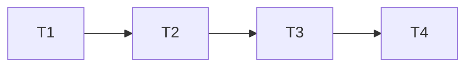

# MongoDB 驱动族兼容 — 实施计划

**Branch:** main
**Baseline SHA:** a73c5c196cae3fc4710efb2f818ca411b725af6b
**Plan Schema Version:** 2
**Worktree Path:** /home/yangyang/workspace/codes/Yggdrasil-Labs/mimir-boot
**Started At:** 2026-09-24T08:02:01+08:00
**Updated At:** 2026-09-24T11:46:37+08:00
**Effective Execution Mode:** serial
**Reason:** T1–T4 有顺序依赖，且共享 consumer 契约、发布产物和唯一工作区状态。
**Resolved Path:** docs/active/v2.3.0/mongodb-driver-alignment/
**Goal:** 消除默认发布消费者的 MongoDB 驱动混版，建立版本解析与同步/Spring Data 离线消费证据。
**Architecture:** 删除 sync 单项覆盖，委托 Boot 基线；3 类消费者进入现有发布隔离和完整质量链。
**Tech Stack:** Java 17、Boot 3.3.13、Spring Data MongoDB 4.3.13、MongoDB 5.0.1、受管 Node 22.22.3+、Maven Wrapper。

**Plan Verdict:**
<!-- markdownlint-disable MD032 -->
- **Status:** completed_with_concerns
- **Verified At:** 2026-09-24T11:46:37+08:00
- **Evidence:** `/tmp/mimir-mongo-quality.e25QJF/quality-report.json` (`quality-1790220241059-736442`, passed); `/tmp/mimir-mongodb-docs-final.json` (passed); `git diff --check` (passed).
- **Blocked Tasks:** none
- **Concerns:** 已接受 R-PLAN-SNAPSHOT-WAIVER 与 R-T2-SNAPSHOT-001；跳过执行计划快照比较，忽略构建产物差异。
<!-- markdownlint-enable MD032 -->

**Accepted Risks:**

| Risk ID | Risk | Accepted By | Accepted At | Source |
|---------|------|-------------|-------------|--------|
| R-T2-SNAPSHOT-001 | The T2 consumer clean changed 759 ignored build artifacts outside the four declared source files; exact baseline copies were unavailable. User explicitly waived snapshot verification; generated outputs remain uncommitted. | YoungerYang-Y | 2026-09-24T10:53:54+08:00 | User request: 忽略执行计划的快照校验 |
| R-PLAN-SNAPSHOT-WAIVER | Per-task and final manifest snapshot comparisons are intentionally skipped under user direction; this leaves no snapshot-based proof that generated or ignored files are unchanged. Visible tracked and untracked changes will still be reviewed through git status and diffs. | User | 2026-09-24T11:10:19+08:00 | User request: 忽略执行计划的快照校验 |

## Dispatch Ledger

**Budget:** planned_stages=8; max_active=3; max_attempts_per_stage=2; max_dispatches=16; elapsed_budget=unknown; token_budget=unknown; budget_revision=initial; owner=start-execution

| objective | scope | actor_kind | role | model | started_at | finished_at | status | attempt | attempt_limit | elapsed | stop_reason | strategy_change | evidence | budget_revision |
|-----------|-------|------------|------|-------|------------|-------------|--------|---------|---------------|---------|-------------|-----------------|----------|-----------------|
| T1: 实现 MongoDB 消费者 fixture 与依赖版本检查器 | ["tools/engineering/src/release/fixture-mongodb.mjs","tools/engineering/src/release/verify-contracts.mjs"] | work | worker | gpt-6-luna | 2026-09-24T08:06:39+08:00 | 2026-09-24T08:15:18+08:00 | blocked | 1 | 2 | about 9 minutes | blocked | none | sandbox blocked nested Node output; escalated contracts command passed with retry fixture; continuing after environment diagnosis | initial |
| T1: 实现 MongoDB 消费者 fixture 与依赖版本检查器 | ["tools/engineering/src/release/fixture-mongodb.mjs","tools/engineering/src/release/verify-contracts.mjs"] | work | worker | gpt-6-luna | 2026-09-24T08:15:30+08:00 | 2026-09-24T08:26:37+08:00 | done | 2 | 2 | about 11 minutes | completed | verify contracts outside sandbox | Red target assertions confirmed; controller reran escalated bash scripts/engineering.sh contracts with exit 0; 3/3 AC reported | initial |
| Group A review: Mongo fixture and dependency contract | ["tools/engineering/src/release/fixture-mongodb.mjs","tools/engineering/src/release/verify-contracts.mjs"] | work | reviewer | gpt-6-luna | 2026-09-24T08:31:42+08:00 | 2026-09-24T08:34:09+08:00 | done | 1 | 2 | about 2 minutes | completed | none | independent reviewer PASS with no findings; snapshot diff contained two T1 files; test_result 1/1 | initial |
| T2: 对齐 MongoDB driver family 与 consumer pipeline | ["mimir-boot-bom/pom.xml","tools/engineering/src/release/consumer.mjs","tools/engineering/src/release/verify-contracts.mjs","tools/engineering/src/release/fixture-mongodb.mjs"] | work | worker | gpt-6-luna | 2026-09-24T08:36:11+08:00 | 2026-09-24T09:18:08+08:00 | done | 1 | 2 | 41m57s | completed | none | Worker completed T2; effective old-BOM Red showed mongodb-driver-sync=4.11.5 vs bson/core=5.0.1; final contracts and consumer exit 0; six Mongo Surefire reports each tests=3/failures=errors=skipped=0; family online/isolated each 8 coordinates at 5.0.1; fixture and cache source markers verified. Evidence directory: /tmp/mimir-mongo-evidence.OQCgAx | initial |
| Group B review: MongoDB driver family and consumer pipeline | ["mimir-boot-bom/pom.xml","tools/engineering/src/release/consumer.mjs","tools/engineering/src/release/verify-contracts.mjs","tools/engineering/src/release/fixture-mongodb.mjs"] | work | reviewer | gpt-6-luna | 2026-09-24T10:57:56+08:00 | 2026-09-24T11:00:51+08:00 | done | 1 | 2 | about 3 minutes | completed | none | Independent review PASS with no findings; reviewer checked four source files and T2 contracts/consumer evidence. No command rerun. User waived ignored-artifact snapshot validation. | initial |
| T3: sync MongoDB compatibility and consumer documentation | ["mimir-boot-bom/README.md","ARCHITECTURE.md","tools/engineering/README.md","docs/active/v2.3.0/release.md"] | work | worker | gpt-6-luna | 2026-09-24T11:02:58+08:00 | 2026-09-24T11:10:19+08:00 | done | 1 | 2 | 7m21s | completed | none | Four declared docs updated. Full docs self-test passed: 77 files, 0 lint issues, exit 0. README table count matches BOM direct dependencyManagement at 15 verified + 39 managed-only = 54; verified set unchanged. Migration and consumer scope are bounded to T2 evidence; no server/CRUD/release claims. | initial |
| Group C review: MongoDB compatibility and consumer documentation | ["mimir-boot-bom/README.md","ARCHITECTURE.md","tools/engineering/README.md","docs/active/v2.3.0/release.md"] | work | reviewer | gpt-6-luna | 2026-09-24T11:16:50+08:00 | 2026-09-24T11:18:21+08:00 | done | 1 | 2 | about 1m30s | completed | none | Independent review PASS with no findings. Reviewer confirmed README 15 verified + 39 managed-only matches BOM 54 direct entries; docs accurately limit claims to T2 local consumers, six Surefire reports have 3 tests and 0 failures/errors/skips, and no broken links. No command rerun; snapshot validation waived by user. | initial |
| T4: close TD-040 after full quality verification | ["docs/active/tech-debt-tracker.md","docs/active/v2.3.0/index.md","docs/active/v2.3.0/mongodb-driver-alignment/plan.md"] | work | worker | gpt-6 | 2026-09-24T11:37:37+08:00 | 2026-09-24T11:46:37+08:00 | done | 1 | 2 | 9 minutes | completed | none | Full quality report quality-1790220241059-736442 passed; G1 source-status, BOM hash, selected-list, and Surefire evidence verified in that run. T4 docs and full docs self-test passed. | initial |

## Global Constraints

- 本文已获用户授权实施。用户明确要求在当前目录执行，canonical root 为 `/home/yangyang/workspace/codes/Yggdrasil-Labs/mimir-boot`，不创建隔离 worktree；controller 建立 baseline manifest，保留已有日志脱敏 SDD 与其他用户修改。
- Java 17、Boot 3.3.13、Spring Data MongoDB 4.3.13 不升级；当前驱动族契约固定 5.0.1，不从待测输出推导期望。
- 新增生产模块/API/业务直接依赖均为 0；不改根 revision、发布坐标、profile、BOM 导入顺序、全局 Enforcer 或支持等级定义。
- 删除 Mimir mongodb.version 与 sync 显式管理项，不新增 MongoDB BOM；公开披露 4.11.5→5.0.1 迁移和旧 API/ABI 风险。
- 8 项 org.mongodb 坐标：bson、bson-kotlin、bson-record-codec、mongodb-driver-core、mongodb-driver-kotlin-coroutine、mongodb-driver-legacy、mongodb-driver-reactivestreams、mongodb-driver-sync。
- 3 类独立消费者：bom、parent、spring-data；仅 from candidate repository，无相对父 POM 或预先缓存 Mimir 制品。
- 离线表示不需要 MongoDB 服务端；Maven 预热可联网，最终验证禁外部仓库。测试不执行数据库操作、不连接业务库、不添加 Docker 前置。
- 每个测试用独占 127.0.0.1 临时 ServerSocket 占住端口，不运行 Mongo 协议；URI 数据库 td040，连接/套接字/选择超时各 200ms。关闭所有客户端、上下文、端口，不把后台连接告警误判为失败。
- 变更权限按任务 Files 限定；执行者不是独占代码库，不得回退他人改动或再次委派。默认有界工作交 luna-worker，任务串行，避免共享契约/consumer 文件冲突。
- controller 独占本文执行记录；用户明确豁免执行计划快照核对，因此不再保留 `plan.md.snapshots.json`，仅审阅可见 Git 状态与 diff。
- 按用户于 2026-09-24 明确授权提交剩余本地变更；不推送、合并或发布。遇到无关失败记录并停在准确状态，不扩大到其他技术债修复。

## Dependency Graph

| Task | 依赖 | 可并行组 |
|---|---|---|
| T1 | 无 | A（单任务） |
| T2 | T1 | B（单任务） |
| T3 | T2 | C（单任务） |
| T4 | T3 | D（单任务） |

无并行实施组；独立只读审查可与作者自检并行。



---

### T1: 消费者 fixture 与检查器

**Depends on:** 无

**Files:**

- Create: `tools/engineering/src/release/fixture-mongodb.mjs`
- Modify: `tools/engineering/src/release/verify-contracts.mjs`

**Interfaces:**

- Consumes: none
- Produces: `writeMongoConsumerFixture(directory: string, revision: string, repositoryDir: string, mode: 'bom' | 'parent' | 'spring-data'): Promise<void>`
- Produces: `assertMongoDependencyList(source: string, expectedArtifacts: readonly string[], expectedVersion: string): void`

**Behavior:**

生成 3 种独立消费者的 POM/Java 测试源，并提供严格的选中依赖列表校验。正常清单接受，失配、缺项、重复、空输入必须拒绝；测试产物只在唯一临时目录，不成为生产模块。

expectedArtifacts 元素仅是 artifactId，groupId 固定 org.mongodb；同步模式固定调用 `assertMongoDependencyList(source, ['mongodb-driver-sync', 'mongodb-driver-core', 'bson'], '5.0.1')`，family 传 Global Constraints 的 8 个 artifactId。

**Acceptance Criteria:**

- [x] AC1: 清单正负例均有断言，sync=4.11.5/core=bson=5.0.1 抛错且包含失配坐标与两版本。
- [x] AC2: 3 种生成 POM 的接入方式、候选 revision/仓库、无 Mongo 显式版本、固定源路径/插件配置经结构断言成立；非法 mode/空参数拒绝；同目录同参数重复生成的路径集合与文件字节完全相同。
- [x] AC3: contracts 命令通过，新 fixture 在临时目录生成/清理，无源工作区输出；保留现有契约测试。

**Execution:**

- **Status:** done
- **Attempts:** 2
- **Blocked Reason:** null
- **Red Result:** {"commands":[{"cmd":"bash scripts/engineering.sh contracts","confirmed":true,"evidence":"清单目标 Red：合法 sync 清单在 checker 占位时因未实现行为失败，而非语法/import 错误。"},{"cmd":"bash scripts/engineering.sh contracts","confirmed":true,"evidence":"fixture 目标 Red：生成内容断言在 fixture 占位时因目标行为未实现失败；使用沙箱外执行。"}]}
- **Verify Result:** {"commands":[{"cmd":"bash scripts/engineering.sh contracts","status":"pass","evidence":"主控在沙箱外复跑，exit 0；既有重试、发布工作流、制品布局、Portal 与公开制品契约均通过。"}]}
- **AC Result:** {"pass":3,"total":3,"deferred":[]}
- **Changed Files:** ["tools/engineering/src/release/fixture-mongodb.mjs","tools/engineering/src/release/verify-contracts.mjs"]
- **Concerns:** none

**Task Completion Gate:**

- [x] Red Result 存在且证明预期失败或前置状态。
- [x] Verify Result 存在且通过。
- [x] AC Result 中所有未延期 AC 均有通过证据，延期必须有用户风险接受记录。
- [x] Changed Files 与 task input/output 快照差集相等且全部在声明范围。
- [x] Per-task AC checkbox synced。

**Step 1: Red**

在 verify-contracts 增加清单解析和 fixture 内容断言，运行 `bash scripts/engineering.sh contracts`。先确认新增行为失败；若首先是模块不存在，建立仅满足导出签名的最小骨架后重跑，Red 证据必须是目标断言失败而非 import/语法错误。

**Step 2: Green**

新建 JS ESM 模块，使用 JSDoc 表达签名，不新增 npm 依赖：

1. 解析 dependency:list：剥离行首空白/可选 [INFO] 前缀和尾部空白加 `-- module ...` 及可选 `[auto]` 或 `(auto)` 注记，接受 `org.mongodb:artifactId:jar:version:scope` 或 `org.mongodb:artifactId:jar:classifier:version:scope`；冒号字段非空，scope 为 compile/runtime/test/provided/system。忽略空行、标准标题和其他非 Mongo 日志，含 org.mongodb 的格式错误行拒绝；零记录拒绝，expectedArtifacts 非空且无重复。按 groupId:artifactId 判重复（不同 classifier/scope 也拒绝）；每个期望项恰好 1 条，所有 Mongo 选中版本为 5.0.1。不消费 dependency:tree omitted 文本。Error.message 为 `MONGO_DEPENDENCY_CONTRACT coordinate=<GA或input> actual=<实际版本或missing/duplicate/malformed> expected=<目标版本或格式/唯一性>`。
2. 生成 bom（只 import Mimir BOM）、parent（只继承候选 Parent，空 relativePath）、spring-data（只 import BOM + data-mongodb/test starter）三个 POM。测试依赖无版本。BOM-only 固定 compiler=3.16.0（release=17、parameters=true）、Surefire=3.6.0（failIfNoTests=true）、dependency=3.11.0，parent 继承当前版本。输出固定为 directory/pom.xml 与 directory/src/test/java/io/github/yggdrasil/labs/fixture/MongoClientCompatibilityTest.java（bom/parent）或 MongoSpringDataCompatibilityTest.java（spring-data）；Sample 为后者的静态内部类。revision/repositoryDir 参数写 POM，repository id=fixture，源文件不注入 revision；Spring runner 用 withPropertyValues 注入动态 spring.data.mongodb.uri 和 spring.data.mongodb.auto-index-creation=false。
3. bom 的 mongo-family profile 额外声明其余 7 项族坐标，正常模式只引入 sync。POM 中仓库与 revision 正确 XML 转义。
4. 两种同步模式生成 MongoClientCompatibilityTest：初始化/数据库名 td040、无 Mongo 服务端仍可创建关闭、非法 URI 参数异常，至少 3 个测试。同步 getDatabase 不发数据库请求。
5. Spring 模式生成 MongoSpringDataCompatibilityTest：ApplicationContextRunner 加载 MongoAutoConfiguration/MongoDataAutoConfiguration，禁自动索引，MongoClient/MongoDatabaseFactory/MongoTemplate 各 1 个；converter 对字符串 id=sample-1/name=alice 写入 Document 再读回，检查 _id/name；非法 URI 上下文失败且原因链含 IllegalArgumentException、无 LinkageError。至少 3 个测试。
6. 合法 URI 使用独占 loopback 端口，不提供 Mongo 协议，三个连接相关超时各 200ms；try/finally 关闭上下文/客户端/ServerSocket。不执行 ping、索引、repository 或健康检查。
7. 在现有 verifyContracts 中运行检查器/生成器断言，使用现有 runtime 临时目录/清理与断言惯例；不得为测试放宽生产发布隔离。串行重复生成相同 fixture 两次，断言相对路径集合及每个文件字节相等；并发同目录由调用方禁止，不新增锁或承诺并发拒绝。
8. verifyContracts 用 process.execPath 启动临时 Node ESM 子进程，导入同一 assertMongoDependencyList，经现有 finishMain 执行；正常清单 exit=0，混版清单 exit=1，stderr 必须包含 MONGO_DEPENDENCY_CONTRACT、sync 坐标、4.11.5 和 5.0.1。不新增 CLI/生产脚本或下载错误制品。

**Step 3: Verify**

运行 `bash scripts/engineering.sh contracts`，期望 PASS。本任务仅证明检查器和生成内容，Java 编译/运行必须在 T2 实际消费候选制品后证明。

**AC Verification:**

- AC1: 清单单元样本覆盖 3 项/8 项成功、4.11.5 混版、遗漏 bson、重复 sync、空输入、多余同族异版、可选 classifier/module/[auto]/(auto) 附注；子进程正常 exit=0、混版 exit=1 且 stderr 含坐标/两版本。
- AC2: XML 结构断言各 mode 的 parent/import/dependencies/profile/plugins 及精确版本；固定路径/目标 suite、未知 mode/空参数错误均有断言；重复写入比较路径集合与逐文件字节相等。
- AC3: 命令退出 0、现有契约测试未删除，临时目录处理及真实 Changed Files 符合声明。

**Execution Group:** A

- **Group Change Snapshot:** ws-581e625d76ceed083c6dd67ca489fa281ba714db611d08f4fe61d2e055c54544

**Group Review:**

- **Verdict:** pass
- **Round:** 1 / 3
- **Reviewer:** external (gpt-6-luna)
- **Review Scope:** declared task files and current working tree
- **Evidence:** independent review PASS, no findings; snapshot diff exactly two T1 files; contracts exit 0 after output capture.
- **Affected Tasks:** none

### T2: 驱动对齐与门禁接入

**Depends on:** T1

**Files:**

- Modify: `mimir-boot-bom/pom.xml`
- Modify: `tools/engineering/src/release/consumer.mjs`
- Modify: `tools/engineering/src/release/verify-contracts.mjs`
- Modify: `tools/engineering/src/release/fixture-mongodb.mjs`

范围备注：fixture 修改限于 T2 所需的 family profile 实际依赖解析行为、真实 dependency:list `-- module ... [auto]`/`(auto)` 尾注解析及原契约编译适配，不扩展公开接口。预期坐标必须各出现一次；额外 org.mongodb 传递坐标仅在版本一致时接受，任何额外异版继续拒绝。

**Interfaces:**

- Consumes: `writeMongoConsumerFixture(directory: string, revision: string, repositoryDir: string, mode: 'bom' | 'parent' | 'spring-data'): Promise<void>` from T1
- Consumes: `assertMongoDependencyList(source: string, expectedArtifacts: readonly string[], expectedVersion: string): void` from T1
- Produces: `mimir-boot-bom/pom.xml` § dependencyManagement 的 Boot 委托管理
- Produces: `bash scripts/engineering.sh consumer`（现有入口，新增 Mongo 必需阶段，0=通过、非零=失败）

**Behavior:**

先接入新消费者证明旧 sync 覆盖引发失配/初始化失败，再删除单项版本来源使整个族回归 Boot 5.0.1。3 种消费路径都必须经过真实临时发布、online 预热、isolated 复跑、版本和新鲜 Surefire 报告校验，不能仅验证源码 POM。

**Acceptance Criteria:**

- [x] AC1: S01–S04 通过；bom/parent 三项预期坐标均 5.0.1，bom profile 八项预期坐标同版，任何额外 org.mongodb 传递坐标也同版，负例仍拒绝；Spring Data 路径 core/bson/sync 同版。
- [x] AC2: S05–S10 在真实依赖上通过，两个同步 suite 和一个 Spring Data suite 各测试数至少 3、失败/错误/跳过均 0；无数据库操作。
- [x] AC3: 新目录/cache 在预热、隔离、来源标记、成功/失败缓存回填、finally 清理、证据复制链全部覆盖；原有 consumers 和故意失败 Failsafe 检查仍通过。

**Execution:**

- **Status:** done
- **Attempts:** 1
- **Blocked Reason:** null
- **Red Result:** {"commands":[{"cmd":"MIMIR_RELEASE_LOG_DIRECTORY=/tmp/mimir-mongo-evidence.OQCgAx bash scripts/engineering.sh consumer (保留旧 BOM 覆盖)","exit_code":2,"confirmed":true,"evidence":"候选发布、解析及 dependency:list 均成功；目标断言报告 MONGO_DEPENDENCY_CONTRACT coordinate=org.mongodb:mongodb-driver-sync actual=4.11.5 expected=5.0.1，bson/core/bson-record-codec=5.0.1，确认真实依赖混版。"},{"cmd":"bash scripts/engineering.sh contracts","exit_code":1,"confirmed":true,"evidence":"新增真实 Maven `[auto]` 输出样例先以 malformed 失败，确认为解析器兼容 Red；之后分别为额外同版传递项和 `(auto)` 变体取得目标 Red。"}]}
- **Verify Result:** {"commands":[{"cmd":"bash scripts/engineering.sh contracts","status":"pass","exit_code":0,"evidence":"主控在修复后沙箱外复跑通过；contracts 中 Mongo 清单/fixture/报告门禁与既有发布契约均通过。"},{"cmd":"MIMIR_RELEASE_LOG_DIRECTORY=/tmp/mimir-mongo-evidence.OQCgAx bash scripts/engineering.sh consumer","status":"pass","exit_code":0,"evidence":"T2 最终源状态的完整 consumer 流水线通过；三类 Mongo 模式 online/blocked-settings+offline list 与 clean verify 均通过，原有消费者、Parent 生命周期及 AlwaysFailIT 门禁通过。"}],"evidence":"证据目录 /tmp/mimir-mongo-evidence.OQCgAx；六份 Mongo Surefire XML 均 tests=3、failures=0、errors=0、skipped=0；family online/isolated 清单各 8 个预期坐标且版本均为 5.0.1；三模式来源标记均为 fixture，发布/缓存 BOM SHA-256 一致，parent bomImportedByFixture=false。"}
- **AC Result:** {"pass":3,"total":3,"deferred":[]}
- **Changed Files:** ["mimir-boot-bom/pom.xml","tools/engineering/src/release/consumer.mjs","tools/engineering/src/release/verify-contracts.mjs","tools/engineering/src/release/fixture-mongodb.mjs"]
- **Concerns:** 用户于 2026-09-24 明确豁免快照校验。T2 consumer clean 使 759 个 ignored 构建产物与 input 不同（738 缺失、21 内容或权限变化）；仓库/worktree/tmp/Maven cache 无精确副本。Changed Files 保留四个声明源码路径；构建产物差异仅作已接受的执行副作用，不提交。

**Task Completion Gate:**

- [x] Red Result 存在且证明预期失败或前置状态。
- [x] Verify Result 存在且通过。
- [x] AC Result 中所有未延期 AC 均有通过证据，延期必须有用户风险接受记录。
- [x] 快照差异门禁由用户明确豁免；差异已记录于 R-T2-SNAPSHOT-001。
- [x] Per-task AC checkbox synced。

**Step 1: Red**

先修改 consumer/契约接入 Mongo 阶段，暂不删除 BOM 覆盖；运行 `bash scripts/engineering.sh consumer`，记录实际失配 sync=4.11.5 与 core/bson=5.0.1 或 StreamFactory 链接错误。缓存/网络/插件下载失败不能当 Red，须先恢复执行条件。另外为新增来源/报告门禁补工具负例：错误来源、缺失 XML、tests=0 或 skipped>0 都必须拒绝。

**Step 2: Green**

1. 删除 BOM `<mongodb.version>4.11.5</mongodb.version>` 以及 org.mongodb:mongodb-driver-sync 的完整显式管理条目，其他项保持不变；不替换成新的重复版本属性。
2. 在 consumer 为 bom/parent/spring-data 分配各自唯一目录/cache；首次解析前缓存不得含 Mimir 制品，只从本次候选 file 仓库取得它们。
3. 各模式 online 执行 dependency:list 和 clean verify，预热新插件/测试依赖；bom family profile online 单独解析。检查候选仓库来源标记后，以 blocked settings + offline 独立缓存再次 list/clean verify，family profile 再 isolated list。
4. 正常 list 输出精确写新文件，includeGroupIds=org.mongodb、appendOutput=false；bom/parent/spring-data 分别必须含 3 项预期坐标，profile 必须含 8 项预期坐标，每项恰好一次。输出还可能含 bson-record-codec 等额外 org.mongodb 传递坐标；只要坐标唯一且所有已选 Mongo 项版本统一即可接受，额外异版必须拒绝。
5. 每个 isolated suite 检查精确类名、tests≥3、failures=errors=skipped=0；非法 URI 是成功执行的负例，不应让 suite 本身失败。缺报告/零测试不算成功。
6. 增加适用 online 下载阶段到既有有限重试名单，但测试/版本断言失败不得重试。新增 cache 同时进入 shared/seed backfill 与 finalizeConsumer；同步 verifyConsumerCacheFlow 的覆盖。
7. 将每个模式的清单、Surefire XML 及阶段日志复制到 logsDirectory/mongo-模式名 下，记录 revision/source 状态指纹、发布 BOM 与该模式缓存 BOM 的原始路径/SHA-256，供最终同轮溯源；遵循 MIMIR_KEEP_WORKDIR、MIMIR_RELEASE_LOG_DIRECTORY。异常时不丢原始诊断。
8. 保持原有 RocketMQ/Elasticsearch、Parent 生命周期与 AlwaysFailIT 检查，不改 FULL_PLAN 或 CLI。

**Step 3: Verify**

先运行 `bash scripts/engineering.sh contracts`，再用本次独立证据目录运行：

```bash
mongo_evidence_dir=$(mktemp -d /tmp/mimir-mongo-evidence.XXXXXX)
MIMIR_RELEASE_LOG_DIRECTORY="$mongo_evidence_dir" bash scripts/engineering.sh consumer
```

两者均期望退出 0；将实际目录写入 Execution，不保留未展开变量作为证据。不需运行仅验证 pom packaging 的 Maven test 来替代此流程。

**AC Verification:**

- AC1: 保存 bom/parent/spring-data 选中清单与 profile 清单，确认全部预期坐标各出现一次且固定为 5.0.1，额外 org.mongodb 坐标同版；contracts 的额外异版负例继续拒绝。
- AC2: 检查 MongoClientCompatibilityTest（两份）与 MongoSpringDataCompatibilityTest 的新鲜报告、测试名和计数；映射 _id/name、非法配置原因链均有断言。
- AC3: 来源标记与隔离日志成立；新 cache 回填/清理的工具正负例通过，旧消费者报告仍可追踪。

**Execution Group:** Group B

- **Group Change Snapshot:** ws-88a36807c8ad266716cb1cba5d691a7c5fcea9da6dc4c2c9549110a0ddcaea16

**Group Review:**

- **Verdict:** pass
- **Round:** 1 / 3
- **Reviewer:** external (gpt-6-luna)
- **Review Scope:** T2 declared source files; ignored build artifacts excluded under accepted risk R-T2-SNAPSHOT-001
- **Evidence:** Independent review PASS with no findings; reviewer checked four source files and T2 contracts/consumer evidence. Contracts and consumer passed; user waived ignored-artifact snapshot validation.
- **Affected Tasks:** none

### T3: 接入说明和兼容边界同步

**Depends on:** T2

**Files:**

- Modify: `mimir-boot-bom/README.md`
- Modify: `ARCHITECTURE.md`
- Modify: `tools/engineering/README.md`
- Modify: `docs/active/v2.3.0/release.md`

**Interfaces:**

- Consumes: T2 的 `mimir-boot-bom/pom.xml` § dependencyManagement 的 Boot 委托管理及 consumer 证据
- Produces: `mimir-boot-bom/README.md` § 支持等级、当前兼容性边界
- Produces: `ARCHITECTURE.md` § 当前能力边界
- Produces: `tools/engineering/README.md` § 独立诊断命令
- Produces: `docs/active/v2.3.0/release.md` § TD-040 变更说明

**Behavior:**

仅在 T2 通过后同步真实能力：由上游 BOM 管理 MongoDB，已有同步初始化和 Spring Data 离线 smoke，不承诺 CRUD 或旧 4.x ABI。披露单项属性移除、升级影响及显式覆盖需整族验证，不提升 Reactor“已验证”等级。

**Acceptance Criteria:**

- [x] AC1: BOM 直接“仅管理”表删除 sync 行，40→39，“已验证”15 项不变；用 XML 读取 BOM 直接 dependencyManagement 的 GA 集合，与两表合并的 GA 集合做相等比较，差集为空。
- [x] AC2: README/发布说明明确 4.11.5→5.0.1、旧属性/旧 API 迁移、验证边界；文档 full 与示例核对通过。

**Execution:**

- **Status:** done
- **Attempts:** 1
- **Blocked Reason:** null
- **Red Result:** {"commands":[{"cmd":"rg -n 'mongodb|MongoDB|TD-040|仅管理（40' mimir-boot-bom/README.md ARCHITECTURE.md tools/engineering/README.md docs/active/v2.3.0/release.md","exit_code":0,"confirmed":true,"evidence":"基线显示 BOM README 仅管理 40 项并把 mongodb-driver-sync 列为仅管理，保留 4.11.5 混版风险；ARCHITECTURE 仍将 TD-040 列入未解决缺口；tools/engineering/README.md 与 release.md 尚无 MongoDB consumer 说明。"}]}
- **Verify Result:** {"commands":[{"cmd":"bash scripts/engineering.sh docs --root \"$PWD\" --mode full --self-test","exit_code":0,"summary":"77 files linted, 0 issues; earlier plan.md list spacing fixed and full rerun passed"},{"cmd":"git diff --check","exit_code":0,"summary":"no whitespace errors"}]}
- **AC Result:** {"pass":2,"total":2,"deferred":[],"evidence":{"AC1":"Structured XML comparison: README GA union equals POM direct dependencyManagement; 54 total = 15 verified + 39 managed-only, verified set unchanged.","AC2":"Migration/version override/verification boundaries match T2 consumer evidence; no live server, CRUD, or release claims."}}
- **Changed Files:** ["mimir-boot-bom/README.md","ARCHITECTURE.md","tools/engineering/README.md","docs/active/v2.3.0/release.md"]
- **Concerns:** none

**Task Completion Gate:**

- [x] Red Result 存在且证明预期失败或前置状态。
- [x] Verify Result 存在且通过。
- [x] AC Result 中所有未延期 AC 均有通过证据，延期必须有用户风险接受记录。
- [x] 实际可见修改文件均在声明范围；快照差异核对按用户明确要求豁免，见 R-PLAN-SNAPSHOT-WAIVER。
- [x] Per-task AC checkbox synced。

**Step 1: Red**

运行 `rg -n 'mongodb|MongoDB|TD-040|仅管理（40' mimir-boot-bom/README.md ARCHITECTURE.md tools/engineering/README.md docs/active/v2.3.0/release.md`，保存旧风险和直接表条目。现状若因他人编辑不同，先核对，不覆盖无关债务内容。

**Step 2: Green**

删除仅管理表的 Mongo sync 直接项、修正计数；增加“由上游管理，外部消费者仅验证同步初始化与 Spring Data 离线映射”的说明。替换“存在版本不一致风险”的当前断言，保留历史迁移版本数字；列出重新编译、检查上游破坏性变更、不要只覆盖 sync、无真实数据库验证。架构只移除 TD-040 当前缺口，保留其他编号；工具说明写 consumer 新覆盖，release 不宣称已发布。

**Step 3: Verify**

运行 `bash scripts/engineering.sh docs --root "$PWD" --mode full --self-test`，期望退出 0；人工核对 README 支持集合与 POM，确认不误升等级。

**AC Verification:**

- AC1: 提取 README 两表 GA 与 POM 直接管理 GA（含导入 BOM 本身，不展开传递项）做集合比较，差集为空，基数 15+39=54；记录比较结果，原 15 项集合不变。
- AC2: 逐项比对迁移/范围声明与 T2 证据，保存文档检查汇总和退出码。

**Execution Group:** Group C

- **Group Change Snapshot:** ws-12faca31557fe21d82614025b1e5ed4124fc5bdfe96dbde8a9b5f9d1ce207865

**Group Review:**

- **Verdict:** pass
- **Round:** 1 / 3
- **Reviewer:** external (gpt-6-luna)
- **Review Scope:** T3 declared docs and T2 consumer evidence; snapshot comparison waived under R-PLAN-SNAPSHOT-WAIVER
- **Evidence:** Independent review PASS with no findings. Reviewer confirmed 15 verified + 39 managed-only entries match the BOM's 54 direct entries, scope claims stay within T2 evidence, six Surefire reports have 3 tests and no failures/errors/skips, and no broken links. Full docs check passed with 77 files and 0 lint issues.
- **Affected Tasks:** none

### T4: 完整验收与技术债收口

**Depends on:** T3

**Files:**

- Modify: `docs/active/tech-debt-tracker.md`
- Modify: `docs/active/v2.3.0/index.md`
- Modify: `docs/active/v2.3.0/mongodb-driver-alignment/plan.md`（controller 执行记录）

**Interfaces:**

- Consumes: T3 的 README/架构/工具/发布说明章节及 T2 consumer 证据
- Produces: `docs/active/v2.3.0/mongodb-driver-alignment/plan.md` § Plan Verdict、Acceptance Criteria

**Behavior:**

以最终完整 worktree 验证依赖变更和既有模块未回归，并核对实际变更范围。证据全部齐全才更新 TD-040 状态和版本索引，保留历史锚点，不把初始化 smoke 描述成完整 MongoDB 功能验收。

**Acceptance Criteria:**

- [x] AC1: quality-report 中 docs-full、verify-build-model、release-contracts、release-consumer、release-signing、java-quality 六阶段均 passed；TD-040 证据链接指向本文 Execution 中实际存在的报告路径。
- [x] AC2（快照比较按用户明确要求豁免）：`git status` 与 diff 中可见的新增和修改均属于获授权的任务文件；manifest 比较风险记录于 R-PLAN-SNAPSHOT-WAIVER。

**Execution:**

- **Status:** done
- **Attempts:** 1
- **Blocked Reason:** null
- **Red Result:** {"commands":[{"cmd":"rg -n -C 2 \"TD-040|MongoDB|mongodb\" docs/active/tech-debt-tracker.md docs/active/v2.3.0/index.md","exit_code":0,"confirmed":true,"evidence":"TD-040 remains listed as high severity and planned/not implemented; v2.3.0 index says implementation pending. T1-T3 execution and acceptance fields are complete. git status --short showed the Mongo implementation files and temporary plan snapshot JSON; snapshot comparison was waived by R-PLAN-SNAPSHOT-WAIVER."}]}
- **Verify Result:** {"commands":[{"cmd":"bash scripts/engineering.sh docs --root \"$PWD\" --mode full --self-test --report /tmp/mimir-mongodb-docs-final.json","status":"pass","exit_code":0,"evidence":"报告 overall=passed；tool-self-test、markdown-format、internal-links、navigation 全部通过，findings=0。"},{"cmd":"git diff --check","status":"pass","exit_code":0,"evidence":"工作区差异空白检查通过。"}],"evidence":"完整质量报告 /tmp/mimir-mongo-quality.e25QJF/quality-report.json，runId=quality-1790220241059-736442，overall=passed；六个规定阶段均通过，java-tests/java-coverage 通过，java-sonar 因 RUN_SONAR=false 为 not_applicable。"}
- **AC Result:** {"pass":2,"total":2,"deferred":[]}
- **Changed Files:** ["docs/active/tech-debt-tracker.md","docs/active/v2.3.0/index.md","docs/active/v2.3.0/mongodb-driver-alignment/plan.md"]
- **Concerns:** R-PLAN-SNAPSHOT-WAIVER 与 R-T2-SNAPSHOT-001 已记录；构建产物差异及未做快照比较不纳入提交。

**Task Completion Gate:**

- [x] Red Result 存在且证明预期失败或前置状态。
- [x] Verify Result 存在且通过。
- [x] AC Result 中所有未延期 AC 均有通过证据，延期必须有用户风险接受记录。
- [x] 可见 `git status`/diff 的 T4 变更均在声明范围；任务快照差异比较按用户要求豁免，见 R-PLAN-SNAPSHOT-WAIVER。
- [x] Per-task AC checkbox synced。

**Step 1: Red**

记录 `git status --short`；检查 T1–T3 执行字段与 AC。快照检查按用户要求豁免；缺少其他证据或适用阶段未运行时，不允许完成状态。

**Step 2: Green**

运行完整门禁并保留新证据：

```bash
mongo_quality_dir=$(mktemp -d /tmp/mimir-mongo-quality.XXXXXX)
bash scripts/engineering.sh quality --mode full --source worktree --report "$mongo_quality_dir/quality-report.json"
```

该入口已包括 contracts、consumer、Java 和 docs，不机械重复完整子构建。全部适用阶段通过才将技术债标记已处理并保留 TD-040 锚点和证据链接；索引同步，POM revision/发布状态不变。

从 T2 留存证据构建 G1 溯源链，记录各 mode 的源状态指纹、候选 revision、发布 BOM 与该模式隔离缓存 BOM 的 SHA-256、selected-list/Surefire 路径及 README/台账链接。为避免临时目录被清理导致链断裂，T2 的证据复制必须同时保留这两份 BOM 或其带原始路径的哈希记录；比较不相等或证据跨轮则阻止完成。

**Step 3: Verify**

状态回写后运行 `bash scripts/engineering.sh docs --root "$PWD" --mode full --self-test --report /tmp/mimir-mongodb-docs-final.json` 与 `git diff --check`。逐项核对 `git status --short` 中可见路径与 T1–T4 Files 联集及 controller 元数据；不运行 baseline/final manifest 快照比较，用户豁免已记录于 R-PLAN-SNAPSHOT-WAIVER。

**AC Verification:**

- AC1: 核对 quality-report 六个固定阶段 ID 的状态均 passed，测试失败/错误/跳过 0，新 Mongo suites 存在；未启用 Sonar 如实标不适用，不能称远端通过。读取每个证据路径确认非空，检查 TD-040 链接最终可达本文 Execution。
- AC2: 对可见 git 状态、diff 和任务 Changed Files 逐项核对；manifest 差异比较按用户明确要求豁免，见 R-PLAN-SNAPSHOT-WAIVER。其他 AC 全部通过后以 `completed_with_concerns` 收口，并保留该已接受风险；依用户既有授权提交剩余变更。

<a id="td-040-处置记录"></a>

## TD-040 处置记录

TD-040 已从[活跃技术债清单](../../tech-debt-tracker.md)移除，旧锚点保留在该清单的已处理明细中。本次本地实施未发布；范围与升级边界见 [BOM README](../../../../mimir-boot-bom/README.md#mongodb-驱动兼容边界) 和 [release.md](../release.md)。

完整门禁报告：`/tmp/mimir-mongo-quality.e25QJF/quality-report.json`，`runId=quality-1790220241059-736442`，overall=passed。六个必需阶段 `docs-full`、`verify-build-model`、`release-contracts`、`release-consumer`、`release-signing`、`java-quality` 均 passed；`java-tests` 与 `java-coverage` passed，`java-sonar` 按配置为 not_applicable（`RUN_SONAR=false`）。

G1 同轮消费者证据目录：`/tmp/mimir-mongo-quality.e25QJF/quality-artifacts.hQy5kf/release-logs/consumer/`。各模式的 `source-status.json` 保留候选 revision、源状态指纹、发布 BOM 与隔离缓存 BOM 的原始路径及 SHA-256；临时 Maven BOM 文件随后清理，路径/哈希记录仍可读取。三种模式的发布与隔离 BOM 哈希均为 `fc850b9152ea74115d4b70e8ef707ffab8d72d189f48a8c8ea8204d64d7b56e5`。

| 模式 | source fingerprint | 候选 revision | 发布/隔离缓存 BOM SHA-256 | selected-list 与 Surefire 证据 |
|---|---|---|---|---|
| BOM | `e8a3109b586c7f12d44cab4081a15c265e59d82bb7d94e206a9136b645a72ee4` | `2.2.2-SNAPSHOT` | 两者相等：`fc850b9152ea74115d4b70e8ef707ffab8d72d189f48a8c8ea8204d64d7b56e5` | `/tmp/mimir-mongo-quality.e25QJF/quality-artifacts.hQy5kf/release-logs/consumer/mongo-bom/source-status.json`；`dependency-list-online.txt`、`dependency-list-isolated.txt`、`mongo-dependency-list-online.txt`、`mongo-dependency-list-isolated.txt`、`family-dependency-list-online.txt`、`family-dependency-list-isolated.txt`、`surefire-online.xml`、`surefire-isolated.xml` |
| Parent | `817eee36433d60cbaf2467c6e9a5c9d47b27a5ab7f558eb1c2fba1c64cc9645b` | `2.2.2-SNAPSHOT` | 两者相等：`fc850b9152ea74115d4b70e8ef707ffab8d72d189f48a8c8ea8204d64d7b56e5` | `/tmp/mimir-mongo-quality.e25QJF/quality-artifacts.hQy5kf/release-logs/consumer/mongo-parent/source-status.json`；`dependency-list-online.txt`、`dependency-list-isolated.txt`、`mongo-dependency-list-online.txt`、`mongo-dependency-list-isolated.txt`、`surefire-online.xml`、`surefire-isolated.xml` |
| Spring Data | `510dc76fb90fc5f1ed6c174f44484c4f39b7253da934ca23a9f21d9b875687b5` | `2.2.2-SNAPSHOT` | 两者相等：`fc850b9152ea74115d4b70e8ef707ffab8d72d189f48a8c8ea8204d64d7b56e5` | `/tmp/mimir-mongo-quality.e25QJF/quality-artifacts.hQy5kf/release-logs/consumer/mongo-spring-data/source-status.json`；`dependency-list-online.txt`、`dependency-list-isolated.txt`、`mongo-dependency-list-online.txt`、`mongo-dependency-list-isolated.txt`、`surefire-online.xml`、`surefire-isolated.xml` |

六份 Surefire XML 均为 tests=3、failures=0、errors=0、skipped=0。所有 source status、清单和 XML 均来自同一 quality run；Spring Data 映射和 MongoDB 客户端初始化只在离线/无服务端环境验证，不代表 CRUD 或生产行为。

## 场景到断言映射

| Spec | Task | 必需断言/证据 |
|---|---|---|
| S01 | T2 | 无 Parent 的 bom fixture；sync/core/bson 选中版本均 5.0.1；发布来源与隔离 list。 |
| S02 | T2 | parent fixture 空 relativePath、无额外 BOM；三项同版，发布来源与隔离 list。 |
| S03 | T1、T2 | mongo-family profile 的 8 项均存在且 5.0.1；仅解析，不冒充其他驱动运行证据。 |
| S04 | T1、T2 | 人工 sync=4.11.5 清单被检查器拒绝，真实 Node 子进程 exit=1，stderr 有坐标/实际/期望；正常对照 exit=0。 |
| S05 | T2 | 两种同步 fixture 客户端/数据库非空、getName()=td040，无 LinkageError，关闭资源。 |
| S06 | T2 | 本地独占端口无 Mongo 服务端，初始化/关闭成功；无 ping/数据库操作。 |
| S07 | T2 | create("not-a-mongodb-uri") 抛 IllegalArgumentException，而非链接错误。 |
| S08 | T2 | runner 无 startupFailure，3 类 bean 各 1 个，工厂数据库名 td040，上下文关闭。 |
| S09 | T2 | 字符串 id/name 样本→Document→对象；_id=sample-1、name=alice，读回相同。 |
| S10 | T2 | 非法 URI 上下文有 startupFailure，原因链含 IllegalArgumentException、无 LinkageError。 |

## 作者自检

- [x] IC-01→T2，IC-02→T1/T2，IC-03→T1/T2，IC-04→T2/T4；S01–S10 全部可追踪。
- [x] 每任务均有 Red/Green/Verify、至少 2 项 AC、初始执行状态、范围核验及依赖。
- [x] 消费者保留预热/隔离/来源/回填/清理全链，文档不会扩大验证能力。

## Acceptance Criteria

- [x] G1: 完成一条跨产物溯源链：对每个 mode 记录“baseline/source 状态指纹 → 候选 revision 与发布 BOM 的 SHA-256 → 同次隔离缓存 BOM 的相同 SHA-256 → 对应 selected-list 与 Surefire 报告路径 → README 验证范围 → TD-040 完成入口”；全部节点可读取、哈希相等、无跨轮证据混用。此为交付级一致性验收，不替代各任务局部通过条件。
