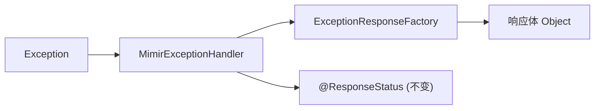

# Exception Handler Adapter

## Context

`mimir-boot-starter-exception` 的 `GlobalExceptionHandler` 存在两个问题：响应格式硬编码为 `R<T>`（与 COLA 5 等架构不兼容），类名与业务项目高概率冲突且无 `@Order` 导致优先级不可预测。

## Goal

异常处理器支持响应格式适配，接入方通过注册一个 Bean 即可切换响应体格式（如 COLA Response），无需关闭整个 Handler。

## Non-Goal

- 不抽象 HTTP 状态码（改状态码走 `enabled=false` 完全替换路径）
- 不修改 `R<T>` 本身的结构
- 不引入 COLA 依赖

## Architecture



- `MimirExceptionHandler`：异常分派、日志、状态码决策
- `ExceptionResponseFactory`：纯格式转换，将 code/message/data 装入响应壳
- `DefaultExceptionResponseFactory`：默认实现，返回 `R<T>`

## Interface Contract

### ExceptionResponseFactory（新增）

```java
// 文件：src/main/java/com/yggdrasil/labs/exception/handler/ExceptionResponseFactory.java
@FunctionalInterface
public interface ExceptionResponseFactory {
    Object createResponse(String code, String message, Object data);
}
```

- 正常路径：`createResponse("BIZ_001", "余额不足", null)` → 返回任意对象（R / COLA Response / 自定义）
- 边界路径：`data` 为非 Serializable 对象 → 默认实现忽略 data，返回 `R.fail(code, message)`

### DefaultExceptionResponseFactory（新增）

```java
// 文件：src/main/java/com/yggdrasil/labs/exception/handler/DefaultExceptionResponseFactory.java
public class DefaultExceptionResponseFactory implements ExceptionResponseFactory {
    @Override
    public Object createResponse(String code, String message, Object data) {
        if (data instanceof Serializable s) {
            R<Serializable> r = new R<>(code, message, s);
            return r;
        }
        return R.fail(code, message);
    }
}
```

- 返回类型始终为 `R<Serializable>`
- `data` 非 Serializable 时丢弃 data，仅返回 code + message

### MimirExceptionHandler（重命名自 GlobalExceptionHandler）

```java
// 文件：src/main/java/com/yggdrasil/labs/exception/handler/MimirExceptionHandler.java
@Slf4j
@RestControllerAdvice
@Order(Ordered.LOWEST_PRECEDENCE)
public class MimirExceptionHandler {
    private final ExceptionResponseFactory responseFactory;
    // 构造函数注入 responseFactory
    // 所有 @ExceptionHandler 方法返回类型 → Object
    // @ResponseStatus 注解保持不变
}
```

各方法的 data 参数传递规则：

| 方法 | data 值 |
|------|---------|
| handleBizException | `null` |
| handleSystemException | `null` |
| handleBaseException | `null` |
| handleMethodArgumentNotValidException | `ArrayList<String> errors`（校验错误列表） |
| handleBindException | `ArrayList<String> errors`（绑定错误列表） |
| handleMissingServletRequestParameterException | `null` |
| handleMethodArgumentTypeMismatchException | `null` |
| handleHttpMessageNotReadableException | `null` |
| handleHttpRequestMethodNotSupportedException | `null` |
| handleNoHandlerFoundException | `null` |
| handleException（兜底） | `null` |

factory 调用模式统一为：`return responseFactory.createResponse(code, message, data)`

### ExceptionAutoConfiguration（修改）

```java
@Bean
@ConditionalOnMissingBean(ExceptionResponseFactory.class)
public ExceptionResponseFactory exceptionResponseFactory() {
    return new DefaultExceptionResponseFactory();
}

@Bean
@ConditionalOnMissingBean(MimirExceptionHandler.class)
public MimirExceptionHandler mimirExceptionHandler(ExceptionResponseFactory responseFactory) {
    return new MimirExceptionHandler(responseFactory);
}
```

## Error Handling

无外部依赖。内部失败场景：

- `ExceptionResponseFactory` Bean 不存在 → 不会发生（`@ConditionalOnMissingBean` + 默认实现保证）
- `responseFactory.createResponse()` 自身抛异常 → Handler 内用 try-catch 包裹，降级为 `R.fail(code, message)`，避免 Spring 默认错误格式泄露

## Testing Strategy

| 测试对象 | 层级 | 验证方法 | 通过标准 |
|---------|------|---------|---------|
| DefaultExceptionResponseFactory | 单元 | `./mvnw test -pl mimir-boot-starters/mimir-boot-starter-exception -Dtest=DefaultExceptionResponseFactoryTest -Pci` | data 为 Serializable 时返回 R 含 data；非 Serializable 时返回 R.fail |
| MimirExceptionHandler | 单元 | `./mvnw test -pl mimir-boot-starters/mimir-boot-starter-exception -Dtest=MimirExceptionHandlerTest -Pci` | 各异常类型正确调用 factory 并保持原有日志行为 |
| ExceptionAutoConfiguration | 单元 | `./mvnw test -pl mimir-boot-starters/mimir-boot-starter-exception -Dtest=ExceptionAutoConfigurationTest -Pci` | 默认注册 factory + handler；自定义 factory 时不注册默认 |
| 自定义 factory 场景 | 单元 | 同上 | 注入自定义 factory 后 handler 使用自定义实现 |
