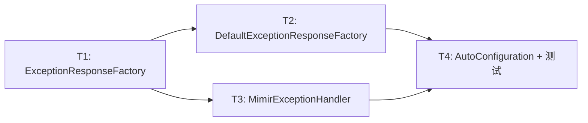

# Exception Handler Adapter

**Branch:** [待填充]
**Baseline SHA:** [待填充]
**Worktree Path:** [待填充]
**Started At:** [待填充]
**Updated At:** [待填充]

**Goal:** 异常处理器支持响应格式适配，接入方注册 ExceptionResponseFactory Bean 即可切换响应体格式。
**Architecture:** 新增 ExceptionResponseFactory 接口 + 默认实现，重命名 Handler 为 MimirExceptionHandler 并注入 factory，@ConditionalOnMissingBean 允许替换。
**Tech Stack:** Spring Boot 3.3.x, JUnit 5, Mockito

## Dependency Graph

| Task | 依赖 | 可并行组 |
|------|------|---------|
| T1 | 无 | A |
| T2 | T1 | B |
| T3 | T1 | B |
| T4 | T2, T3 | C |



---

### T1: ExceptionResponseFactory 接口

**Depends on:** 无

**Files:**

- Create: `mimir-boot-starters/mimir-boot-starter-exception/src/main/java/com/yggdrasil/labs/exception/handler/ExceptionResponseFactory.java`

**Behavior:**
定义响应格式转换的函数式接口，接受 code/message/data 返回任意响应对象。

**Execution:**

- **Status:** pending
- **Commit SHA:** null
- **Attempts:** 0
- **Blocked Reason:** null

- [ ] **Step 1: Confirm baseline**

```bash
test ! -f mimir-boot-starters/mimir-boot-starter-exception/src/main/java/com/yggdrasil/labs/exception/handler/ExceptionResponseFactory.java && echo "NOT_EXISTS"
```

- [ ] **Step 2: Implement**

```java
@FunctionalInterface
public interface ExceptionResponseFactory {
    Object createResponse(String code, String message, Object data);
}
```

- [ ] **Step 3: Verify**

```bash
grep "ExceptionResponseFactory" mimir-boot-starters/mimir-boot-starter-exception/src/main/java/com/yggdrasil/labs/exception/handler/ExceptionResponseFactory.java
```

- [ ] **Step 4: Commit**

`feat(exception): 新增 ExceptionResponseFactory 接口`

---

### T2: DefaultExceptionResponseFactory

**Depends on:** T1

**Files:**

- Create: `mimir-boot-starters/mimir-boot-starter-exception/src/main/java/com/yggdrasil/labs/exception/handler/DefaultExceptionResponseFactory.java`
- Test: `mimir-boot-starters/mimir-boot-starter-exception/src/test/java/com/yggdrasil/labs/exception/handler/DefaultExceptionResponseFactoryTest.java`

**Behavior:**
默认实现，data 为 Serializable 时返回 `R<>(code, message, data)`，否则返回 `R.fail(code, message)`。

**Execution:**

- **Status:** pending
- **Commit SHA:** null
- **Attempts:** 0
- **Blocked Reason:** null

- [ ] **Step 1: Confirm baseline**

```java
// DefaultExceptionResponseFactoryTest.java
@Test
void shouldReturnRWithDataWhenSerializable() {
    var factory = new DefaultExceptionResponseFactory();
    Object result = factory.createResponse("BIZ_001", "error", "detail");
    assertInstanceOf(R.class, result);
    assertEquals("detail", ((R<?>) result).getData());
}

@Test
void shouldReturnRFailWhenDataNotSerializable() {
    var factory = new DefaultExceptionResponseFactory();
    Object result = factory.createResponse("BIZ_001", "error", new Object());
    assertInstanceOf(R.class, result);
    assertNull(((R<?>) result).getData());
}
```

Run: `./mvnw test -pl mimir-boot-starters/mimir-boot-starter-exception -Dtest=DefaultExceptionResponseFactoryTest -Pci`
Expected: **FAIL** — 类不存在

- [ ] **Step 2: Implement**

```java
// instanceof Serializable → new R<>(code, message, s)
// else → R.fail(code, message)
```

- [ ] **Step 3: Verify**

Run: `./mvnw test -pl mimir-boot-starters/mimir-boot-starter-exception -Dtest=DefaultExceptionResponseFactoryTest -Pci`
Expected: **PASS**

- [ ] **Step 4: Commit**

`feat(exception): 新增 DefaultExceptionResponseFactory 默认实现`

---

### T3: MimirExceptionHandler

**Depends on:** T1

**Files:**

- Create: `mimir-boot-starters/mimir-boot-starter-exception/src/main/java/com/yggdrasil/labs/exception/handler/MimirExceptionHandler.java`
- Delete: `mimir-boot-starters/mimir-boot-starter-exception/src/main/java/com/yggdrasil/labs/exception/handler/GlobalExceptionHandler.java`
- Modify: `mimir-boot-starters/mimir-boot-starter-exception/src/test/java/com/yggdrasil/labs/exception/handler/GlobalExceptionHandlerTest.java` → 重命名为 `MimirExceptionHandlerTest.java`

**Behavior:**
重命名 GlobalExceptionHandler → MimirExceptionHandler，加 `@Order(LOWEST_PRECEDENCE)`，构造函数注入 ExceptionResponseFactory，所有返回值通过 factory 构建。日志和 @ResponseStatus 不变。

**Execution:**

- **Status:** pending
- **Commit SHA:** null
- **Attempts:** 0
- **Blocked Reason:** null

- [ ] **Step 1: Confirm baseline**

```java
// MimirExceptionHandlerTest.java — 验证 factory 被调用
@Test
void shouldDelegateToFactory() {
    ExceptionResponseFactory mockFactory = mock(ExceptionResponseFactory.class);
    when(mockFactory.createResponse(any(), any(), any())).thenReturn("custom");
    var handler = new MimirExceptionHandler(mockFactory);
    Object result = handler.handleBizException(new BizException("B001", "biz error"), mockRequest);
    assertEquals("custom", result);
    verify(mockFactory).createResponse("B001", "biz error", null);
}
```

Run: `./mvnw test -pl mimir-boot-starters/mimir-boot-starter-exception -Dtest=MimirExceptionHandlerTest -Pci`
Expected: **FAIL** — 类不存在

- [ ] **Step 2: Implement**

基于 GlobalExceptionHandler 改造：

1. 重命名类，加 `@Order(Ordered.LOWEST_PRECEDENCE)`
2. 加 `private final ExceptionResponseFactory responseFactory` + 构造函数
3. 所有方法返回类型 `R<...>` → `Object`
4. 所有 `return R.fail(...)` / `return new R<>(...)` → `return responseFactory.createResponse(code, message, data)`

- [ ] **Step 3: Verify**

Run: `./mvnw test -pl mimir-boot-starters/mimir-boot-starter-exception -Dtest=MimirExceptionHandlerTest -Pci`
Expected: **PASS**

- [ ] **Step 4: Commit**

`refactor(exception): 重命名 GlobalExceptionHandler 为 MimirExceptionHandler 并注入响应工厂`

---

### T4: AutoConfiguration 适配

**Depends on:** T2, T3

**Files:**

- Modify: `mimir-boot-starters/mimir-boot-starter-exception/src/main/java/com/yggdrasil/labs/exception/config/ExceptionAutoConfiguration.java`
- Modify: `mimir-boot-starters/mimir-boot-starter-exception/src/test/java/com/yggdrasil/labs/exception/config/ExceptionAutoConfigurationTest.java`

**Behavior:**
用 `@ConditionalOnMissingBean` 注册 ExceptionResponseFactory 和 MimirExceptionHandler，允许接入方覆盖。

**Execution:**

- **Status:** pending
- **Commit SHA:** null
- **Attempts:** 0
- **Blocked Reason:** null

- [ ] **Step 1: Confirm baseline**

```java
// ExceptionAutoConfigurationTest.java — 验证自定义 factory 优先
@Test
void shouldUseCustomFactoryWhenProvided() {
    // 注册自定义 factory Bean，验证 handler 使用自定义 factory
}

@Test
void shouldRegisterDefaultFactoryWhenNoneProvided() {
    // 无自定义 factory 时，默认 factory 被注册
}
```

Run: `./mvnw test -pl mimir-boot-starters/mimir-boot-starter-exception -Dtest=ExceptionAutoConfigurationTest -Pci`
Expected: **FAIL** — 旧配置不兼容新 Bean 签名

- [ ] **Step 2: Implement**

修改 ExceptionAutoConfiguration：

1. 删除旧 `globalExceptionHandler()` 方法
2. 新增 `exceptionResponseFactory()` + `@ConditionalOnMissingBean`
3. 新增 `mimirExceptionHandler(ExceptionResponseFactory)` + `@ConditionalOnMissingBean`

- [ ] **Step 3: Verify**

Run: `./mvnw test -pl mimir-boot-starters/mimir-boot-starter-exception -Pci`
Expected: **PASS** — 全模块测试通过

- [ ] **Step 4: Commit**

`feat(exception): 适配 AutoConfiguration 支持自定义响应工厂`
