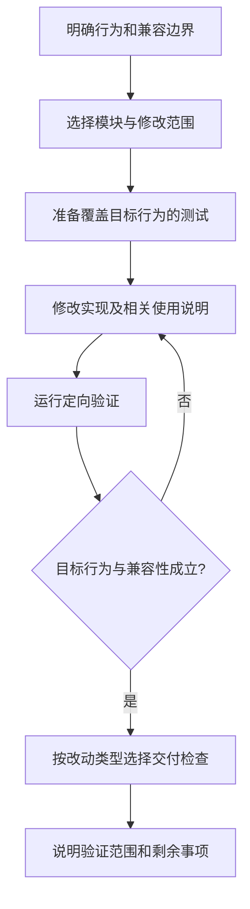

# 开发指南

适用于修复问题、修改已有 Starter、公共模型、依赖、POM 和文档。完成后应能说明改动行为、兼容性影响及验证结果。新增模块走[新增 Starter](./new-starter.md)，发布走[发布指南](./release.md)。

## 开始前

1. 首次参与先[准备环境](#准备环境)，查看 `git status --short`，识别已有改动。
2. 阅读目标模块 README、相关实现和测试；先描述当前行为、目标行为及一个可验证的例子。
3. 明确是否涉及公共 API、配置默认值、依赖和下游兼容性。多文件变更先列计划；实质性架构约束变化先按[设计索引](../design-docs/index.md)处理 RFC。

所需文档按[文档治理规范](../standards/documentation-governance.md#2-按任务规模选择文档)选择。修改配置先读模块 README，涉及模块边界再读架构，涉及安全或可靠性再查[项目规范](../index.md#项目规范)，无需每次通读全部文档。

## 准备环境

在仓库根目录使用 Java 17、Maven Wrapper、Bash、Git 和 curl；完整发布相关验收还需要 JDK 的 jar 命令与 GPG。初始化和缺失依赖下载需要可用网络。

首次初始化执行：

```bash
java -version
./mvnw -version
bash scripts/setup-dev.sh
git config --get core.hooksPath
```

初始化会准备工程工具、预热并检查 Spotless、运行 quick，全部成功后将仓库 `core.hooksPath` 设为 `.githooks`。它会修改本地 Git 配置；发现已有自定义 hook 或工作树冲突时停止，保留原配置，由维护者处理冲突。

仅刷新工具缓存时执行 `bash scripts/engineering.sh prepare`；它不安装 hook，也不代替 Spotless 依赖预热。缓存缺失导致 quick 失败时，按错误提示重新初始化。WSL 中如需手动使用 Node，先 `source ~/.nvm/nvm.sh`；工程检查本身使用仓库托管运行时。

日常开发按改动范围做定向验证。已安装的提交和推送 hook 执行 quick，完整验收由匹配触发条件的 CI 和发布工作流执行；本地也可显式运行 full。各阶段的输入、触发条件和成功含义见[测试与质量](./testing.md#自动检查发生在哪里)。

## 找到修改位置

| 改动 | 首先查看 | 同步检查 |
|---|---|---|
| 依赖版本 | `mimir-boot-bom/pom.xml` | 使用该依赖的模块与版本兼容性 |
| 构建插件、profile、覆盖率规则 | `mimir-boot-parent/pom.xml` | 下游继承行为、CI 与发布影响 |
| Reactor 模块集合 | 根或 Starter 聚合 POM | BOM 注册、制品与文档导航 |
| 公共异常、响应、分页或枚举 | `mimir-boot-common` | 公开接口、序列化形状、既有调用方 |
| 运行时 Starter 能力 | 对应模块的源码、资源与测试 | 自动配置条件、属性绑定、默认行为 |
| 编译期生成能力 | `mimir-boot-starter-mybatis-processor` | 处理器注册与生成代码编译 |
| 文档说明 | 该内容的权威页面 | 内部链接、上层导航、实际实现 |

模块选择理由和允许的依赖方向见[模块边界](../design-docs/arch-module-dependencies.md)。上表用于定位文件，不重新定义架构。

## 修改与反馈



修复缺陷时先建立能复现问题的测试；新增行为覆盖正常路径、关键边界及适用的兼容场景。纯文字修改使用文档检查即可，无需为文字建立代码测试。

### 修改已有 Starter

- 配置变化：同步属性类、绑定与校验、条件装配、默认值测试及 README 示例。说明旧配置是否仍可用。
- 自动配置变化：核对配置类与注册资源；验证启用条件、禁用条件、依赖缺失和用户自定义 Bean 的适用行为。
- API 或运行行为变化：检查调用方与异常语义，补相应测试；改变默认行为时明确迁移影响。
- 文档变化：将当前行为写入对应章节，过程与未完成事项留在需求记录中。

定向单元测试使用实际模块路径；下面以日志模块为例，`-am` 同时构建所需的 Reactor 依赖：

```bash
# 仅单元测试反馈，不运行 Failsafe 集成测试
./mvnw -pl mimir-boot-starters/mimir-boot-starter-log -am test
```

需要集成测试时，按[测试命令选择表](./testing.md#按验证目标选择检查)运行模块 `clean verify`，核对本次 Surefire / Failsafe 报告。两者都不代表仓库完整验收。需要修复格式时显式运行 `./mvnw spotless:apply`，随后复核生成的 diff。

## 验证与完成条件

按[测试页的选择表](./testing.md#按验证目标选择检查)选择检查，避免把 quick、java、原生 Maven 和 full 机械地全部执行。

| 改动类型 | 交付前至少确认 |
|---|---|
| 纯文档内容 | 文档 full 与 diff 检查通过；内容与事实一致 |
| 局部运行行为 | 对应单元/集成测试验证目标与回归边界；说明尚未覆盖的仓库级检查 |
| 依赖、构建、跨模块或公共契约 | 完整验收覆盖受影响链路；可本地提前运行，或明确等待适用 CI，未通过前不宣称仓库级验收完成 |
| 已有实施计划指定验收 | 满足计划要求；通用指南不降低专项验收标准 |

完成检查清单：

- 实现和测试覆盖目标行为，兼容性影响已有处理。
- 配置、示例与限制已同步至对应 README；必要导航可达。
- 结果对应当前修改或提交，按[验收结论格式](./testing.md#验收结论怎么写)绑定实际命令、报告和覆盖范围；未执行项明确列出。
- 已安装的 hook 通过不等于行为验证；CI 尚未执行时明确标记待验收。

简单任务在交付回复中说明结果，复杂任务写回已有计划。提交、推送、合并和发布按用户授权执行；阅读指南或检查通过不会自动授予这些权限。

## 遇到问题

| 情况 | 下一步 |
|---|---|
| 修改需要跨越现有模块边界 | 重新评估方案和 RFC，先解决设计分歧 |
| 执行中范围变化或兼容性影响不明 | 先说明具体问题，明确边界后再继续相关修改 |
| 构建找不到依赖或工具缓存缺失 | 查看原始日志与[检查故障处理](./testing.md#失败处理)，确认依赖与环境 |
| 测试失败 | 保存报告，区分实现失败与工具/环境错误、原有失败与本次引入，再用最小复现修复和复验 |
| 当前工作树有其他改动或并行构建 | 保留他人内容；避免并行 clean 破坏报告 |
| 需要提交或推送 | 核对授权与实际差异，再进入对应 Git 操作 |

## 事实来源

模块职责以[架构](../../ARCHITECTURE.md)、[模块边界](../design-docs/arch-module-dependencies.md)和各模块 POM 为准；检查行为以[测试与质量](./testing.md)列出的脚本与工作流为准。

环境初始化以 [setup-dev.sh](../../scripts/setup-dev.sh) 为准，工具实现与独立诊断入口见[工程工具说明](../../tools/engineering/README.md)。
