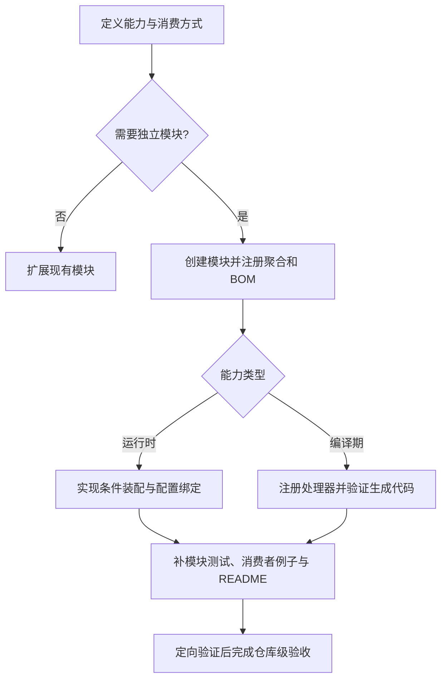

# 新增 Starter

适用于新增独立、可复用的能力模块。先依据[模块边界](../design-docs/arch-module-dependencies.md)判断是否值得独立；已有 Starter 能自然承载时，按[开发指南](./development.md)扩展现有模块。

## 开始前

在计划中明确能力边界、预期消费者、依赖、默认行为和最小接入例子。选择运行时 Starter 或编译期处理器：两者注册方式与验证方法不同，不能直接复制同一套自动配置。



## 实施步骤

1. 创建 `mimir-boot-starters/mimir-boot-starter-<name>/`。以同类型现有模块为参考，检查 POM 的 Parent、版本来源、依赖作用域与发布配置；不要复制无关依赖。
2. 在 Starter 聚合 POM 添加模块，在 BOM 注册制品版本。确认消费者能通过 BOM 获得版本，无需手写项目内部版本号。
3. 按下表实现并注册能力。公共配置写清前缀、默认值、启用条件和错误行为。
4. 增加模块测试和一个真实使用该能力的最小消费者。测试内容按能力选择，不以仅能解析依赖作为功能成功。
5. 编写模块 README，包含依赖坐标、启用方式、配置、示例、限制与兼容性；在现有能力导航补必要链接。
6. 按“验证与完成条件”验收，并在计划中说明影响与结果。

`<name>` 是创建模块时替换的名称占位符，不是可直接执行的命令。

| 能力类型 | 注册点 | 验证重点 |
|---|---|---|
| 运行时 Starter | 自动配置类与 `META-INF/spring/org.springframework.boot.autoconfigure.AutoConfiguration.imports` | 满足条件时生效；适用的禁用、依赖缺失、用户覆盖行为正确 |
| 编译期处理器 | 处理器实现与 `META-INF/services/javax.annotation.processing.Processor` | 消费者编译能发现处理器；生成代码可编译；错误输入给出明确诊断 |

## 必须核对的位置

| 位置 | 要确认的结果 |
|---|---|
| [Starter 聚合 POM](../../mimir-boot-starters/pom.xml) | 新模块进入 Reactor |
| [BOM](../../mimir-boot-bom/pom.xml) | 消费者能够解析新坐标及版本 |
| 新模块 POM、源码与资源 | 职责、依赖、注册与发布模型符合仓库约定 |
| 新模块测试 | 正常路径、关键边界和适用兼容行为可验证 |
| 新模块 README 与能力导航 | 接入例子可用，读者能够找到新模块 |
| 消费者验收 | 真正使用新能力，验证制品中的类、资源或处理器，而非只通过聚合构建 |

现有模块可参考[日志 Starter](../../mimir-boot-starters/mimir-boot-starter-log/README.md)与[MyBatis Processor](../../mimir-boot-starters/mimir-boot-starter-mybatis-processor/README.md)。测试依赖外部服务时使用受控 fixture，不需要真实生产凭据。

### 最小消费者如何验证

准备独立消费者 POM，引用本次已构建并可解析的候选制品版本，加入触发新能力的最小代码。不要让消费者引用旧发布版后将其结果记成本次验证。

运行时 Starter 应启动最小上下文并断言预期 Bean 或行为；编译期处理器应提供带目标注解的源码，断言生成源码和对应 class 均存在且编译成功。现有处理器的依赖与实体示例见[快速开始](../../mimir-boot-starters/mimir-boot-starter-mybatis-processor/README.md#快速开始)，例如应生成并编译示例中的 UserMapper、UserService 和 UserServiceImpl。

将环境变量 `consumer_pom` 设置为已准备的消费者 POM 绝对路径，再从本仓库根目录执行：

```bash
: "${consumer_pom:?请先设置消费者 pom.xml 的绝对路径}"
./mvnw -f "$consumer_pom" clean verify
```

记录消费者 POM、示例源码、候选版本、命令结果及断言产物。仅增加依赖、未触发能力的消费者不能证明功能有效。

## 验证与完成条件

开发中先做新模块与消费者的定向验证，再进行仓库完整验收。完整入口与 CI 条件见[测试与质量](./testing.md)；full 已包含文档、消费者、签名和 Java 检查，无需固定串行运行所有子入口。

新增模块时必须确认现有消费者验收是否实际覆盖新能力；若只验证原模块，应补相应消费场景，不能用旧 fixture 的通过替代新能力证据。

交付时确认：

- 聚合、BOM、能力注册、制品内容和 README 均已同步。
- 定向测试与最小消费者证明了功能和适用边界。
- 本地 full 或适用 CI 的完整验收已通过；尚未执行时明确记录待验收。
- 计划中记录新增模块位置、公共配置/接口、兼容性影响和验证结果。

## 遇到问题

| 情况 | 处理 |
|---|---|
| 新模块与已有能力高度重叠 | 回到模块划分，优先扩展现有模块 |
| 自动配置未生效 | 检查 imports、条件、作用域与属性绑定 |
| 处理器未执行或生成代码失败 | 检查服务注册、消费方编译配置与生成源码 |
| Reactor/BOM/制品缺失 | 检查聚合、坐标、发布 POM 和注册资源 |
| 跨模块依赖违反约束 | 先调整设计或完成必要 RFC，再继续实现 |

## 事实来源

长期约束见[模块边界](../design-docs/arch-module-dependencies.md)；编译期注册参考[现有处理器资源](../../mimir-boot-starters/mimir-boot-starter-mybatis-processor/src/main/resources/META-INF/services/javax.annotation.processing.Processor)。消费者与发布验收实现入口见[工程工具](../../tools/engineering/README.md)。
