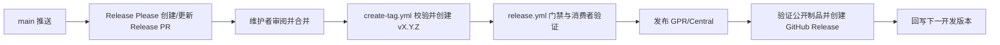

# 发布指南

本页用于 Release PR、Tag、制品发布和发布故障补偿。正常发布走 Release Please 与 GitHub Actions；本地 `quality --mode full` 用于提前反馈或排障，不是远程发布的必做前置。发布完成以远程工作流和公开制品证据为准。

## 适用场景

- 日常发布：`main` 有待发布变更，使用 Release Please 生成并合并 Release PR。
- Tag 发布：Release PR 合并后，由 `create-tag.yml` 校验合并提交和版本，再创建 `vX.Y.Z`。
- 故障补偿：已有 Tag 的某个发布动作失败时，重跑同一 Tag，或在 `release.yml` 手动选择尚未完成的动作。
- 新版本修复：代码或 POM 有错误时，提交修复并走下一次 Release Please 发布；不可移动既有 Tag。

## 开始前

1. 确认变更已经合并到 `main`，版本、CHANGELOG、公开 API、依赖和兼容性均已审阅。
2. 确认 Release Please 的 PR 版本符合预期。配置和 manifest 的事实源见[发布配置](../../.github/release-please-config.json)与[版本 manifest](../../.github/.release-please-manifest.json)。
3. 凭据、签名密钥和发布权限只在 GitHub Actions 中提供。不要把令牌、私钥、密码或 Maven settings 写进仓库。
4. 需要本地预检时运行 `bash scripts/engineering.sh quality --mode full --source worktree`，但本地通过不能替代 Tag 上的远程门禁。

## 正常发布

人员与自动化的职责如下：

| 阶段 | 维护者 | 自动化与完成信号 |
| --- | --- | --- |
| Release PR | 审阅版本、CHANGELOG、依赖和文档，确认后合并 | `release-please.yml` 在 `main` 推送时创建或更新 PR |
| 创建 Tag | 观察结果，处理权限或配置故障 | 自动路径识别 Release Please 生成的合并 PR，并在其合并 SHA 上创建 Tag；手动恢复需显式指定目标 |
| 发布验收 | 观察 workflow 和报告，不以本地结果代替远程结果 | `release.yml` 在 Tag 上运行完整门禁、消费者验证并上传质量报告 |
| 制品与收尾 | 核对公开坐标和 GitHub Release | 自动发布 GitHub Packages、Maven Central，验证 Central 公开制品后创建 Release |
| 下一开发版本 | 关注是否产生回写提交 | `update-dev-version` 在收尾成功后把 `pom.xml` 推进到下一 patch `-SNAPSHOT` |

版本输入使用 `MAJOR.MINOR.PATCH`，Tag 使用 `vX.Y.Z`。Tag、远程制品、GitHub Release 和下一开发版本提交是独立事实，必须分别核对。

## 失败处理

先查看失败 job、Tag 指向的 SHA、质量报告、deployment ID 和公开制品状态，再决定动作：

| 失败类型 | 处理方式 |
| --- | --- |
| 网络抖动、制品传播延迟、凭据或 runner 瞬态故障，代码未变 | 重跑同一 Tag 的失败 workflow/job；它仍使用同一 Tag 的同一份代码 |
| 源码、POM、配置或测试错误 | 在 `main` 提交修复，等待新的 Release Please PR、版本和 Tag；不要给旧 Tag 换提交 |
| 某个远程副作用已成功，后续步骤失败 | 先保留成功证据，只补偿缺失动作；不要重复上传已有版本或重复创建已存在的 Release |
| `create-tag.yml` 尚未创建 Tag | 修复权限/配置后重跑；手动恢复时必须同时填写版本和目标合并 SHA，并通过 manifest 校验 |
| `update-dev-version` 单独失败 | 已发布版本不需要重发；确认 GitHub Release 和公开制品已存在后，在 `release.yml` 手动输入同版本，仅选择 `update_dev_version` |

手动运行 `release.yml` 时，`version` 必填；`publish_gpr`、`publish_maven_central`、`finalize_github_release`、`update_dev_version` 默认都是 `false`，且至少选择一项。每个开关只允许对应补偿动作产生副作用：发布仓库、Maven Central、GitHub Release 或推送下一开发版本。选择 `update_dev_version` 时，工作流会验证对应 GitHub Release 已存在。

不要跳过完整门禁、复用其他 SHA 的报告、移动既有 Tag 或把“重跑同 Tag”描述成“获取新代码”。凭据缺失由仓库维护者在 GitHub Actions secret 和权限层处理。

## 完成条件与交付记录

发布完成至少要能关联以下证据：

- Release PR 链接、合并 SHA、发布版本和 Tag 名称；
- `create-tag.yml` 与 `release.yml` 的 workflow 链接及最终结论；
- 完整质量报告、消费者验证结果、签名结果和 Maven Central deployment ID（如有）；
- GitHub Packages 上传结果，以及 Maven Central 的公开坐标和可解析 POM/JAR；
- GitHub Release 链接；若开发版本回写执行，还要记录其提交 SHA；若单独失败，记录补偿结果。

## 事实来源

本页只依据仓库现有配置：[`release-please.yml`](../../.github/workflows/release-please.yml)、[`create-tag.yml`](../../.github/workflows/create-tag.yml)、[`release.yml`](../../.github/workflows/release.yml)、[Release Please 配置](../../.github/release-please-config.json)和[版本 manifest](../../.github/.release-please-manifest.json)。工作流行为变化时，先更新这些配置，再同步本页。
