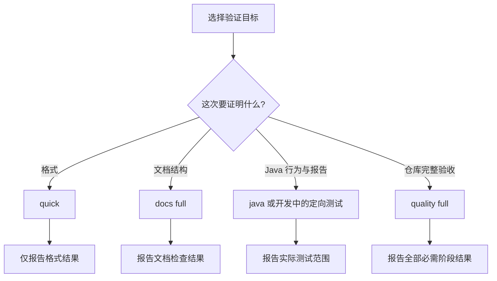

# 测试与质量

本页帮助维护者和 Agent 选择检查、解释结果和定位失败。先明确要验证什么，再执行相应入口。所有命令在仓库根目录运行；首次使用先完成[环境初始化](./development.md#准备环境)。

## 按验证目标选择检查

模块命令以日志 Starter 为例，其他模块替换 `-pl` 后的实际路径；`-am` 同时构建所需的 Reactor 依赖。

| 要验证什么 | 命令 | 实际覆盖 | 不能据此宣称 |
|---|---|---|---|
| 模块单元测试反馈 | `./mvnw -pl mimir-boot-starters/mimir-boot-starter-log -am test` | 所选模块及所需依赖的 Surefire 单元测试 | Failsafe 集成测试或仓库完整验收通过 |
| 模块单元与集成测试 | `./mvnw -pl mimir-boot-starters/mimir-boot-starter-log -am clean verify` | 所选模块及所需依赖的 Surefire、Failsafe 测试；核对实际执行用例 | 未选模块、完整 CI 门禁或发布契约通过 |
| 修改后的格式快速反馈 | `bash scripts/engineering.sh quality --mode quick --source worktree` | 按变更选择 Markdown/Java 格式检查 | 行为、内部链接或完整门禁通过 |
| 文档格式、链接与导航 | `bash scripts/engineering.sh docs --root "$PWD" --mode full --self-test` | Markdown、内部链接、导航和工具自检 | 文档语义正确或 Java 行为通过 |
| Java 构建、测试、覆盖率及报告 | `bash scripts/engineering.sh java` | CI Maven 构建并核验报告 | 完整发布契约或远端 CI 通过 |
| 仓库完整验收 | `bash scripts/engineering.sh quality --mode full --source worktree` | 文档、构建模型、发布契约、消费者、签名及 Java 检查 | 不同提交的 CI、未启用的 Sonar 或真实发布成功 |
| 排查 Maven 本身 | `./mvnw -Pci clean verify` | Java 子检查的基础构建步骤 | 上层报告核验和仓库完整验收通过 |

本仓库的 `test` 不执行 Failsafe 的 `*IT` / `*IntegrationTest`；需要这些用例时运行到 `verify`。测试选择规则以 [Parent POM](../../mimir-boot-parent/pom.xml) 为准，不能仅凭测试类名称或命令退出码推断覆盖范围。

开发中按需选择定向测试或 quick；交付时按改动范围选择文档 full、Java 或 quality full，不把表中命令当作必跑清单。quality full 已包含文档 full 和 Java 子检查，Java 子检查已包含 Maven `clean verify`；同一状态通过上层检查后，无需重复子步骤。定向测试和 quick 不能替代需要的完整验收。



纯文档改动通常使用文档 full 和 `git diff --check`。修改工程工具、hook、工作流或构建配置属于行为变更，不能按纯文档处理。

## 自动检查发生在哪里

下表描述当前仓库配置；本地 hook 须先安装，远端工作流须满足触发条件。

| 时机 | 实际输入 | 检查 | 通过代表什么 |
|---|---|---|---|
| 本地 commit | 暂存区快照 | quick | 本次提交的适用格式检查通过 |
| 本地 push | 各待推送引用指向的提交快照 | quick | 待推送提交的适用格式检查通过 |
| push 到 `main` 或 `develop` | CI 检出的工作树 | full | 该 CI 输入的完整基础验收通过 |
| 目标分支为 `main` 的 PR | CI 检出的 PR 工作树 | full | 该 PR 的 CI 验收通过 |
| 发布 Tag 或手动发布补偿 | 工作流选择的 Tag 及相关验证输入 | 发布前完整验收与发布后制品验证 | 按[发布指南](./release.md)判断最终结果 |

普通特性分支仅 push、不创建目标为 `main` 的 PR，不会因此触发 `ci.yml`。本地 push 成功不等于 CI 或发布成功。

`--source worktree` 包含当前未提交内容；`index` 和 `commit` 分别检查暂存快照和指定提交。工作区结果不能替代不同输入的 hook 或 CI 结果。

## 联网与运行环境

- quick 使用已准备的工程工具缓存，Java 格式检查使用 Maven offline；缺缓存时明确失败，不在 hook 中自动下载。
- `setup-dev.sh`、`prepare`、独立 docs/Java 检查和 full 在准备工具或缺少依赖时可能联网。本地 full 是可选的提前验收，不是每次 commit/push 的额外固定步骤。
- full 包含临时仓库中的消费者和签名验证，不向正式制品仓库发布；真实上传和公开制品检查在发布流程中进行。
- 同一工作树避免并行构建，`clean` 会重建产物。报告存放在 `target/` 外，避免被构建清理。
- 本地默认 `RUN_SONAR=false`；CI 仅在上述 push 事件且三项凭据齐全时启用 Sonar。PR 不使用这些凭据；本地上传需确认目标项目、分支和授权。每次 push 不固定要求本地 full，按改动范围、排障或受控复现需要选择性运行。

Sonar 的变量为 `SONAR_TOKEN`、`SONAR_ORGANIZATION`、`SONAR_PROJECT_KEY`；凭据由受控环境注入，不写入文档或命令示例。

### Sonar New Code 判定与处置

本次变更以 **New Code** 为判定范围，不把项目总览中的历史问题混入本次结论。仓库阈值和禁止绕过门禁的要求统一见[Sonar 质量基线](../standards/reliability.md#sonar-质量基线)；操作时对照项目设置中的 New Code 周期、Quality Gate 条件、规则与排除范围，以及对应 workflow 和分析报告。记录目标项目、分支/提交、分析链接和配置差异；未读取远端设置时明确“未核实”，不能以仓库文档证明远端已配置。

出现 New Code issue 或 Quality Gate 失败时：

1. 先按 Sonar 的规则、文件、行号和 New Code 标记定位，并分类为真实缺陷/安全问题、可安全重构的问题、需要兼容性或安全决策的治理项，或有证据的误报；不能用项目总览中的历史问题代替本次判断。
2. 真实缺陷、安全问题和可安全重构项在当前变更中修复，补复现或边界测试，再运行受影响模块测试和所需完整检查。不得通过降低阈值、扩大 `sonar.*.exclusions`、关闭规则或无理由抑制注解绕过门禁。
3. 公开 API、配置绑定、默认行为等兼容性项先保留兼容语义并明确迁移策略；不能立即移除的项登记到[技术债台账](../active/tech-debt-tracker.md)，必须有 owner、目标版本、复查条件和证据，不能以无 owner 的抑制作为关闭理由。
4. 修复或处置后重新触发受控 CI 分析，核对同一变更输入的 New Code issue 和 Quality Gate；只有新的远端分析通过才算闭环。旧报告、本地 `verify` 或本地 `RUN_SONAR=false` 结果不能替代远端复验。

责任边界：改动作者负责识别并处理本次引入的问题、补测试和记录未验证项；审查者负责检查 issue 分类、兼容性迁移策略及是否存在以排除或抑制掩盖问题；维护者负责保持 Sonar 项目设置、workflow、报告路径和本文事实源一致，并为技术债指定 owner、目标版本和复查条件。

## 结果如何判断

工程检查入口非零退出时先读阶段报告：0 表示该入口通过，1 表示验收失败，2 表示参数或工具错误。原生 Maven 命令按其构建日志和测试报告定位，不能套用工程入口的退出码分类。

| 证据 | 需要核对 |
|---|---|
| 结构化质量报告 | 输入 source/tree/commit、配置摘要、各必需检查状态与日志位置 |
| Surefire XML | 本次实际执行的单元测试类、数量、失败、错误和跳过；不能代替集成测试结果 |
| Failsafe XML | 本次实际执行的集成测试类及结果；旧文件或缺少目标用例不能证明本次覆盖 |
| JaCoCo XML | 适用模块的 `target/site/jacoco/jacoco.xml` 新鲜且完整；阈值以 Parent POM 为准 |
| CI 结果 | 对应 PR/提交的 workflow run 和 artifacts；本地报告不能代替 |
| Sonar 结果 | 未启用时明确 `not_applicable`，不描述为远程通过 |

完整 Java 门禁要求测试失败、错误、跳过均为 0。必需检查为 `failed`、`error` 或 `not_run` 均不能完成验收。`not_applicable` 仅用于条件确实不适用的项目，如默认关闭的 Sonar；不能据此跳过适用检查。

### 验收结论怎么写

在交付回复或已有任务记录中逐项填写，不必另建报告文件：

```text
输入：工作区 / 暂存快照 / 提交 SHA，以及验证时间或报告中的 tree
检查：实际执行的命令或 CI run 链接
证据：报告路径、实际测试类/数量、失败/错误/跳过，或适用检查的状态
结论：仅声明上述证据覆盖的范围
未验证：未执行的适用检查及后续验收位置
```

例如只运行模块 `test` 时，应写“所选模块及依赖的单元测试通过，集成测试和仓库 full 未验证”，不能写“全部测试通过”。拟执行命令不算已执行证据；相同路径的旧报告也不代表当前输入通过。

完整验收需要保留报告时，可使用本次独立目录：

```bash
quality_report_dir=$(mktemp -d /tmp/mimir-quality.XXXXXX)
bash scripts/engineering.sh quality --mode full --source worktree \
  --report "$quality_report_dir/quality-report.json"
```

CI 的 `quality-report` artifact 保存聚合报告，`surefire-reports` 和 `jacoco-report` 保存测试与覆盖率产物。临时报告需长期留存时归入任务证据或 CI artifact。

## 失败处理

| 表现 | 先查看 | 修复与复验 |
|---|---|---|
| quick 缓存缺失或 offline 依赖缺失 | 初始化与 bootstrap 日志 | 按错误提示运行 `bash scripts/setup-dev.sh`，解决网络/缓存准备后重跑 |
| Markdown/Java 格式失败 | 文件与行号 | 显式修改或运行 `./mvnw spotless:apply`，检查 diff 后复验 |
| 文档链接或导航失败 | docs 报告的目标路径与锚点 | 修复引用或补所属索引，重跑文档 full |
| 编译、测试或覆盖率失败 | 对应阶段日志及 XML 报告 | 修复实现或补有效测试；开发中定向反馈，验收时重跑所需范围 |
| 消费者、签名或构建模型失败 | 聚合报告的阶段日志 | 按[独立诊断入口](../../tools/engineering/README.md#独立诊断命令)定位；修复后重跑 full |
| 工具错误、进程中断或报告缺失 | 退出码、bootstrap 与阶段日志 | 修复执行条件；本次标为未通过，不复用旧结果 |
| Sonar 或公开制品失败 | 远端分析或[发布工作流](./release.md)证据 | 按对应远端条件处理，保留未完成状态 |

## 事实来源

输入与阶段由 [quality-check.sh](../../scripts/quality-check.sh) 和 [runner.mjs](../../tools/engineering/src/quality/runner.mjs) 定义；自动触发见 [pre-commit](../../.githooks/pre-commit)、[pre-push](../../.githooks/pre-push)、[ci.yml](../../.github/workflows/ci.yml)、[release.yml](../../.github/workflows/release.yml)。本页解释这些事实，不另外设定门禁。
